# Comparative Study of vcd::mosaic and geom_mosaic

Mamunur Rashid and Jiaying Chen

`vcd::mosaic` and `geom_mosaic` are two mostly used functions to create mosaic plot - a way of visualizing multivariate categorical data which is  an area-proportional visualization of frequencies, composed of tiles (or block) created by recursive vertical and horizontal splits of a rectangle. 
There are several functions available to produce mosaic plot including mosaicplot - a generic function from base R function, mosaic from vcd (Visualizing Categorical Data) package, geom_mosaic from ggmosaic package etc.

Currently, there is inadequate online help or guidance to use those functions. Moreover, the existing documentation of these functions is not user-friendly for beginners. It has a limited number of examples and test cases.

In the following sections, we are going to discuss a comparative study of `vcd::mosaic` and `geom_mosaic`. Our goal is to describe different aspects of these functions with some user-friendly examples and detail explanation of some of the parameters, and finally to compare ease-of-use & effectiveness of each of the functions.

In this study, we tried to explain how to use these two functions to produce different mosaic plots. We have elaborated some of the necessary parameters/ arguments in detail that are used in the functions. As a matter of fact, it will be easy to learn for a new user. Finally, we showed which function is better in which scenario such as `vcd::mosaic` is better in some cases whereas `geom_mosaic` is better in other cases based on the available data and the objective.

To demonstrate different aspects of these functions, we will use the Titanic dataset to plot different mosaic plots.


```r
str(Titanic)
```

```
##  'table' num [1:4, 1:2, 1:2, 1:2] 0 0 35 0 0 0 17 0 118 154 ...
##  - attr(*, "dimnames")=List of 4
##   ..$ Class   : chr [1:4] "1st" "2nd" "3rd" "Crew"
##   ..$ Sex     : chr [1:2] "Male" "Female"
##   ..$ Age     : chr [1:2] "Child" "Adult"
##   ..$ Survived: chr [1:2] "No" "Yes"
```

```r
tail(as.data.frame(Titanic))
```

```
##    Class    Sex   Age Survived Freq
## 27   3rd   Male Adult      Yes   75
## 28  Crew   Male Adult      Yes  192
## 29   1st Female Adult      Yes  140
## 30   2nd Female Adult      Yes   80
## 31   3rd Female Adult      Yes   76
## 32  Crew Female Adult      Yes   20
```


## 1. vcd::mosaic:

```r
library(vcd)
```
`mosaic` is one of the functions of strucplot framework which we can get from vcd R package. The main idea of strucplot is to visualize the tables’ cells arranged in rectangular form structable objects. The “flattened” contingency table can be obtained using the structable() function.


The basic Usage of mosaic functions is:


```r
vcd::mosaic(x, condvars = NULL,
  split_vertical = NULL, direction = NULL, spacing = NULL,
  spacing_args = list(), gp = NULL, expected = NULL, shade = NULL,
  highlighting = NULL, highlighting_fill = grey.colors, highlighting_direction = NULL,
  zero_size = 0.5, zero_split = FALSE, zero_shade = NULL,
  zero_gp = gpar(col = 0), panel = NULL, main = NULL, sub = NULL, ...)

OR

vcd::mosaic(formula, data, highlighting = NULL,
  ..., main = NULL, sub = NULL, subset = NULL, na.action = NULL)
```


Some of the basic parameters/arguments are described in the following section:

**x:**	
A contingency table in array form, with optional category labels specified in the dimnames(x) attribute, or an object of class "structable".

x is a table or formula. A structable can also be deduced from data frame or contengency table using formula. For example,


```r
HEC <- structable(Survived ~ Sex + Age, data = Titanic)
HEC
```

```
##              Survived   No  Yes
## Sex    Age                     
## Male   Child            35   29
##        Adult          1329  338
## Female Child            17   28
##        Adult           109  316
```


**formula:**

A formula specifying the variables used to create a contingency table from data. For convenience, conditioning formulas can be specified; the conditioning variables will then be used first for splitting. If any, a specified response variable will be highlighted in the cells.

For example, If we want to split the plot by 1 varialbe, we can specify as ~V1.
If V2 is dependent on V1 and V1 needs to be highlighted, we can do V2 ~ V1.

In the following example, a  plot is crated from Titanic data:


```r
vcd::mosaic(Survived ~ Sex + Age, data = Titanic,
       main = "Survival on the Titanic")
```

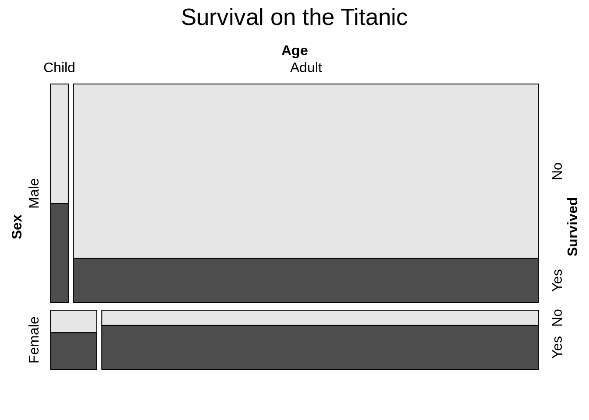

In the above plot, the data is partinioned by sex first and then age; after that survival is used to show the dependency.


```r
vcd::mosaic(Survived ~ ., data = Titanic)
```

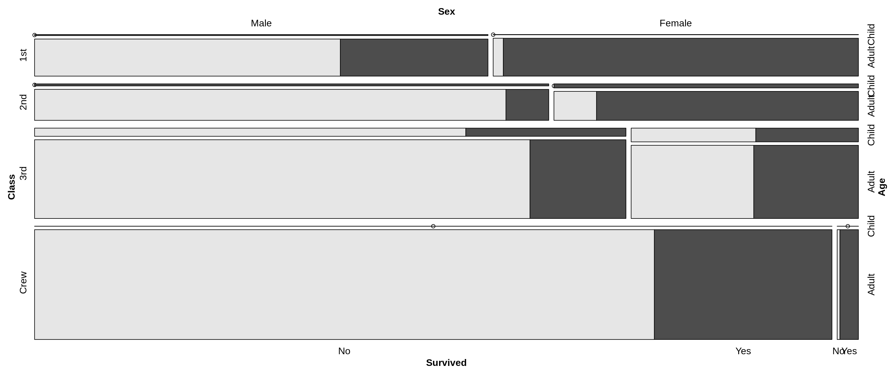

This type of formuala is used when one variable is needed to be highlighted based on rest of the varialbes. Survived is highlihgted based on all otther dependend variables.


**data:**	
Either a data frame, or an object of class "table" or "ftable". If we provide, structable contingency table, we do not need to provide data (df or table). If data is in a data frame, the count column must be called Freq.

**direction:**	
character vector of length k, where k is the number of margins of x (values are recycled as needed). For each component, a value of "h" indicates that the tile(s) of the corresponding dimension should be split horizontally, whereas "v" indicates vertical split(s).

By default, vcd::mosaic() splits horizontally from left for the first variable (e.g. ~ V1, ~ V1 + V2, ~ V2 | V1 or V2 ~ V1 -- here V1 is considered as first variable) and vertically from top for the second variable and so on. If we want to alter this direction, we can provide this "direction" parameter. For example,


```r
vcd::mosaic(Survived ~ Sex + Age, data = Titanic, 
        main = "Survival on the Titanic",direction=c("v","v","h"))
```


```r
# Sex = Vertical, Age = Vertical, Survived = Horizonal
```

In the above plot, the sex variable is used to split the plot vertically, then age variable is used to sub-devide verticaly and then survived sub-division is highlighted horizontally from the other side.

**gp:**	
Object of class "gpar", shading function or a corresponding generating function (see details and shadings). Components of "gpar" objects are recycled as needed along the last splitting dimension. Ignored if shade = FALSE.

if gp is not provided, the default gray color is applied with shade = TRUE


```r
vcd::mosaic(Survived~ Sex + Age, data = Titanic,
       main = "Survival on the Titanic", shade = TRUE,
       direction=c("v","v","h"))
```

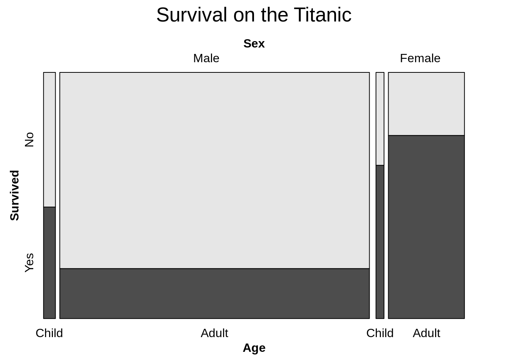

If gp is provided with shade = TRUE (or no shade parameter but not shade = FALSE), the provided color along with other graphical paramters (if provided any) will apply.


```r
vcd::mosaic(Survived~ Sex + Age, data = Titanic,
       main = "Survival on the Titanic", shade = TRUE,
       direction=c("v","v","h"), gp = gpar(fill=c('lightblue', 'pink'))
                 )
```

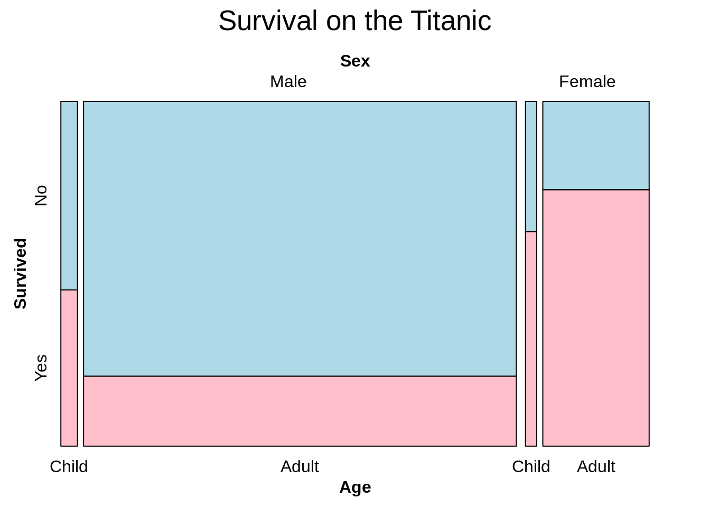

**shade:**	
Logical specifying whether gp should be used or not (see gp). If TRUE and expected is unspecified, a default model is fitted: if condvars (see strucplot) is specified, a corresponding conditional independence model, and else the total independence model.

If we provide shade = FALSE, the gp will not apply at all.


```r
vcd::mosaic(Survived~ Sex + Age, data = Titanic,
       main = "Survival on the Titanic", shade = FALSE,
       direction=c("v","v","h"), gp = gpar(fill=c('lightblue', 'pink'))
                 )
```

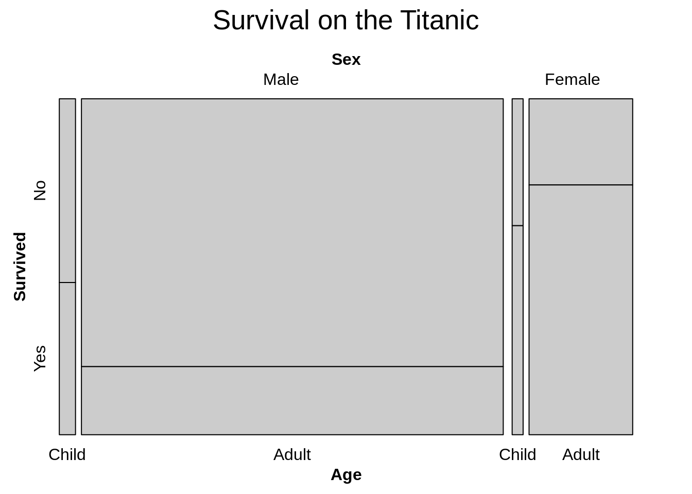


## 2. geom_mosaic:

`geom_mosaic` is similar to `vcd::mosaic`, which is also designed to display the relationship between categorical variables. `geom_mosaic` can be imported from ggmosaic package which is integrated in ggplot2 as a geom and allows for facetting and layering.


```r
library(ggmosaic)
library(gridExtra)
```

We are also using the same Titanic dataset. But, here will convert the dataset from contengency table to data frame to easy to use.


```r
Titanic_df<-as.data.frame(Titanic)
```

The basic usage or parameters of geom_mosaic is:


```r
geom_mosaic(mapping = NULL, data = NULL, stat = "mosaic", 
            position = "identity", conds=NULL, na.rm = FALSE, 
            divider = mosaic(), offset = 0.01, show.legend = NA, 
            inherit.aes = FALSE, ...)
```


The following is  the  description of parameters:

**mapping:** 
In geom_mosaic, this is used to specify categorical varaibles and numeric variable to be displayed. The basic parameters of mapping is

```r
aes(weight=NULL, x=NULL, fill=NULL, conds=NULL)
```
Aesthetics contains the arugments of  weight, x, fill and conds.

* **weight:** select a weighting variable, it can be frequency, relative frequency or other similar weighting variables, but it must be numeric. In mosaic graph, this parameter is used to show the area of each splitting rectangle.

* **x:** select variables to add to formula, which is used to assign categorical varaibles. The basic parameters of x is:

```r
x=product(col_1, col_2, col_3,...)
```
  For example,

```r
ggplot(data = Titanic_df) +
  geom_mosaic(aes(weight = Freq, x = product(Survived, Age, Sex)))
```

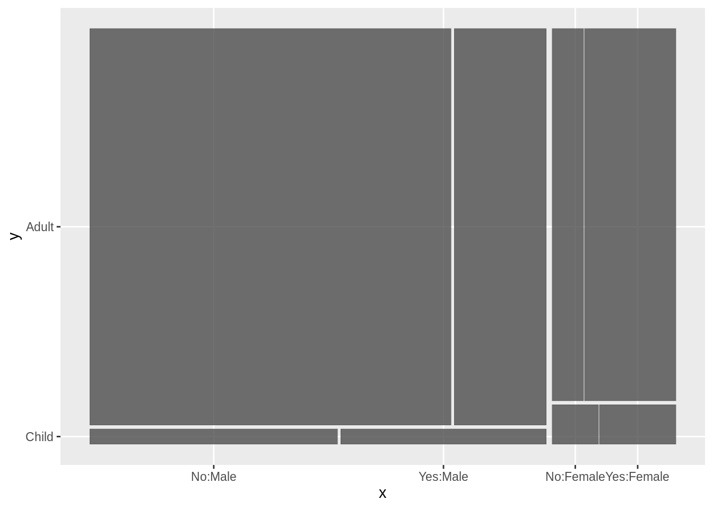

The data is partinioned by Sex first, then Age, and finally Survived.

* **fill:** Select a variable to be filled, it is used to color each rectangle in different colors, which is same to splitting each rectangle into two smaller rectangle and then coloring each smaller rectangle in the same parent rectangle in different colors. For example,


```r
ggplot(data = Titanic_df) +
  geom_mosaic(aes(weight = Freq, x = product( Age, Sex), fill=Survived))
```

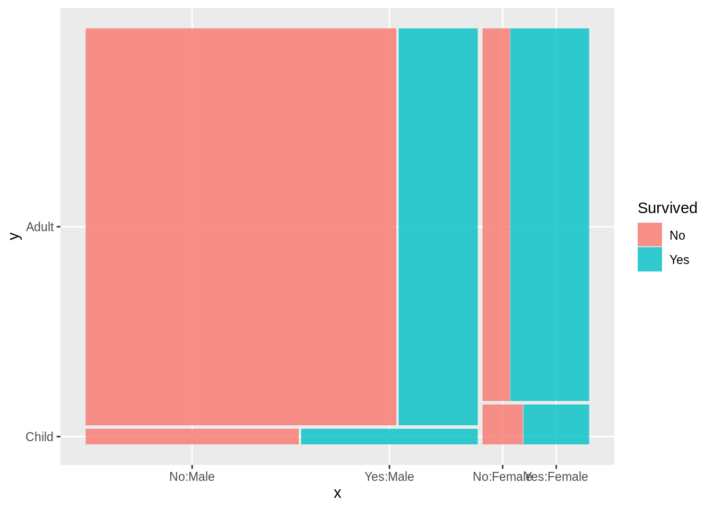


* **conds:** 
Select variables to condition on, which will be used first for splitting. The basic parameters of conds is


```r
conds=product(col_1, col_2, ...)
```

For example,


```r
ggplot(data = Titanic_df) +
  geom_mosaic(aes(weight = Freq, x = product(Age, Sex), 
                  conds=product(Class, Survived),fill=Survived))
```

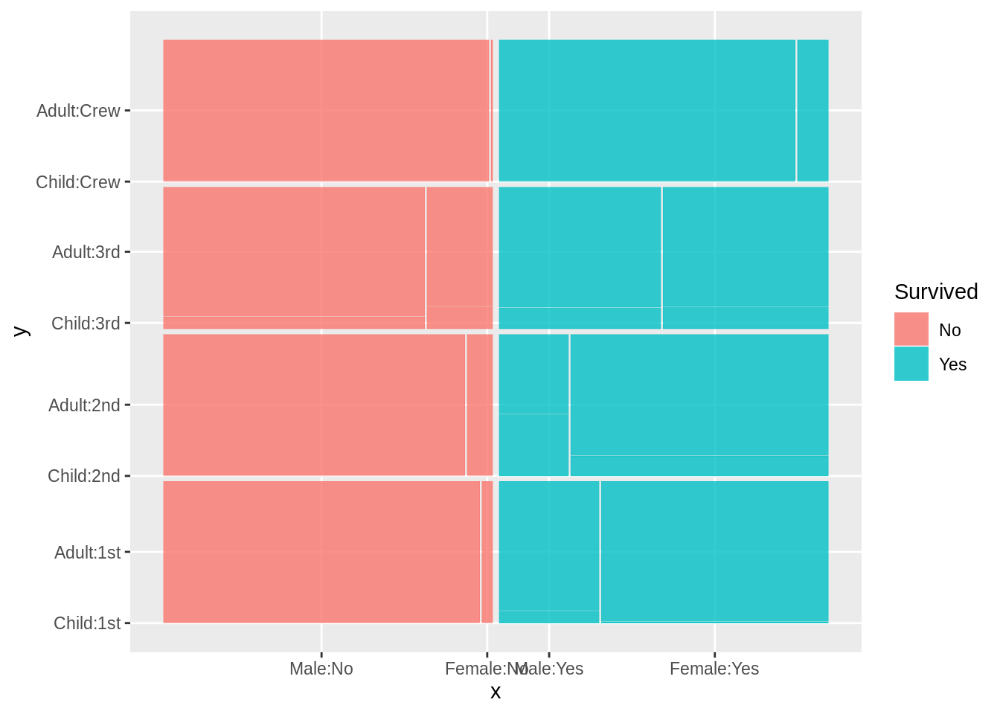

In this example, the data is partitioned by variables in conds first, (Survived, then Class), and then by variables in x. 

When variables in "product", then the order is always from the right most varible to the left most variable, not only in x but also in conds.

And geom_mosaic is a little different to other geom_* functions, we don't need to and also can't specific y. In geom_mosaic, there is no y value.


**order of split**


```r
ggplot(data = Titanic_df) +
  geom_mosaic(aes(weight = Freq, x = product(Survived, Age, Sex), fill=Class))
```

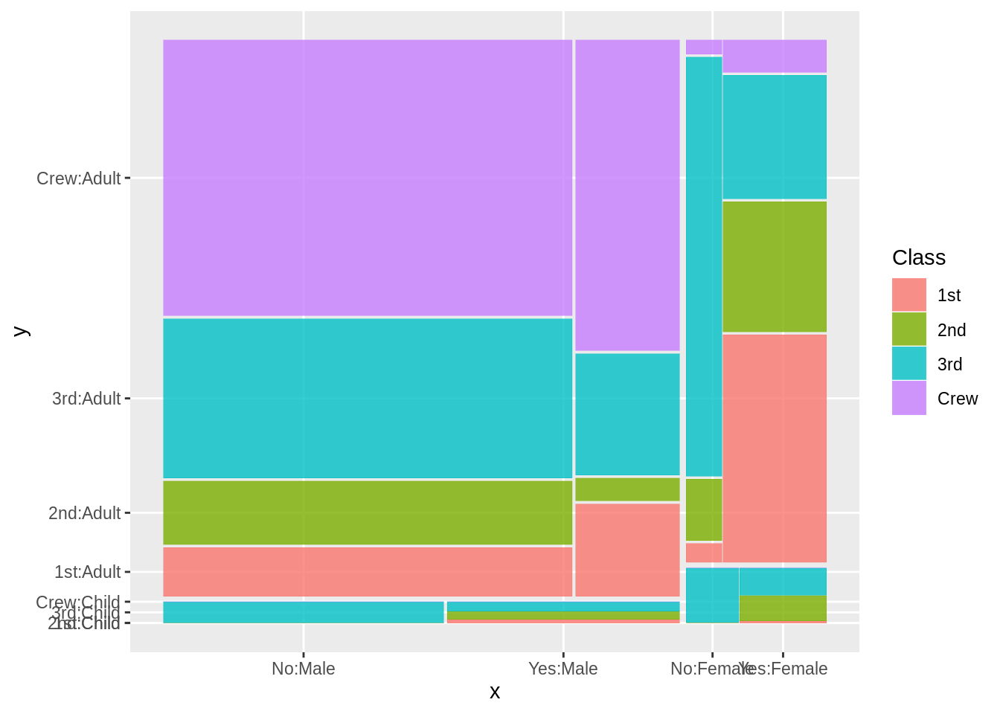

In this example, the order of partition is Sex, Age, Survived, and then each rectangle splitted by Sex, Age and Survived will also be partitioned by Class into 4 smaller rectanglers and then color these smaller ones into four different colors.

The most important thing for this parameter is that the direction of splitting depends on the number of patameters in x. In the above example, the number of patameters in x is 3, which is odd, then the data is partitioned by Class horizontally. While when the number of patameters in x is even, for example, if it is 2, we can see the direction is now vertical.


```r
ggplot(data = Titanic_df) +
  geom_mosaic(aes(weight = Freq, x = product(Age, Sex), fill=Class))
```

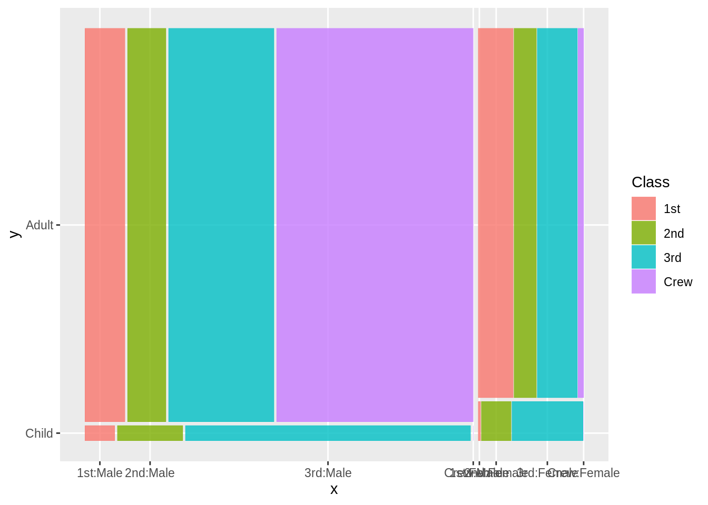


**data:** Only data frame can be used, no "table" or "ftable". If we want to use an object of "table", we must transfer it into dataframe. 


```r
#Titanic <- as.data.frame(Titanic)
```

And we can also put data in the function of ggplot.

**na.rm:** The default is "FALSE", which means it will not remove "NA"; while when it equals to "TURE", it will remove missing values.

**divider:** We have two methods to set divider.

The first one is mosaic().The default of directions is first vertical and then horizontal, repeatedly. And we can also use divider to reset the directions of splitting. For example,


```r
ggplot(data = Titanic_df) +
  geom_mosaic(aes(weight = Freq, x = product(Survived, Age, Sex),
                  fill=Survived), divider = mosaic("v"))
```

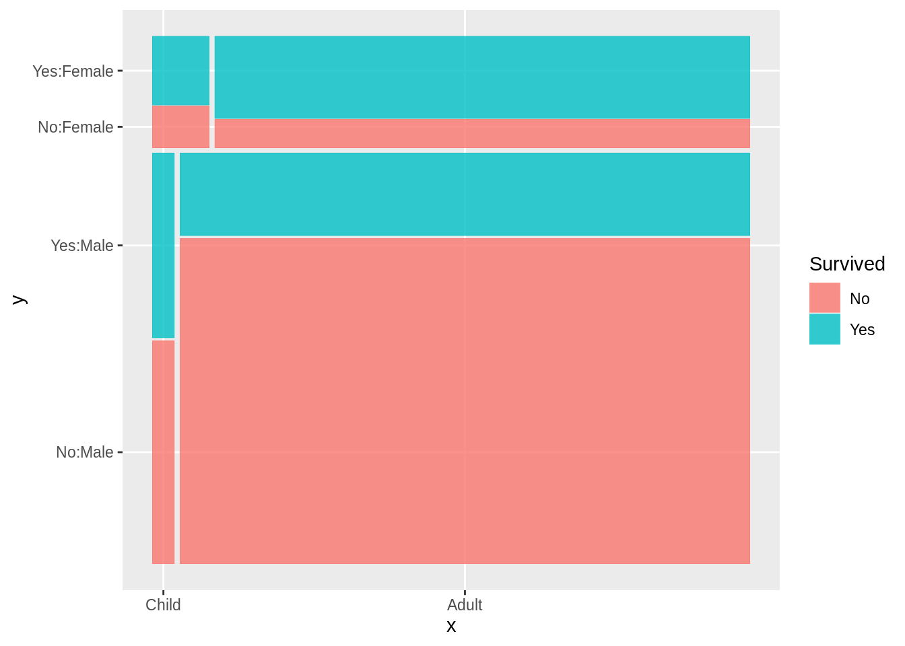

The default parameter is "horizontal"(or "h"), the splitting directions is v-h-v-h-...; while when using "vertical"(or "v"), the directions will become h-v-h-v-.... In other words, it is transversed, varaibles in y-axis will be in x-axis, and varaibles in x-axis will be in y-axis.

The second one is setting divider directly, hspine, vspine, vbar or hbar. But in this method, the data can only be splitted by one categorical variable. Using hspine or vspine, it is same to the original mosaic graph, which using vbar or hbar, it will be like bar chart.
For example,


```r
p1<-ggplot(data = Titanic_df) +
  geom_mosaic(aes(weight = Freq, x = product(Sex)), divider="hspine")+ggtitle("Hspine")
p2<-ggplot(data = Titanic_df) +
  geom_mosaic(aes(weight = Freq, x = product(Sex)), divider="hbar")+ggtitle("Hbar")
grid.arrange(p1, p2, nrow = 1)
```

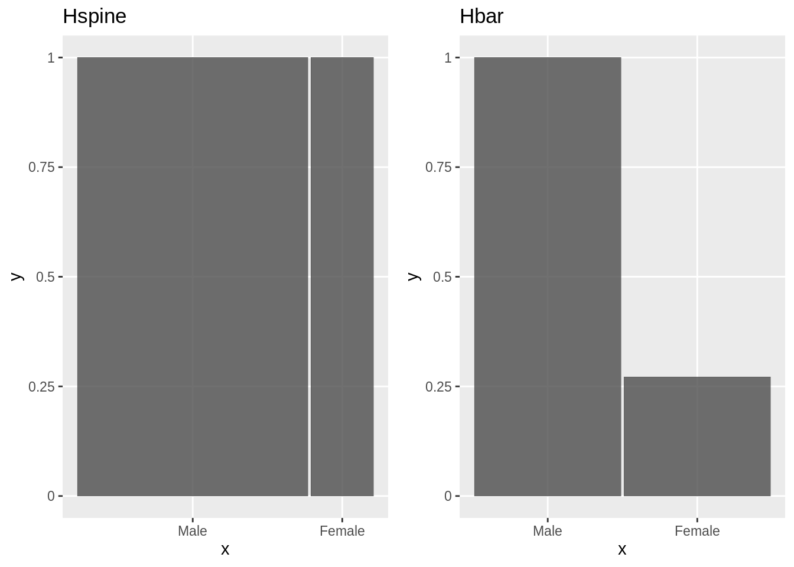

**offset:** Set the space between the first spine, but at the same time, the space between other spines also will change in equal proportion. For example,


```r
g1<-ggplot(data = Titanic_df) +
  geom_mosaic(aes(weight = Freq, x = product(Survived, Age, Sex),fill=Survived),offset = 0.01)+ggtitle("Offset=0.01")
g2<-ggplot(data = Titanic_df) +
  geom_mosaic(aes(weight = Freq, x = product(Survived, Age, Sex),fill=Survived),offset = 0.05)+ggtitle("Offset=0.1")
grid.arrange(g1, g2, nrow = 1)
```

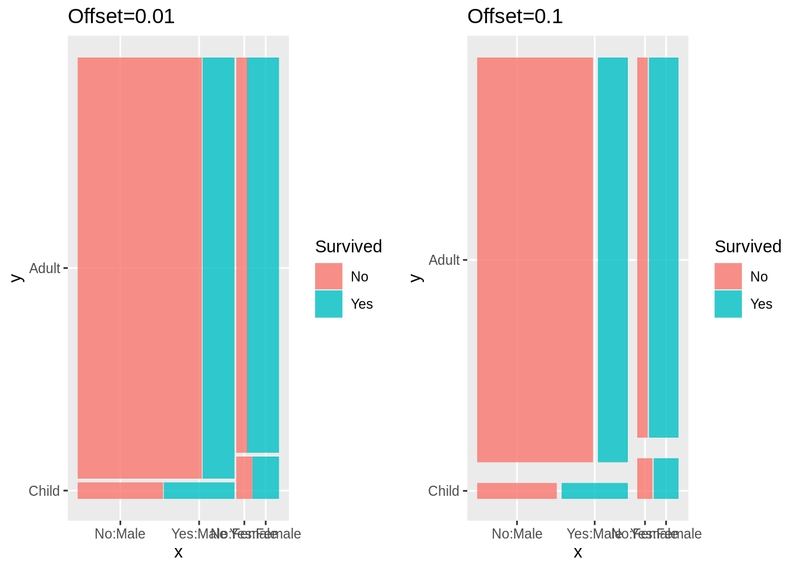

Besides, geom_mosaic also has other similar features of ggplot, like it can use facet_* to facet. For example,


```r
ggplot(data = Titanic_df) +
  geom_mosaic(aes(weight = Freq, x = product(Survived, Age, Sex), fill=Survived))+facet_grid(Class~.)
```

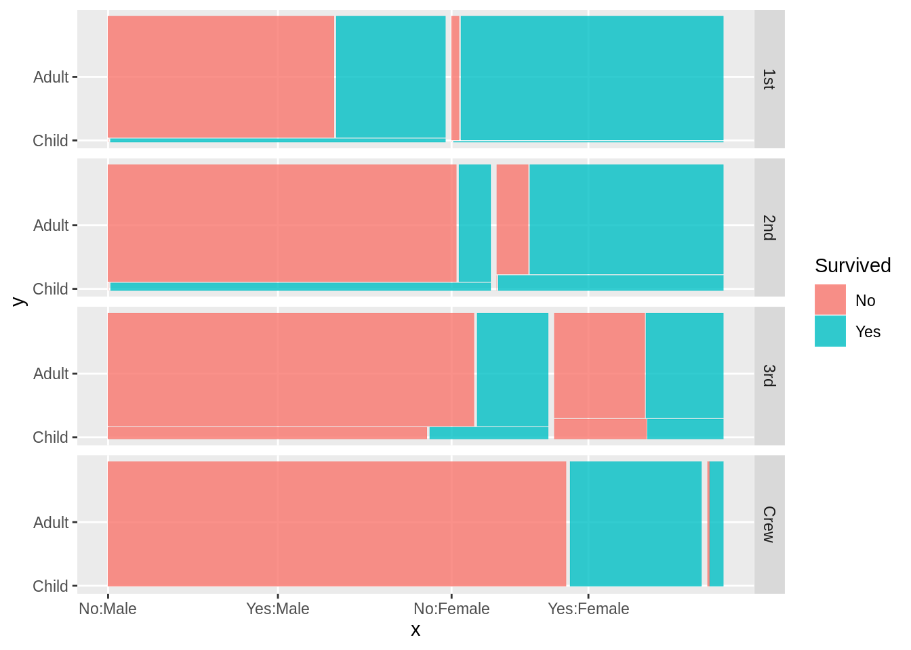


## 3. vcd::mosaic vs geom_mosaic -- which one is better?


* **Type of data**
`geom_mosaic` can only use data frame as its `data` argument, however the type of data in `vcd::mosaic` can be data frame or table.


* **Handling variables used in partition**

`geom_mosaic`, in fact ggplot2, is not capable of handling a different number of variables in aesthetics. `product`, a wrapper function for a list, is used as a workaround for this. However, this workaround leads to issues with the labeling; those can be fixed manually though.

On the other hand, the `formualla` of `vcd::mosaic` is capable of handling a number of splitting variables and labeling is also very easy in this case. 


* **Use of different layer including faceting**

Since `geom_mosaic` is a faction of ggplot2, it inherits the layered mechanism. So, we can plot mosaic with other plots. We can also use other grouping techniques like faceting.


* **Order of splits**
`vcd::mosaic` is much easier to control the order of split than `geom_mosaic`. `vcd::mosaic` uses formula (e.g. V3 ~ V1 + V2) to set the split order which has a clear explanation of the position of the variables. On the other hand, `geom_mosaic` uses odd or even number of variables to decide the split. If the number of parameters is odd,  the data is partitioned by the last dependent variable horizontally.


* **Direction of splits**

`vcd::mosaic` has a `direction` argument that directs split directions whether the variable should be split horizontally or vertically.
`geom_mosaic` has default direction to split the product variables. The default of directions is first vertical and then horizontal, repeatedly. `divider` is used to reset the directions of splitting, but a different combination of splitting direction with the variable is very challenging


* **Color**
In the use of color in different places (e.g. fill, border), both functions have a straightforward structure. `geom_mosaic` also gives an auto legend facility in the use of color.


* **offset**
Setting offset and spacing, `geom_mosaic` is very easy to work with.


In conclusion, it's easier to use `vcd::mosaic`, especially when setting the arguments of categorical variables and their splitting directions. What's more, `vcd::mosaic` can also display the relationship between categorical variables more clearly. But `geom_mosaic` is integrated in ggplot2 as a geom which allows for faceting, layering, setting offset and so on.


**Reference:**

1) https://pdfs.semanticscholar.org/2416/2c1a46669f94356854176ece8548bf7fb989.pdf

2) https://ncss-wpengine.netdna-ssl.com/wp-content/themes/ncss/pdf/Procedures/NCSS/Mosaic_Plots.pdf

3) https://en.wikipedia.org/wiki/Mosaic_plot

4) http://www.pmean.com/definitions/mosaic.htm

5) https://cran.r-project.org/web/packages/ggmosaic/vignettes/ggmosaic.html
