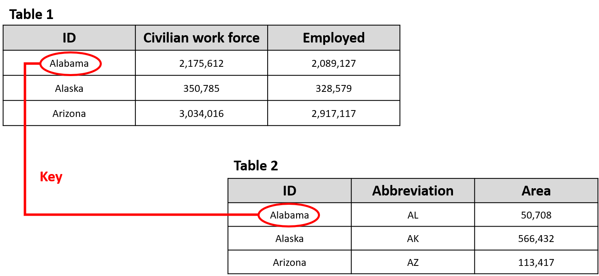
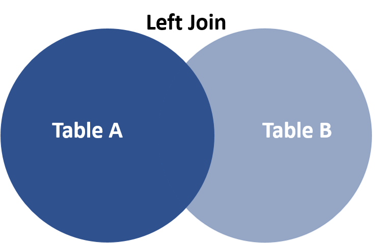
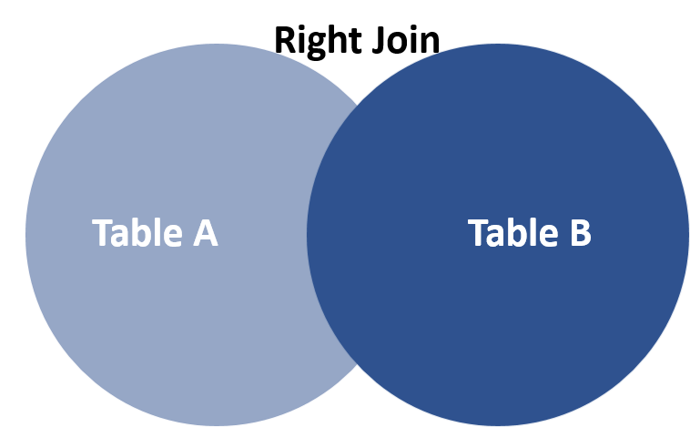
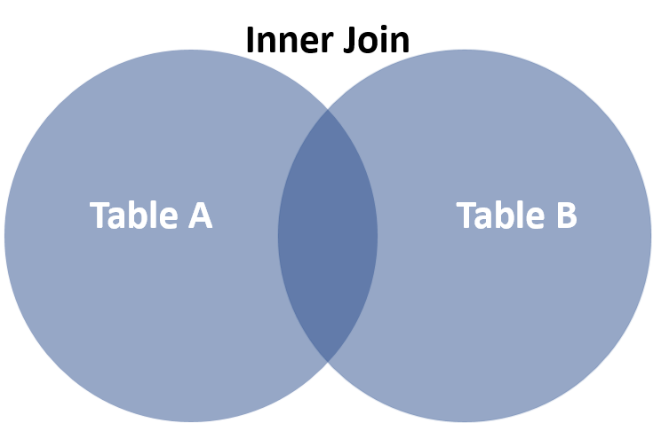

# Dplyr Relational Databases

Alberto Munguia and Chengyi Chen


## 1.Overview

This project intends to illustrate the use of some libarries that are relevant to manipulate and transform relational databases.

## 2.Definition of Relational Databases

A relational database is a type of database that stores and provides access to data points that are related to one another. Relational databases are based on the relational model, an intuitive, straightforward way of representing data in tables. The relational model organizes data into one or more tables (or "relations") of columns and rows, with a unique key identifying each row. Key plays an important role in relational database.

* Primary Key a.. A primary is a column or set of columns in a table that uniquely identifies tuples (rows) in that table.

* Super Key a.. A super key is a set of one or more columns (attributes) to uniquely identify rows in a table.

* Candidate Key a.. A super key with no redundant attribute is known as a candidate key.

* Alternate Key a.. Out of all candidate keys, only one gets selected as primary key, remaining keys are known as alternate or secondary keys.

* Composite Key a.. A key that consists of more than one attribute to uniquely identify rows (also known as records & tuples) in a table is called composite key.

* Foreign Key a.. Foreign keys are the columns of a table that points to the primary key of another table. They act as a cross-reference between tables.

{width=70%}


Standard relational databases enable users to manage predefined data relationships across multiple databases. Popular examples of relational databases include Microsoft SQL Server, Oracle Database, MySQL and IBM DB2.

## 3. R Packages

R offers flexibility in the manipulation of relational of databases through some specific functions embedded in the packages like:

* [`dplyr`](https://www.rdocumentation.org/packages/dplyr){target="_blank"}
* [`base`](https://www.rdocumentation.org/packages/base/versions/3.6.1){target="_blank"}
* [`sqldf`](https://www.rdocumentation.org/packages/sqldf/versions/0.4-11){target="_blank"}

Nevertheless, the data manipulation in R is easier with dplyr because the package is oriented towards the data analysis. Furthemore, dplyr offers some advantages in the join functions in comaprison with base and sqldf:

* For large amounts of data joining tables is faster.
* Rows are kept in existing order.
* Tells users what keys you are merging by.
* Work with database tables.

For our example you need to install the next packages:

* For the dplyr manipulation.
  + `install.packages('dplyr')` 

* For the SQL manipulation.
  + `install.packages('sqldf')` 
  + `install.packages('gsubfn')`
  + `install.packages('proto')`
  + `install.packages('RSQLite')`

* For getting the data for the example
  + `install.packages('BIS')`


Load the libraries


```r
library(dplyr)


library(sqldf)
library(gsubfn)
library(proto)
library(RSQLite)


library(BIS)
```


## 4. Data description for example

### 4.1 BIS Library 

We will explore relational data from the recent data package  [`BIS`](https://www.rdocumentation.org/packages/BIS/versions/0.2.1){target="_blank"} that provides an interface to data provided by the Bank for International Settlements <https://www.bis.org>, allowing for programmatic retrieval of a large quantity of (central) banking data. 

### 4.2 Selected data sets

First, we are going to upload the tables that are available in the BIS package.


```r
datasets=get_datasets()
datasets
```

```
## # A tibble: 24 x 2
##    name                               url                                       
##    <chr>                              <chr>                                     
##  1 Locational banking statistics      https://www.bis.org/statistics/full_bis_l…
##  2 Consolidated banking statistics    https://www.bis.org/statistics/full_bis_c…
##  3 Debt securities statistics         https://www.bis.org/statistics/full_bis_d…
##  4 Credit to the non-financial sector https://www.bis.org/statistics/full_bis_t…
##  5 Credit-to-GDP gaps                 https://www.bis.org/statistics/full_webst…
##  6 Debt service ratios for the priva… https://www.bis.org/statistics/full_bis_d…
##  7 Global liquidity indicators        https://www.bis.org/statistics/full_bis_g…
##  8 Exchange-traded derivatives stati… https://www.bis.org/statistics/full_bis_x…
##  9 OTC derivatives outstanding        https://www.bis.org/statistics/full_bis_o…
## 10 US dollar exchange rates (monthly… https://www.bis.org/statistics/full_webst…
## # … with 14 more rows
```

For the purpose of our excercise we have choose tables 6 and 18 from the BIS data set.

  * Table 6 corresponds to the quarterly data of the Debt service ratios for the private non-financial sector for the countries that are part of the BIS. In order to facilite our example we are going to filter our data and only keep the quaterly information that corresponds to the Private non-financial sector.


```r
Debt_service=get_bis(datasets$url[6])
glimpse(Debt_service)
```

```
## Observations: 5,334
## Variables: 8
## $ freq              <chr> "Q", "Q", "Q", "Q", "Q", "Q", "Q", "Q", "Q", "Q", "…
## $ frequency         <chr> "Quarterly", "Quarterly", "Quarterly", "Quarterly",…
## $ borrowers_cty     <chr> "AU", "AU", "AU", "BE", "BE", "BE", "BR", "CA", "CA…
## $ borrowers_country <chr> "Australia", "Australia", "Australia", "Belgium", "…
## $ dsr_borrowers     <chr> "H", "N", "P", "H", "N", "P", "P", "H", "N", "P", "…
## $ borrowers         <chr> "Households & NPISHs", "Non-financial corporations"…
## $ date              <chr> "1999-q1", "1999-q1", "1999-q1", "1999-q1", "1999-q…
## $ obs_value         <dbl> 10.0, 44.3, 16.3, 6.1, 36.3, 13.8, 40.0, 10.6, 58.0…
```


```r
Debt_service_filter=filter(Debt_service, Debt_service$dsr_borrowers=="P")
glimpse(Debt_service_filter)
```

```
## Observations: 2,580
## Variables: 8
## $ freq              <chr> "Q", "Q", "Q", "Q", "Q", "Q", "Q", "Q", "Q", "Q", "…
## $ frequency         <chr> "Quarterly", "Quarterly", "Quarterly", "Quarterly",…
## $ borrowers_cty     <chr> "AU", "BE", "BR", "CA", "CH", "CN", "CZ", "DE", "DK…
## $ borrowers_country <chr> "Australia", "Belgium", "Brazil", "Canada", "Switze…
## $ dsr_borrowers     <chr> "P", "P", "P", "P", "P", "P", "P", "P", "P", "P", "…
## $ borrowers         <chr> "Private non-financial sector", "Private non-financ…
## $ date              <chr> "1999-q1", "1999-q1", "1999-q1", "1999-q1", "1999-q…
## $ obs_value         <dbl> 16.3, 13.8, 40.0, 21.4, 16.8, 10.9, 13.8, 13.0, 21.…
```

  * Table 18 corresponds to the quarterly data of the Property prices: long series for the countries that are part of the BIS. 


```r
Property_prices=get_bis(datasets$url[18])
glimpse(Property_prices)
```

```
## Observations: 4,526
## Variables: 6
## $ freq           <chr> "Q", "Q", "Q", "Q", "Q", "Q", "Q", "Q", "Q", "Q", "Q",…
## $ frequency      <chr> "Quarterly", "Quarterly", "Quarterly", "Quarterly", "Q…
## $ ref_area       <chr> "IT", "IT", "IT", "IT", "IT", "IT", "IT", "IT", "IT", …
## $ reference_area <chr> "Italy", "Italy", "Italy", "Italy", "Italy", "Italy", …
## $ date           <chr> "1927-q1", "1927-q2", "1927-q3", "1927-q4", "1928-q1",…
## $ obs_value      <dbl> 0.0343, 0.0342, 0.0340, 0.0339, 0.0338, 0.0336, 0.0334…
```


  * The key to joining our two tables are going to be the code of the country and the date.
  
{width=65%}  


## 5. Types of joins

### 5.1 Left_join

{width=25%}

Select all records from Table A, along with records from Table B for which the join condition is met (if at all).

In our case Table A corresponds to Debt_service_filter and Table B to Property_prices. Notice that in our example the resulting table after the left join will keep all the records of Debt_service_filter. Additionally, we can observe that the columns where the name is the same in the tables Debt_service_filter and Property_prices appears with the suffix '.x' and '.y'. to clarify the origin of the column. In the case of SQL, we need to highlight that the join function results in 14 columns, two more than in merge and left_join. This is explained because SQL leaves the totality of the columns while in the other two procedures the keys are not repeated.

   * Left join functionality with dplyr.

```r
leftjoin_dplyr=left_join(Debt_service_filter, Property_prices, by=c('borrowers_cty'='ref_area','date'='date'))
glimpse(leftjoin_dplyr)
```

```
## Observations: 2,580
## Variables: 12
## $ freq.x            <chr> "Q", "Q", "Q", "Q", "Q", "Q", "Q", "Q", "Q", "Q", "…
## $ frequency.x       <chr> "Quarterly", "Quarterly", "Quarterly", "Quarterly",…
## $ borrowers_cty     <chr> "AU", "BE", "BR", "CA", "CH", "CN", "CZ", "DE", "DK…
## $ borrowers_country <chr> "Australia", "Belgium", "Brazil", "Canada", "Switze…
## $ dsr_borrowers     <chr> "P", "P", "P", "P", "P", "P", "P", "P", "P", "P", "…
## $ borrowers         <chr> "Private non-financial sector", "Private non-financ…
## $ date              <chr> "1999-q1", "1999-q1", "1999-q1", "1999-q1", "1999-q…
## $ obs_value.x       <dbl> 16.3, 13.8, 40.0, 21.4, 16.8, 10.9, 13.8, 13.0, 21.…
## $ freq.y            <chr> "Q", "Q", NA, "Q", "Q", NA, NA, "Q", "Q", "Q", "Q",…
## $ frequency.y       <chr> "Quarterly", "Quarterly", NA, "Quarterly", "Quarter…
## $ reference_area    <chr> "Australia", "Belgium", NA, "Canada", "Switzerland"…
## $ obs_value.y       <dbl> 116.5571, 115.9600, NA, 101.6600, 90.9073, NA, NA, …
```


   * Left join functionality with base.

```r
leftjoin_base=merge(Debt_service_filter, Property_prices, all.x = TRUE, by.x=c("borrowers_cty", "date"), by.y=c("ref_area", "date"))
glimpse(leftjoin_base)
```

```
## Observations: 2,580
## Variables: 12
## $ borrowers_cty     <chr> "AU", "AU", "AU", "AU", "AU", "AU", "AU", "AU", "AU…
## $ date              <chr> "1999-q1", "1999-q2", "1999-q3", "1999-q4", "2000-q…
## $ freq.x            <chr> "Q", "Q", "Q", "Q", "Q", "Q", "Q", "Q", "Q", "Q", "…
## $ frequency.x       <chr> "Quarterly", "Quarterly", "Quarterly", "Quarterly",…
## $ borrowers_country <chr> "Australia", "Australia", "Australia", "Australia",…
## $ dsr_borrowers     <chr> "P", "P", "P", "P", "P", "P", "P", "P", "P", "P", "…
## $ borrowers         <chr> "Private non-financial sector", "Private non-financ…
## $ obs_value.x       <dbl> 16.3, 16.2, 16.4, 16.8, 17.3, 17.9, 17.9, 18.1, 17.…
## $ freq.y            <chr> "Q", "Q", "Q", "Q", "Q", "Q", "Q", "Q", "Q", "Q", "…
## $ frequency.y       <chr> "Quarterly", "Quarterly", "Quarterly", "Quarterly",…
## $ reference_area    <chr> "Australia", "Australia", "Australia", "Australia",…
## $ obs_value.y       <dbl> 116.5571, 119.2170, 121.4370, 125.4269, 127.7368, 1…
```


   * Left join functionality with sqldf.

```r
leftjoin_sqldf=sqldf("select * from Debt_service_filter 
                      LEFT JOIN Property_prices 
                      on Debt_service_filter.borrowers_cty = Property_prices.ref_area
                      and Debt_service_filter.date = Property_prices.date")
glimpse(leftjoin_sqldf)
```

```
## Observations: 2,580
## Variables: 14
## $ freq              <chr> "Q", "Q", "Q", "Q", "Q", "Q", "Q", "Q", "Q", "Q", "…
## $ frequency         <chr> "Quarterly", "Quarterly", "Quarterly", "Quarterly",…
## $ borrowers_cty     <chr> "AU", "BE", "BR", "CA", "CH", "CN", "CZ", "DE", "DK…
## $ borrowers_country <chr> "Australia", "Belgium", "Brazil", "Canada", "Switze…
## $ dsr_borrowers     <chr> "P", "P", "P", "P", "P", "P", "P", "P", "P", "P", "…
## $ borrowers         <chr> "Private non-financial sector", "Private non-financ…
## $ date              <chr> "1999-q1", "1999-q1", "1999-q1", "1999-q1", "1999-q…
## $ obs_value         <dbl> 16.3, 13.8, 40.0, 21.4, 16.8, 10.9, 13.8, 13.0, 21.…
## $ freq..9           <chr> "Q", "Q", NA, "Q", "Q", NA, NA, "Q", "Q", "Q", "Q",…
## $ frequency..10     <chr> "Quarterly", "Quarterly", NA, "Quarterly", "Quarter…
## $ ref_area          <chr> "AU", "BE", NA, "CA", "CH", NA, NA, "DE", "DK", "ES…
## $ reference_area    <chr> "Australia", "Belgium", NA, "Canada", "Switzerland"…
## $ date..13          <chr> "1999-q1", "1999-q1", NA, "1999-q1", "1999-q1", NA,…
## $ obs_value..14     <dbl> 116.5571, 115.9600, NA, 101.6600, 90.9073, NA, NA, …
```


### 5.2. Right_join

{width=25%}

Select all records from Table B, along with records from Table A for which the join condition is met (if at all).
In our case Table, A corresponds to Debt_service_filter and Table B to Property_prices. Notice that in our example the resulting table after the right join will keep all the records of Property_prices.


   * Right join functionality with dplyr.

```r
rightjoin_dplyr=right_join(Debt_service_filter, Property_prices, by=c('borrowers_cty'='ref_area','date'='date'))
glimpse(rightjoin_dplyr)
```

```
## Observations: 4,526
## Variables: 12
## $ freq.x            <chr> NA, NA, NA, NA, NA, NA, NA, NA, NA, NA, NA, NA, NA,…
## $ frequency.x       <chr> NA, NA, NA, NA, NA, NA, NA, NA, NA, NA, NA, NA, NA,…
## $ borrowers_cty     <chr> "IT", "IT", "IT", "IT", "IT", "IT", "IT", "IT", "IT…
## $ borrowers_country <chr> NA, NA, NA, NA, NA, NA, NA, NA, NA, NA, NA, NA, NA,…
## $ dsr_borrowers     <chr> NA, NA, NA, NA, NA, NA, NA, NA, NA, NA, NA, NA, NA,…
## $ borrowers         <chr> NA, NA, NA, NA, NA, NA, NA, NA, NA, NA, NA, NA, NA,…
## $ date              <chr> "1927-q1", "1927-q2", "1927-q3", "1927-q4", "1928-q…
## $ obs_value.x       <dbl> NA, NA, NA, NA, NA, NA, NA, NA, NA, NA, NA, NA, NA,…
## $ freq.y            <chr> "Q", "Q", "Q", "Q", "Q", "Q", "Q", "Q", "Q", "Q", "…
## $ frequency.y       <chr> "Quarterly", "Quarterly", "Quarterly", "Quarterly",…
## $ reference_area    <chr> "Italy", "Italy", "Italy", "Italy", "Italy", "Italy…
## $ obs_value.y       <dbl> 0.0343, 0.0342, 0.0340, 0.0339, 0.0338, 0.0336, 0.0…
```


   * Right join functionality with base

```r
rightjoin_base=merge(Debt_service_filter, Property_prices, all.y = TRUE, by.x=c("borrowers_cty", "date"), by.y=c("ref_area", "date"))
glimpse(rightjoin_base)
```

```
## Observations: 4,526
## Variables: 12
## $ borrowers_cty     <chr> "AU", "AU", "AU", "AU", "AU", "AU", "AU", "AU", "AU…
## $ date              <chr> "1970-q1", "1970-q2", "1970-q3", "1970-q4", "1971-q…
## $ freq.x            <chr> NA, NA, NA, NA, NA, NA, NA, NA, NA, NA, NA, NA, NA,…
## $ frequency.x       <chr> NA, NA, NA, NA, NA, NA, NA, NA, NA, NA, NA, NA, NA,…
## $ borrowers_country <chr> NA, NA, NA, NA, NA, NA, NA, NA, NA, NA, NA, NA, NA,…
## $ dsr_borrowers     <chr> NA, NA, NA, NA, NA, NA, NA, NA, NA, NA, NA, NA, NA,…
## $ borrowers         <chr> NA, NA, NA, NA, NA, NA, NA, NA, NA, NA, NA, NA, NA,…
## $ obs_value.x       <dbl> NA, NA, NA, NA, NA, NA, NA, NA, NA, NA, NA, NA, NA,…
## $ freq.y            <chr> "Q", "Q", "Q", "Q", "Q", "Q", "Q", "Q", "Q", "Q", "…
## $ frequency.y       <chr> "Quarterly", "Quarterly", "Quarterly", "Quarterly",…
## $ reference_area    <chr> "Australia", "Australia", "Australia", "Australia",…
## $ obs_value.y       <dbl> 9.8398, 10.0197, 10.2997, 10.6197, 10.9197, 11.1697…
```

   * Right join functionality with sqldf is not supported.


### 5.3. Inner_join

{width=25%}

Select all records from Table A and Table B, where the join condition is met. In our case Table, A corresponds to Debt_service_filter and Table B to Property_prices. Notice that in our example the resulting table will keep only the rows in the intersection.

   * Inner join functionality with dplyr.

```r
innerjoin_dplyr=inner_join(Debt_service_filter, Property_prices, by=c('borrowers_cty'='ref_area','date'='date'))
glimpse(innerjoin_dplyr)
```

```
## Observations: 1,664
## Variables: 12
## $ freq.x            <chr> "Q", "Q", "Q", "Q", "Q", "Q", "Q", "Q", "Q", "Q", "…
## $ frequency.x       <chr> "Quarterly", "Quarterly", "Quarterly", "Quarterly",…
## $ borrowers_cty     <chr> "AU", "BE", "CA", "CH", "DE", "DK", "ES", "FI", "FR…
## $ borrowers_country <chr> "Australia", "Belgium", "Canada", "Switzerland", "G…
## $ dsr_borrowers     <chr> "P", "P", "P", "P", "P", "P", "P", "P", "P", "P", "…
## $ borrowers         <chr> "Private non-financial sector", "Private non-financ…
## $ date              <chr> "1999-q1", "1999-q1", "1999-q1", "1999-q1", "1999-q…
## $ obs_value.x       <dbl> 16.3, 13.8, 21.4, 16.8, 13.0, 21.1, 11.6, 13.3, 15.…
## $ freq.y            <chr> "Q", "Q", "Q", "Q", "Q", "Q", "Q", "Q", "Q", "Q", "…
## $ frequency.y       <chr> "Quarterly", "Quarterly", "Quarterly", "Quarterly",…
## $ reference_area    <chr> "Australia", "Belgium", "Canada", "Switzerland", "G…
## $ obs_value.y       <dbl> 116.5571, 115.9600, 101.6600, 90.9073, 95.9194, 140…
```

   * Inner join functionality with base.

```r
innerjoin_base=merge(Debt_service_filter, Property_prices, by.x=c("borrowers_cty", "date"), by.y=c("ref_area", "date"))

glimpse(innerjoin_base)
```

```
## Observations: 1,664
## Variables: 12
## $ borrowers_cty     <chr> "AU", "AU", "AU", "AU", "AU", "AU", "AU", "AU", "AU…
## $ date              <chr> "1999-q1", "1999-q2", "1999-q3", "1999-q4", "2000-q…
## $ freq.x            <chr> "Q", "Q", "Q", "Q", "Q", "Q", "Q", "Q", "Q", "Q", "…
## $ frequency.x       <chr> "Quarterly", "Quarterly", "Quarterly", "Quarterly",…
## $ borrowers_country <chr> "Australia", "Australia", "Australia", "Australia",…
## $ dsr_borrowers     <chr> "P", "P", "P", "P", "P", "P", "P", "P", "P", "P", "…
## $ borrowers         <chr> "Private non-financial sector", "Private non-financ…
## $ obs_value.x       <dbl> 16.3, 16.2, 16.4, 16.8, 17.3, 17.9, 17.9, 18.1, 17.…
## $ freq.y            <chr> "Q", "Q", "Q", "Q", "Q", "Q", "Q", "Q", "Q", "Q", "…
## $ frequency.y       <chr> "Quarterly", "Quarterly", "Quarterly", "Quarterly",…
## $ reference_area    <chr> "Australia", "Australia", "Australia", "Australia",…
## $ obs_value.y       <dbl> 116.5571, 119.2170, 121.4370, 125.4269, 127.7368, 1…
```

   * Inner join functionality with sqldf.

```r
innerjoin_sqldf=sqldf("select * from Debt_service_filter
                      INNER JOIN Property_prices 
                      on Debt_service_filter.borrowers_cty = Property_prices.ref_area
                      and Debt_service_filter.date = Property_prices.date
                      ")
glimpse(innerjoin_sqldf)
```

```
## Observations: 1,664
## Variables: 14
## $ freq              <chr> "Q", "Q", "Q", "Q", "Q", "Q", "Q", "Q", "Q", "Q", "…
## $ frequency         <chr> "Quarterly", "Quarterly", "Quarterly", "Quarterly",…
## $ borrowers_cty     <chr> "AU", "BE", "CA", "CH", "DE", "DK", "ES", "FI", "FR…
## $ borrowers_country <chr> "Australia", "Belgium", "Canada", "Switzerland", "G…
## $ dsr_borrowers     <chr> "P", "P", "P", "P", "P", "P", "P", "P", "P", "P", "…
## $ borrowers         <chr> "Private non-financial sector", "Private non-financ…
## $ date              <chr> "1999-q1", "1999-q1", "1999-q1", "1999-q1", "1999-q…
## $ obs_value         <dbl> 16.3, 13.8, 21.4, 16.8, 13.0, 21.1, 11.6, 13.3, 15.…
## $ freq..9           <chr> "Q", "Q", "Q", "Q", "Q", "Q", "Q", "Q", "Q", "Q", "…
## $ frequency..10     <chr> "Quarterly", "Quarterly", "Quarterly", "Quarterly",…
## $ ref_area          <chr> "AU", "BE", "CA", "CH", "DE", "DK", "ES", "FI", "FR…
## $ reference_area    <chr> "Australia", "Belgium", "Canada", "Switzerland", "G…
## $ date..13          <chr> "1999-q1", "1999-q1", "1999-q1", "1999-q1", "1999-q…
## $ obs_value..14     <dbl> 116.5571, 115.9600, 101.6600, 90.9073, 95.9194, 140…
```


### 5.4. Full_join


{width=25%}

Select all records from Table A and Table B, where the join condition is met. In our case Table, A corresponds to Debt_service_filter and Table B to Property_prices. Notice that in our example the resulting table will keep all the rows in both tables.


   * Full join functionality with dplyr.

```r
outerjoin_dplyr=full_join(Debt_service_filter, Property_prices, by=c('borrowers_cty'='ref_area','date'='date'))
glimpse(outerjoin_dplyr)
```

```
## Observations: 5,442
## Variables: 12
## $ freq.x            <chr> "Q", "Q", "Q", "Q", "Q", "Q", "Q", "Q", "Q", "Q", "…
## $ frequency.x       <chr> "Quarterly", "Quarterly", "Quarterly", "Quarterly",…
## $ borrowers_cty     <chr> "AU", "BE", "BR", "CA", "CH", "CN", "CZ", "DE", "DK…
## $ borrowers_country <chr> "Australia", "Belgium", "Brazil", "Canada", "Switze…
## $ dsr_borrowers     <chr> "P", "P", "P", "P", "P", "P", "P", "P", "P", "P", "…
## $ borrowers         <chr> "Private non-financial sector", "Private non-financ…
## $ date              <chr> "1999-q1", "1999-q1", "1999-q1", "1999-q1", "1999-q…
## $ obs_value.x       <dbl> 16.3, 13.8, 40.0, 21.4, 16.8, 10.9, 13.8, 13.0, 21.…
## $ freq.y            <chr> "Q", "Q", NA, "Q", "Q", NA, NA, "Q", "Q", "Q", "Q",…
## $ frequency.y       <chr> "Quarterly", "Quarterly", NA, "Quarterly", "Quarter…
## $ reference_area    <chr> "Australia", "Belgium", NA, "Canada", "Switzerland"…
## $ obs_value.y       <dbl> 116.5571, 115.9600, NA, 101.6600, 90.9073, NA, NA, …
```

   * Full join functionality with base.

```r
outerjoin_base=merge(Debt_service_filter, Property_prices, all.y = TRUE, all.x = TRUE, by.x=c("borrowers_cty", "date"), by.y=c("ref_area", "date"))

glimpse(outerjoin_base)
```

```
## Observations: 5,442
## Variables: 12
## $ borrowers_cty     <chr> "AU", "AU", "AU", "AU", "AU", "AU", "AU", "AU", "AU…
## $ date              <chr> "1970-q1", "1970-q2", "1970-q3", "1970-q4", "1971-q…
## $ freq.x            <chr> NA, NA, NA, NA, NA, NA, NA, NA, NA, NA, NA, NA, NA,…
## $ frequency.x       <chr> NA, NA, NA, NA, NA, NA, NA, NA, NA, NA, NA, NA, NA,…
## $ borrowers_country <chr> NA, NA, NA, NA, NA, NA, NA, NA, NA, NA, NA, NA, NA,…
## $ dsr_borrowers     <chr> NA, NA, NA, NA, NA, NA, NA, NA, NA, NA, NA, NA, NA,…
## $ borrowers         <chr> NA, NA, NA, NA, NA, NA, NA, NA, NA, NA, NA, NA, NA,…
## $ obs_value.x       <dbl> NA, NA, NA, NA, NA, NA, NA, NA, NA, NA, NA, NA, NA,…
## $ freq.y            <chr> "Q", "Q", "Q", "Q", "Q", "Q", "Q", "Q", "Q", "Q", "…
## $ frequency.y       <chr> "Quarterly", "Quarterly", "Quarterly", "Quarterly",…
## $ reference_area    <chr> "Australia", "Australia", "Australia", "Australia",…
## $ obs_value.y       <dbl> 9.8398, 10.0197, 10.2997, 10.6197, 10.9197, 11.1697…
```

   * Full join functionality with sqldf is not supported.
