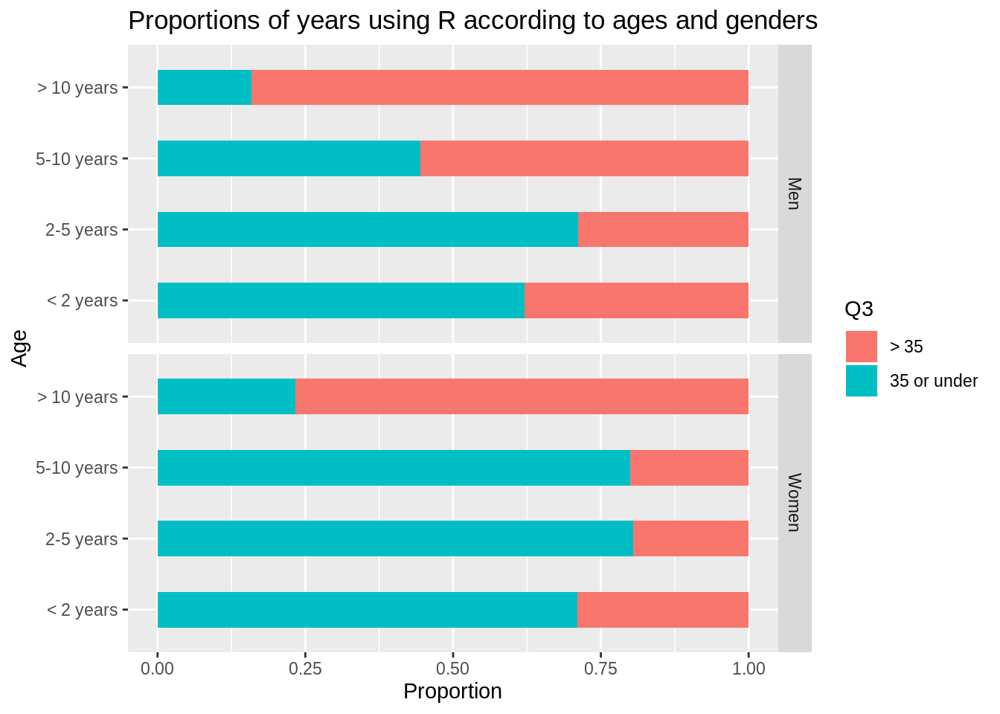
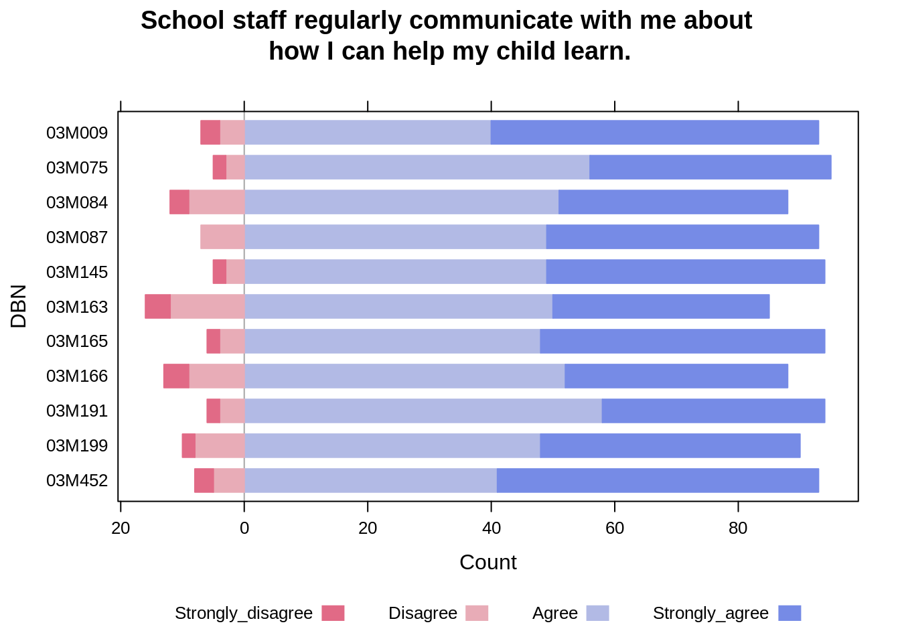
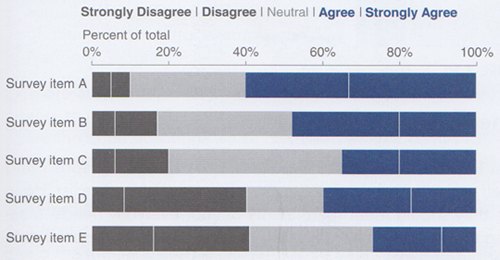
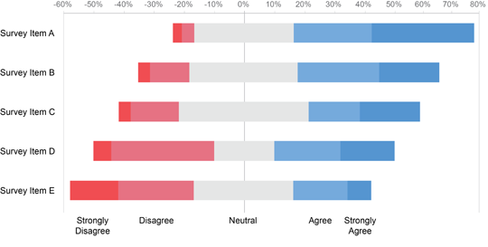
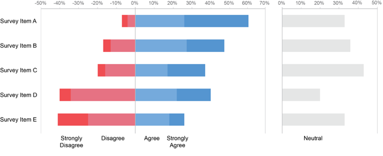

# Chart: Stacked Bar Chart (For Likert Data)

Ying Du and Chenlu Jia


## Overview

In this chapter, we will discuss about stacked bar charts and its application to deal with likert data.


### Stacked Bar Chart

A stacked bar graph (or stacked bar chart)  is a chart that uses bars to show comparisons between categories of data, but with ability to break down and compare parts of a whole. Each bar in the chart represents a whole, and segments in the bar represent different parts or categories of that whole. [1](https://businessq-software.com/2017/02/21/stacked-bar-chart-definition-and-examples-businessq/)


### Likert Data

Likert, used in questionnaires, that is designed to measure people’s attitudes, opinions, or perceptions. Subjects choose from a range of possible responses to a specific question or statement; responses typically include “strongly agree,” “agree,” “neutral,” “disagree,” and “strongly disagree.” [2](https://www.britannica.com/topic/Likert-Scale)


## Examples

### Simple Stacked Bar Chart

Data: useR2016 dataset in the forwards package (available on CRAN)

This data set contains results from a survey conducted by Forwards of attendees at useR! 2016, the R user conference held at Stanford University, Stanford, California, June 27 - June 30 2016. Modifications made to anonymize the data are noted in Details.


```r
install.packages("forwards", repos = "http://cran.us.r-project.org")
useR2016 = forwards::useR2016
```


Now we want to create a horizontal stacked bar chart showing the proportion of respondents for each level of Q11 who are over 35 vs. 35 or under.


And here's the code:

```r
library(ggplot2)
library(tidyverse)

#get rid of the 'NA' data in the dataset
noNuseR2016 <- useR2016 %>% dplyr::filter(Q3 != 'NA'&Q11 != 'NA')

#plot the graph without NA
ggplot(noNuseR2016) + 
 geom_bar(aes(x = Q11, fill = Q3), position = 'fill')+
  ylab('Proportion')+
  xlab('Years')+
  ggtitle('Years of using R according to Ages')+
  coord_flip()
```


According to the graph above, we can tell a lot of information. For example, the proportion of people over 35 years old in the group with people using R over 10 years is much larger than those in other groups. This can be inferred by the length since the width of each bar is the same.


Now let's take a look at a more complicated example from the same dataset:

Create a horizontal stacked bar chart showing the proportional breakdown of Q3 for each level of Q11, faceted on Q2.


And here's the code:

```r
#plot the graph of data without 'NA'
ggplot(noNuseR2016)+
  #"fill" sets different colors according to Q11
  geom_bar(aes(x = Q11, fill = Q3), position = 'fill', width = 0.5)+
  facet_grid(noNuseR2016$Q2)+
  coord_flip()+
  ylab('Proportion')+
  xlab('Age')+
  ggtitle('Proportions of years using R according to ages and genders')
```
Here we facet on sex ("facet_grid(noNuseR2016$Q2)"), with men on the top and women at the bottom. we can tell from the graph that the bars for men and women follow the same pattern except the 5-10 years group.

Comparing the two graphs above, we have some surprising observations. In the first graph, the proportion of people over 35 years old is smaller than the proportion of people under 35 years old in the 5-10 years group. However, in the second graph, we see that although this pattern is followed by women, it's the opposite for men.


### Likert Data with Stacked Bar Chart
Likert data typically contains the responses in the format of “strongly agree,” “agree,” “neutral,” “disagree,” and “strongly disagree.”


Here, let's look at the data of NYC public school survey in 2019. Recently, there has been much debate about the lack of racial and economic diversity at Manhattan District 3 elementary schools, part of a larger and long-standing controversy about iniquities in the New York City public school system as a whole.The New York Times article, “Rezoning Plan to Remake 3 Upper West Side Schools Will Proceed, City Says,” (https://www.nytimes.com/2016/11/10/nyregion/rezoning-plan-for-3-upper-west-side-schools-will-proceed-city-says.html) (2016-11-10) identifies the 11 elementary schools in Manhattan District 3.

```r
#load the dataset, use the function for xlsx file
df <- readxl::read_xlsx('resources/Likert/2019-public-data-file_parent.xlsx', sheet=2)
#choose the schools by names (rows)
dfNew <- df %>% filter(DBN %in% c('03M165','03M145','03M163','03M075','03M084','03M166','03M009','03M087','03M452','03M199','03M191'))
#choose a question and answers by column indies (columns)
#For example, we choose : If school staff regularly communicate with me about how I can help my child learn.
dfNew <- dfNew %>% dplyr::select(c(1,2,4:7))
#set new names for the chosen columns as they were randomly assigned names #before. Here we use the likert levels as column names.
names(dfNew)[2:6] <- c("School_Name", "Strongly_disagree","Disagree","Agree","Strongly_agree")

#change the percentage columns to numeric type
dfNew$DBN <- as.factor(dfNew$DBN)
dfNew$School_Name <- as.factor(dfNew$School_Name)
dfNew <- dfNew %>% mutate_if(is.character, function(x) as.numeric(x))
head(dfNew)
```

```
## # A tibble: 6 x 6
##   DBN    School_Name              Strongly_disagr… Disagree Agree Strongly_agree
##   <fct>  <fct>                               <dbl>    <dbl> <dbl>          <dbl>
## 1 03M009 P.S. 009 SARAH ANDERSON                 3        4    40             53
## 2 03M075 P.S. 075 EMILY DICKINSON                2        3    56             39
## 3 03M084 P.S. 084 LILLIAN WEBER                  3        9    51             37
## 4 03M087 P.S. 087 WILLIAM SHERMAN                0        7    49             44
## 5 03M145 P.S. 145, THE BLOOMINGD…                2        3    49             45
## 6 03M163 P.S. 163 ALFRED E. SMITH                4       12    50             35
```

Now, draw a diverging stacked bar chart to show results for the 11 schools identified in the article referenced above:


And here's the code:

```r
HH::likert(DBN ~ ., dfNew, main="School staff regularly communicate with me about \nhow I can help my child learn.")
```

Notice that in the bar charts of last question, the bars are aligned at both the left and right sides. However, in this diverging stacked bar chart, the bars are aligned by the neutral values. In our example, there is no neutral value, so the bars are aligned by the gapline between agree and disagree. 

In this graph, we can clearly compare people's positive attitude vs. negative attitude for each item. 


## When to Use

1. When the bars consist of only two segments (e.g., male and female).
2. When we need to compare the sum of multiple parts among multiple bars.
3. When we need to compare the percentages of responses to Likert scales.
[3](https://www.perceptualedge.com/blog/?p=2239)


## Considerations

### Interpretation of stacked bar charts:
  We can only tell the proportion for each category under a certain group, but we cannot make any inference about the category size or group size.
  
### Alignings in Diverging Stacked Bar Charts:

#### 100% Stacked Bar Chart
  

This particular design does work well for the following purposes:

1. Comparing Strongly Disagree percentages
2. Comparing the combination of Strong Disagree and Disagree percentages
3. Comparing Strongly Agree percentages
4. Comparing the combination of Agree and Strongly Agree percentages
5. Reading the percentage values for Strongly Disagree
6. Reading the percentage values for the sum of Strongly Disagree and   Disagree

However, it does not work well for the following purposes:

1. Comparing Disagree percentages
2. Comparing Neutral percentages
3. Comparing Agree percentages
4. Reading percentage values of the individual segments Disagree, Neutral, -Agree, or Strongly Agree, because mental math is required
5. Reading the percentage values for the sum of Agree and Strongly Agree, because mental math is required [4](https://www.perceptualedge.com/blog/?p=2239)

#### Diverging Stacked Bar Chart with Neutral in Middle


For some purposes, the Neutral results may be eliminated altogether, and for some it may be appropriate to split the Neutral results down the middle, displaying half of them as negative and half as positive, as above. [5](https://www.perceptualedge.com/blog/?p=2239)

#### Diverging Stacked Bar Chart with Neutral Held Aside


In most of the cases, negative results (e.g., Strongly Disagree and Disagree) as negative values running left from zero and positive results (e.g., Agree and Strongly Agree) as positive values running right from zero, as shown above.
Designed in this way, differences between positive and negative results now stand out a bit more, the sum of Agree and Strongly Agree are easier to read, and the Neutral values are both easier to read and compare. [6](https://www.perceptualedge.com/blog/?p=2239)


## External Resources & References

1. https://businessq-software.com/2017/02/21/stacked-bar-chart-definition-and-examples-businessq/

2. https://www.britannica.com/topic/Likert-Scale

3. https://www.perceptualedge.com/blog/?p=2239

4. https://blog.datawrapper.de/divergingbars/

5. http://t-redactyl.io/blog/2016/01/creating-plots-in-r-using-ggplot2-part-4-stacked-bar-plots.html
