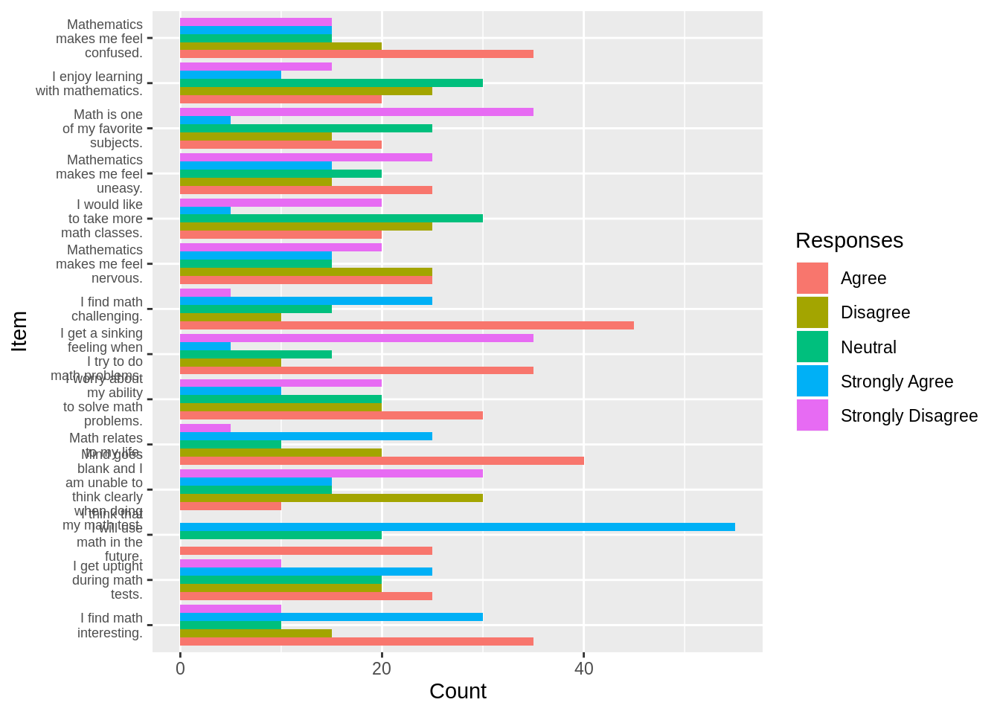
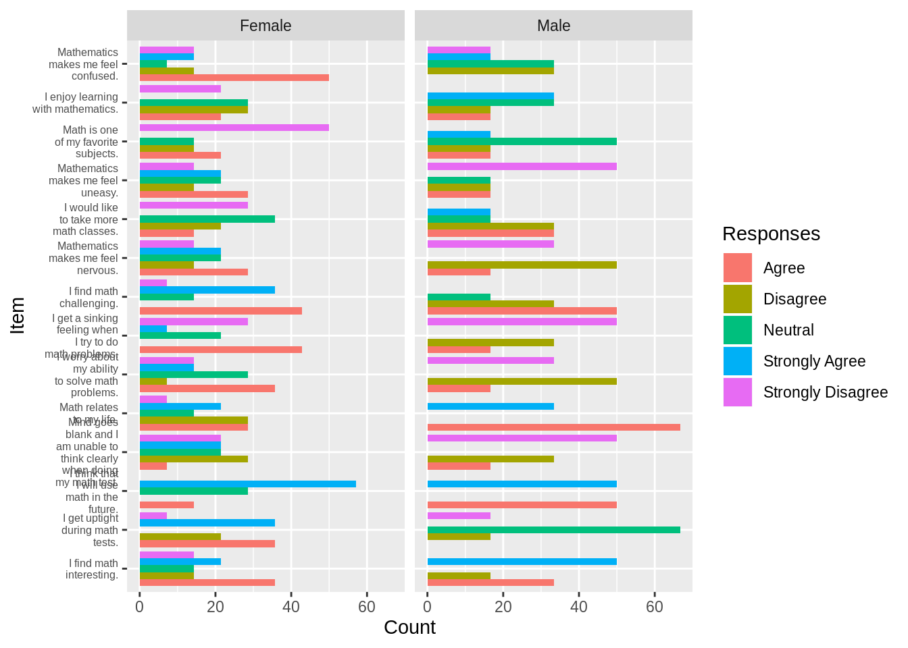
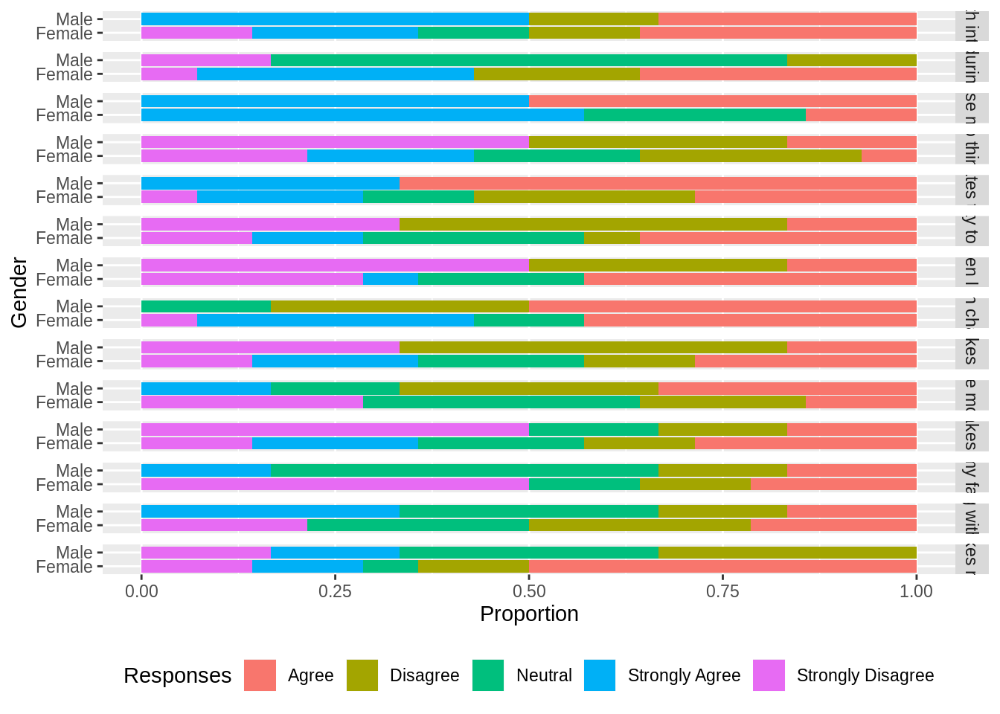
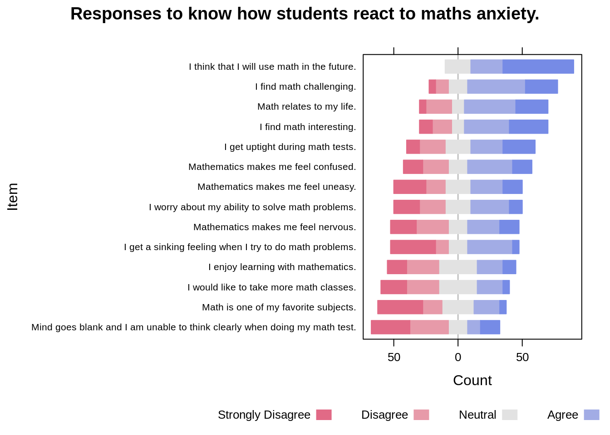
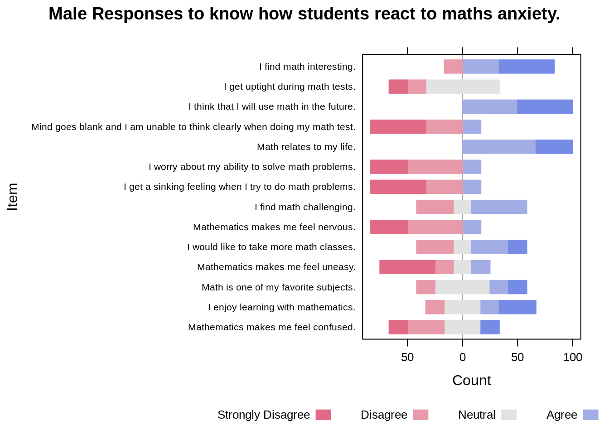
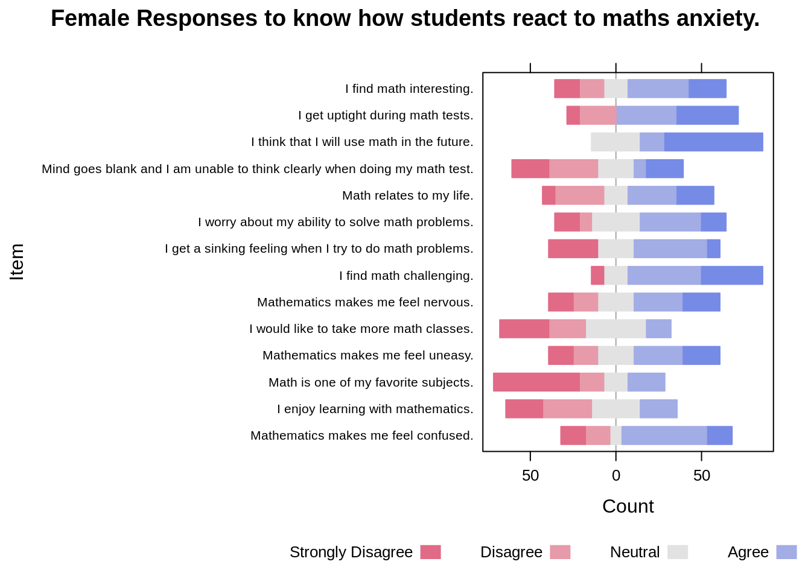
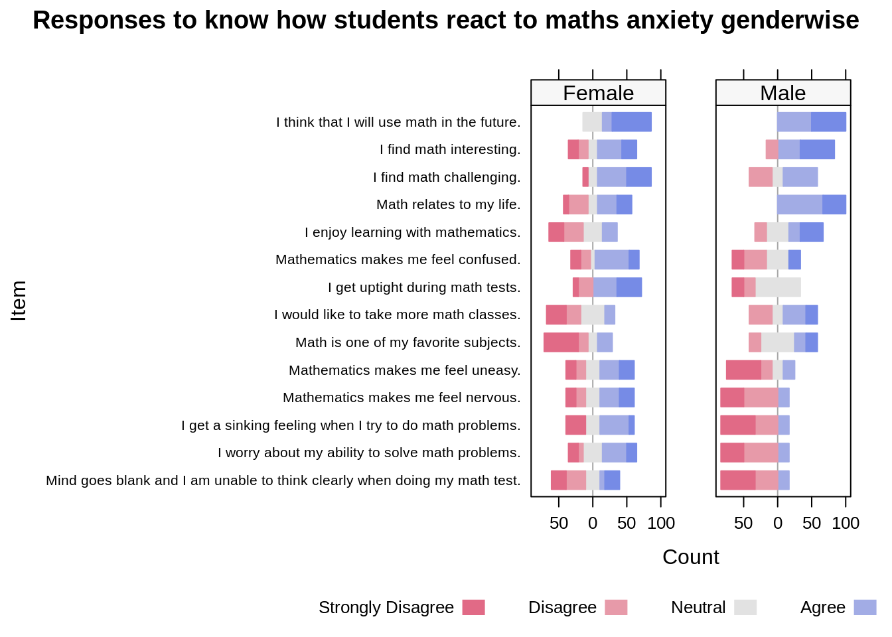

# Likert vs. Bar Chart 

Prasham Sheth and Manas Dresswala


This example goes through some work with the MathAnxiety and MathAnxietyGender dataset to get to a finished Likert that is ready to present.

Following are the packages that we used for it:

- devtools
- ggplot2
- likert
- dplyr
- tidyr

For the likert package we install and load the amended package from github, for which following set of commands are used:

  library(devtools)
  
  install_github("m-dev-/likert")

Let us understand our data first, before diving into the actual code. 

MathAnxiety is a data set of presummarized results of the Math Anxiety Scale Survey administered to 20 stu- dents in a statistics course.
It has 14 rows and 6 columns. 

MathAnxietyGender is a data set of presummarized results of the Math Anxiety Scale Survey administered to 20 stu- dents in a statistics course grouped by gender.
It has 28 rows and 7 columns. One extra column named 'Group' for the gender (Male/Female).

Next, we define the following function in whcih linebreak is introduced in the given sentence after every nth character instead of space and if it is not a space next nearest space is found and then it is replaces with the linebreak.

The function is used to make sure that labels that appear on the graph are readable and don't spoil the visual perspective represented by the graph.


```r
linebreaks <- function(st, len=10){
  loops <- nchar(st)/len
  j <- 0
  for (i in 0:loops-1)
  {
    j <- j + len
    while(substring(st, j, j) != " ")
    {
      j <- j + 1
        if (j >= nchar(st))
      {
          j<- j+1
        break
      }
    }
    substring(st,j,j) <- "\n"
        j<-j+1
    if (j >= nchar(st))
    {
      break
    }
  }
  return (st)
}

sentence <- "i find maths interesting"
function_result <- linebreaks(sentence, 10)
print(function_result)
```

```
## [1] "i find maths\ninteresting"
```

We here plot the bar charts to get the insights from the data. 

- For the pupose of plotting the data on the bar chart we need to tidy the data by using the gather function of dplyr library. Gather takes multiple columns and collapses into key-value pairs, duplicating all other columns as needed.

We then call the function implemented above, to clean the labels by updating the item column of the dataset which would be used as the X axis.


```r
library(dplyr)
library(tidyr)

data("MathAnxiety")

df_bar <- gather(MathAnxiety, key = "Repsonse", value = "Count", -Item)

df<- data.frame(df_bar$Item)
df2<-t(lapply(as.character(df[[1]]),linebreaks))
df3<-data.frame()
for (i in df2){
  df3<-rbind(df3,data.frame(i))
}

df_bar<-cbind(df_bar,df3)
```

In the following sections we plot 3 different bar graphs. 

In the first one the position of the bars are dodged and the relative size of the labels is adjusted to 0.75 to make sure they appear in a proper format. The fill of the bar graphs are set to the responses to the answers to know the difference between proportions of different responses.

For the second graph, we clean the data to get the responses grouped by gender of participants and tidy it in a similar way using the gather function and the function we implemented.

The second graph is created in a similar way as the first one with a difference that the graphs are facted according to gender of the participants. 

The third graph is similar to the second one with a difference in the position of the alignment of the bar. The bars are stacked instead of keeping it side by side. The graphs are faceted bu the items that represent the responses by the participants in the survey.

```r
ggplot(df_bar, aes(y = df_bar$Count, x = df_bar$i, fill = df_bar$Repsonse)) +
  geom_col(position = "dodge") +
  coord_flip()+
  theme(axis.text.y = element_text(size = rel(0.75)))+
  xlab("Item")+
  ylab("Count")+
  guides(fill=guide_legend(title="Responses"))
```



```r
data("MathAnxietyGender")

df_bar_gender <- gather(MathAnxietyGender, key = "Repsonse", value = "Count", -Item, -Group)

df<- data.frame(df_bar_gender$Item)
df2<-t(lapply(as.character(df[[1]]),linebreaks))
df3<-data.frame()
for (i in df2){
  df3<-rbind(df3,data.frame(i))
}

df_bar_gender<-cbind(df_bar_gender,df3)

ggplot(df_bar_gender, aes(y = df_bar_gender$Count, x = df_bar_gender$i, fill = df_bar_gender$Repsonse)) +
  geom_col(position = "dodge") +
  coord_flip() +
  facet_wrap(df_bar_gender$Group) + 
  theme(axis.text.y = element_text(size = rel(0.70)))+
   xlab("Item")+
  ylab("Count")+
    guides(fill=guide_legend(title="Responses"))
```



```r
ggplot(df_bar_gender, aes(y = df_bar_gender$Count, x = df_bar_gender$Group, fill = df_bar_gender$Repsonse)) +
  geom_col(position = "fill") +
  coord_flip() +
  facet_grid(df_bar_gender$Item,scales='free_y', space='free_y')+
   xlab("Gender")+
  ylab("Proportion")+
    guides(fill=guide_legend(title="Responses"))+
  theme(legend.position="bottom")
```



The following section plots the likert charts for the gievn survey data. We use HH package to plot the likert charts. We have ordered the chart by positive responses to the answers in a descending order. The scale of the chart labels is set to 0.65 to make the chart labels readable.


```r
data("MathAnxiety")

df_1 <- MathAnxiety

HH::likert(Item ~., df_1, positive.order = TRUE, main="Responses to know how students react to maths anxiety.", scales = list(y = list(cex = .65)))
```



The following is the graph containing the responses by male participants only. The responses are not sorted to maintain the order of the questions asked in the survey. For this firstly we filter the data to collect the responses by male participants who took part in the survey.


```r
data("MathAnxietyGender")

df_male <- MathAnxietyGender[which(MathAnxietyGender$Group=='Male'), ]

HH::likert(Item ~., df_male, positive.order = FALSE, main="Male Responses to know how students react to maths anxiety.",, scales = list(y = list(cex = .65)))
```



The following is the graph containing the responses by female participants only. The responses are not sorted to maintain the order of the questions asked in the survey. For this firstly we filter the data to collect the responses by female participants who took part in the survey.


```r
df_female <- MathAnxietyGender[which(MathAnxietyGender$Group=='Female'), ]

HH::likert(Item ~., df_female, positive.order = FALSE, main="Female Responses to know how students react to maths anxiety.",, scales = list(y = list(cex = .65)))
```


Follwing graph shows the plots for male and female side by side to do a comparitive analysis from the graphs. The faceting is done using the | operator while passing the data into the likert function of the HH package.


```r
HH::likert(Item ~. | Group, MathAnxietyGender, positive.order = TRUE, main="Responses to know how students react to maths anxiety genderwise",, scales = list(y = list(cex = .65)))
```



After looking at all the above graphs, we would like to conclude that when we have ordinal data, plotting a Likert graph would be a better option over using bar charts. 
Lets understand why we are trying to say this - 
1. If we go through the different bar charts that we drew in the beginning, the last one seems to be the most readable. Where we can easily make the comparisons between the male and female responses for all the questions seperately. But, the main issue here is that it is very difficult to manipulate the labels on each facet. Due to this we cannot read the question clearly, thus making it difficult to understand which question are we actually looking at. 
2. Another reason, why we think Likert is a better option is because we can easily compare the results keeping the neutral option in the centre. This makes is very easy to read the graph and make faster inferences. 

Hope this tutorial was helpful to further strengthen your understanding on Likert and why it is better to use over the bar chart. 
