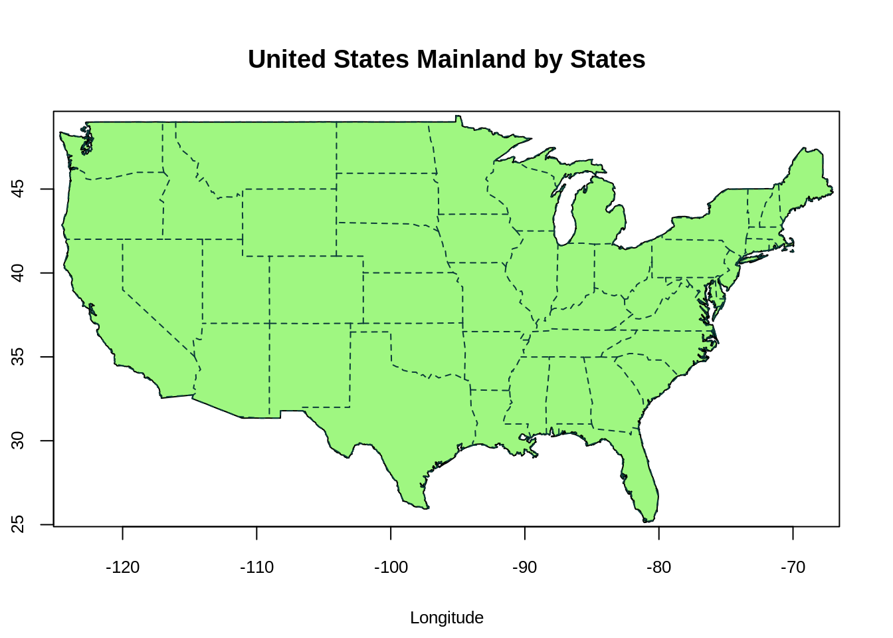
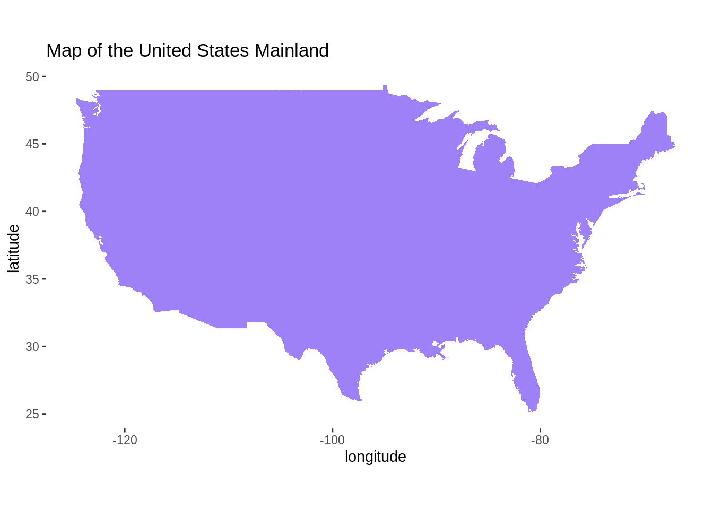
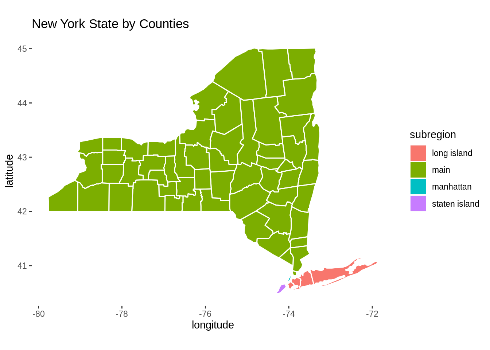
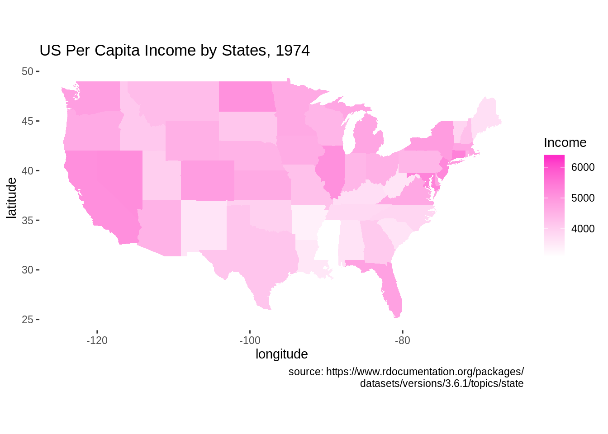
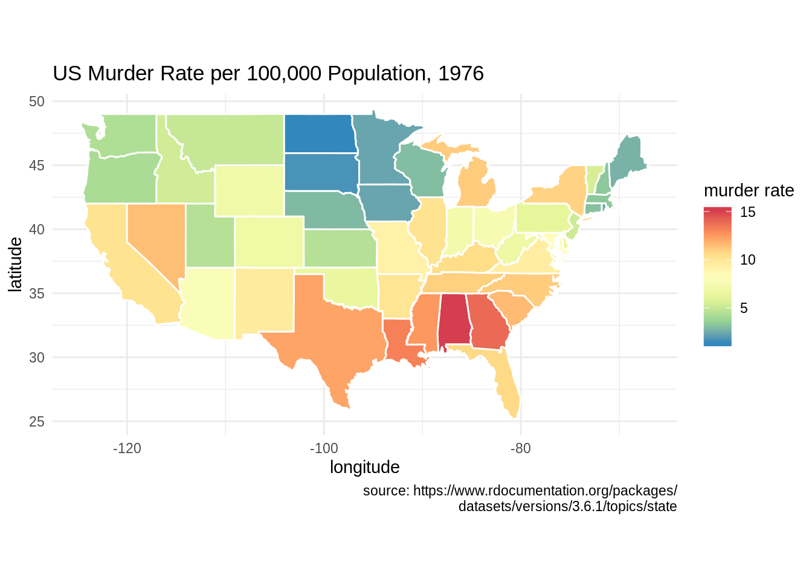

# Mapping in R

Hanjun Li and Chengchao Jin


## Overview
This section covers how to draw maps using R. The packages we will be using are `ggplot2` and `maps`. 

## What is `maps`?
The package `maps`, which contains a lot of outlines of continents, countries, states, and counties, is used to visualize geographical map. Some notable features and functions of `maps` are:


* `county`: counties of the United States mainland generated from US Department of the Census data. we can use `county.fips` to check the all counties listed.  

* `map`: main function used to draw lines and polygons as specified by a map database.  

* `state`: states of the United States mainland generated from US Department of the Census data  

* `usa`: this database produces a map of the United States


## Installing `maps`

You can install `maps` from CRAN:
```
install.packages("maps")
```
Load the required packages

```r
library(maps)
library(ggplot2)
```

## Simple Demonstration (using `maps`)

```r
maps::map("usa", col = "#9FF781", fill = TRUE)
map.axes(cex.axis=0.8) 
maps::map("state", lty = 2, add = TRUE, col = "#0B3B39") # map the state borderline to the US map
title(main = "United States Mainland by States", xlab = "Longitude", ylab = "Latitude",
      cex.lab = 0.8)
```



* The function `map("usa")` plots a map of the United States Mainland. The x-axis and y-axis represent longtitude and latitude respectively. Positive latitude is above the equator (N), and negative latitude is below the equator (S). Positive longitude is east of the prime meridian, while negative longitude is west of the prime meridian (a north-south line that runs through a point in England).
* The function `map("state",add=True)` adds the state borderline to the US map.


```r
maps::map('county', region = 'new york', col = "#5E610B")
map.cities(us.cities, country="NY", col = "#642EFE", cex = 0.6) # map cities recorded in us.cities to NY State
map.axes(cex.axis=0.8) 
title(main = "New York State by Counties", xlab = "Longitude", ylab = "Latitude",
      cex.lab = 0.8)
```


* The graph above plots the state map of New York. The function `map.cities` points out the recorded cities in us.cities in New York State map (blue dots).

## Simple Demonstration (using `ggplot2`)

We would first introduce the function `map_data` from `ggplot2`, which converts the map to a data frame. The most important variable we need to pass to `map_data` is the name of map provided by the `maps` package. These include: `maps::usa`, `maps::france`, `maps::italy` and etc.  

```r
usa <- map_data("usa")
class(usa)
```

```
## [1] "data.frame"
```

```r
head(usa)
```

```
##        long      lat group order region subregion
## 1 -101.4078 29.74224     1     1   main      <NA>
## 2 -101.3906 29.74224     1     2   main      <NA>
## 3 -101.3620 29.65056     1     3   main      <NA>
## 4 -101.3505 29.63911     1     4   main      <NA>
## 5 -101.3219 29.63338     1     5   main      <NA>
## 6 -101.3047 29.64484     1     6   main      <NA>
```


```r
ggplot() + geom_polygon(data = usa, aes(x=long, y = lat), fill = "#9F81F7") + 
  labs(title = "Map of the United States Mainland", x = "longitude", y = "latitude") +
  coord_fixed(1.3) +
  theme(panel.background = element_blank())
```



* We could plot the map of the United States Mainland using `ggplot2` as well. First, we require a data which contains information of longitude and latitude. The function `map_data` can easily turn data from the maps package into a data frame suitable for plotting with ggplot2. Then we pass the suitable data frame to `geom_polygon` function. Again, the two axis represent longitude and latitude.


```r
states <- map_data("state")
counties <- map_data("county")
NewYork <- subset(states, region == "new york")
head(NewYork)
```

```
##           long      lat group order   region subregion
## 9050 -73.92874 40.80605    34  9050 new york manhattan
## 9051 -73.93448 40.78886    34  9051 new york manhattan
## 9052 -73.95166 40.77741    34  9052 new york manhattan
## 9053 -73.96312 40.75449    34  9053 new york manhattan
## 9054 -73.96885 40.73730    34  9054 new york manhattan
## 9055 -73.97458 40.72584    34  9055 new york manhattan
```

```r
ny_county <- subset(counties, region == "new york")
head(ny_county)
```

```
##            long      lat group order   region subregion
## 52932 -73.78550 42.46763  1795 52932 new york    albany
## 52933 -74.25533 42.41034  1795 52933 new york    albany
## 52934 -74.27252 42.41607  1795 52934 new york    albany
## 52935 -74.24960 42.46763  1795 52935 new york    albany
## 52936 -74.22668 42.50774  1795 52936 new york    albany
## 52937 -74.23241 42.56504  1795 52937 new york    albany
```


```r
ggplot() + geom_polygon(data = NewYork, aes(x=long, y = lat, fill = subregion)) +
  geom_polygon(data = ny_county, aes(x=long, y = lat, group = group), color = "white", fill = NA) +
  labs(title = "New York State by Counties", x = "longitude", y = "latitude") +
  coord_fixed(1.3) +
  theme(panel.background = element_blank())
```



* To plot the map of New York State, we need to preprocess the data frame using `map_data` and `subset`. We first fill the map by subregions, and then we add the borderlines to the map.

## Mapping with `geom_map`
we will use the built-in `state.x77` dataset. This 50 by 8 dataset contains some US State facts and figures. For instance, the variable **Population** indicates the population estimate as of July 1, 1975 in each states. For our example, we choose to investigate **Income** and **Murder**

```r
head(state.x77)
```

```
##            Population Income Illiteracy Life Exp Murder HS Grad Frost   Area
## Alabama          3615   3624        2.1    69.05   15.1    41.3    20  50708
## Alaska            365   6315        1.5    69.31   11.3    66.7   152 566432
## Arizona          2212   4530        1.8    70.55    7.8    58.1    15 113417
## Arkansas         2110   3378        1.9    70.66   10.1    39.9    65  51945
## California      21198   5114        1.1    71.71   10.3    62.6    20 156361
## Colorado         2541   4884        0.7    72.06    6.8    63.9   166 103766
```


```r
library(tidyverse)

df <- state.x77 %>% as.data.frame() %>% rownames_to_column("state")
df$state <- tolower(df$state)

ggplot(df, aes(map_id = state)) + geom_map(aes(fill = Income), map = states) +
  expand_limits(x = states$long, y = states$lat) +
  scale_fill_gradient(low = "white", high = "#FE2EC8") +
  labs(title = "US Per Capita Income by States, 1974", x = "longitude", y = "latitude",
       caption = "source: https://www.rdocumentation.org/packages/
       datasets/versions/3.6.1/topics/state") +
  coord_fixed(1.3) +
  theme(panel.background = element_blank())
```



* The graph above plots the heatmap of US per Capita income by state in 1974. To plot the state map, we need to preprocess data to make sure the state names are all in lowercase. Then, we use `map_id` to plot the states. We set the `fill` in `geom_map` function to the variable of interest to plot the heatmap. 


```r
ggplot(df, aes(map_id = state)) + geom_map(aes(fill = Murder), map = states, col = "white") +
  expand_limits(x = states$long, y = states$lat) +
  scale_fill_distiller(name = "murder rate", palette = "Spectral") +
  labs(title = "US Murder Rate per 100,000 Population, 1976", x = "longitude", y = "latitude",
       caption = "source: https://www.rdocumentation.org/packages/
       datasets/versions/3.6.1/topics/state") +
  coord_fixed(1.3) +
  theme_minimal()
```



* This is another example of plotting with `geom_map`. The graph shows US murder rate in 1976.


## Considerations

* When we visualize the map using `ggplot2` and `geom_ploygon`, it is necessary to add `coord_fixed()` to ggplot as it fixes the ratio between x and y direction. The value **1.3** we used in `coord_fixed()` is an arbitrary value that makes the plot look good


## External Resources

* https://cran.r-project.org/web/packages/maps/maps.pdf is an R documentation on the package `maps`.

* https://www.rdocumentation.org/packages/maps/versions/3.3.0/topics/map talks specifically about the function **map** in the package `maps`.

* https://eriqande.github.io/rep-res-web/lectures/making-maps-with-R.html demonstrates some examples of mapping in R

* The package `ggmap` is also used to draw maps. It uses the Google map platform and users need to register for an API key prior to accessing the database. More details on https://cran.r-project.org/web/packages/ggmap/ggmap.pdf and https://rdrr.io/cran/ggmap/man/register_google.html
