# Tutorial for Multivariable Linear Regression

Yuge Shen, Shengqing Xia


## Motivation


1. We use regression models to describe how one or more factors influence certain response variables.

2. We already learnt how to construct a single variable regression model, but in practice, one often needs to predict or control future responses base on multiple variables or to gain understanding between them.

3. We will make use of basic mathematical ideas and introduce the data visualization, model selection and construction processes in R. For the sake of this tutorial, we use the housing price data kc_house_data.csv from UCI Machine Learning Repository. Notice we will only use this dataset for illustration only, and not going to discuss the underlying mechanism.


## Connection with Single Variable Regression

We are familiar with Single Variable Regression $$y_i = \beta_0 + \beta x_i + \epsilon_i$$ where $y_i$ is the response variable. Similar with Single Variable case, model for multivariable case has quite the same structure only with more variables to consider. We can express the model concept in matrix form:

$$\pmatrix{Y_1\\Y_2\\...\\Y_n} = \pmatrix{1&X_{11}&X_{12}&...&X_{1d}\\1&X_{21}&X_{22}&...&X_{2d}\\\vdots&\vdots&\vdots&&\vdots\\1&X_{n1}&X_{n2}&...&X_{nd}}\pmatrix{\beta_0\\\beta_1\\\vdots\\\beta_d} + \pmatrix{\epsilon_1\\\epsilon_2\\\vdots\\\epsilon_n}.$$

Below is an example of model visualization for single and multiple resgressions. The data we are using consists of prices of houses in King County, Washington from sales between May 2014 to May 2015. We found the data on Kaggle website. There are 21,613 observations and 21 variables. There are 19 house features plus the price of the house and id as column fields.


```
##           id            date   price bedrooms bathrooms sqft_living sqft_lot
## 1 7129300520 20141013T000000  221900        3      1.00        1180     5650
## 2 6414100192 20141209T000000  538000        3      2.25        2570     7242
## 3 5631500400 20150225T000000  180000        2      1.00         770    10000
## 4 2487200875 20141209T000000  604000        4      3.00        1960     5000
## 5 1954400510 20150218T000000  510000        3      2.00        1680     8080
## 6 7237550310 20140512T000000 1225000        4      4.50        5420   101930
##   floors waterfront view condition grade sqft_above sqft_basement yr_built
## 1      1          0    0         3     7       1180             0     1955
## 2      2          0    0         3     7       2170           400     1951
## 3      1          0    0         3     6        770             0     1933
## 4      1          0    0         5     7       1050           910     1965
## 5      1          0    0         3     8       1680             0     1987
## 6      1          0    0         3    11       3890          1530     2001
##   yr_renovated zipcode     lat     long sqft_living15 sqft_lot15
## 1            0   98178 47.5112 -122.257          1340       5650
## 2         1991   98125 47.7210 -122.319          1690       7639
## 3            0   98028 47.7379 -122.233          2720       8062
## 4            0   98136 47.5208 -122.393          1360       5000
## 5            0   98074 47.6168 -122.045          1800       7503
## 6            0   98053 47.6561 -122.005          4760     101930
```


```r
library(scatterplot3d)
library(dplyr)
data2 <- data %>% as.data.frame() %>% select(sqft_above,sqft_basement,price)
p1 <- scatterplot3d(data2, pch = 16, color = "steelblue", main = "Price vs. above area and basement area", xlab = "above area", ylab = "basement area", zlab = "price")
fit = lm(data2$price~data2$sqft_above+data2$sqft_basement)
p1$plane3d(fit)
```

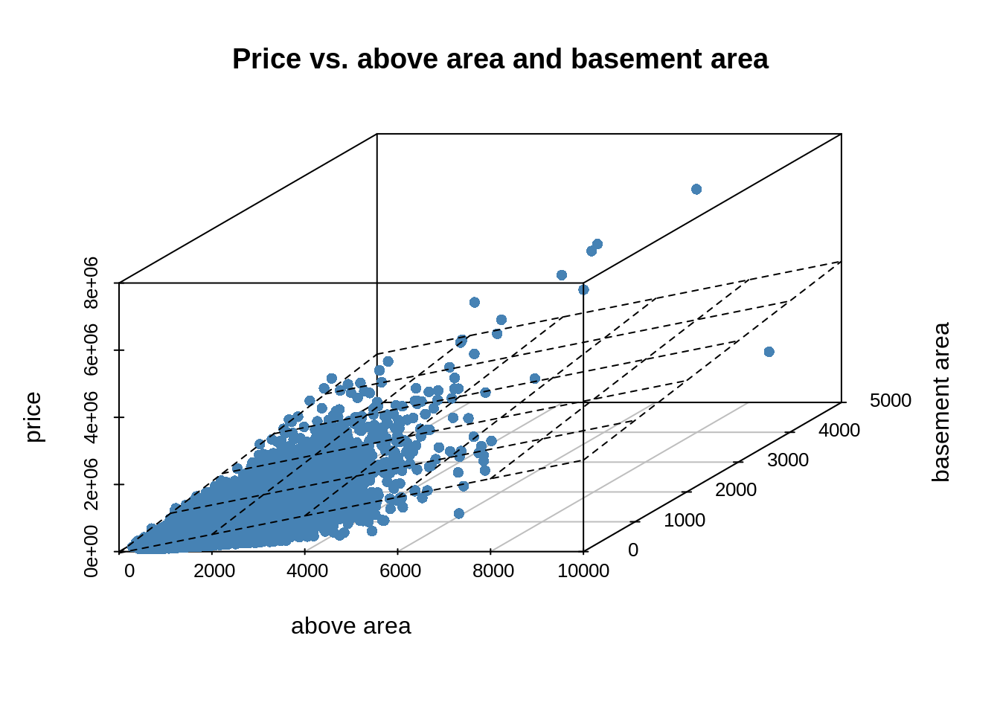

```r
fit2d = lm(data$price~data$sqft_living)
plot(data$sqft_living, data$price, pch = 16, col="steelblue")
abline(fit2d, col = "orange")
```

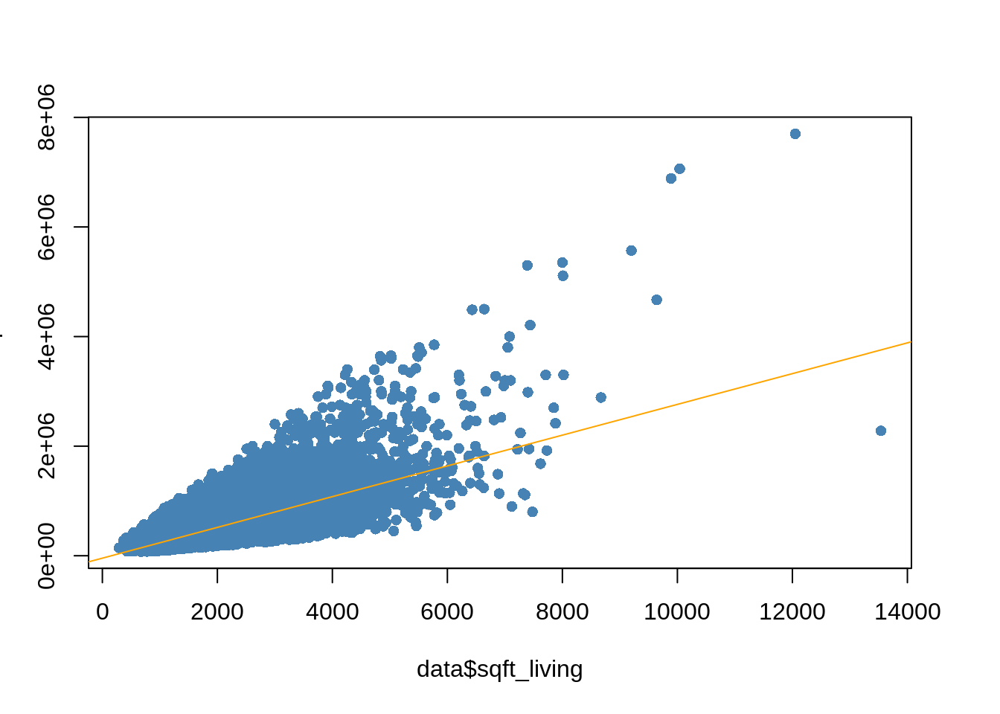

## Collinearity and Paradox

One important assumption for the multiple regression model is that we assume independence of all features. So the model would be inaccurate if some of the X values have strong correlation. If this happens, it is called collinearity. In the case of house pricing, it is very possible that the living area is strongly correlated with the area above so if we add both of these 2 factors into the model, the collinearity problem could occur.

In order to make accurate decision, we need to have some sort of visualization about the correlation among all x values. The most generally used method is pair matrix plot. By drawing the pairwise correlation of all variables, we can see underlying collinearity pattern and omit some variables that will cause this problem.

To show the importance of detecting collinearity, we firstly introduce a paradox:

```r
library(ggplot2)
type = 1:8
type[1:4]="type1"
type[5:8]="type2"
x=c(1,2,3,4,8,9,10,11)
y = c(6,7,8,9,1,2,3,4)
model = lm(y~x)
df <- data_frame(type,x,y)
g <- ggplot(df,aes(x, y)) +
  geom_line(aes(color = type)) + geom_point()+xlab("") + ylab("")
g+geom_abline(intercept = coef(model)[1],slope = coef(model)[2])
```

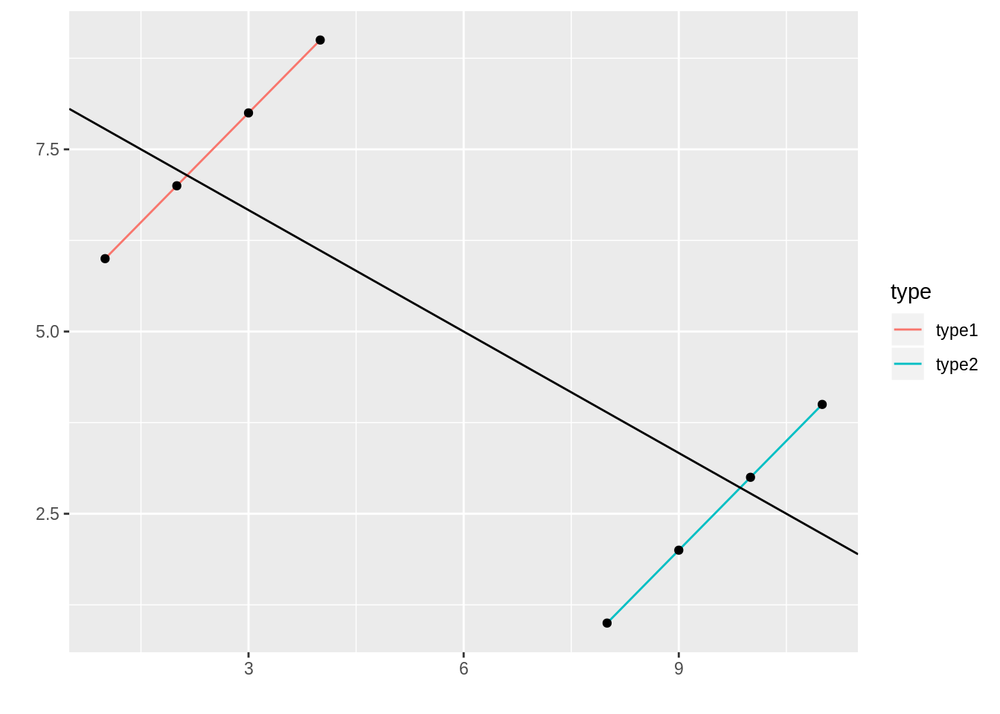
We can see althought the two groups all seem to have positive slope, while because of the multicollinearity, the real regression line has a negative slope, and this is called a paradox. If your goal is to understand how the various X variables impact Y, then multicollinearity is a big problem to the model selection. To better detect the collinearity and select model, we introduce pair matrix firstly. 

In the housing price dataset, we can choose some variables that we are interested in putting into the model and analyze their patterns.


```r
pairs(data = data, price~sqft_living+sqft_above+sqft_basement+bathrooms)
```

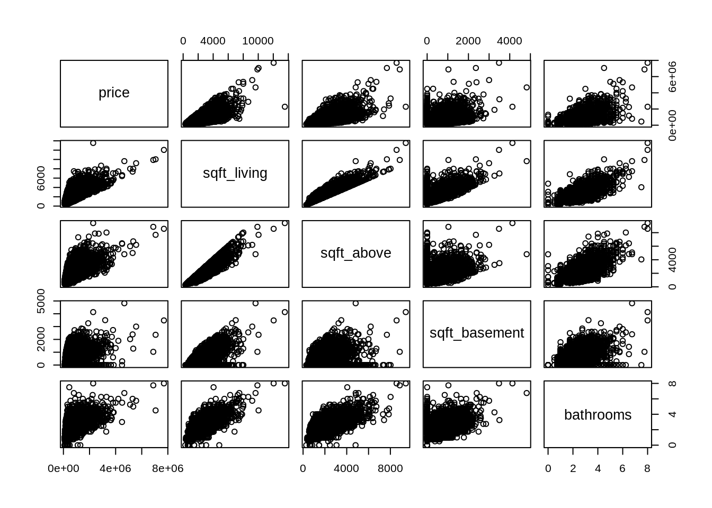


## Solution Path

Below is an example of a solution path base on lasso.


```r
X = cbind(sqft_living,sqft_above,yr_renovated,  zipcode, sqft_living15)
library(lars)
lasso  <- lars(X,price)
plot(lasso)
```

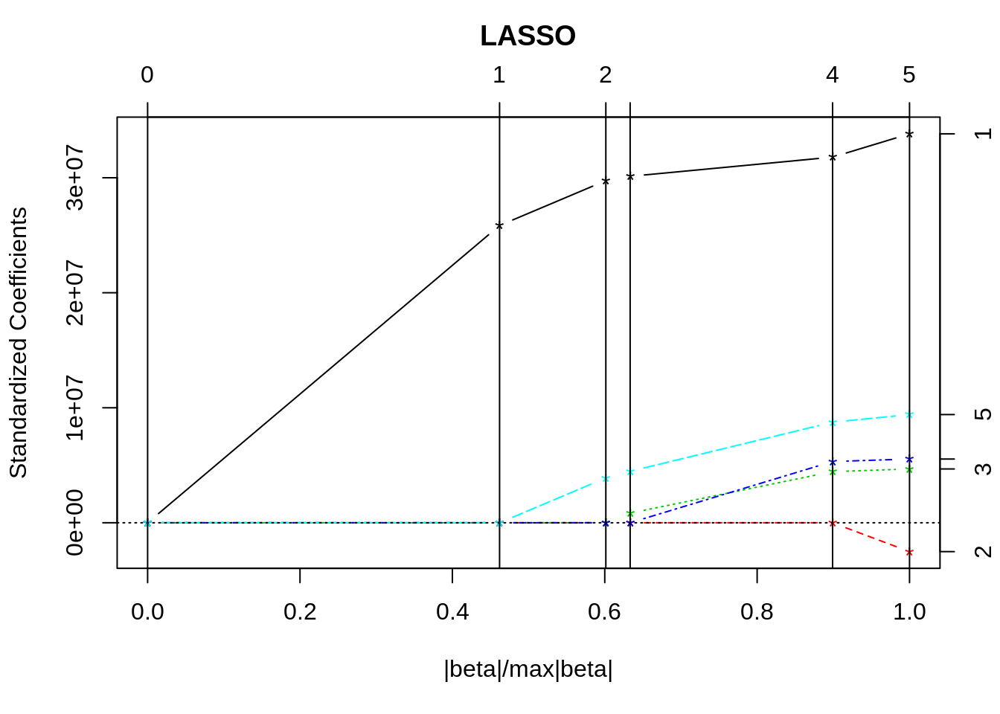
Initially all of the coefficients are zero, because when $$λ = \infty,log(-λ)=0$$ the penalty is too large, none of the variables can have influence on the regression model. When $$λ = 0,log(-λ)=1$$ means taht there is no penalty in lasso, so the coefficients are just least square estimators. When a coordinate path (in this case sqft_living) firstly leaves the boundary (drawn in black), the slope of it won't change until another paths leave the boundary, and repeat the progress, until all coordinates are above the boundary.


More specifically, we only include 2 variables so the pattern is more clear and easy to interprete. 


```r
X = cbind(sqft_living,sqft_above)
library(lars)
lasso  <- lars(X,price)
plot(lasso)
legend("topleft",1, 2, legend = c("living", "above"), fill = c("black","red"))
```

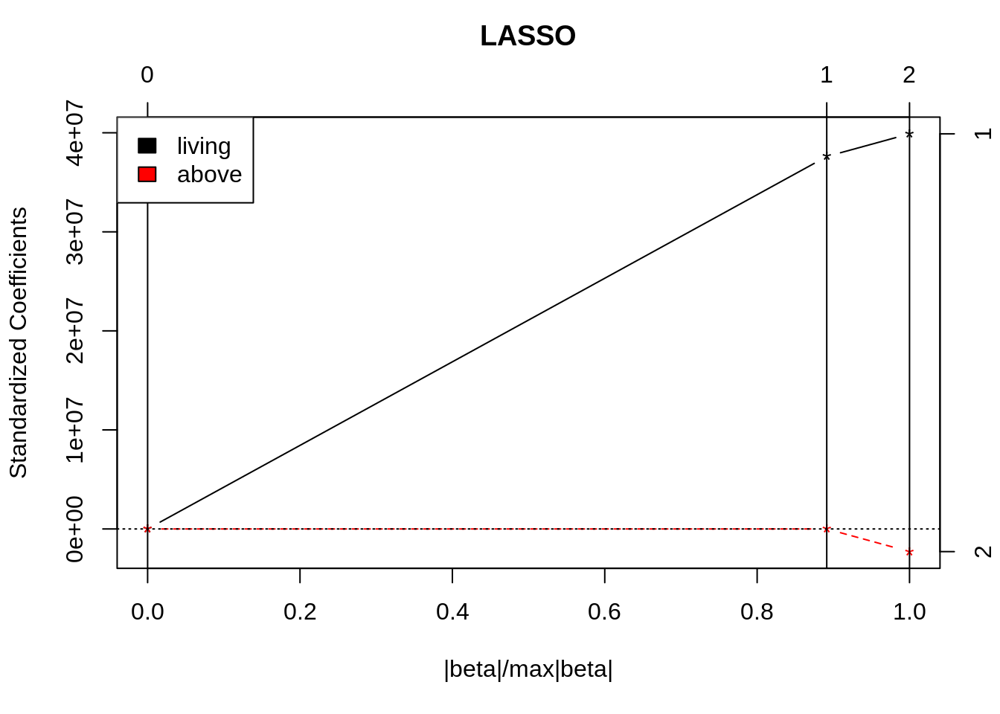

Based on the solution path plot, we can see that when lambda is small, the coefficient for sqft_living is extreme large and it appears first as lambda decreases, while for the sqft_above, it appears when lambda is small and its standardized coefficient is small and close to 0, which suggests that this variable should not be included. Moreover, we can see that when sqft_above appears(becomes larger than 0) in the solution path, the coefficient of sqft_living changes sharply and standardized coefficient of sqft_above decreases, which suggests that there is collinearity between the two variables. Based on the pair matrix we confirm our ideas.


## Stepwise Model Selection

In order to choose which predictors to include in our model, we need to test their relative importance. There are 3 major ways to complete the test.

#### Forward selection
We start with an empty model, which means no predictors in the model. Then we iteratively add the most affective predictor at each step. In the end, the process terminates when the improvement is no longer statistically significant.

#### Backward selection (or backward elimination)
We start with a full model, which means, to include all predictors in the model. Then we repeatedly remove the least contributive predictors. The process terminates when all predictors are statistically significant

#### Stepwise selection (or sequential replacement)
A combination of forward and backward selections. You start with no predictors, then sequentially add the most contributive predictors (like forward selection). After adding each new variable, remove any variables that no longer provide an improvement in the model fit (like backward selection). 

R has a function that perform this process for us. As for this example, we start from an empty model "fitNone" and cast out the stepwise selection 


```r
fitNone = lm(price~1)
step(fitNone, scope = ~sqft_living+sqft_above+sqft_basement+bathrooms+ sqft_lot+ floors+ waterfront+ view+condition+ grade+ yr_built+ yr_renovated+ sqft_living15+ sqft_lot15, direction = "both")
```

```
## Start:  AIC=553875.8
## price ~ 1
## 
##                 Df  Sum of Sq        RSS    AIC
## + sqft_living    1 1.4356e+15 1.4773e+15 539204
## + grade          1 1.2976e+15 1.6153e+15 541134
## + sqft_above     1 1.0682e+15 1.8447e+15 544004
## + sqft_living15  1 9.9816e+14 1.9148e+15 544810
## + bathrooms      1 8.0329e+14 2.1096e+15 546904
## + view           1 4.5978e+14 2.4531e+15 550165
## + sqft_basement  1 3.0544e+14 2.6075e+15 551484
## + waterfront     1 2.0668e+14 2.7062e+15 552287
## + floors         1 1.9209e+14 2.7208e+15 552403
## + yr_renovated   1 4.6564e+13 2.8664e+15 553529
## + sqft_lot       1 2.3417e+13 2.8895e+15 553703
## + sqft_lot15     1 1.9801e+13 2.8931e+15 553730
## + yr_built       1 8.4977e+12 2.9044e+15 553815
## + condition      1 3.8514e+12 2.9091e+15 553849
## <none>                        2.9129e+15 553876
## 
## Step:  AIC=539203.5
## price ~ sqft_living
## 
##                 Df  Sum of Sq        RSS    AIC
## + view           1 1.2362e+14 1.3537e+15 537317
## + grade          1 1.2132e+14 1.3560e+15 537353
## + waterfront     1 1.1024e+14 1.3670e+15 537529
## + yr_built       1 9.2854e+13 1.3844e+15 537802
## + yr_renovated   1 2.2405e+13 1.4549e+15 538875
## + sqft_living15  1 2.0109e+13 1.4572e+15 538909
## + condition      1 1.7605e+13 1.4597e+15 538946
## + sqft_lot15     1 6.4407e+12 1.4708e+15 539111
## + sqft_lot       1 3.0113e+12 1.4743e+15 539161
## + sqft_above     1 1.2165e+12 1.4761e+15 539188
## + sqft_basement  1 1.2165e+12 1.4761e+15 539188
## + floors         1 2.2991e+11 1.4770e+15 539202
## + bathrooms      1 1.4719e+11 1.4771e+15 539203
## <none>                        1.4773e+15 539204
## - sqft_living    1 1.4356e+15 2.9129e+15 553876
## 
## Step:  AIC=537316.8
## price ~ sqft_living + view
## 
##                 Df  Sum of Sq        RSS    AIC
## + grade          1 1.0850e+14 1.2452e+15 535513
## + yr_built       1 6.3611e+13 1.2900e+15 536278
## + waterfront     1 4.4742e+13 1.3089e+15 536592
## + yr_renovated   1 1.3877e+13 1.3398e+15 537096
## + condition      1 1.2074e+13 1.3416e+15 537125
## + sqft_living15  1 1.1203e+13 1.3425e+15 537139
## + sqft_lot15     1 7.7245e+12 1.3459e+15 537195
## + sqft_lot       1 4.1477e+12 1.3495e+15 537252
## + floors         1 1.8712e+12 1.3518e+15 537289
## + sqft_above     1 7.8057e+11 1.3529e+15 537306
## + sqft_basement  1 7.8057e+11 1.3529e+15 537306
## <none>                        1.3537e+15 537317
## + bathrooms      1 8.9455e+09 1.3536e+15 537319
## - view           1 1.2362e+14 1.4773e+15 539204
## - sqft_living    1 1.0995e+15 2.4531e+15 550165
## 
## Step:  AIC=535513
## price ~ sqft_living + view + grade
## 
##                 Df  Sum of Sq        RSS    AIC
## + yr_built       1 1.5271e+14 1.0924e+15 532687
## + waterfront     1 4.7212e+13 1.1979e+15 534680
## + condition      1 2.6995e+13 1.2182e+15 535041
## + yr_renovated   1 1.7932e+13 1.2272e+15 535202
## + sqft_lot15     1 5.9098e+12 1.2392e+15 535412
## + sqft_above     1 5.2796e+12 1.2399e+15 535423
## + sqft_basement  1 5.2796e+12 1.2399e+15 535423
## + bathrooms      1 4.7539e+12 1.2404e+15 535432
## + floors         1 4.1610e+12 1.2410e+15 535443
## + sqft_lot       1 2.9713e+12 1.2422e+15 535463
## <none>                        1.2452e+15 535513
## + sqft_living15  1 8.9141e+08 1.2452e+15 535515
## - grade          1 1.0850e+14 1.3537e+15 537317
## - view           1 1.1080e+14 1.3560e+15 537353
## - sqft_living    1 2.0630e+14 1.4515e+15 538824
## 
## Step:  AIC=532687.1
## price ~ sqft_living + view + grade + yr_built
## 
##                 Df  Sum of Sq        RSS    AIC
## + waterfront     1 4.8129e+13 1.0443e+15 531715
## + bathrooms      1 7.7749e+12 1.0847e+15 532535
## + floors         1 5.7639e+12 1.0867e+15 532575
## + sqft_lot15     1 4.2071e+12 1.0882e+15 532606
## + sqft_lot       1 2.4210e+12 1.0900e+15 532641
## + yr_renovated   1 1.5703e+12 1.0909e+15 532658
## + condition      1 1.5232e+12 1.0909e+15 532659
## + sqft_living15  1 4.6523e+11 1.0920e+15 532680
## + sqft_above     1 1.7064e+11 1.0923e+15 532686
## + sqft_basement  1 1.7064e+11 1.0923e+15 532686
## <none>                        1.0924e+15 532687
## - view           1 6.4285e+13 1.1567e+15 533921
## - yr_built       1 1.5271e+14 1.2452e+15 535513
## - grade          1 1.9760e+14 1.2900e+15 536278
## - sqft_living    1 2.0225e+14 1.2947e+15 536356
## 
## Step:  AIC=531715.3
## price ~ sqft_living + view + grade + yr_built + waterfront
## 
##                 Df  Sum of Sq        RSS    AIC
## + bathrooms      1 7.9640e+12 1.0364e+15 531552
## + floors         1 4.9620e+12 1.0394e+15 531614
## + sqft_lot15     1 4.2941e+12 1.0400e+15 531628
## + sqft_lot       1 2.2513e+12 1.0421e+15 531671
## + condition      1 1.5965e+12 1.0427e+15 531684
## + sqft_living15  1 7.5855e+11 1.0436e+15 531702
## + yr_renovated   1 7.1666e+11 1.0436e+15 531702
## <none>                        1.0443e+15 531715
## + sqft_above     1 1.9360e+10 1.0443e+15 531717
## + sqft_basement  1 1.9360e+10 1.0443e+15 531717
## - view           1 2.2298e+13 1.0666e+15 532170
## - waterfront     1 4.8129e+13 1.0924e+15 532687
## - yr_built       1 1.5363e+14 1.1979e+15 534680
## - grade          1 2.0110e+14 1.2454e+15 535519
## - sqft_living    1 2.0126e+14 1.2456e+15 535522
## 
## Step:  AIC=531551.8
## price ~ sqft_living + view + grade + yr_built + waterfront + 
##     bathrooms
## 
##                 Df  Sum of Sq        RSS    AIC
## + sqft_lot15     1 3.3139e+12 1.0330e+15 531485
## + floors         1 2.6013e+12 1.0337e+15 531500
## + sqft_lot       1 1.7011e+12 1.0346e+15 531518
## + sqft_living15  1 1.3617e+12 1.0350e+15 531525
## + condition      1 1.3220e+12 1.0350e+15 531526
## + yr_renovated   1 2.1381e+11 1.0361e+15 531549
## + sqft_above     1 1.4759e+11 1.0362e+15 531551
## + sqft_basement  1 1.4759e+11 1.0362e+15 531551
## <none>                        1.0364e+15 531552
## - bathrooms      1 7.9640e+12 1.0443e+15 531715
## - view           1 2.1785e+13 1.0581e+15 531999
## - waterfront     1 4.8318e+13 1.0847e+15 532535
## - sqft_living    1 1.0668e+14 1.1430e+15 533667
## - yr_built       1 1.5691e+14 1.1933e+15 534597
## - grade          1 1.9379e+14 1.2301e+15 535255
## 
## Step:  AIC=531484.6
## price ~ sqft_living + view + grade + yr_built + waterfront + 
##     bathrooms + sqft_lot15
## 
##                 Df  Sum of Sq        RSS    AIC
## + floors         1 2.2075e+12 1.0308e+15 531440
## + sqft_living15  1 1.6952e+12 1.0313e+15 531451
## + condition      1 1.3870e+12 1.0316e+15 531458
## + sqft_above     1 2.7772e+11 1.0328e+15 531481
## + sqft_basement  1 2.7772e+11 1.0328e+15 531481
## + yr_renovated   1 2.3857e+11 1.0328e+15 531482
## <none>                        1.0330e+15 531485
## + sqft_lot       1 5.6626e+08 1.0330e+15 531487
## - sqft_lot15     1 3.3139e+12 1.0364e+15 531552
## - bathrooms      1 6.9837e+12 1.0400e+15 531628
## - view           1 2.2236e+13 1.0553e+15 531943
## - waterfront     1 4.8384e+13 1.0814e+15 532472
## - sqft_living    1 1.0999e+14 1.1430e+15 533669
## - yr_built       1 1.5337e+14 1.1864e+15 534474
## - grade          1 1.9178e+14 1.2248e+15 535163
## 
## Step:  AIC=531440.4
## price ~ sqft_living + view + grade + yr_built + waterfront + 
##     bathrooms + sqft_lot15 + floors
## 
##                 Df  Sum of Sq        RSS    AIC
## + sqft_living15  1 2.0282e+12 1.0288e+15 531400
## + condition      1 1.9255e+12 1.0289e+15 531402
## + yr_renovated   1 1.4454e+11 1.0307e+15 531439
## <none>                        1.0308e+15 531440
## + sqft_above     1 8.1986e+09 1.0308e+15 531442
## + sqft_basement  1 8.1986e+09 1.0308e+15 531442
## + sqft_lot       1 6.7056e+07 1.0308e+15 531442
## - floors         1 2.2075e+12 1.0330e+15 531485
## - sqft_lot15     1 2.9201e+12 1.0337e+15 531500
## - bathrooms      1 5.0000e+12 1.0358e+15 531543
## - view           1 2.2866e+13 1.0537e+15 531913
## - waterfront     1 4.7787e+13 1.0786e+15 532418
## - sqft_living    1 1.1194e+14 1.1428e+15 533667
## - yr_built       1 1.5261e+14 1.1834e+15 534422
## - grade          1 1.7753e+14 1.2084e+15 534873
## 
## Step:  AIC=531399.8
## price ~ sqft_living + view + grade + yr_built + waterfront + 
##     bathrooms + sqft_lot15 + floors + sqft_living15
## 
##                 Df  Sum of Sq        RSS    AIC
## + condition      1 2.0259e+12 1.0268e+15 531359
## + yr_renovated   1 1.8644e+11 1.0286e+15 531398
## + sqft_above     1 1.4099e+11 1.0287e+15 531399
## + sqft_basement  1 1.4099e+11 1.0287e+15 531399
## <none>                        1.0288e+15 531400
## + sqft_lot       1 2.7063e+09 1.0288e+15 531402
## - sqft_living15  1 2.0282e+12 1.0308e+15 531440
## - floors         1 2.5405e+12 1.0313e+15 531451
## - sqft_lot15     1 3.2400e+12 1.0320e+15 531466
## - bathrooms      1 5.4649e+12 1.0343e+15 531512
## - view           1 2.1315e+13 1.0501e+15 531841
## - waterfront     1 4.8268e+13 1.0771e+15 532389
## - sqft_living    1 8.0960e+13 1.1098e+15 533035
## - grade          1 1.5032e+14 1.1791e+15 534345
## - yr_built       1 1.5461e+14 1.1834e+15 534424
## 
## Step:  AIC=531359.2
## price ~ sqft_living + view + grade + yr_built + waterfront + 
##     bathrooms + sqft_lot15 + floors + sqft_living15 + condition
## 
##                 Df  Sum of Sq        RSS    AIC
## + yr_renovated   1 4.6126e+11 1.0263e+15 531352
## <none>                        1.0268e+15 531359
## + sqft_above     1 8.3048e+10 1.0267e+15 531359
## + sqft_basement  1 8.3048e+10 1.0267e+15 531359
## + sqft_lot       1 5.4527e+09 1.0268e+15 531361
## - condition      1 2.0259e+12 1.0288e+15 531400
## - sqft_living15  1 2.1286e+12 1.0289e+15 531402
## - floors         1 3.1360e+12 1.0299e+15 531423
## - sqft_lot15     1 3.2777e+12 1.0301e+15 531426
## - bathrooms      1 4.9874e+12 1.0318e+15 531462
## - view           1 2.1197e+13 1.0480e+15 531799
## - waterfront     1 4.8290e+13 1.0751e+15 532351
## - sqft_living    1 8.0158e+13 1.1069e+15 532982
## - yr_built       1 1.3349e+14 1.1603e+15 533999
## - grade          1 1.5061e+14 1.1774e+15 534315
## 
## Step:  AIC=531351.5
## price ~ sqft_living + view + grade + yr_built + waterfront + 
##     bathrooms + sqft_lot15 + floors + sqft_living15 + condition + 
##     yr_renovated
## 
##                 Df  Sum of Sq        RSS    AIC
## <none>                        1.0263e+15 531352
## + sqft_above     1 8.6480e+10 1.0262e+15 531352
## + sqft_basement  1 8.6480e+10 1.0262e+15 531352
## + sqft_lot       1 6.1742e+09 1.0263e+15 531353
## - yr_renovated   1 4.6126e+11 1.0268e+15 531359
## - sqft_living15  1 2.2065e+12 1.0285e+15 531396
## - condition      1 2.3007e+12 1.0286e+15 531398
## - floors         1 3.0139e+12 1.0293e+15 531413
## - sqft_lot15     1 3.3340e+12 1.0296e+15 531420
## - bathrooms      1 4.5250e+12 1.0308e+15 531445
## - view           1 2.1000e+13 1.0473e+15 531787
## - waterfront     1 4.7584e+13 1.0739e+15 532329
## - sqft_living    1 8.0206e+13 1.1065e+15 532976
## - yr_built       1 1.1544e+14 1.1418e+15 533653
## - grade          1 1.5006e+14 1.1764e+15 534299
```

```
## 
## Call:
## lm(formula = price ~ sqft_living + view + grade + yr_built + 
##     waterfront + bathrooms + sqft_lot15 + floors + sqft_living15 + 
##     condition + yr_renovated)
## 
## Coefficients:
##   (Intercept)    sqft_living           view          grade       yr_built  
##     5.976e+06      1.392e+02      4.723e+04      1.256e+05     -3.509e+03  
##    waterfront      bathrooms     sqft_lot15         floors  sqft_living15  
##     5.938e+05      3.323e+04     -4.677e-01      2.757e+04      2.424e+01  
##     condition   yr_renovated  
##     1.747e+04      1.229e+01
```

From the output we can easily see the variable selection process step by step and the result is yield at the end. We omit the sqft_above, sqft_basement and sqft_lot variable and keep the rest of them.

## Model Verification

Now if we would like to make sure our model is working well, we need to test if it has a good fit with the original data. Then a diagnostic plot becomes handy. 


```r
fitTry = lm(formula = price ~ sqft_living + view + grade + yr_built + 
    waterfront + bathrooms + sqft_lot15 + floors + sqft_living15 + 
    condition + yr_renovated)
plot(fitTry)
```

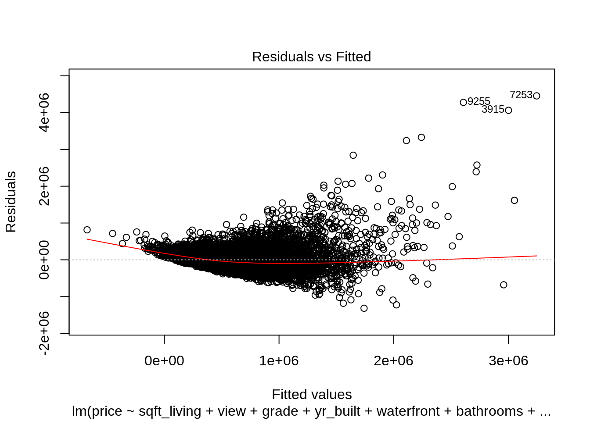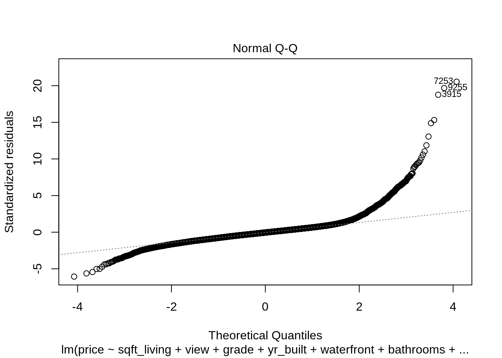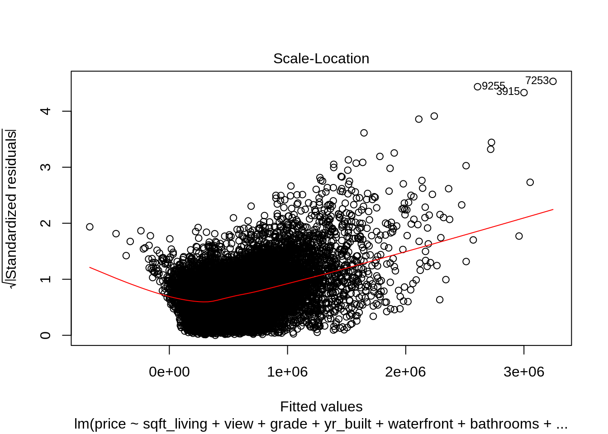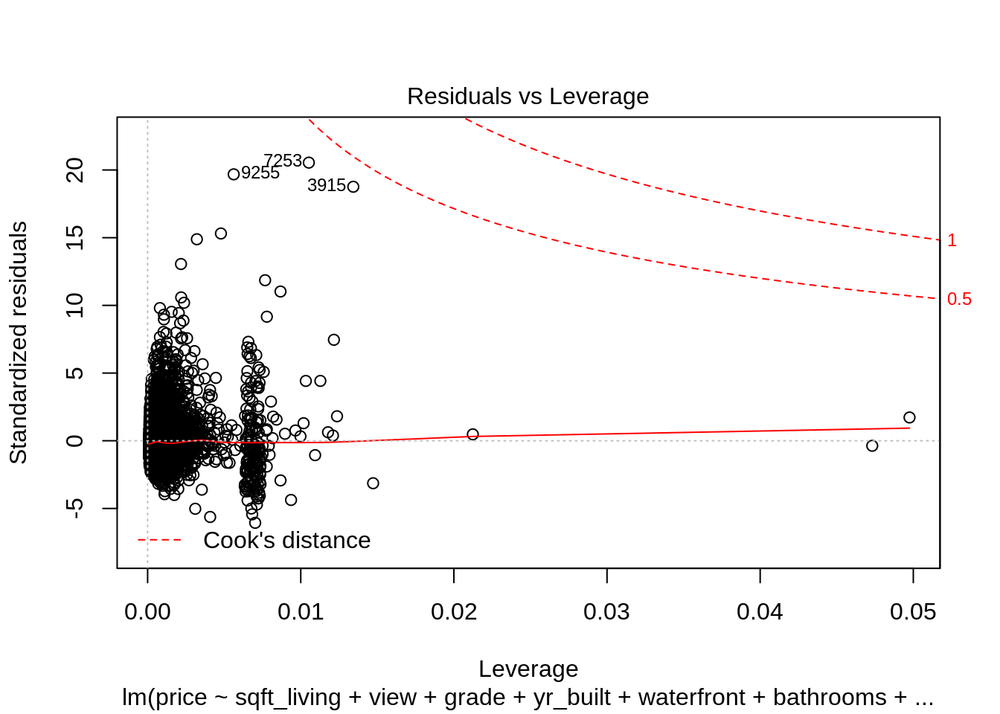

Oops, this might not seem to be a well-fit model to the data. The 1st and 3rd plot show that the residuals are not randomly distributed with obvious trends. The 2nd plot, the QQ plot shows non-normalily of the data points, which violates the assumption of the model. 

Below is a diagnostic plot for a better model on this dataset. 

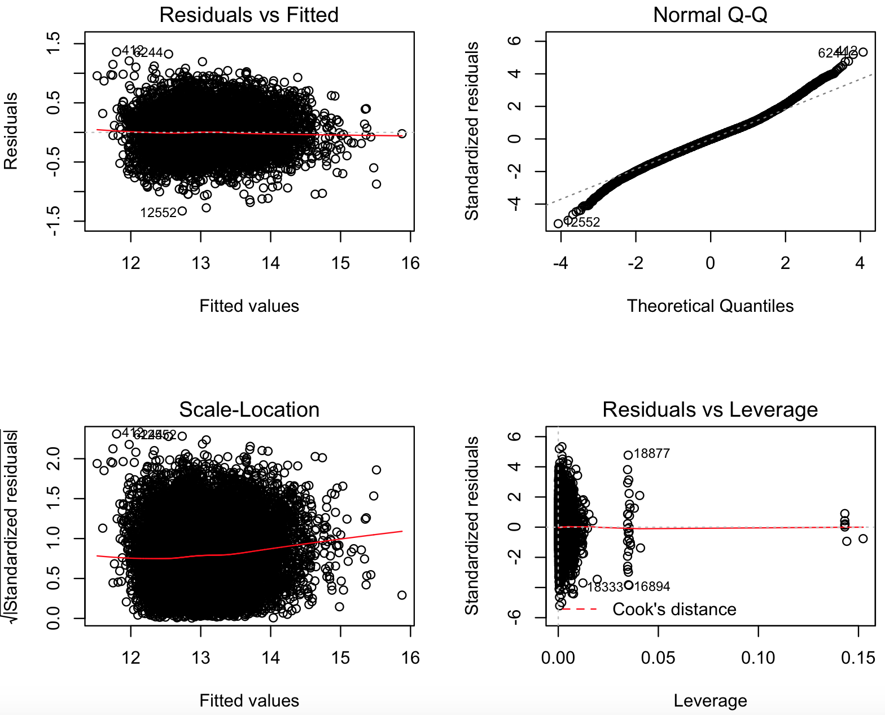{#id .class width=70% height=70%}


### Outliers and Leverage
Plot for detecting outliers. Studentized deleted residuals (or externally studentized residuals) is the deleted residual divided by its estimated standard deviation. Now we firstly introduce $$di$$:
delete ith observations at a time.
refit the regression model on remaining observations, calculate the new fitted value $$\hat{yi_i}$$.
examine how much all of the fitted values change when the ith observation is deleted$$di = yi - \hat{yi_i}$$.
Then we have $$StudRes_i = \frac{di}{SE(di)}$$

Studentized residuals are going to be more effective for detecting outlying Y observations than standardized residuals. If an observation has an externally studentized residual that is larger than 3 (in absolute value) we can call it an outlier.

```r
library(olsrr)
short_living = sqft_living[4000:4500]
short_above = sqft_above[4000:4500]
model = lm(short_living~short_above)
ols_plot_resid_stud(model)
```

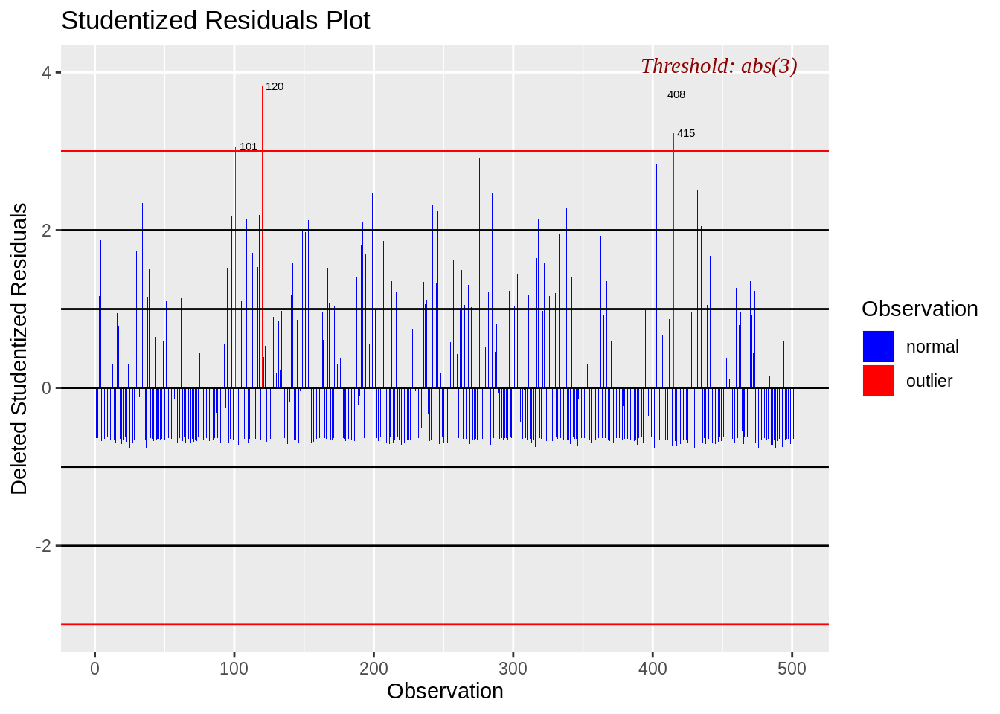

```r
ols_plot_resid_stand(model)
```

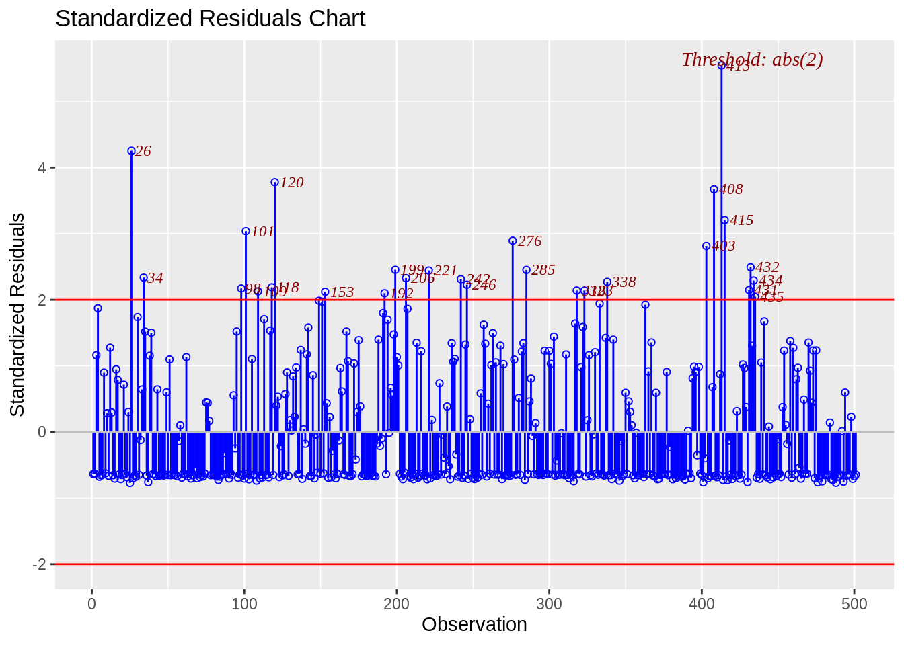
Based on the two plots, we can see studentized residuals find less outliers than the standardized residuls and only detect extreme cases.

Next, we want to discuss leverage which only depends on X variables.
For the simple linear regression case:
$$H_i = \frac{1}{n} + \frac{(x_i - \bar{x})^2}{\sum(x_i - \bar{x})^2}$$
For the multiple case:
$$\sum_{i=1}^{n}H_{ii} = Trace(H) = Tr(X(X^TX)^{-1}X^T)$$
$$H_{ii} = X_i(X^TX)^{-1}X_i$$
if$$H_{ii} > \frac{2\sum_{i=1}^{n}H_{ii}}{n}$$, we say the ith observation is a huge leverage.

Graph for detecting influential observations.

```r
ols_plot_resid_lev(model)
```

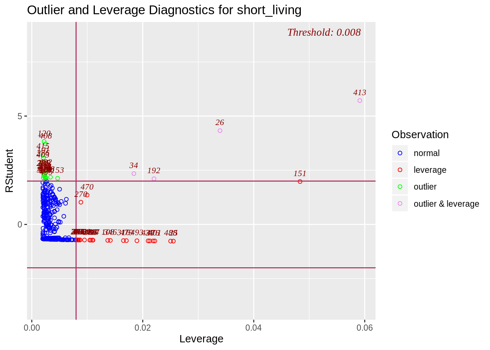


