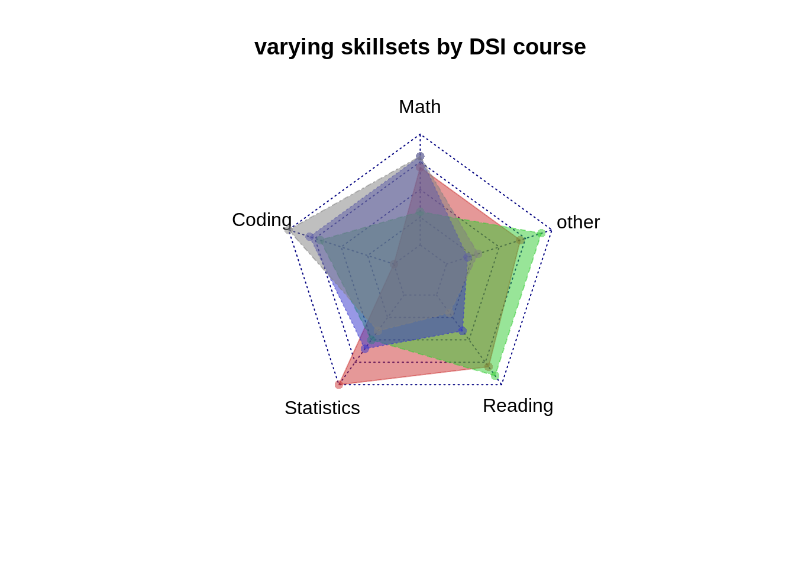
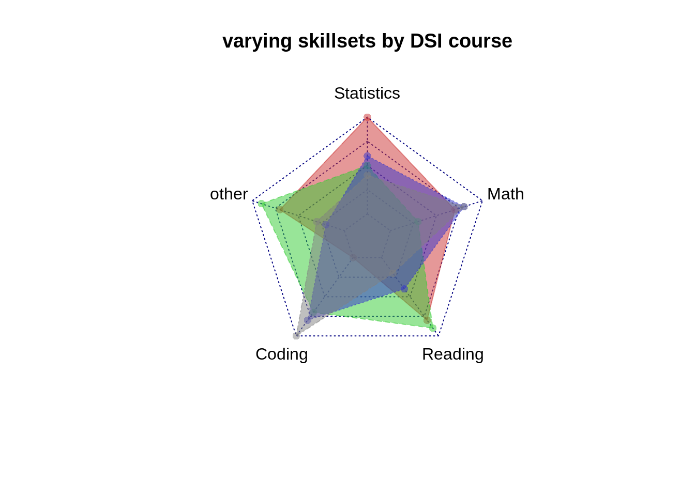
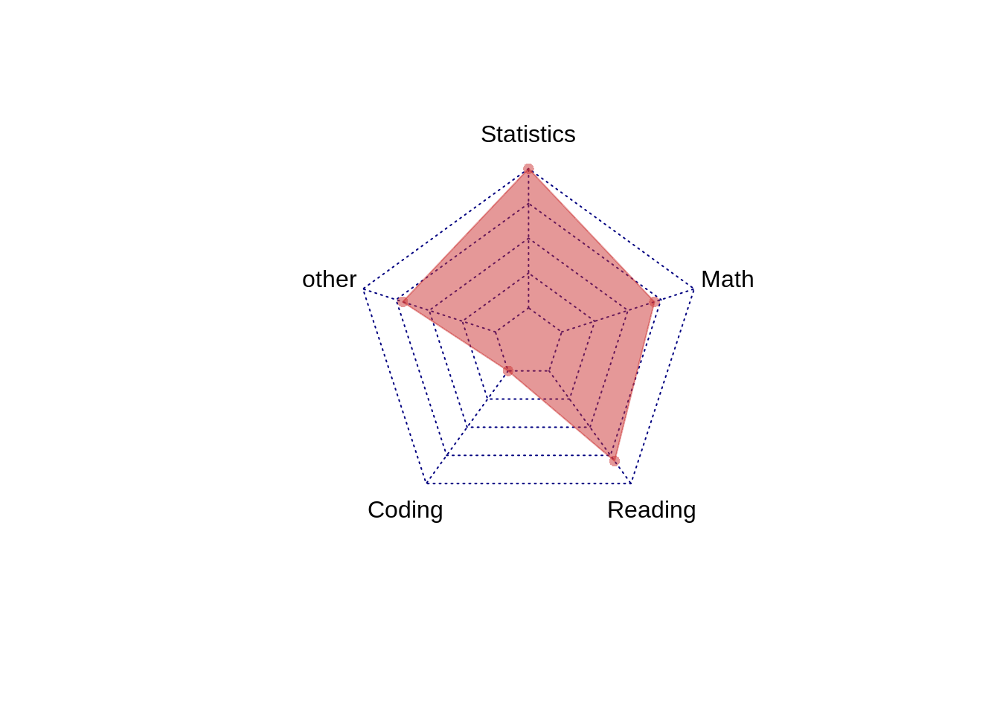
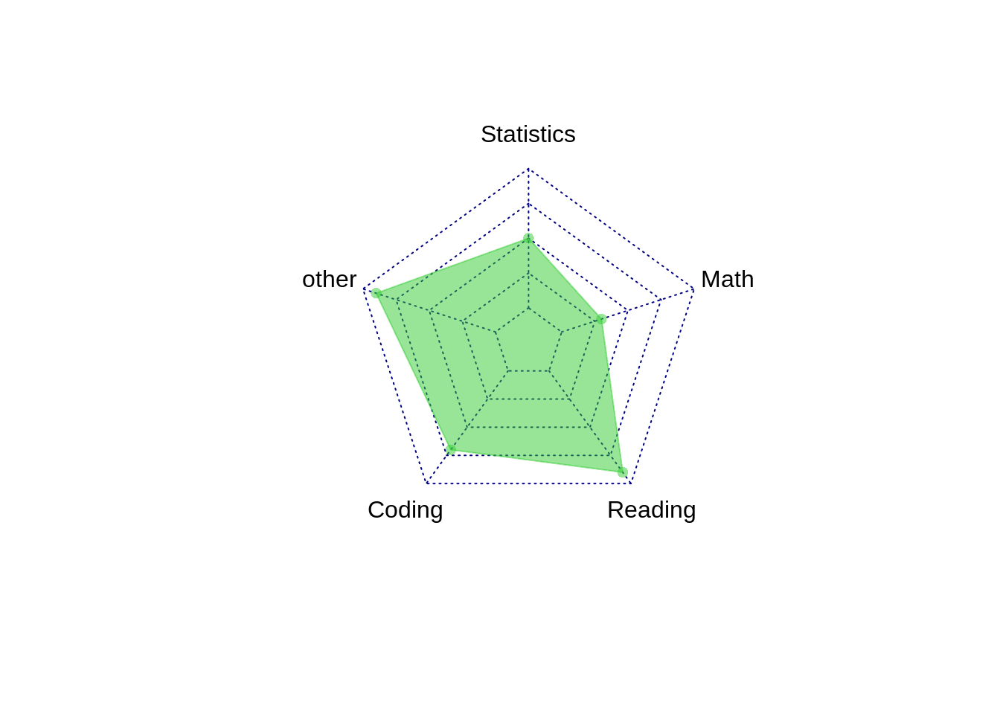
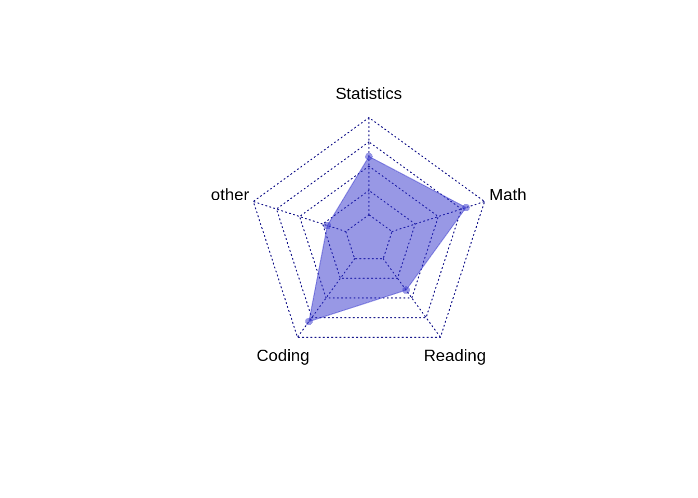

# Radar plots to show multivariate continuous data

Charley Levy


Radar plots are another way to visualize multivariate quantitative data.  Radar plots are otherwise known as spider charts, web charts, polar charts or star plots.  We have previously used Parallel Coordinate Plots to visualize multivariate continulous data.  

I became intrigued with Radar plots when I first saw them in a column by Nate Silver on FiveThirtyEight.com.(https://fivethirtyeight.com/features/why-kamala-and-beto-have-more-upside-than-joe-and-bernie/).  Nate Silver broke the Democratic party into 5 different coalitions.  He then attempted to show how strong each of the Democratic Candidates were among each of the 5 different coalitions.  The visualizations were done by Rachael Dottle.  Each candidate had their own radar plot.  

I used the library "fmsb" and the function "radarchart" for our visualizations.  I wanted to show how each of the 4 DSI core classes varied in their subject matter.  I used 5 different variables (Math, Coding, Statistics, Reading, Other).  Each of the 4 observations (ProbStat, EDAV, Algorithms, ML) received a score for each of the 5 variables.  The first 4 variables were on a scale of 0 to 10.  The fifth variable was on a score of 0 to 20.  We created a data frame with this information.  For the Radarchart package, the first observation needs to correspond to the max value for each variable and the second observation needs to correspond to the min value for each variable.  This allows us to scale each variable appropriately. 

The 1st visualization has all 4 observations (ProbStat, EDAV, Algorithms, ML) in one radar plot.  I adjusted the alpha (the 4th input to the color functions) to 0.5 so there was enough transparency to see all 4 observations on one plot.  You can adjust the pcol (color of polygon border) and pfcol(color of polygon fill) amongst each observation.

```r
library(fmsb)
library(dplyr)

min<-c(0,0,0,0,0)
max<-c(10,10,10,10,20)
ProbStat<-c(7,0,10,8,14)
EDAV<-c(3,7,5,9,18)
Algorithm<-c(8,8,6,4,4)
ML<-c(8,10,4,2,6)
DSDF<-data.frame(max,min,ProbStat,EDAV,Algorithm,ML)
DSDFT<-t(DSDF)
DS<-data.frame(DSDFT)


#radar plot w/ variable names
colnames(DS)<-c("Math","Coding","Statistics","Reading","other")

color=c(rgb(0.8,0.2,0.2,0.5), rgb(0.2,0.8,0.2,0.5),rgb(0.2,0.2,0.8,0.5), rgb(0.5,0.5,0.5,0.5))


radarchart(DS, pcol=c( rgb(0.8,0.2,0.2,0.5), rgb(0.2,0.8,0.2,0.5),rgb(0.2,0.2,0.8,0.5), rgb(0.5,0.5,0.5,0.5)), pfcol=c(  rgb(0.8,0.2,0.2,0.5), rgb(0.2,0.8,0.2,0.5),rgb(0.2,0.2,0.8,0.5), rgb(0.5,0.5,0.5,0.5) ), title="varying skillsets by DSI course")
```



Our 5 variables are nominal (as opposed to ordinal).  They have no fixed order.  For the next visualization, I changed the order of our nominal variables to see how our plot would change.  The proper ordering of these 5 variables is arbitrary.


```r
#change the order or the norminal varibales to see how polygon shapes change (order is arbitrary)


DS2<-DS[c(3,5,2,4,1)]

colnames(DS2)<-c("Statistics","other","Coding","Reading","Math")


color=c(rgb(0.8,0.2,0.2,0.5), rgb(0.2,0.8,0.2,0.5),rgb(0.2,0.2,0.8,0.5), rgb(0.5,0.5,0.5,0.5))


radarchart(DS2, pcol=c( rgb(0.8,0.2,0.2,0.5), rgb(0.2,0.8,0.2,0.5),rgb(0.2,0.2,0.8,0.5), rgb(0.5,0.5,0.5,0.5)), pfcol=c(  rgb(0.8,0.2,0.2,0.5), rgb(0.2,0.8,0.2,0.5),rgb(0.2,0.2,0.8,0.5), rgb(0.5,0.5,0.5,0.5)), title="varying skillsets by DSI course")
```



For the last visualization, I chose to have each observation have its own radar plot.  This is how the data was visualized in the FiveThirtyEight column.  


```r
#break down the 4 classes into 4 individual radar charts


DS3=DS2[1:3,]

radarchart(DS3, pcol=c( rgb(0.8,0.2,0.2,0.5)), pfcol=c( rgb(0.8,0.2,0.2,0.5), title="ProbStat"))
```



```r
DS4=data.frame(DS2%>%slice(1:2,4))

radarchart(DS4, pcol=c( rgb(0.2,0.8,0.2,0.5)), pfcol=c( rgb(0.2,0.8,0.2,0.5), title="EDAV"))
```



```r
DS5=data.frame(DS2%>%slice(1:2,5))

radarchart(DS5, pcol=c( rgb(0.2,0.2,0.8,0.5)), pfcol=c( rgb(0.2,0.2,0.8,0.5), title="Algorithm"))
```



```r
DS6=data.frame(DS2%>%slice(1:2,6))

radarchart(DS6, pcol=c( rgb(0.5,0.5,0.5,0.5)), pfcol=c( rgb(0.5,0.5,0.5,0.5), title="ML"))
```


Radar plots are good for noticing patterns of each variable among the different observations.  For a specific variable, are the scores fairly similar amongst observations or are they very different.  You can also see which variables generally score higher or lower. These are more easily noticed on a Parallel Coordinate Plot.  The PCP has the advantage of having a single, straight axis. Having too many observations/polygons in one chart makes it difficult to read. The polygons overlap eachother, particularly if they are filled in.  Having too many variables/axis can also make it appear very cluttered.

With radar charts, the perception of the data is not always ideal. In reality, each of the variable's values is plotted as a point on a line.  When each of the points on each axis are connected to form a polygon, we get an area.  For one, this conversion from lines to area is quadratic and not linear.  If each of observation B's values are twice that of observation A, observation B will have more than twice the area of observation A.  This is misleading and tends to have us overestimate differences btw/ observations.  Additionally, we know from Cleveland's hierarchy of graphical perception that area is harder to perceive than lines/length in general.  This is compounded when each observation is on it's own plot, even if the axis are identical.

Resources Used: https://www.data-to-viz.com/caveat/spider.html
                https://www.r-graph-gallery.com/142-basic-radar-chart.html
                
