# Stacked Bar Charts and Treemaps

Jasmine Bao and Yingnan Wu

This tutorial covers how to make static and interactive stacked bar charts and static treemaps.


In this section, we discuss ways of displaying multivariate categorical data, i.e., combinations of categorical variables using bar charts and treemaps.   


## 1. Grouped and Stacked Bar Chart


### Overview


Grouped and stacked bar charts are good for showing the counts of two or three categorical variables. The dataset we are using is the same as the data frame shown in class.  


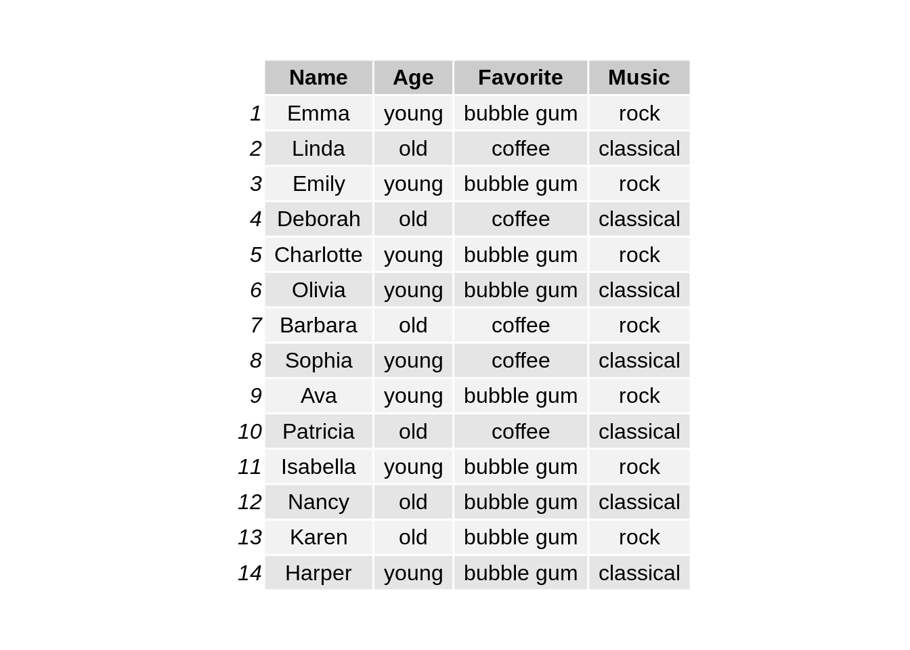

### ggplot2

We first use package `ggplot2` to make stacked bar charts. The input dataset should provide three columns which are the numeric count and two categorical variables for group and subgroup respectively.  


```r
# load the library
library(ggplot2)

# reshape the dataset
df1 <- df %>% group_by(Age,Favorite) %>% summarise(count=n())

# make stacked bar chart
ggplot(df1, aes(y=count, x=Age, fill=Favorite)) + 
    geom_bar(stat="identity") + 
  ggtitle("Figure 1.1: Stacked bar chart on Age and Favorite") + 
  theme(plot.title = element_text(hjust = 0.5, size=15))
```

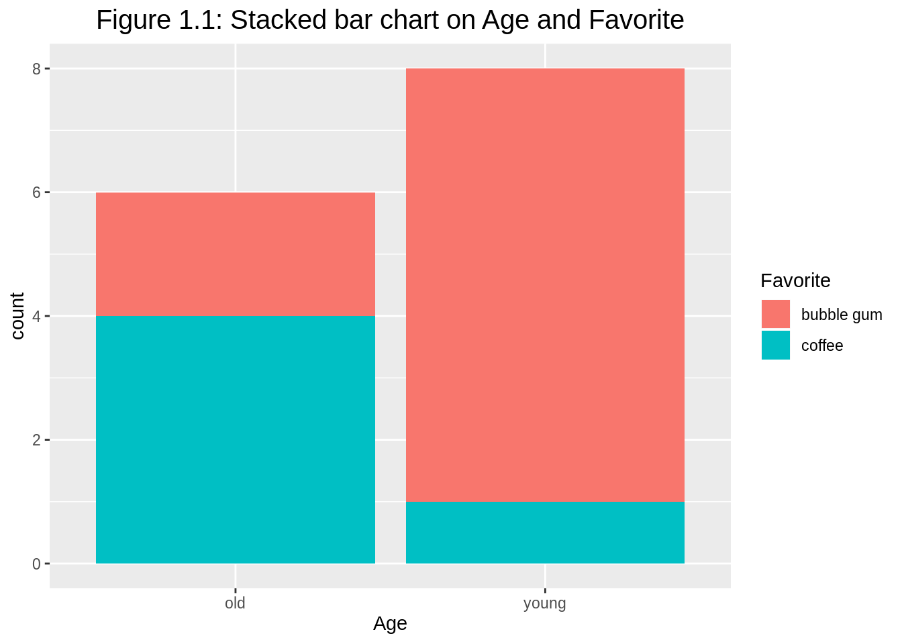


To make a percentage stacked bar chart, we just need to switch to `position="fill"`. The y-axis label needs to be changed to proportion or percent, accordingly. If the original numerical values are counts, it is better to change the y-axis to continuous percentage scale. 


```r
# make percent stacked bar chart
ggplot(df1, aes(y=count, x=Age, fill=Favorite)) + 
    geom_bar(position="fill", stat="identity") + 
  ylab("percent") +
  ggtitle("Figure 1.2: Percent stacked bar chart on Age and Favorite") + 
  theme(plot.title = element_text(hjust = 0.5, size=15)) +
  scale_y_continuous(labels = scales::percent_format()) 
```

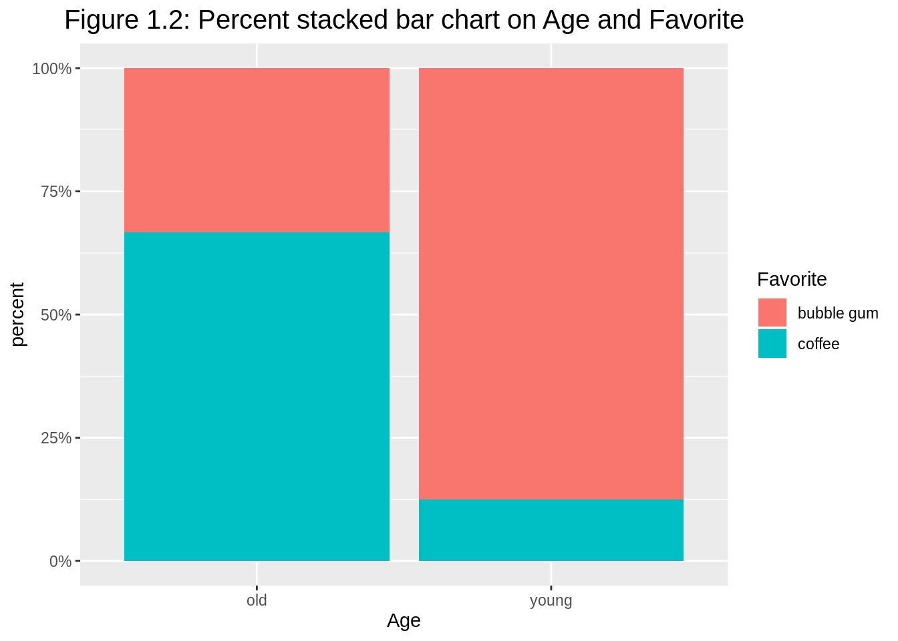


Argument `position="dodge"` has bars align beside each other (default as `position="stack"`). When stacked bar charts are overused, grouped barplot is preferred with common y-axis scale to compare. 


```r
# make another grouped bar chart
ggplot(df1, aes(y=count, x=Age, fill=Favorite)) + 
    geom_bar(position="dodge", stat="identity") + 
  ggtitle("Figure 1.3: Grouped bar chart on Age and Favorite as fill") + 
  theme(plot.title = element_text(hjust = 0.5, size=15))
```

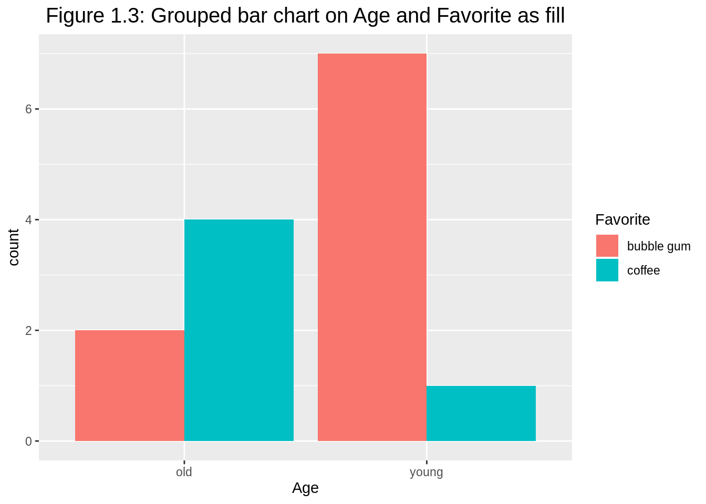


In this case, we have two options in terms of which is used for `fill` and which is used for group division.  


```r
# make grouped bar chart
ggplot(df1, aes(y=count, x=Favorite, fill=Age)) + 
    geom_bar(position="dodge", stat="identity") + 
  ggtitle("Figure 1.4: Grouped bar chart on Favorite and Age as fill") + 
  theme(plot.title = element_text(hjust = 0.5, size=15))
```

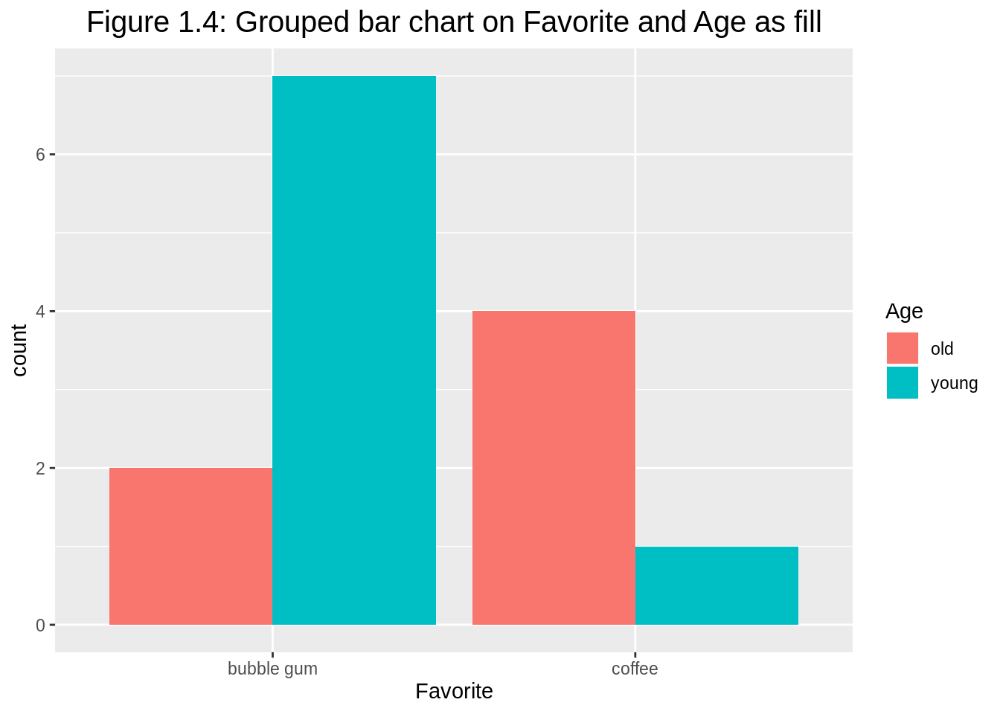


We can also add facets to avoid overusing colors. Observe that colors disappear, it is because all categorical variables are clearly labeled.  


```r
# make grouped bar chart with facets
ggplot(df1, aes(y=count, x=Age)) + 
  geom_bar(position="dodge", stat="identity") + 
  facet_wrap(~Favorite) + 
  ggtitle("Figure 1.5: Grouped bar chart with facets on Favorite") + 
  theme(plot.title = element_text(hjust = 0.5, size=15))
```

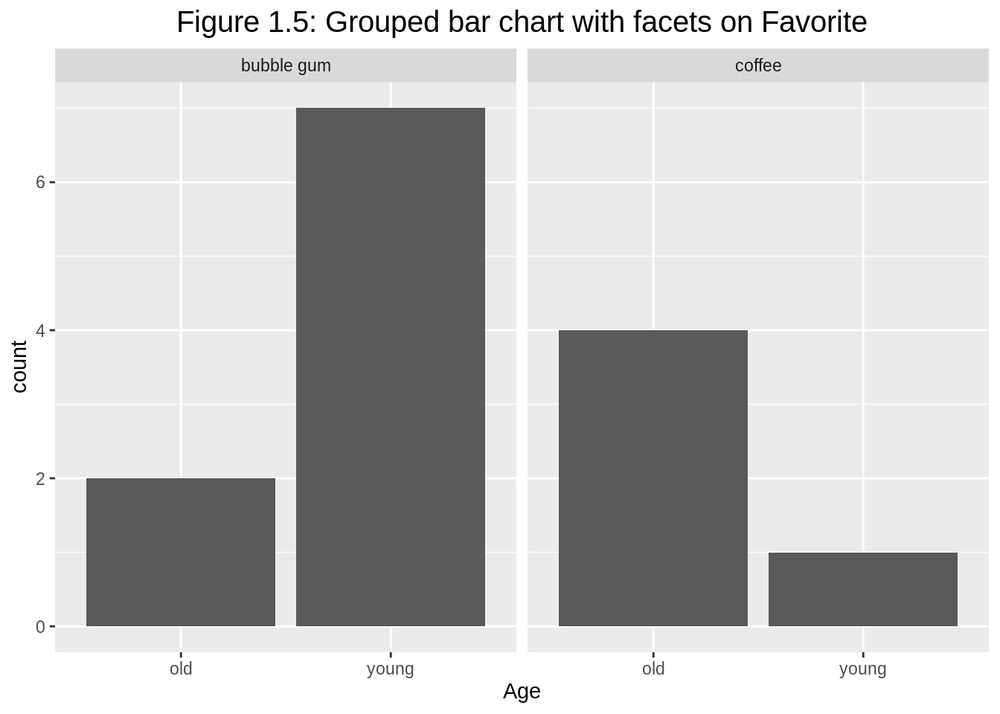


Similarly, we can have facets on the other categorical variable `Age`.


```r
# make grouped bar chart with facets on Age
ggplot(df1, aes(y=count, x=Favorite)) + 
    geom_bar(position="dodge", stat="identity") + 
  facet_wrap(~Age) + 
  ggtitle("Figure 1.6: Grouped bar chart with facets on Age") + 
  theme(plot.title = element_text(hjust = 0.5, size=15))
```

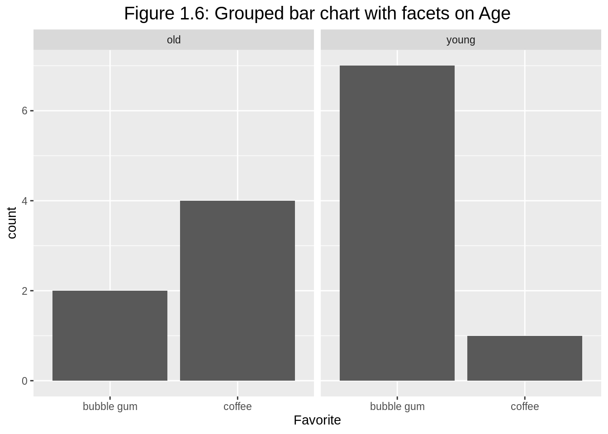


The grouped bar chart with facets also works when we have three categorical variables. When reshaping the dataset, we actually need `complete()` here to avoid dropping zero counts. 


```r
# load library
library(tidyr)

# reshape the dataset
df2 <- df %>% group_by(Age,Favorite, Music) %>% 
  summarise(count=n()) %>%
  complete(Age, Favorite, Music, fill=list(count = 0))

# make the grouped barplot
ggplot(df2, aes(fill=Music, y=count, x=Favorite)) + 
  geom_bar(position="dodge", stat="identity") + 
  facet_wrap(~Age) + 
  ggtitle("Figure 1.7: Grouped bar chart for Favorite and Music with facets on Age") + 
  theme(plot.title = element_text(hjust = 0.5, size=13))
```

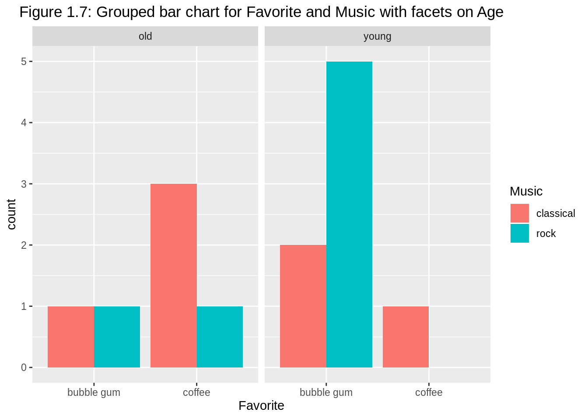


### plotly

R package `plotly` can also be utilized to plot interactive bar charts for multivariate categorical variables.  


```r
# load the library
library(plotly)

# spread the dataset
df3 <- df %>% group_by(Age,Favorite) %>% 
  summarise(count=n()) %>%
  spread(key=Favorite, value=count)

# make the stacked bar chart
plot_ly(df3, x=~Age, y=~`bubble gum`, type='bar', name='bubble gum') %>%
  add_trace(y=~coffee, name='coffee') %>%
  layout(yaxis = list(title = 'count'), 
         title = 'Figure 1.8: Interactive stacked bar chart on Age and Favorite',
         barmode = 'stack')
```

<!--html_preserve--><div id="htmlwidget-15cd4f2945f5bfbc0f1d" style="width:672px;height:480px;" class="plotly html-widget"></div>
<script type="application/json" data-for="htmlwidget-15cd4f2945f5bfbc0f1d">{"x":{"visdat":{"6dc73904f942":["function () ","plotlyVisDat"]},"cur_data":"6dc73904f942","attrs":{"6dc73904f942":{"x":{},"y":{},"name":"bubble gum","alpha_stroke":1,"sizes":[10,100],"spans":[1,20],"type":"bar"},"6dc73904f942.1":{"x":{},"y":{},"name":"coffee","alpha_stroke":1,"sizes":[10,100],"spans":[1,20],"type":"bar","inherit":true}},"layout":{"margin":{"b":40,"l":60,"t":25,"r":10},"yaxis":{"domain":[0,1],"automargin":true,"title":"count"},"title":"Figure 1.8: Interactive stacked bar chart on Age and Favorite","barmode":"stack","xaxis":{"domain":[0,1],"automargin":true,"title":"Age","type":"category","categoryorder":"array","categoryarray":["old","young"]},"hovermode":"closest","showlegend":true},"source":"A","config":{"showSendToCloud":false},"data":[{"x":["old","young"],"y":[2,7],"name":"bubble gum","type":"bar","marker":{"color":"rgba(31,119,180,1)","line":{"color":"rgba(31,119,180,1)"}},"error_y":{"color":"rgba(31,119,180,1)"},"error_x":{"color":"rgba(31,119,180,1)"},"xaxis":"x","yaxis":"y","frame":null},{"x":["old","young"],"y":[4,1],"name":"coffee","type":"bar","marker":{"color":"rgba(255,127,14,1)","line":{"color":"rgba(255,127,14,1)"}},"error_y":{"color":"rgba(255,127,14,1)"},"error_x":{"color":"rgba(255,127,14,1)"},"xaxis":"x","yaxis":"y","frame":null}],"highlight":{"on":"plotly_click","persistent":false,"dynamic":false,"selectize":false,"opacityDim":0.2,"selected":{"opacity":1},"debounce":0},"shinyEvents":["plotly_hover","plotly_click","plotly_selected","plotly_relayout","plotly_brushed","plotly_brushing","plotly_clickannotation","plotly_doubleclick","plotly_deselect","plotly_afterplot","plotly_sunburstclick"],"base_url":"https://plot.ly"},"evals":[],"jsHooks":[]}</script><!--/html_preserve-->


For the corresponding grouped bar chart, we only need to change `barmode = 'stack'` to `barmode = 'group'`. The counts for each subgroup can be added directly on the interactive plot as well.  


```r
# make the stacked bar chart

df3 %>% 
  plot_ly() %>%
  add_trace(x=~Age, y=~`bubble gum`, type = 'bar', name='bubble gum',
            text = df3$`bubble gum`, textposition = 'auto') %>%
  add_trace(x=~Age, y=~coffee, type = 'bar', name='coffee',
            text = df3$coffee, textposition = 'auto') %>%
  layout(title = "Figure 1.9: Interactive grouped bar chart on Age and Favorite\nwith direct labels",
         barmode = 'group',
         xaxis = list(title = ""),
         yaxis = list(title = ""))
```

<!--html_preserve--><div id="htmlwidget-c90546be6249fa361709" style="width:672px;height:480px;" class="plotly html-widget"></div>
<script type="application/json" data-for="htmlwidget-c90546be6249fa361709">{"x":{"visdat":{"6dc72a50e2da":["function () ","plotlyVisDat"]},"cur_data":"6dc72a50e2da","attrs":{"6dc72a50e2da":{"alpha_stroke":1,"sizes":[10,100],"spans":[1,20],"x":{},"y":{},"type":"bar","name":"bubble gum","text":[2,7],"textposition":"auto","inherit":true},"6dc72a50e2da.1":{"alpha_stroke":1,"sizes":[10,100],"spans":[1,20],"x":{},"y":{},"type":"bar","name":"coffee","text":[4,1],"textposition":"auto","inherit":true}},"layout":{"margin":{"b":40,"l":60,"t":25,"r":10},"title":"Figure 1.9: Interactive grouped bar chart on Age and Favorite<br />with direct labels","barmode":"group","xaxis":{"domain":[0,1],"automargin":true,"title":"","type":"category","categoryorder":"array","categoryarray":["old","young"]},"yaxis":{"domain":[0,1],"automargin":true,"title":""},"hovermode":"closest","showlegend":true},"source":"A","config":{"showSendToCloud":false},"data":[{"x":["old","young"],"y":[2,7],"type":"bar","name":"bubble gum","text":[2,7],"textposition":["auto","auto"],"marker":{"color":"rgba(31,119,180,1)","line":{"color":"rgba(31,119,180,1)"}},"error_y":{"color":"rgba(31,119,180,1)"},"error_x":{"color":"rgba(31,119,180,1)"},"xaxis":"x","yaxis":"y","frame":null},{"x":["old","young"],"y":[4,1],"type":"bar","name":"coffee","text":[4,1],"textposition":["auto","auto"],"marker":{"color":"rgba(255,127,14,1)","line":{"color":"rgba(255,127,14,1)"}},"error_y":{"color":"rgba(255,127,14,1)"},"error_x":{"color":"rgba(255,127,14,1)"},"xaxis":"x","yaxis":"y","frame":null}],"highlight":{"on":"plotly_click","persistent":false,"dynamic":false,"selectize":false,"opacityDim":0.2,"selected":{"opacity":1},"debounce":0},"shinyEvents":["plotly_hover","plotly_click","plotly_selected","plotly_relayout","plotly_brushed","plotly_brushing","plotly_clickannotation","plotly_doubleclick","plotly_deselect","plotly_afterplot","plotly_sunburstclick"],"base_url":"https://plot.ly"},"evals":[],"jsHooks":[]}</script><!--/html_preserve-->


### Consideration

The above stacked and grouped bar charts can only be used for the visualization of two or three categorical variables and necessitate the reshape of data (messier or tidier). For more general demonstration, we can apply mosaic plots, doubledecker plots, fluctuation diagrams, treemaps, association plots, and parallel sets/categorical parallel coordinate plots.  


### External resources
1. [Grouped, stacked and percent stacked barplot in ggplot2](https://www.r-graph-gallery.com/48-grouped-barplot-with-ggplot2.html): a good reference of learning how to build grouped, stacked and percent stacked barplot with R and ggplot2 with multiple examples. 

2. [How to make a bar chart in R using plotly](https://plot.ly/r/bar-charts/): a detailed tutorial of making barplots using `plotly` package.  

3. [R documentation tidyr: complete()](https://www.rdocumentation.org/packages/tidyr/versions/0.8.3)  

4. [R documentation ggplot2: geom_bar()](https://www.rdocumentation.org/packages/ggplot2/versions/3.2.1)

5. [14MosaicPlots.pdf by Professor Joyce Robbins](https://courseworks2.columbia.edu/courses/86100/files/5992457/download?wrap=1)


## 2. Treemap


### Overview

This section covers how to make treemaps. Treemaps are filled rectangular plot representing hierarchical data, similar to pie chart in that the area of the rectangles can represent proportions. Treemaps can be drawn in R using the treemap function in the package `treemap`. 


What types of datasets are appropriate for treemaps? Firstly, we need to have a quantitative variable of positive value, then we need one or more hierarchical categorical variables associated with that quantitative variable. 


```r
#load library
library(ggplot2)
library(tidyverse)
library(treemap)

#Load population dataset from Github
df <- read.table("https://raw.githubusercontent.com/holtzy/data_to_viz/master/Example_dataset/11_SevCatOneNumNestedOneObsPerGroup.csv", header=T, sep=";")
df[ which(df$value ==-1),"value"] <- 1
colnames(df) <- c("Continent", "Region", "Country", "Population")
```


### Continent level

First, we want to look at the proportions of population across the continents. 


```r
treemap(df, #dataframe
        index=c("Continent"),  #categorical hierarchy variable, Continent in this case
        vSize = "Population",  #quantitative variable, Population in this case
        type="index",
        title = "Figure 2.1: Population by Continents")#colors are determined by the index variables. Different branches in the hierarchical tree get different colors
```

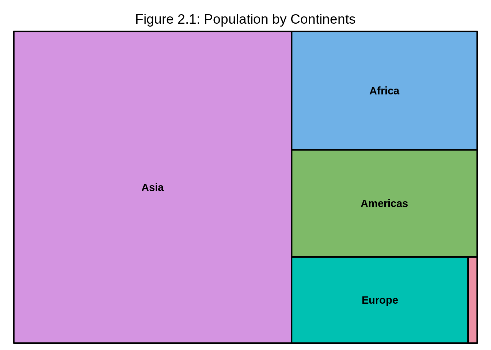

We can observe from the treemap that Asia has the highest population in all continents meanwhile Oceania has the lowest.   


### Region level

Now we would like to look at the population at region level. We simply add "Region" after "Continent" in the `index=c("Continent")` line. Note that the categorical variables have to go in decreasing order of hierarchy for instance, `index=c("group", "subgroup", "sub-subgroup",...)`.  


```r
treemap(df, #dataframe
        index=c("Continent", "Region"),  #categorical hierarchy variables
        vSize = "Population",  #quantitative variable, Population in this case
        type="index",
        title = "Figure 2.2: Population by Continents and Regions")
```

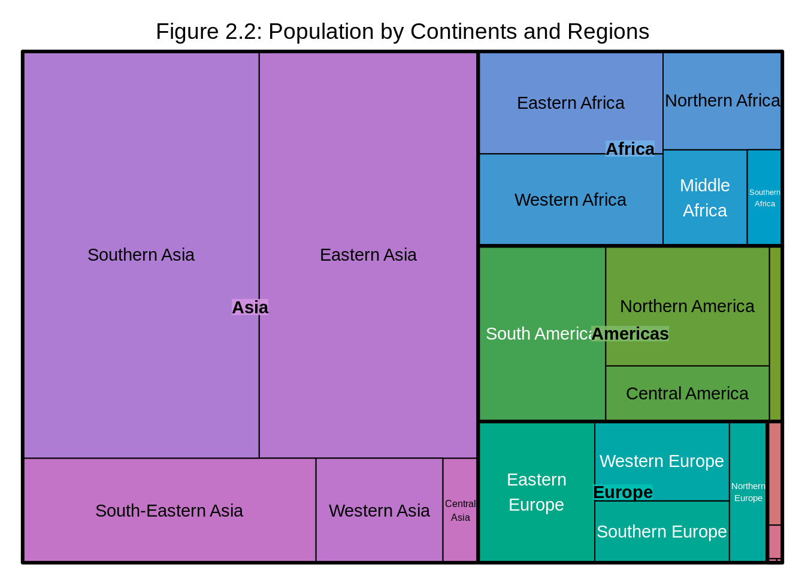


We observe that Southern Asia and Eastern Asia have the higest proportion of population within Asia and their population proportions are almost equal, while Central Asia has the lowest proportion of population within Asia. Western Africa has the higest proportion of population within Africa, Southern Africa has the lowest and so on. 


### Country Level


If we would also like to look at population at the country level, we simply add `"Country"` after `"Region"` in the `index=c("Continent", "Region")` line.


```r
treemap(df, #dataframe
        index=c("Continent", "Region", "Country"),  #categorical variables in the order of highest level of the hierarchy to lowest
        vSize = "Population",                    
        type="index",
        title = "Figure 2.3: Population by Continents, Regions and Countries") 
```

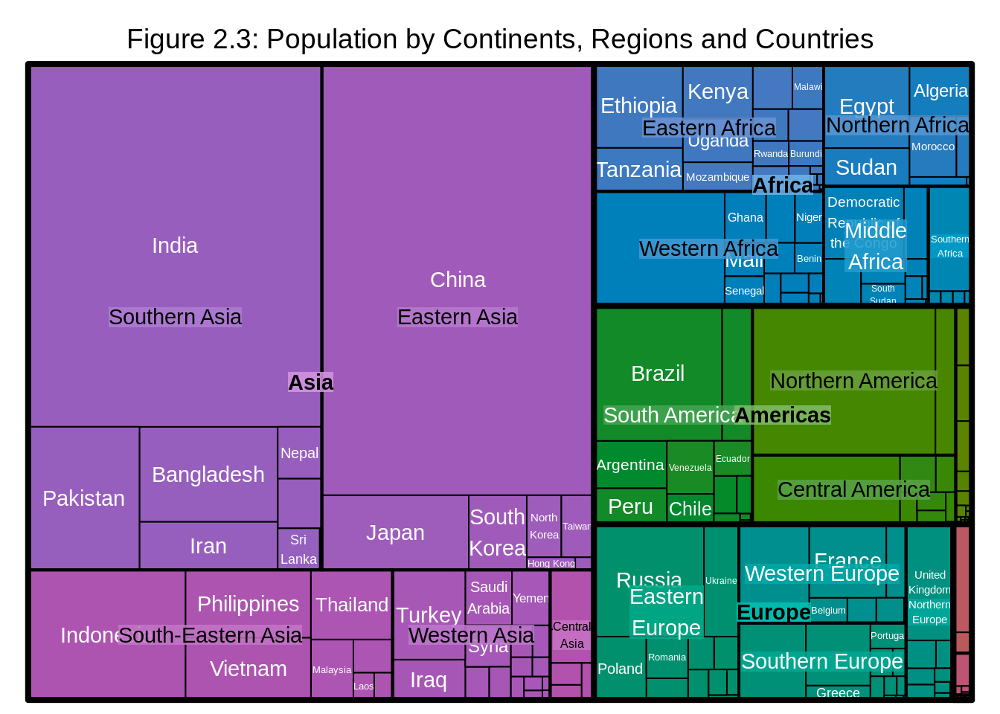


However, one problem might arise as we have many levels of hierarchy: the labels might become hard to read. In that case, we can adjust the parameters of the labels for the ease of reading. 


```r
treemap(df, #dataframe
        index=c("Continent", "Region", "Country"),  #categorical variables in the order of highest level of the hierarchy to lowest
        vSize = "Population",                     #quantitative variable
        type="index",
        # Labels
        fontsize.labels=c(15,8,5),                # size of labels. Give the size per level of aggregation: size for group, size for subgroup, sub-subgroups...
        fontcolor.labels=c("black","orange", "white"),    # Color of labels
        fontface.labels=c(2,1,1),                  # Font of labels: 1,2,3,4 for normal, bold, italic, bold-italic...
        bg.labels=c("transparent"),              # Background color of labels
        align.labels=list(
        c("center", "center"), 
        c("right", "bottom"),
        c("left", "top")),                      # Where to place labels in the rectangle?
        overlap.labels=0.5,                     # number between 0 and 1 that determines the tolerance of the overlap between labels. 0 means that labels of lower levels are not printed if higher level labels overlap, 1  means that labels are always printed. In-between values, for instance the default value .5, means that lower level labels are printed if other labels do not overlap with more than .5  times their area size.
        inflate.labels=F,
        title = "Figure 2.4: Population by Continents, Regions and Countries") 
```

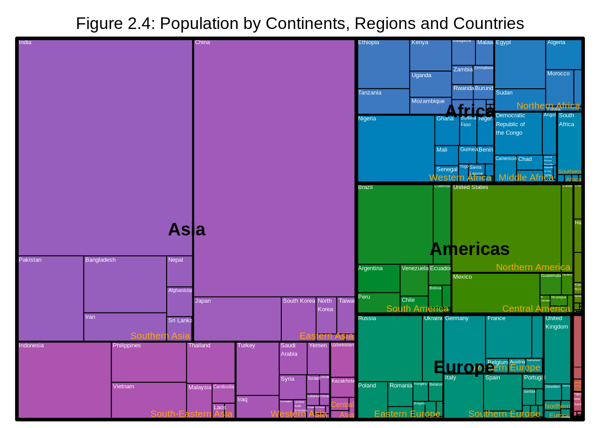


We observe that China has the highest proportion of population in Eastern Asia while India has the the highest proportion of population in Southern Asia and so on.


### Consideration

Static treemaps which were covered in this section could be handy when we have a hierarchical dataset with at most three levels of hierarchy. However, if there are more levels of hierarchy, we should consider plotting an interactive version of treemaps using packages such as `d3Tree` as it will greatly increase readability of the plot. 

Another important reminder is that when we have multivariate categorical data, we should only consider plotting the data using treemaps when the data has hierarchical structure and we are interested in the relationship between the quantitative variables and the different level of subgroups. If that's not the case, we should consider plotting the data using graphs such as mosaicplots, doubledecker plots, fluctuation diagrams, association plots, and parallel sets/categorical parallel coordinate plots.


### External resources

1. [How to make a treemap in R using treemap()](https://www.r-graph-gallery.com/treemap.html): a detailed tutorial of making treemaps using `treemap` package.  

2. [R documentation treemap()](https://www.rdocumentation.org/packages/treemap/versions/2.4-2/topics/treemap)  

3. Graphical Data Analysis with R by Antony Unwin

