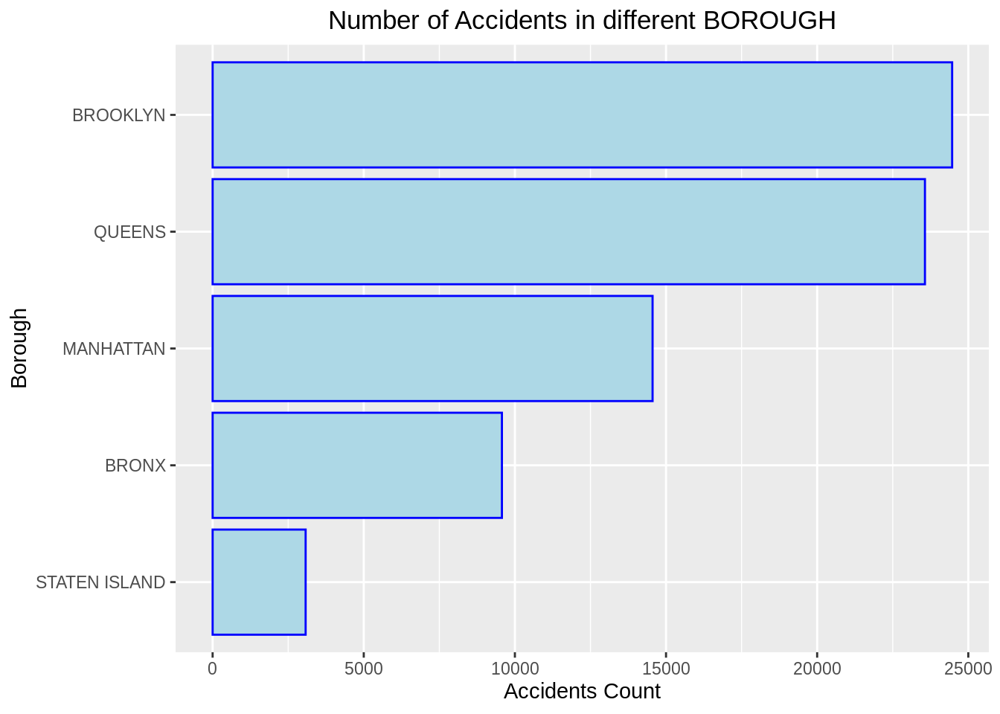
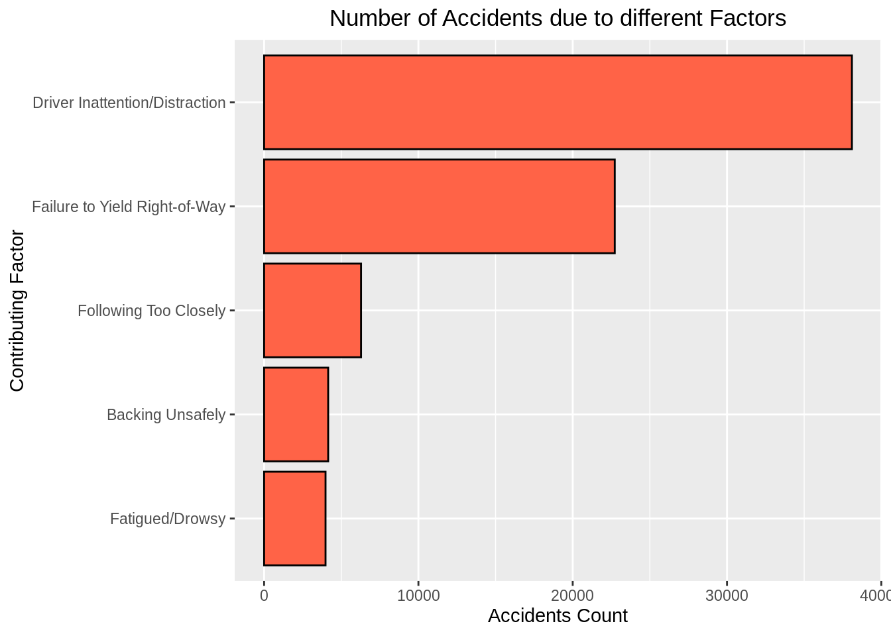
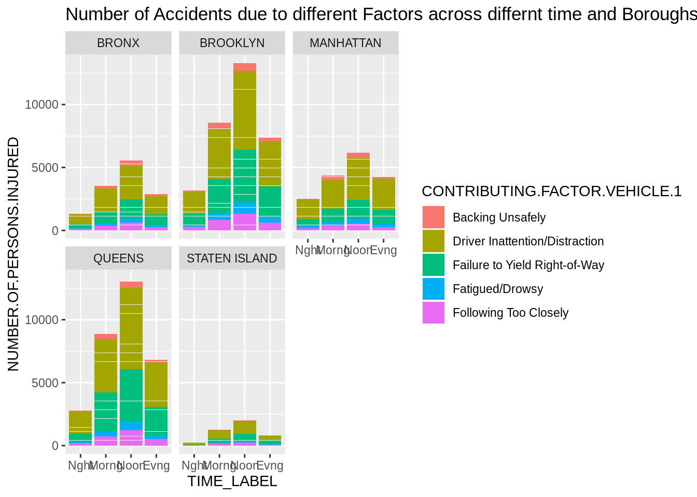
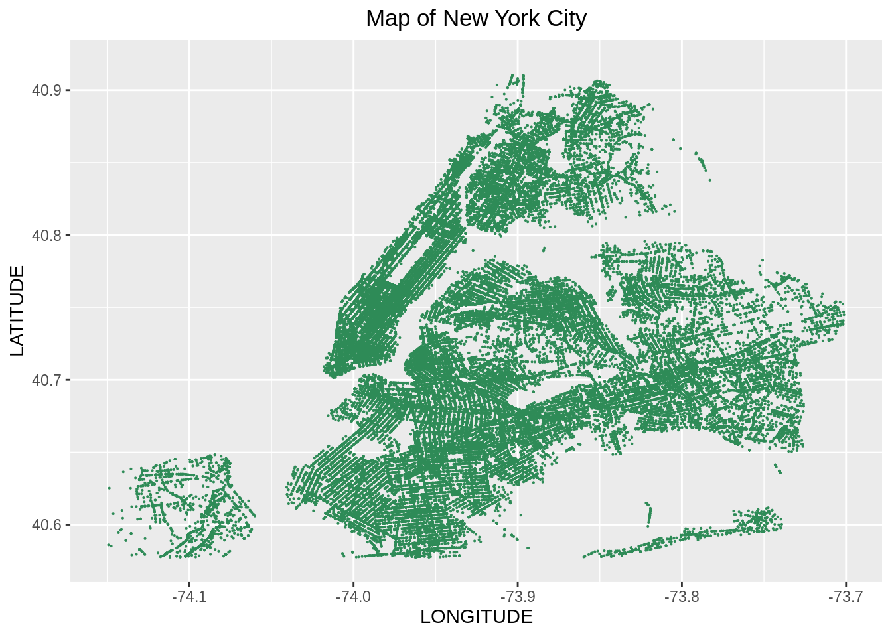
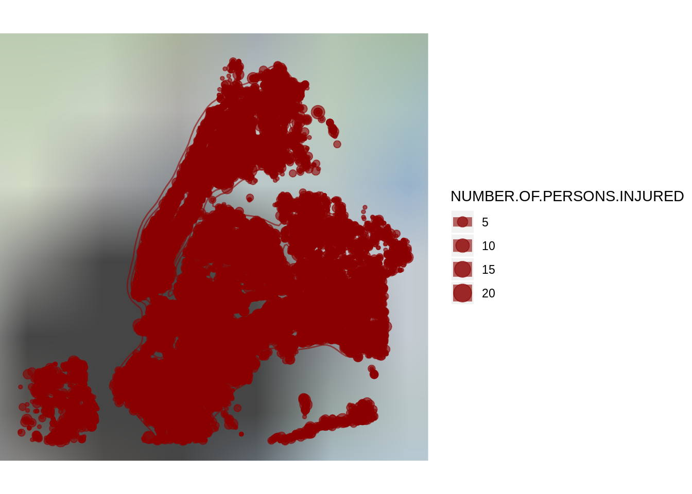
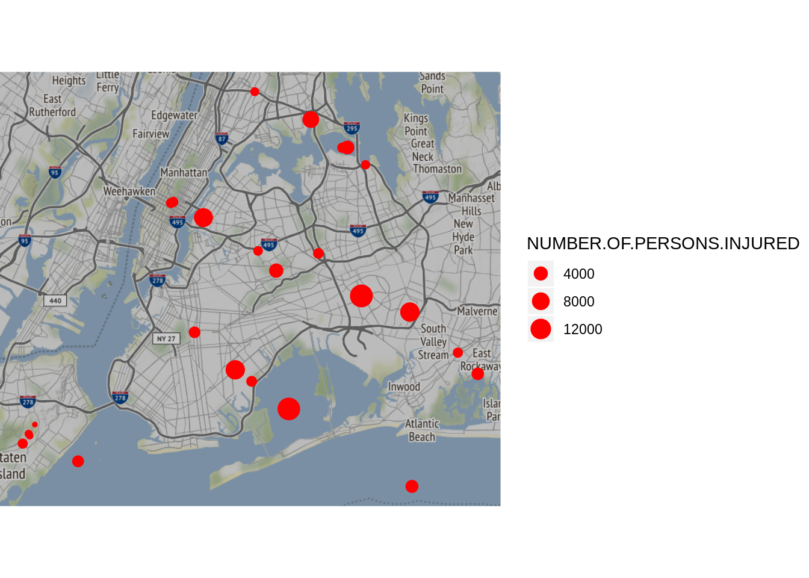
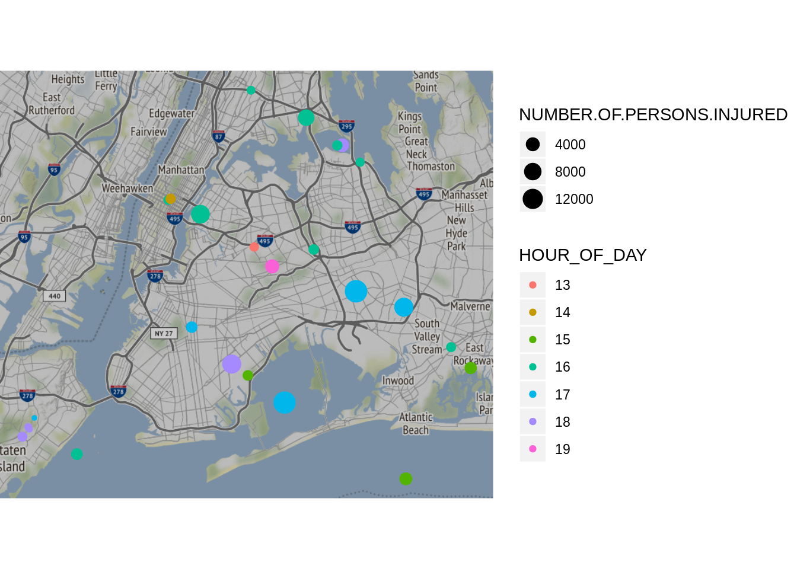

# Using Stamen Maps for Plotting Spatial Data


Kumari Nishu and Neelam Patodia

Objective: 
We intend to highlight the usability of Stamen Maps for visualizing spatial data. 

Approach:
We conduct a comparative study between different types of graphs to understand the visualization tool which best demonstrates spatial data.We use the publicly available data on the number of vehicle collisions in New York for this demonstration.   


```r
library(dplyr)
library(ggmap)

# Dataset available at "https://data.cityofnewyork.us/Public-Safety/NYPD-Motor-Vehicle-Collisions-Crashes/h9gi-nx95/data". 

raw_df <-
  read.csv(file ="https://data.cityofnewyork.us/api/views/h9gi-nx95/rows.csv",
           header = TRUE, sep = ",")
```


```r
# Selecting specific columns and rows 

reasons <- c("Driver Inattention/Distraction", "Failure to Yield Right-of-Way",
    "Following Too Closely", "Fatigued/Drowsy", "Backing Unsafely")

df <- raw_df %>%
  select(ACCIDENT.TIME, BOROUGH, LATITUDE, LONGITUDE, NUMBER.OF.PERSONS.INJURED, CONTRIBUTING.FACTOR.VEHICLE.1) %>%
  na_if("") %>%  # recode empty strings "" by NAs
  na.omit %>% # remove NAs
  filter(NUMBER.OF.PERSONS.INJURED != 0) %>%
  filter(CONTRIBUTING.FACTOR.VEHICLE.1 %in% reasons)

df$TIME <- as.character(df$ACCIDENT.TIME)
df$TIME <- as.numeric(unlist(strsplit(df$TIME, ":"))[seq(1, 2 * nrow(df), 2)])

#creating label based on the hour of day
breaks <- c(0, 6, 12, 18, 24)
labels <- c("Nght", "Morng", "Noon", "Evng")
df$TIME_LABEL <- cut(x=df$TIME, breaks = breaks, labels = labels, include.lowest=TRUE)
```
For the purpose of our analysis, we would try to see patterns associated with number of persons injured. For this we have selected the following potential parameters : Time, Latitude, Longitude, Borough and Contributing Factor with respect to vehicles. Since data was available for each granular time, we've created a broader bucket to categorise time into 4 slots. 


```r
library(forcats)
# Summary of dataset
# accident count by borough
ggplot(data=df, aes((fct_rev(fct_infreq(BOROUGH))))) + 
  geom_bar( color="blue", fill="LIGHTBLUE") +
  ggtitle("Number of Accidents in different BOROUGH", ) + theme(plot.title = element_text(hjust = 0.5)) + 
  xlab("Borough") +ylab("Accidents Count") + 
  coord_flip() +
  theme(legend.position = "top")
```



```r
# accidents by contributing factors
ggplot(data=df, aes((fct_rev(fct_infreq(CONTRIBUTING.FACTOR.VEHICLE.1))))) + 
  geom_bar( color="black", fill="tomato") +
  ggtitle("Number of Accidents due to different Factors", ) + theme(plot.title = element_text(hjust = 0.5)) + 
  xlab("Contributing Factor") +ylab("Accidents Count") + 
  coord_flip() +
  theme(legend.position = "top")
```



```r
# Number of accidents across different Boroughs for different time slots and contributing factors
ggplot(df, aes(fill=CONTRIBUTING.FACTOR.VEHICLE.1, y=NUMBER.OF.PERSONS.INJURED, x=TIME_LABEL)) + 
    geom_bar(position="stack", stat="identity") +
    facet_wrap(~BOROUGH)+
    ggtitle("Number of Accidents due to different Factors across differnt time and Boroughs", )
```



Using the plots above, we had to plot 5 graphs (3rd GGPLOT) to understand the pattern of accidents occuring across differnt Boroughs at different times and the factor contributing the most to the accident. However, this results in assimilating information from multiple graphs which is indeed tedious. Additionally, if we were to further analyse the sub locatlities within each Borough, plotting the latitudes and longitudes on an x-y axis would not convey much information. We, thus try a different approach of adding these plots on an actual map of the area recorded. 


```r
#Step 1
#plotting map of New York
#Constraining the plot to a bounding box of latitude and longitude coordinates corresponding to NYC. 
min_lat <- 40.5774
max_lat <- 40.9176
min_long <- -74.15
max_long <- -73.7004

ggplot(df, aes(x=LONGITUDE, y=LATITUDE)) +
  geom_point(size=0.06, color="seagreen") +
  scale_x_continuous(limits=c(min_long, max_long)) +
  scale_y_continuous(limits=c(min_lat, max_lat)) +
  ggtitle("Map of New York City", ) + theme(plot.title = element_text(hjust = 0.5))
```



```r
#Step 2
#Plotting all accidents
qmplot(x = LONGITUDE, y = LATITUDE, data = df, maptype = "watercolor",darken = .2,
       geom = c("point","density2d"), size = NUMBER.OF.PERSONS.INJURED, color = I("darkred"),
      , alpha = I(.6), legend = NA) +
  scale_x_continuous(limits=c(min_long, max_long)) +
  scale_y_continuous(limits=c(min_lat, max_lat)) 
```



```r
#Step 3
#Plotting by borough and contributing factor with size proportional to number of persons injured
gdf <- df %>%
  group_by(BOROUGH, CONTRIBUTING.FACTOR.VEHICLE.1) %>% 
  summarize(NUMBER.OF.PERSONS.INJURED = sum(NUMBER.OF.PERSONS.INJURED),
             HOUR_OF_DAY = names(which(table(TIME) == max(table(TIME)))[1]),
             LATITUDE = mean(LATITUDE), LONGITUDE = mean(LONGITUDE))

#Step 3a
#Plotting with size proportional to number of persons injured
qmplot(x = LONGITUDE, y = LATITUDE, data = gdf, maptype = "toner",darken=0.2,
       geom = c("point"), size = NUMBER.OF.PERSONS.INJURED, color = I("red")) 
```



```r
#Step 3b
#Plotting with size proportional to number of persons injured and color proportional to hour of the day
qmplot(x = LONGITUDE, y = LATITUDE, data = gdf, maptype = "toner",darken = .2,
       geom = "point", size = NUMBER.OF.PERSONS.INJURED, color = HOUR_OF_DAY) 
```



* We have used Stamen maps as opposed to Google maps as the latter requires an API and costs money beyond a certain number of views per day. 

* The qmplot function in Stamen maps is used to add the map background. 

* We get the base map of New York based on the Latitudes and longitudes (Step 1). 

* Similar to ggplot, we can add layers on the maps which enbales us with a better visualization of events occuring in a locality. 

* Step 2 shows how the map would look if we plotted all the accidents in the raw format based solely on the latitudes and longitudes. 

* In the next steps, we have thus grouped data on potential parameters such as Borough and Contributing Factor. Additionally, instead of plotting all data points for all latitudes and longitudes, we consider the mean latitude and longitude to give a better perspective of the number of accidents in a locality. 

* Stamen Maps have various map backgrounds such as toner, watermark, burning, terrain etc for varied requirements. For our analysis, toner seemed to be the best fit as it highlighted the cities and cross sections which are vital for understanding vehicle collisions on the road. 

* We use a variation of size and colour to highlight 2 parameters i.e the size of the bubble denotes the if more or less number of accidents occured in a region based on latitude and longitude. And colour denotes if there is a pattern across different time stamps. The colour gradient can be changed to accomodate for different parameter. 

* Using maps have thus enabled us to seamlessly identify patterns in the data by accomodating for multiple parameters into one graph. Overall, it offers a better visualization of spatial data as opposed to normal graphs. 


