# (PART) Interactive Graphs {-}

# Shiny

Duanyue Yun, Boyu Liu


In this tutorial, we will use the cars dataset as an example to wall through the process of building a shiny app. The cars dataset contains various information about a particular car.


```r
cars_info <- read.csv("cars.csv")
```

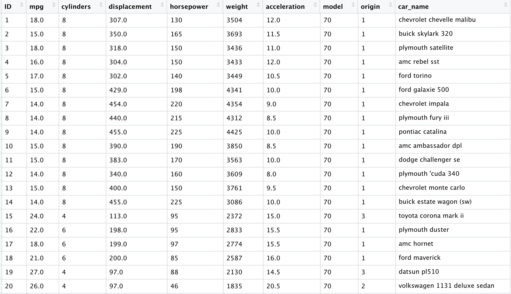

## Part 1 How to Build a Shiny App

## 1. Install the shiny package

First of all, we can install the shiny package by running the code below.


```r
install.packages("shiny")
```

## 2. Template for creating a shiny app

A shiny app consists of two main components: user interface (ui) and server instructions (server). The user interface will contain the elements that a user sees on your shiny app, which can be input (possible user interactions) and output display. The server instructions will define how the app should react to a user's action.

Therefore, a basic template for creating a shiny app consists of 3 parts as shown below:


```r
library(shiny)

#1 define user interface
ui <- fluidPage()

#2 define server instructions
server <- function(input, output) {}

#3 putting everything together
shinyApp(ui = ui, server = server)
```


## 3. Add elements to user interface using `fluidPage()`

The arguments of the `fluidPage()` function could be `Input()` functions or `Output()` functions.

### Input functions

Inputs define the possible ways a user can interact with our shiny App. For a numerical variable, the input could be a slider that a user can move along to select a certain value. For a categorical variable, the input could be a box where the user can select a particular category from a drop down list.

All `Input()` functions contain 2 required arguments: `inputId =` and `label =`. `inputId` is for us to identify a particular input. Later we can use the same input ID in server instructions to decide the corresponding output. Therefore, to avoid errors, it is better to give a unique name to each input. `label` is what the user sees on the shiny App, so it should be informative.

The common `Input()` functions supported are:

`actionButton()`, `submitButton()`, `checkboxInput()`, `checkboxGroupInput()`, `dateInput()`, 
`dateRangeInput()`, `fileInput()`, `numericInput()`, `passwordInput()`, `radioButtons()`, `selectInput()`,
`sliderInput()`, `textInput()`.

Each `Input()` function has some specific arguments. For example, the `sliderInput()` function requires min, max arguments to set the range of the slider and also a value argument which is the default value the user sees when the shiny app is launched. You can find more about the function using `?sliderInput()`.

For example, we can add a select box by running the code below.
  

```r
ui <- fluidPage(
  # Add a select box
  selectInput(inputId = "varname", 
              label = "Choose a variable", 
              choices = colnames(cars_info)[c(2, 6, 7)]))
```

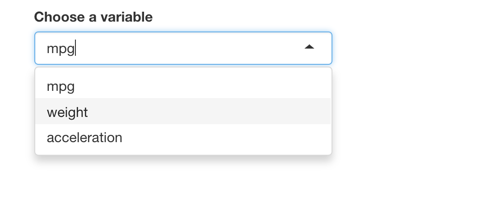

### Output functions

We can display an output, for example a plot, by adding `Output()` functions to `fluidPage()`. Each `Output()` function requires one argument, which is `outputId =`. We will talk about how to build output in server instructions.


```r
ui <- fluidPage(plotOutput("histogram"))
```

The common `Output()` functions supported are:
  
`dataTableOutput()`, `htmlOutput()`, `imageOutput()`, `plotOutput()`, `tableOutput()`, `textOutput()`, `uiOutput()`, `verbatimTextOutput()`.


## 4. Build output in server instructions

### (1): Save objects you want to display to `output$`


```r
server <- function(input, output) {
      output$histogram <- # code
}
```

We can use the same name in the form of a string in fluidPage() to display the output.

### (2): Build objects with `render()`

The `render()` functions that are supported include `renderDataTable()`, `renderImage()`, `renderPlot()`, `renderPrint()`, `renderTable()`, `renderText()`, `renderUI()`.

Within `render()` functions, we could use `{}` to wrap the code so that we can write multiple lines of code to create more sophisticated output.

As an example, the following code builds a histrogram of the variable `mpg` to our shiny app. Remember to add it to `ui()` to display it in the shiny app.


```r
server <- function(input, output) {
  output$histogram <- renderPlot({
    hist(cars_info$mpg, main = "", xlab = "mpg")
  })
}
```

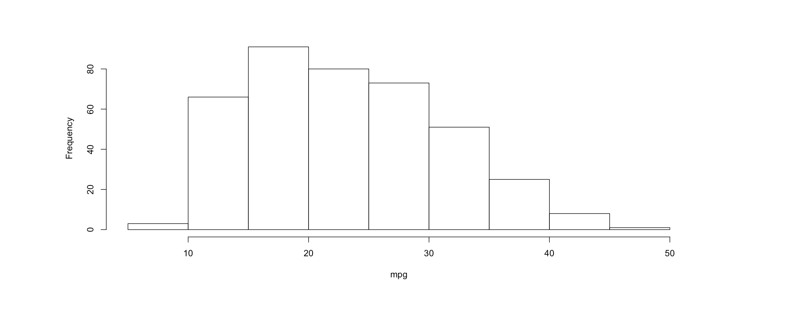

### (3): Use input values with `input$`

When we use `input$`, the app will be interactive. For the following example, when the user selects a different variable, the histogram will change accordingly.


```r
server <- function(input, output) {
  output$histogram <- renderPlot({
    hist(cars_info[[input$varname]], main = "", xlab = input$varname)
  })
}
```

## 5. Share your app

### Save your app

You should save your app to one directory with every file the app needs:

  * app.R (must be the exact file name)

  * datasets, images, css, helper scripts, etc.

### Publish your app on Shinyapps.io

1. Go to https://www.shinyapps.io to sign up for an account. 

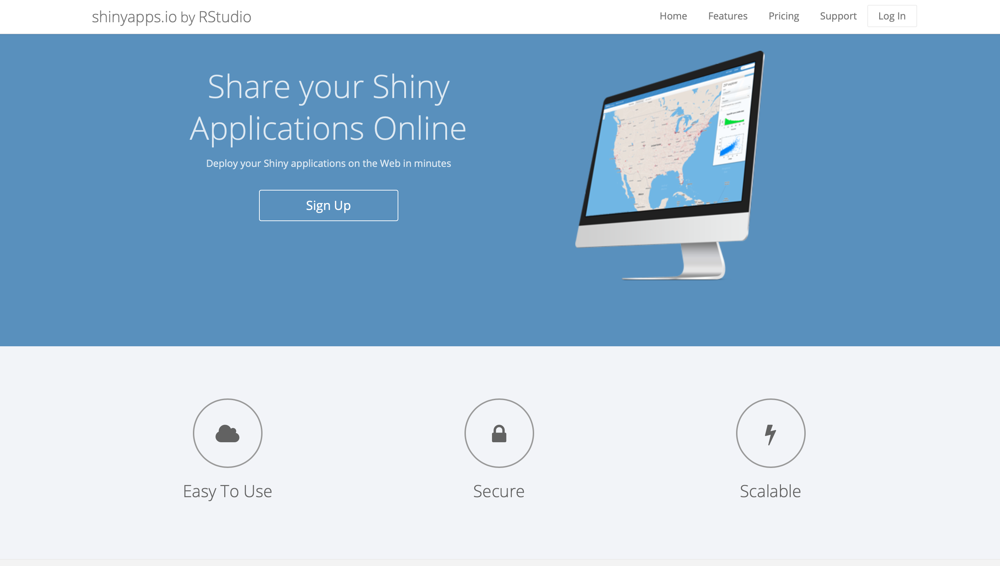

2. When you signed up for a new account on https://www.shinyapps.io, there will be instructions on how to associate your account with your RStudio IDE and how to deploy your app.

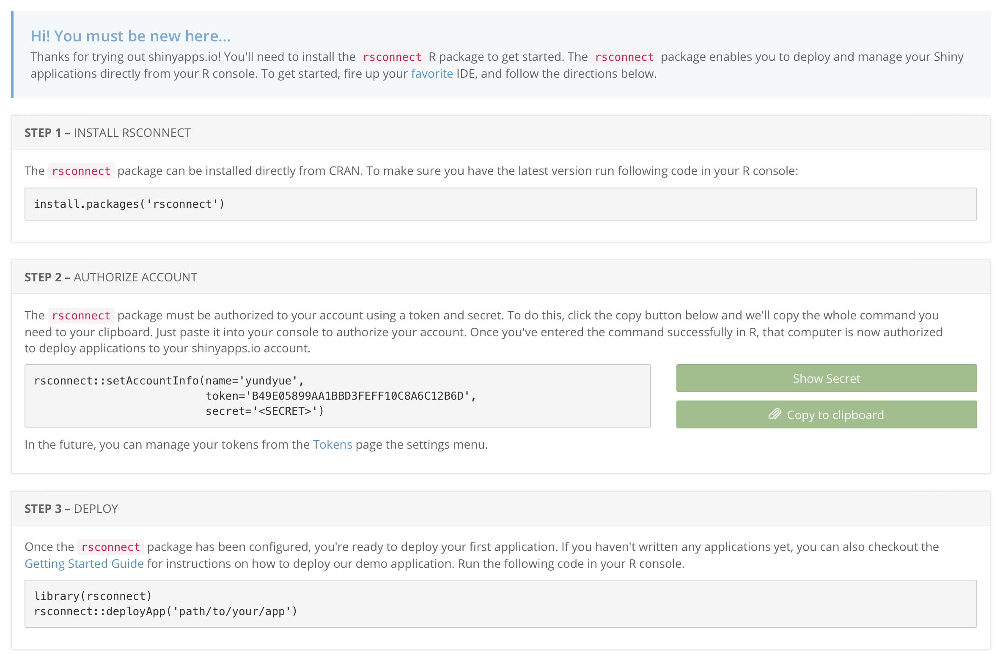 
  
## Part 2 How to Customize Reactions

## 1. Reactivity 

### What is reactivity? 

Let's think about Microsoft Excel. In Excel, we can type some value into a cell x and type a formula that uses x into a new cell y. Then whenever we change the value in x, y's value will change correspondingly. This is reactivity, which is also what Shiny does.
  
Shiny has an input object `input$x` and an output object `output$y`. Any changes in `input$x` will cause changes in `output$y`.
  
So now let's start with reactive values, which is where reactivity starts in Shiny. 
  
### Reactive values

Reactive values are what the user selects and depend on `Input()` functions. In the previous example where we create a select box, the reactive values are the variable that the user selects.
  
Note that reactive values don't work on their own. They actually work together with reactive functions.
 
### Reactive functions (reactive toolkit) 

  * They are a kind of functions that are expected to take reactive values and know what to do with them.
  
  * They are notified that they need to re-execute whenever the reactive value changes. 
  
  * They are included in the server instructions section to build (and rebuild) an object.
  
We can think of reactivity in R as two-step process. Consider the following example. We use input function `selectInput()` to get user's choice. `input$varname` is the reactive value. When we choose different variables, firstly reactive values will notify the functions which use them that they become outdated. After that its job is over and it's time for reactive functions to do their jobs, which is rebuild the corresponding object using new values. The process is automatic in shiny.
  

Suppose we want to output the corresponding histogram whenever the user chooses a variable.


```r
ui <- fluidPage(
  # Add a select box
  selectInput(inputId = "varname", 
              label = "Choose a variable", 
              choices = colnames(cars_info)[c(2, 6, 7)]),
  
  # Add corresponding output
  plotOutput(outputId = "histogram")
)

server <- function(input, output) {
  output$histogram <- renderPlot({
    hist(cars_info[[input$varname]], main = "", xlab = input$varname)
  })
}

shinyApp(ui = ui, server = server)
```

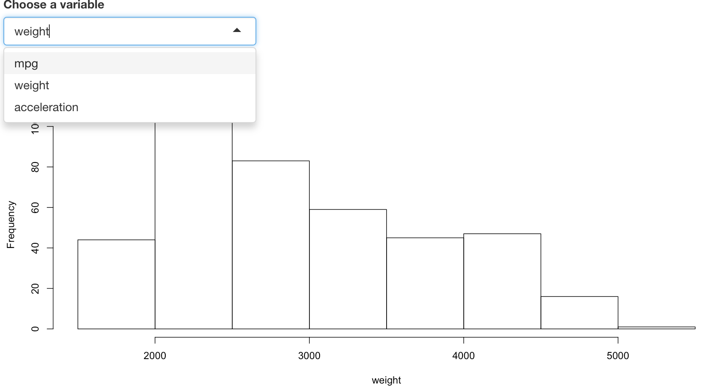

### Modularize code with `reactive()`

See the example below. When the user selects a number, the shiny app plots a histogram for that number of N(0,1) variables and also computes the summary statistics. This app has only one reactive value (number the user chooses) but has two objects, a histogram and a block of text which includes the statistics of the data. When the reactive value changes, it will notify these two objects and they will rerun the code to update themself. But the probelm is that because they rerun their code successively, so `rnorm(input$num)` is called twice. Since `rnorm` is random, each object generates a different set of values, which means the histogram describes a dataset and the summary of the statistics describes another dataset. 
  

```r
# Before
ui <- fluidPage(
  # Add a slider
  sliderInput(inputId = "num", label = "Please choose a number.", 
  min = 1, max = 100, value = 25),
  
  # Display the histogram
  plotOutput(outputId = "hist"),
  
  # Display the summary statistics
  verbatimTextOutput("stats")
)

server <- function(input, output) {
  # Build the histogram
  output$hist <- renderPlot({hist(rnorm(input$num), main = "", xlab = "num")})
  
  # Build the object that contains the summary statistics
  output$stats <- renderPrint({summary(rnorm(input$num))})
  }

shinyApp(ui = ui, server = server)
```

For example, when we only select one normal variable. It is clear that the histogram and the summary statistics do not correpond to the same data.

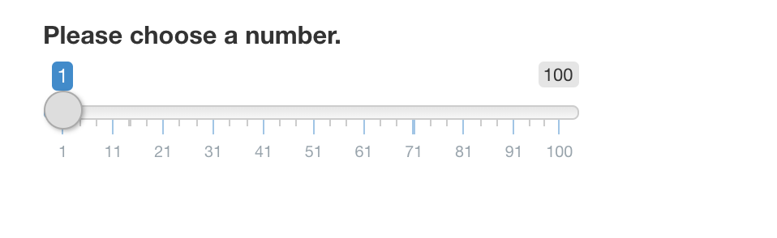
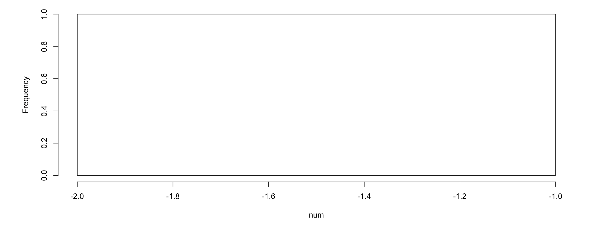
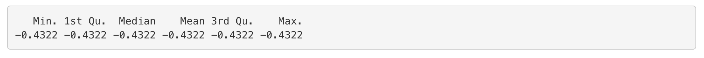


Can the two objects describe the same data? The answer is yes! The strategy is calling `rnorm(input$num)` only once and saving the dataset it creates. Then use this dataset downstream when we need it. Shiny provides a function called `reactive()`, which can wrap a normal expression to create a reactive expression and realize what we hope to achieve. 


```r
reactive(rnorm(input$num))
```
  
In this specific example, we add a code `data <- reactive(rnorm(input$num))` to the server and replace `rnorm(input$num)` in the reactive functions with `data()`. Note that you should call a reactive expression like a function. So here we use `data()` instead of `data`.
  

```r
# After
ui <- fluidPage(
  sliderInput(inputId = "num", label = "Please choose a number.", 
  min = 1, max = 100, value = 25),
  plotOutput(outputId = "hist"),
  verbatimTextOutput("stats")
)

server <- function(input, output) {
  data <- reactive(rnorm(input$num))
  output$hist <- renderPlot({hist(data(), main = "", xlab = "num")})
  output$stats <- renderPrint({summary(data())})
}

shinyApp(ui = ui, server = server)
```
  
Now when will select 1 variable, the two objects will describe the same data.


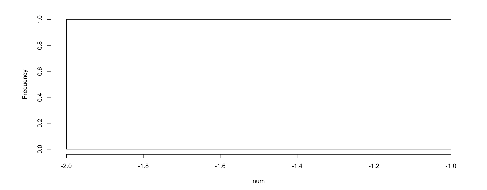
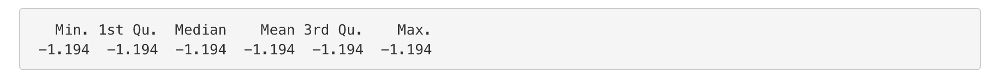


### Prevent reactions with `isolate()`

Sometimes we might want to delay a reactive function. For example, the following shiny app plots a scatterplot between 2 variables of the user's choose and also allows the user to give the plot a customized title. So there are 3 inputs: the title of the scatterplot, an x variable and a y variable. With our regular code, the title will change instantaneously as the user types.
  

```r
# Before
ui <- fluidPage(
  textInput(inputId = "title", label = "Enter a title", value = "displacement vs mpg"),
  selectInput('xcol', 'X Variable', colnames(cars_info)[c(2, 4, 5, 6, 7)]),
  selectInput('ycol', 'Y Variable', colnames(cars_info)[c(2, 4, 5, 6, 7)], selected=colnames(cars_info)[[4]]),
  plotOutput('scatterplot')
)

server <- function(input, output) {
  output$scatterplot <- renderPlot({
    plot(cars_info[, c(input$xcol, input$ycol)], main = input$title)
  })
}

shinyApp(ui = ui, server = server)
```

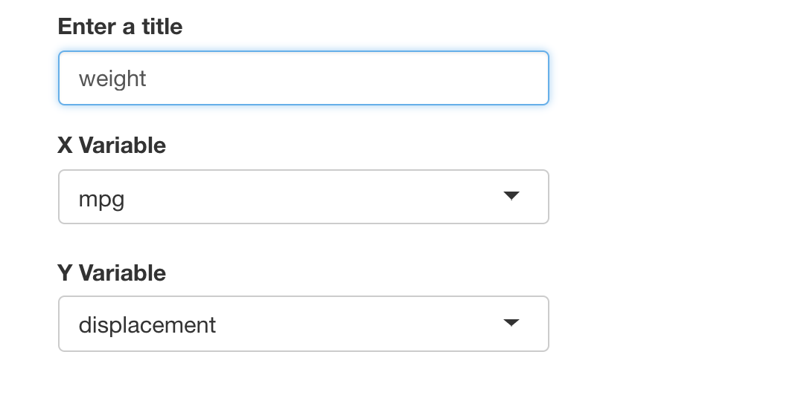
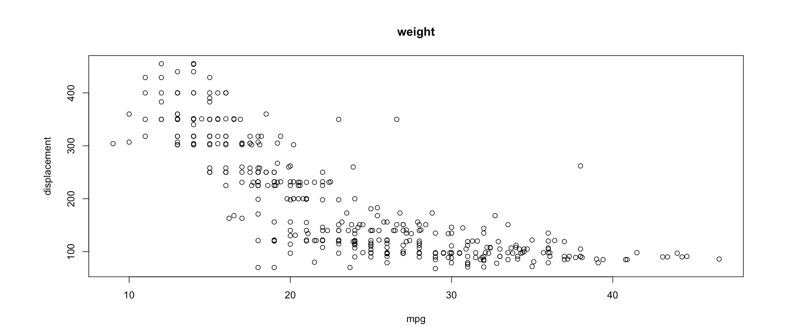

Say we do not want the title to change until the user has chosen two variables. In this case, we can use `isolate()` to isolate the input title. It returns the result as a non-reactive value. That means the observed object will only react to its changes when other inputs also change.


```r
server <- function(input, output) {
  output$scatterplot <- renderPlot({
    plot(cars_info[, c(input$xcol, input$ycol)], 
         # This line isolates the input title
         main = isolate({input$title}))
  })
}
```

### Trigger code with `observeEvent()`

we can create an action button or link whose value is initially zero, and increments by one each time it is pressed.

When we have an input like action button, we can trigger a response when the user clicks on the button by using `observeEvent()` function. Examples of an action button include `download` which allows the user to download a file. 


```r
actionButton(inputId = "download", label = "Download")
```
  
The `observeEvent()` function takes two arguments: the first argument is the reactive value(s) it responds to. In our example, it will be the action button. The second armgument is a code block which runs behind the scene whenever the input changes. 
  

```r
observeEvent(input$download, {print(input$download)})
```

Here is how we can use it in our app. Every time we click the Go! button, the observer will update, which is running the block of code `print(as.numeric(input$goButton)`. The result won't appear in the user panel, but to appear back of our app.


```r
ui <- fluidPage(
  actionButton(inputId = "download", label = "Download")
)

server <- function(input, output) {
  observeEvent(input$downloadn, {
    print(as.numeric(input$download))
  })
}

shinyApp(ui = ui, server = server) 
```
   
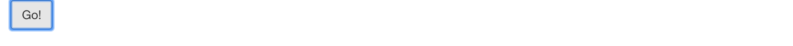
    
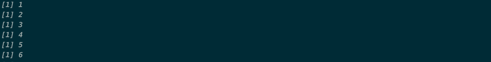

Along with `observeEvent()` which triggers code, there's another function called `observe()`, which does the same thing and it's a parallel of `observeEvent()`. But its syntax is more like `render*()` functions. We just give a block of code to it and it will respond to every reactive value in the code.
  

```r
observe({print(input$download)})
```

### Delay reactions with `eventReactive()`

Sometimes we don't want the outputs to change as soon as the user changes some input in the user interface. Instead, we would like to change them when the user clicks an 'update' button. In others words, we hope to prevent the output from updating until the user hits the button.

The way to do this in Shiny is with the function `eventReactive()`. It creates a reactive expression that only responds to specific values, similar to `reactive()` but having different syntax. First we give a reactive value to it. The second argument is the code the function uses to build or rebuild the object when it's clicked. In addition, similar to `observeEvent()`, the expression treats this block of code as if it has been isolated with `isolate()`. 
  

```r
data <- eventReactive(input$update, {rnorm(input$num)})
```

Let's look at the entire code.


```r
ui <- fluidPage(
  selectInput(inputId = "varname", 
              label = "Choose a variable", 
              choices = colnames(cars_info)[c(2, 6, 7)]),
  actionButton(inputId = "update", label = "Update"),
  plotOutput(outputId = "hist")
)

server <- function(input, output) {
  data <- eventReactive(input$update, {input$varname})
  output$hist <- renderPlot({
    hist(cars_info[[data()]], main = "", xlab = data())
  })
}

shinyApp(ui = ui, server = server)
```
 
If we choose different variable without clicking `Update` button, the histogram would not be updated.

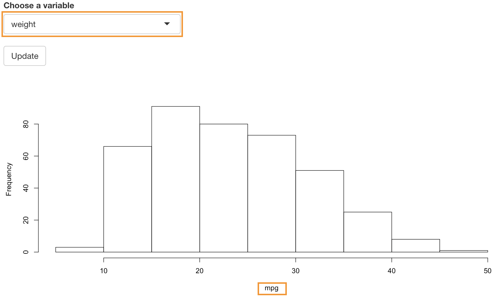

### Manage state with `reactiveValues()`

We know that the reactive value changes whenever a user changes the input in the user panel. But we cannot set these values in our code. Fortunately, although Shiny doesn't give us the power to overwrite the input values in our app, it gives us the power to create our own list of reactive values, which you can overwrite.
  
`reactiveValues()` is a function that creates a list of reactive values to manipulate programmatically. Note that it has nothing to do with input reactive values.
  

```r
rv <- reactiveValues(data = rnorm(100))
```

Let's look at an example. If we click `mpg vs displacement`, the Shiny app would select column `mpg` and `displacement` from the cars_info dataset and plot a scatter plot for them. If we click `mpg vs weight`, it would select column `mpg` and `weight` from the cars_info dataset and plot a scatter plot for them.


```r
ui <- fluidPage(
  actionButton(inputId = "scatter1", label = "mpg vs displacement"),
  actionButton(inputId = "scatter2", label = "mpg vs weight"),
  plotOutput("scatter")
)

server <- function(input, output) {
  rv1 <- reactiveValues(data = cars_info[,2], label = "mpg")
  rv2 <- reactiveValues(data = cars_info[,4], label = "displacement")
  observeEvent(input$scatter1, {
    rv1$data <- cars_info[,2] 
    rv1$label <- "mpg"
    rv2$data <- cars_info[,4]
    rv2$label <- "displacement"
    })
  observeEvent(input$scatter2, {
    rv1$data <- cars_info[,2]
    rv1$label <- "mpg"
    rv2$data <- cars_info[,6]
    rv2$label <- "weight"
    })
  output$scatter <- renderPlot({
    plot(rv1$data, rv2$data, xlab = rv1$label, ylab = rv2$label)})
}

shinyApp(ui = ui, server = server)
```

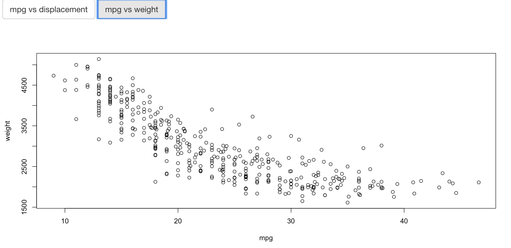

## 3. Summary 
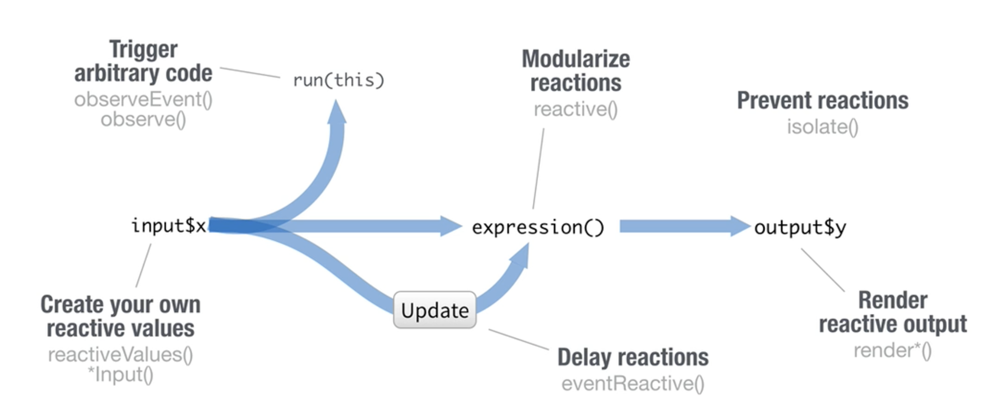

Till now, We have learnt both syntax and usage of the basic reactive functions in Shiny. Now there are still some important tips we need to provide.

We should reduce repetition when we create shiny apps. That is to place code where it will be re-run as little as necessary. Keep in mind that,

* Code outside the server function will be run once per R session (worker). So you only need it to run once when setting up the R session, outside the server function. For example, codes that load the help file or some library should be placed outside the server function.

* Code inside the server function will be run once per end user session (connection).

* Code inside the reactive function will be run once per reaction, which means many times.


If you are interested in Shiny and would like to learn more about it, you can go to the official website or download the documentation of Shiny. The relevant resources are listed below. 

(1) Official website: https://shiny.rstudio.com/
(2) Documantation of pacakge "Shiny": https://cran.r-project.org/web/packages/shiny/shiny.pdf
(3) Share your Shiny apps: https://www.shinyapps.io/
(4) Shiny cheat sheet: https://shiny.rstudio.com/images/shiny-cheatsheet.pdf

The main source of this tutorial is the video on the Shiny official website. We adapted it with some new examples based on the cars dataset. Hope this can help you and any suggestion is welcome.
