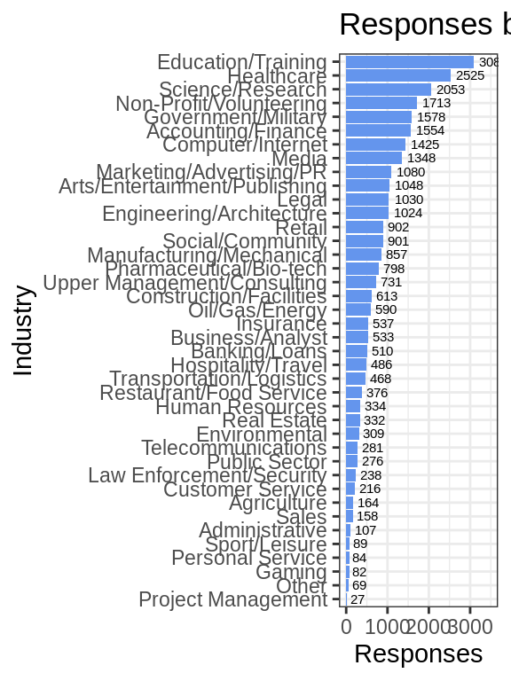
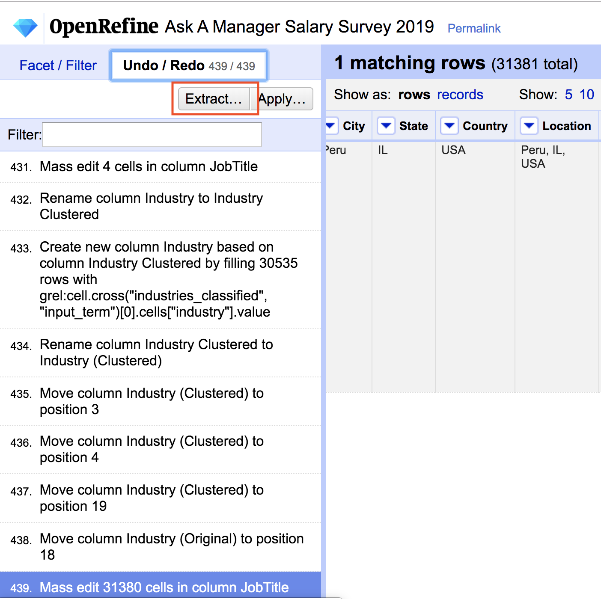

# "Ask A Manager" salary survey dataset

Kliment Mamykin

A survey posted in a popular blog "Ask A Manager"<https://www.askamanager.org> asked the readers to anonymously fill out how much money they were making. After the [blog post](https://www.askamanager.org/2019/04/how-much-money-do-you-make-3.html) was published, it went viral, and 31407 people took time and responded to the survey. A [Google sheet](https://docs.google.com/spreadsheets/d/1rGCKXIKt-7l5gX06NAwO3pjqEHh-oPXtB8ihkp0vGWo) was used to aggregate the responses. The data is interesting, since the self-reported compensation data is hard to come by, and useful for anyone on the job market. However the analysis of this dataset is made difficult by the lack of normalization in the responses. The survey uses freeform entered responses, with little standartization on the values allowed (probably to minimize the time/friciton of filling out the form). 

*The goal for this project is to clean up the data and make it available for community for further analysis.* Most of the work was done using [OpenRefine](http://openrefine.org/), with the Industries list normalized with a machine learning model.

The repository is https://github.com/kmamykin/askamanager_salary_survey

## Obtaining the dataset

Version 1 of the cleaned up dataset is located at (https://github.com/kmamykin/askamanager_salary_survey/raw/master/data/v1/Ask-A-Manager-Salary-Survey-2019.csv)


```r
salary_survey <- readr::read_csv("https://github.com/kmamykin/askamanager_salary_survey/raw/master/data/v1/Ask-A-Manager-Salary-Survey-2019.csv")
```


```r
salary_survey %>%
  drop_na(Industry) %>%
  group_by(Industry) %>%
  summarise(Freq = n()) %>%
  ggplot(aes(x=fct_reorder(Industry, Freq), y=Freq)) +
  geom_bar(stat = "identity", fill = "cornflowerblue") +
  geom_text(aes(label = Freq), position = position_dodge(width = 1), hjust = -0.2, size = 2) +
  coord_flip() +
  ylim(0, 3500) +
  xlab("Industry") +
  ylab("Responses") +
  ggtitle("Responses by Industry") +
  theme_bw()
```



## Description of fields

* `Timestamp` - timestamp of the submittd response
* `Age` - age bracket: "18-24", "25-34", "35-44", ... One of the few fields that was a choice and did not need a cleanup
* `Industry` - This is the field that took the most time to normalize. While there are many different industry classification taxonomies, the industry list in https://www.webspidermount.com/features/generic-job-taxonomy/ looked short, simple and targeted for a job search domain. The values were normalized based on `Industry (Original)` using KNN classifier (see below for details).
* `JobTitle` - user entered field, clustered to remove small variations (e.g. "sr.engineer" vs "Sr Engineer"). There is still too much variation and this field need more normalization work.
* `City`, `State`, `Country` - these fields were normalized from `Location (Original)` field by calling Google Locations API and further manually tweaking the data inside OpenRefine.
* `Location` - normalized location in format "Nashville, TN, USA". Only USA, Australia, Canada locations contain states in this dataset, for the other countries the field contains <City>, <Country>, e.g. "Manchester, UK"
* `Experience` - experience in the responder, e.g. "8 - 10 years", "11 - 20 years" etc. Also did not need normalization.
* `Currency` - currency of the Base pay, normalized from a freeform entry.
* `Base` - base salary (in specified `Currency`). This is the main metric. A lot of parsing and regex transforms went to this field to extract the numbers from freeform `AnnualSalary (Original)`. Extra perks got separated into `Extras` field. For the records where it was detected that the compensation was at an hourly rate, the rate was extracted to `HourlyRate` and the `Base` was calculated with `HourlyRate` * 1650 hours/year (this is a big assumption here). You can filter those records out where `HourlyRate` is not NA.
* `HourlyRate` - extracted hourly rate from `AnnualSalary (Original)`. Only some records contain values (hourly rate workers), otherwise the value is empty.
* `Extras` - extracted extra perks/comments from `AnnualSalary (Original)`
* `Notes` - user provided notes
* `AnnualSalary (Original)` - original field
* `Location (Original)` - original field
* `JobTitle (Original)` - original field
* `Industry (Original)` - original field
* `Industry (Clustered)` - `Industry (Original)` clustered with OpenRefine to remove small variations of spelling/capitalization


```r
str(salary_survey)
```

```
## Classes 'spec_tbl_df', 'tbl_df', 'tbl' and 'data.frame':	31381 obs. of  22 variables:
##  $ JobTitle               : chr  "Talent Management Asst. Director" "Operations Director" "Market Research Assistant" "Senior Scientist" ...
##  $ Job Seniority          : chr  "Director" "Director" NA NA ...
##  $ Job Area               : chr  "Talent Management Asst." "Operations" NA NA ...
##  $ Timestamp              : chr  "4/24/2019 11:43:21" "4/24/2019 11:43:26" "4/24/2019 11:43:27" "4/24/2019 11:43:27" ...
##  $ Age                    : chr  "35-44" "25-34" "18-24" "25-34" ...
##  $ Industry               : chr  "Government/Military" "Environmental" "Science/Research" "Pharmaceutical/Bio-tech" ...
##  $ Currency               : chr  "USD" "USD" "USD" "GBP" ...
##  $ City                   : chr  "Nashville" "Madison" "Las Vegas" "Cardiff" ...
##  $ State                  : chr  "TN" "WI" "NV" NA ...
##  $ Country                : chr  "USA" "USA" "USA" "UK" ...
##  $ Location               : chr  "Nashville, TN, USA" "Madison, WI, USA" "Las Vegas, NV, USA" "Cardiff, UK" ...
##  $ Experience             : chr  "11 - 20 years" "8 - 10 years" "2 - 4 years" "5 - 7 years" ...
##  $ Base                   : num  75000 65000 36330 34600 55000 ...
##  $ HourlyRate             : num  NA NA NA NA NA NA NA NA NA NA ...
##  $ Extras                 : chr  NA NA NA NA ...
##  $ Notes                  : chr  NA NA NA NA ...
##  $ JobTitle (Original)    : chr  "Talent Management Asst. Director" "Operations Director" "Market Research Assistant" "Senior Scientist" ...
##  $ AnnualSalary (Original): chr  "75000" "65,000" "36,330" "34600" ...
##  $ AnnualSalary           : chr  "75000" "65000" "36330" "34600" ...
##  $ Location (Original)    : chr  "Nashville, TN" "Madison, Wi" "Las Vegas, NV" "Cardiff, UK" ...
##  $ Industry (Original)    : chr  "Government" "Environmental nonprofit" "Market Research" "Biotechnology" ...
##  $ Industry (Clustered)   : chr  "Government" "Environmental non-profit" "Market Research" "Biotechnology" ...
##  - attr(*, "spec")=
##   .. cols(
##   ..   JobTitle = col_character(),
##   ..   `Job Seniority` = col_character(),
##   ..   `Job Area` = col_character(),
##   ..   Timestamp = col_character(),
##   ..   Age = col_character(),
##   ..   Industry = col_character(),
##   ..   Currency = col_character(),
##   ..   City = col_character(),
##   ..   State = col_character(),
##   ..   Country = col_character(),
##   ..   Location = col_character(),
##   ..   Experience = col_character(),
##   ..   Base = col_double(),
##   ..   HourlyRate = col_double(),
##   ..   Extras = col_character(),
##   ..   Notes = col_character(),
##   ..   `JobTitle (Original)` = col_character(),
##   ..   `AnnualSalary (Original)` = col_character(),
##   ..   AnnualSalary = col_character(),
##   ..   `Location (Original)` = col_character(),
##   ..   `Industry (Original)` = col_character(),
##   ..   `Industry (Clustered)` = col_character()
##   .. )
```
## Data cleanup process

[OpenRefine](http://openrefine.org/) was used for most of the heavy lifting of data transformations.

> OpenRefine (previously Google Refine) is a powerful tool for working with messy data: cleaning it; transforming it from one format into another; and extending it with web services and external data.


### Industry classification

The initial attempt to manually cleanup the original `Industry (Original)` field proved to be taking to long, and in the middle I decided to change the taxonomy. To automate this process a simple machine learning model was used to classify the *input* user entered industry into a *target* normalized set of industry taxonomy values. 

For both sets (the target industries and the input industries) I scraped Google search result and the resulting organic web sites, creating a rich text document describing each input or target industry. Using bag of words document representation and KNN classifier (k=1), each input industry was classified into a target industry based on their document vector similarity (using eucledian metric)

See [Processing.ipynb](https://github.com/kmamykin/askamanager_salary_survey/Processing.ipynb) and [Classification.ipynb](https://github.com/kmamykin/askamanager_salary_survey/Classification.ipynb) for further details.

### Job Title classification

TODO - transform the freeform entered job titles into `Job Seniority` field and `Job Area` field, e.g. "Senior Data Scientist" would be transformed to "Senior" seniority and "Data Science" job area.

### Contributing

Contributions are welcome! If you notice an error in the dataset, or would like to add further cleanup - please follow this process:

1. Download the dataset and create a project in OpenRefine.
2. Perform desired data operations.
3. Switch to "Undo/Redo" tab and "Extract..." transformation file in JSON.
4. Submit your changes in a Pull Request with transformation file attached.


