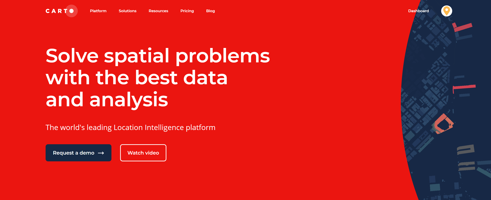

## CartoDB

Luis Lu and Timothy Huang  

This tutorial gives a brief overview on getting started with CartoDB, a powerful cloud computing tool that provides geospatial analysis and mapping tools. In this tutorial, we will go over the steps of getting set up on CartoDB, uploading your first dataset, creating your first map visualization, and exploring a few of Carto's provided geospatial data analysis tools.  

Link to tutorial video: [https://www.youtube.com/watch?v=GxRRXWTMMe8&feature=youtu.be](https://www.youtube.com/watch?v=GxRRXWTMMe8&feature=youtu.be)

