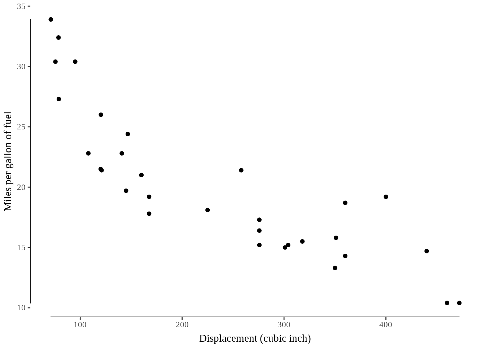
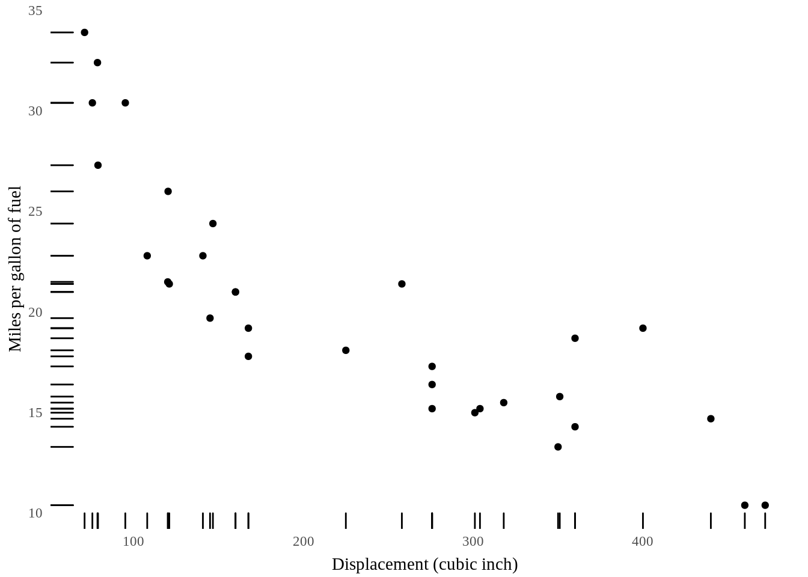
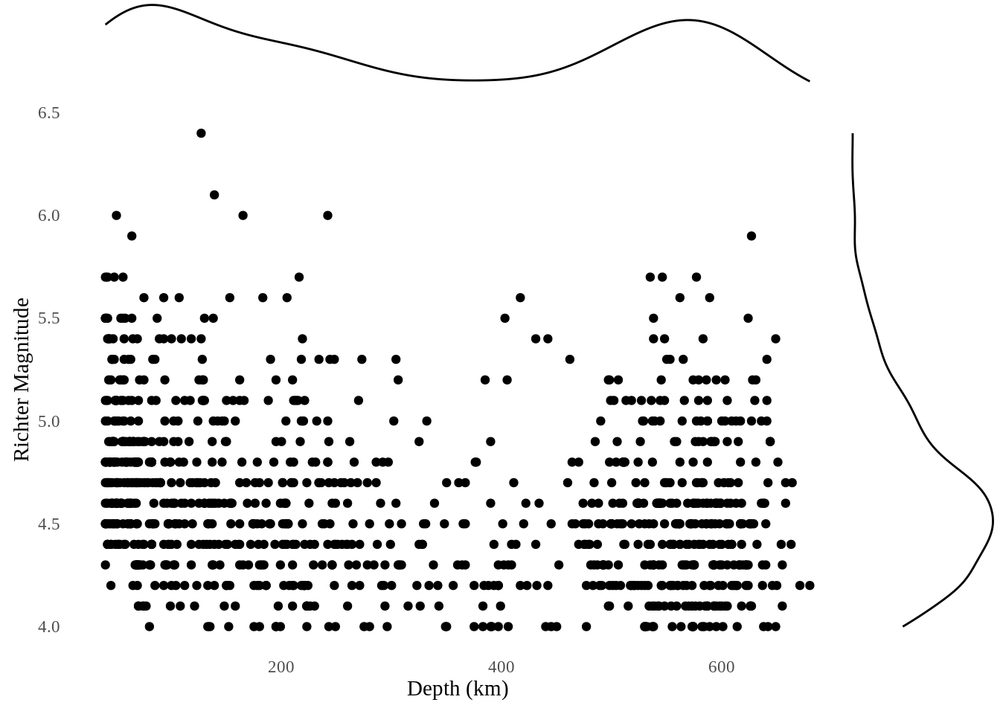
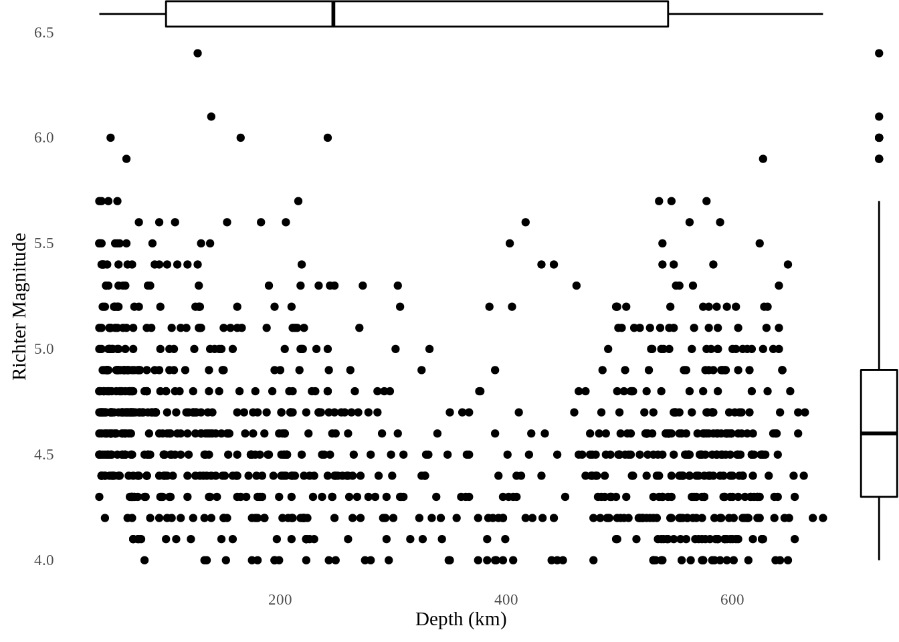
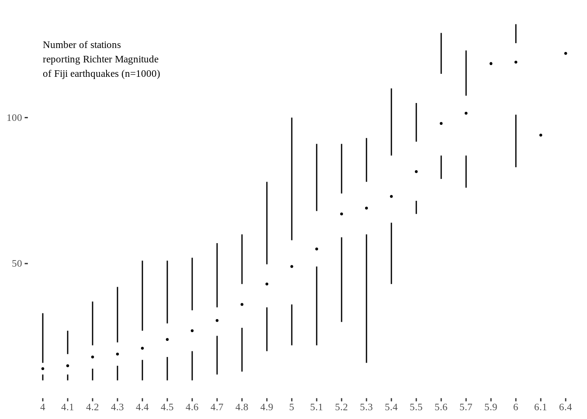
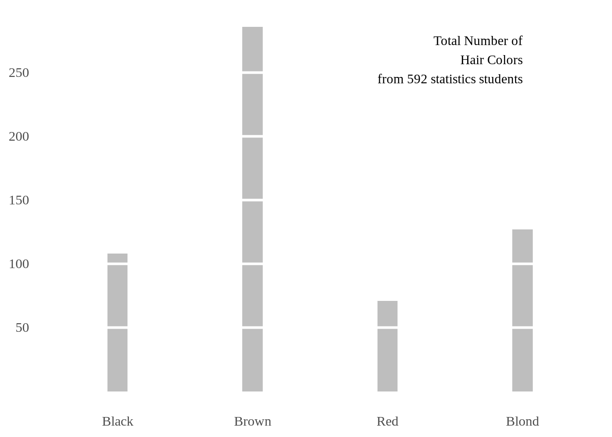
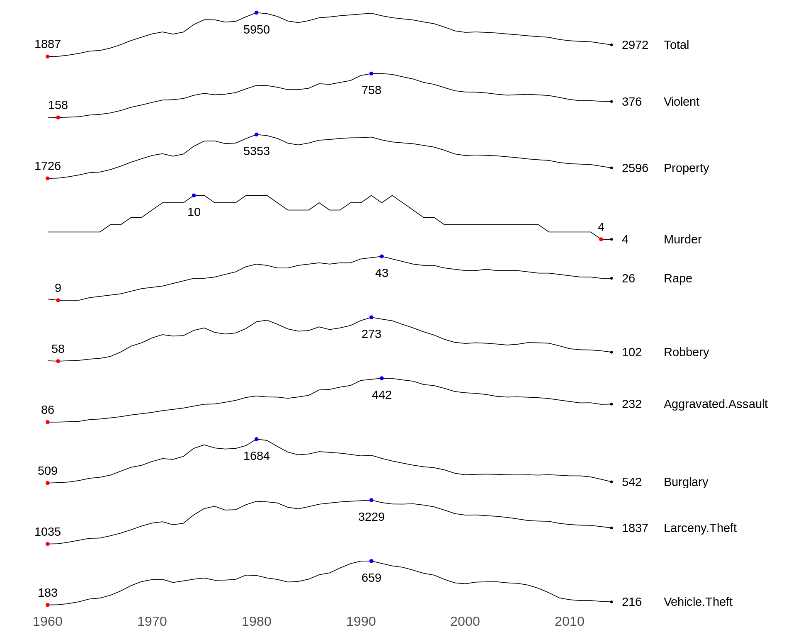

# Tufte's Principles of Data-Ink

Huazhang Liu and Jianfeng Zhuang


## Overview

As we are building a new data visualization, we often add more elements to the graph that may only provide small details but takes more attention away from the main takeaways. To solve this issue, Edward Tufte, an expert whose work has contributed significantly to data visualization, introduces the concept of data-ink. 

This section covers the concepts and examples of data-ink introduced by Edward Tufte in *The Visual Display of Quantitative Information*.

The term, 'data-ink', is defined as the total ink on a graph that represents data. Tufte claims that good graphical representations maximize data-ink and erase as much non-data-ink as possible. Thus, he defines the data-ink ratio is the proportion of a graphic's ink devoted to the non-redundant display of data-information. It should equal to (1 - the proportion of graphics that can be erased without loss of data-information). 

Tufte gives the following five principles:

1. Above all else show data.
2. Maximize the data-ink ratio.
3. Erase non-data-ink.
4. Erase redundant data-ink.
5. Revise and edit of data-ink:

The following sections introduce examples based on Tufte's techniques about data-ink. 

We use `ggplot2`, `ggtheme` and `ggExtra` packages to draw the examples with data-ink requirements. 

## Minimal Line Plot

The purpose of the minimal line plot is to keep the data-ink ratio equal to (1 - the proportion of graphic that can be erased without loss of data-information). There is not extra lines or points in the plot, such as axis. It is easier to see in time series. 


```r
yr <- 2010:2019
gdp <- c(50749.31, 51193.47, 51565.08, 52545.25, 53654.59, 54280.36, 55004.99, 56192.49, 57252.36, 57821.28)
df <- data.frame(yr, gdp)
ggplot(df, aes(yr,gdp)) + 
  geom_line() + 
  geom_point(size=1.5) + 
  theme_tufte(base_size = 15) +
  theme(axis.title=element_blank()) + 
  scale_y_continuous(breaks=seq(50000,58000,1000),label=sprintf("$%s",seq(50000,58000,1000))) + 
  scale_x_continuous(breaks=yr,label=yr) +
  annotate("text", x = 2019, y = 51500, adj=1,  family="serif",
           label = "US GDP per capita\nin constant dollars")
```


## Range-frame (or quartile-frame) scatterplot

Compared with the traditional axis we used, the range-frame is defined as the axis that is only on the range of the data points. A range-frame scatterplot only provides the most appropriate axis lines. 

We use the `mtcars` (Motor Trend Car Road Tests) dataset to give the following examples, and use `geom_rangeframe()` in `ggthemes` to satisfy this requirement.


```r
ggplot(mtcars, aes(disp, mpg)) + 
  geom_point() + 
  geom_rangeframe() + 
  theme_tufte() +
  xlab("Displacement (cubic inch)") + 
  ylab("Miles per gallon of fuel") + 
  theme(axis.title.x = element_text(vjust=-0.5), axis.title.y = element_text(vjust=1.5))
```



## Dot-dash (or rug) scatterplot

Dot-dash scatterplot is the scatterplot with the tick marks next to the axis that represent the marginal distribution of the data. Compared with the previous two scatterplots, the dot-dash scatterplot is easier to see the distribution on one axis. 

We use `geom_rug()` from `ggplot2` to exhibit the marginal distribution.


```r
ggplot(mtcars, aes(disp, mpg)) + 
  geom_point() + 
  geom_rug() + 
  theme_tufte(ticks=F) +
  xlab("Displacement (cubic inch)")+ 
  ylab("Miles per gallon of fuel") + 
  theme(axis.title.x = element_text(vjust=-0.5), axis.title.y = element_text(vjust=1))
```



## Marginal histogram scatterplot

Similar with dot-dash scatterplot, marginal histogram scatterplot use histogram to mark the marginal distribution of the data. This is useful when there is a huge amount of data points. 

We use `quakes` dataset, and use `ggMarginal()` from `ggExtra` to exhibit the marginal distribution.


```r
p <- ggplot(quakes, aes(depth, mag)) + 
  geom_point() + 
  theme_tufte(ticks=F) +
  xlab("Depth (km)") + 
  ylab("Richter Magnitude")
ggMarginal(p, type = "histogram", fill="transparent")
```


`ggMarginal()` also provides marginal density scatterplot and marginal boxplot scatterplot that use density lines or boxplots to mark the marginal distribution of the data. 


```r
ggMarginal(p, type = "density", fill="transparent")
```




```r
ggMarginal(p, type = "boxplot", size = 20, fill="transparent")
```



## Minimal boxplot

Although it is hard for boxplots to include zero non-data inks, minimal boxplot uses as little non-data ink as possible. In this case, minimal boxplot gets rid of the "box" but uses one dot and blank space to represent the median and interquartile range. 

In `ggtheme`, `geom_tufteboxplot()` is used to represent minimal boxplot. 


```r
ggplot(quakes, aes(factor(mag), stations)) + 
  theme_tufte() +
  geom_tufteboxplot(outlier.colour="transparent") + 
  theme(axis.title=element_blank()) +
  annotate("text", x = 1, y = 120, adj=0,  family="serif", size = 3, 
           label = c("Number of stations \nreporting Richter Magnitude\nof Fiji earthquakes (n=1000)"))
```



## Minimal barchart

In order to erase the theme as much as possible without compromising the data, minimal barchart does not include grid or axes lines. Instead, We add ablines to draw Tufte-like grid lines. Also, we need to adjust the width and space of the bars. 

We use `HairEyeColor` dataset. 


```r
colors <- as.data.frame(HairEyeColor)
eye_colors <- colors %>%
  group_by(Hair) %>%
  summarise(Total = sum(Freq))

ggplot(eye_colors, aes(x=Hair, y=Total)) + 
  theme_tufte(base_size=14, ticks=F) +
  geom_bar(width=0.15, fill="gray", stat = "identity") +  
  theme(axis.title=element_blank()) +
  scale_y_continuous(breaks=seq(50, 250, 50)) + 
  geom_hline(yintercept=seq(50, 250, 50), col="white", lwd=1) +
  annotate("text", x = 4, y = 260, adj=1,  family="serif",
           label = c("Total Number of\nHair Colors\nfrom 592 statistics students"))
```



## Sparklines

Edward Tufte states in *Beautiful Evidence* that,

"A sparkline is a small, intense, simple, word-sized graphic with typographic resolution. Sparklines mean that graphics are no longer cartoonish special occasions with captions and boxes, but rather sparkline graphics can be everywhere a word or number can be: embedded in a sentence, table, headline, map, spreadsheet, graphic."

The difference between the typical line charts and Tufte-style sparklines is that sparklines are small and single. They are small enough that they can be able to embedded in the text. Usually, several sparklines may be grouped together. So it is essential to do the scaling. Otherwise, it is hard to group them. 

In this section, we use the example dataset provides in the journal *Tufte in R*. The graph shows the maximum, minimum, and last value of each sparkline. 


```r
# extract and clean the data
dd <- read.csv(text = getURL("https://gist.githubusercontent.com/GeekOnAcid/da022affd36310c96cd4/raw/9c2ac2b033979fcf14a8d9b2e3e390a4bcc6f0e3/us_nr_of_crimes_1960_2014.csv"))
d <- melt(dd, id="Year")
names(d) <- c("Year","Crime.Type","Crime.Rate")
d$Crime.Rate <- round(d$Crime.Rate,0)

# calculate the min, max and end points
mins <- group_by(d, Crime.Type) %>% slice(which.min(Crime.Rate))
maxs <- group_by(d, Crime.Type) %>% slice(which.max(Crime.Rate))
ends <- group_by(d, Crime.Type) %>% filter(Year == max(Year))

#draw the graph with max, min, end points 
ggplot(d, aes(x=Year, y=Crime.Rate)) + 
  facet_grid(Crime.Type ~ ., scales = "free_y") + 
  geom_line(size=0.3) +
  geom_point(data = mins, size=1, col = 'red') +
  geom_point(data = maxs, size=1, col = 'blue') +
  geom_point(data = ends, size=0.5, col = 'black') +
  geom_text(data = mins, aes(label = Crime.Rate), vjust = -1) +
  geom_text(data = maxs, aes(label = Crime.Rate), vjust = 2.5) +
  geom_text(data = ends, aes(label = Crime.Rate), hjust = 0, nudge_x = 1) +
  geom_text(data = ends, aes(label = Crime.Type), hjust = 0, nudge_x = 5) +
  expand_limits(x = max(d$Year) + (0.25 * (max(d$Year) - min(d$Year)))) +
  scale_x_continuous(breaks = seq(1960, 2010, 10)) +
  scale_y_continuous(expand = c(0.1, 0)) +
  theme_tufte(base_size = 15, base_family = "Helvetica") +
  theme(axis.title=element_blank(), axis.text.y = element_blank(), 
        axis.ticks = element_blank(), strip.text = element_blank())
```



## References and external resources

* [Tufte in R](http://motioninsocial.com/tufte/){target="_blank"}: introduces several graphs following Tufte's techniques by using basic R plot, ggplot2, interactive plots with highcharter, etc. This journal is written by Lukasz Piwek.
* [Above All Else Show the Data](https://medium.com/plotly/above-all-else-show-the-data-1b8bbf05c2ae){target="_blank"}: based on Lukasz Piwek's journal, *Tufte in R*, this introduces some other interactive plots by using plotly.
* [Data-ink Ratio](https://infovis-wiki.net/wiki/Data-Ink_Ratio){target="_blank"}: introduces the concept of data-ink and data-ink ratio
* [Tufte’s Principles](https://thedoublethink.com/tuftes-principles-for-visualizing-quantitative-information/){target="_blank"}: introduce Tufte's principles, including data-ink.
