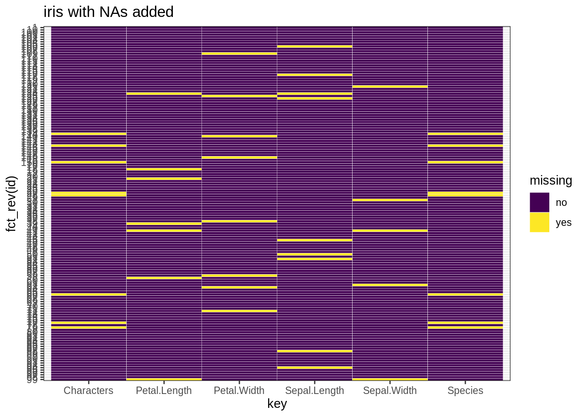
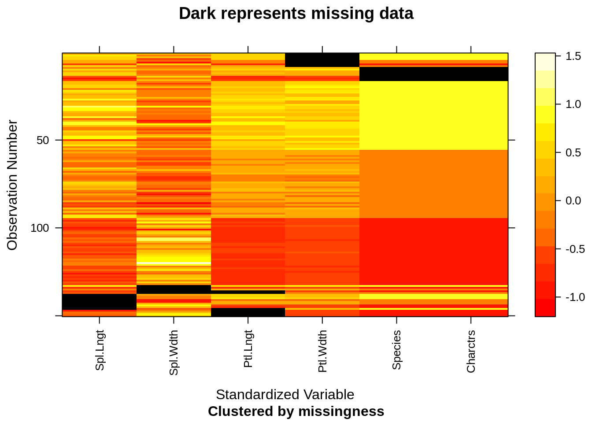
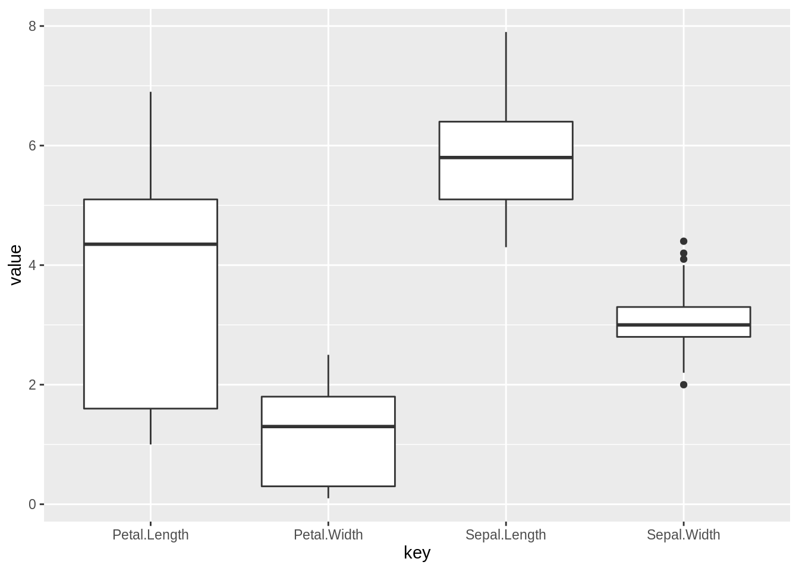
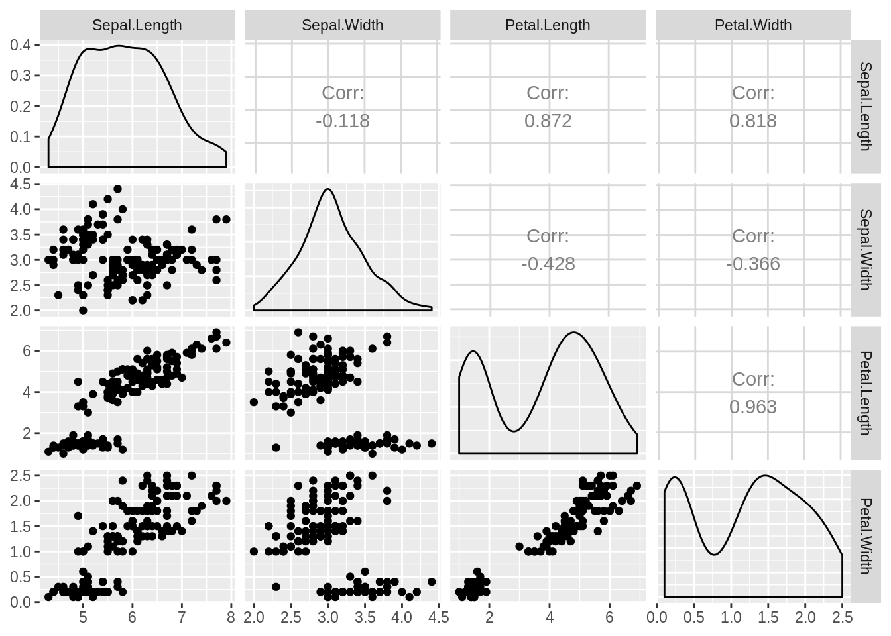

# (PART) Case studies {-}

# The first step to analyse a dataset

Weitao Chen and Jianing Li


## Introduction

Oftentimes we get a large dataset to conduct data analysis or to prepare the data to be further used in our model. A common question data analysts hear is “where do I even start in my analysis?”. We will introduce serveral functions to help you take a glance at your giant dataset so you can have a fundemental undetstanding of your data.


## A glimpse at the dataset

### How does the data look like?

When you come across a new dataset, you may ask: How does the dataset look like?

"To see is to know. Not to see is to guess." To answer this question, you just need to view its content.

`View` works not only in RStudio, but also in R terminal on Windows. However, its output can't be knitted into html or pdf.

Though, when the dataset is huge, you would not really like to open and view the entire dataset. Then what? Just take a sample of it.

The first function that comes to your mind? `head`!


```
##   Sepal.Length Sepal.Width Petal.Length Petal.Width Species
## 1          5.1         3.5          1.4         0.2  setosa
## 2          4.9         3.0          1.4         0.2  setosa
## 3          4.7          NA          1.3         0.2  setosa
## 4          4.6         3.1          1.5         0.2  setosa
## 5          5.0         3.6          1.4         0.2  setosa
## 6          5.4         3.9           NA         0.4  setosa
```

`head` returns the first 5 rows of a data frame by default. You can also specify how many rows you want.


```r
head(iris,3)
```

```
##   Sepal.Length Sepal.Width Petal.Length Petal.Width Species
## 1          5.1         3.5          1.4         0.2  setosa
## 2          4.9         3.0          1.4         0.2  setosa
## 3          4.7          NA          1.3         0.2  setosa
```

`tail` is similar to it, but it retrives the rows from the bottom.


```r
tail(iris,2)
```

```
##     Sepal.Length Sepal.Width Petal.Length Petal.Width   Species
## 149          6.2         3.4          5.4          NA virginica
## 150          5.9         3.0          5.1         1.8      <NA>
```

As you can see, we get only the flowers of species "setosa" with `head` and of "virginica" with `tail`. That's because the original dataset is ordered by the "Species", and its head and tail are homogeneous.

What if we want to get a heterogeneous view? You may use `sample_n` instead. It selects random rosw from a table for you.


```r
library(dplyr)
sample_n(iris, 5)
```

```
##   Sepal.Length Sepal.Width Petal.Length Petal.Width    Species
## 1          6.3         2.5          5.0         1.9  virginica
## 2          6.3         3.3          4.7         1.6 versicolor
## 3          6.1         3.0          4.9         1.8  virginica
## 4          5.2         3.4          1.4         0.2     setosa
## 5          5.3         3.7          1.5         0.2     setosa
```

When you want to take a glimpse at a huge dataset, it's fairly better choice to use `sample_n`. However, unlike `head`, `tail` or `View`, it doesn't work on vector or types other than data frame. Also, you have to library `dplyr` to use `sample_n`, while other 3 functions come in `baser`.

### Retrive the metadata

For a data frame, one of the first property we want to learn about it would be its size.


```r
dim(iris)
```

```
## [1] 150   5
```

The first value in the result is the number of observations and the second is of variables.

Sometimes we don't really want to know the details of a dataset. We simply need a summary.


```r
summary(iris)
```

```
##   Sepal.Length    Sepal.Width     Petal.Length    Petal.Width   
##  Min.   :4.300   Min.   :2.000   Min.   :1.000   Min.   :0.100  
##  1st Qu.:5.100   1st Qu.:2.800   1st Qu.:1.600   1st Qu.:0.300  
##  Median :5.800   Median :3.000   Median :4.400   Median :1.300  
##  Mean   :5.823   Mean   :3.057   Mean   :3.835   Mean   :1.182  
##  3rd Qu.:6.400   3rd Qu.:3.300   3rd Qu.:5.100   3rd Qu.:1.800  
##  Max.   :7.900   Max.   :4.400   Max.   :6.900   Max.   :2.500  
##  NA's   :9       NA's   :5       NA's   :7       NA's   :8      
##        Species  
##  setosa    :47  
##  versicolor:47  
##  virginica :48  
##  NA's      : 8  
##                 
##                 
## 
```

When used on a data frame, `summary` gives you the metadata of the dataset. That is, the summaries for each vairable in it. For numerical column, you will see the percentiles and mean. For categorical ones, you can get the frequency of each factors.

A simpler alternative is `str`. Note that `str` here is not an abbreviation for "string", but for "structure". `str` "compactly displays the structure of an arbitrary R object", according to the document. As for data frame, it displays the data type and first few values of each columns.


```r
str(iris)
```

```
## 'data.frame':	150 obs. of  5 variables:
##  $ Sepal.Length: num  5.1 4.9 4.7 4.6 5 5.4 4.6 5 4.4 4.9 ...
##  $ Sepal.Width : num  3.5 3 NA 3.1 3.6 3.9 3.4 3.4 2.9 3.1 ...
##  $ Petal.Length: num  1.4 1.4 1.3 1.5 1.4 NA 1.4 1.5 1.4 1.5 ...
##  $ Petal.Width : num  0.2 0.2 0.2 0.2 0.2 0.4 0.3 0.2 0.2 0.1 ...
##  $ Species     : Factor w/ 3 levels "setosa","versicolor",..: 1 1 1 1 1 1 1 1 1 1 ...
```

## Dive into one column

### Summarise a numerical variable

If you would like to examine some columns more thoroughly, you can use `summarise` to customize your summary. It takes the data frame as the first parameter. Name-value pairs of summary functions are followed, indicating the output titles and content.

Available summary functions are as followed:

- Center: mean(), median()

- Spread: sd(), IQR(), mad()

- Range: min(), max(), quantile()

- Position: first(), last(), nth(),

- Count: n(), n_distinct()

- Logical: any(), all()


```r
library(dplyr)
iris %>% 
    summarize(mean.1 = mean(Petal.Length, na.rm=TRUE), sd.1 = sd(Petal.Length, na.rm=TRUE),
              mean.2 = mean(Sepal.Length, na.rm=TRUE), sd.2 = sd(Sepal.Length, na.rm=TRUE))
```

```
##     mean.1     sd.1   mean.2      sd.2
## 1 3.834965 1.751227 5.823404 0.8196374
```

### Understand a categorical variable

You may learn about the frequency about a categorical column in a data frame using `summary`.


```r
summary(iris$Species)
```

```
##     setosa versicolor  virginica       NA's 
##         47         47         48          8
```

Though, it doesn't work when the column is presented not as a factor, but as characters.


```r
iris$Characters <- as.character(iris$Species)
summary(iris$Characters)
```

```
##    Length     Class      Mode 
##       150 character character
```

Under such circumstances, we may use `unique` and `table` instead. `unique` tells you about all the unique values in a vector, and `table` shows their frequency.


```r
unique(iris$Characters)
```

```
## [1] "setosa"     NA           "versicolor" "virginica"
```


```r
table(iris$Characters)
```

```
## 
##     setosa versicolor  virginica 
##         47         47         48
```

## Advanced patterns about a data set

### Locate the missing values


Sometime there are missing values or NA in our dataset. It can be caused by a number of reasons such as observations that were not recorded and data corruption. Or it can be left as NA on purpose to indicate something. The important thing is how to find the missing values in our dataset.

In this block we will introduce several functions to find the missing values

- Check missing values by columns


```r
colSums(is.na(iris))  %>%
  sort(decreasing=TRUE)
```

```
## Sepal.Length  Petal.Width      Species   Characters Petal.Length  Sepal.Width 
##            9            8            8            8            7            5
```

- Check missing values by row


```r
rowSums(is.na(iris))  %>%
  sort(decreasing=TRUE)
```

```
##   [1] 2 2 2 2 2 2 2 2 2 2 2 1 1 1 1 1 1 1 1 1 1 1 1 1 1 1 1 1 1 1 1 1 1 1 0 0 0
##  [38] 0 0 0 0 0 0 0 0 0 0 0 0 0 0 0 0 0 0 0 0 0 0 0 0 0 0 0 0 0 0 0 0 0 0 0 0 0
##  [75] 0 0 0 0 0 0 0 0 0 0 0 0 0 0 0 0 0 0 0 0 0 0 0 0 0 0 0 0 0 0 0 0 0 0 0 0 0
## [112] 0 0 0 0 0 0 0 0 0 0 0 0 0 0 0 0 0 0 0 0 0 0 0 0 0 0 0 0 0 0 0 0 0 0 0 0 0
## [149] 0 0
```

- Use a heatmap to check missing values


```r
library(ggplot2)

tidyiris <- iris %>%
  rownames_to_column("id") %>%
  gather(key, value, -id) %>%
  mutate(missing = ifelse(is.na(value), "yes", "no"))

ggplot(tidyiris, aes(x = key, y = fct_rev(id), fill = missing)) +
  geom_tile(color = "white") +
  ggtitle("iris with NAs added") +
  scale_fill_viridis_d() + # discrete scale
  theme_bw()
```




```r
if("mi" %in% rownames(installed.packages()) == TRUE) {
  library(mi)
  x <- missing_data.frame(iris)
  image(x)
}
```

```
## NOTE: The following pairs of variables appear to have the same missingness pattern.
##  Please verify whether they are in fact logically distinct variables.
##      [,1]      [,2]        
## [1,] "Species" "Characters"
```



### Find the outlier for numeric values

An outlier may be due to variability in the measurement or it may indicate experimental error; the latter are sometimes excluded from the data set.[3] An outlier can cause serious problems in statistical analyses.
Here we find the outliers in each columns.


```r
tidyiris <- clean.iris[1:4] %>%
  rownames_to_column("id") %>%
  gather(key, value, -id) 

ggplot(data=tidyiris)+
  geom_boxplot(mapping=aes(x=key,y=value))
```


Thus we can see that there are 4 outliers in Sepal.Width variable.

### Find out the correlations among variables

For our numeric data, it is important to find the correlations between variables, since it provides us extra information about the dataset.


```r
library(GGally)
ggpairs(clean.iris[1:4])
```


