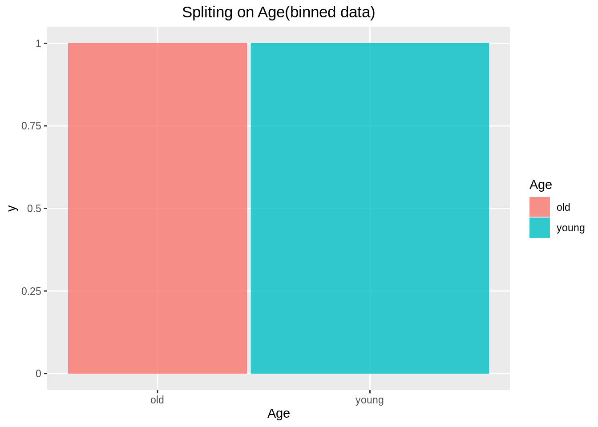
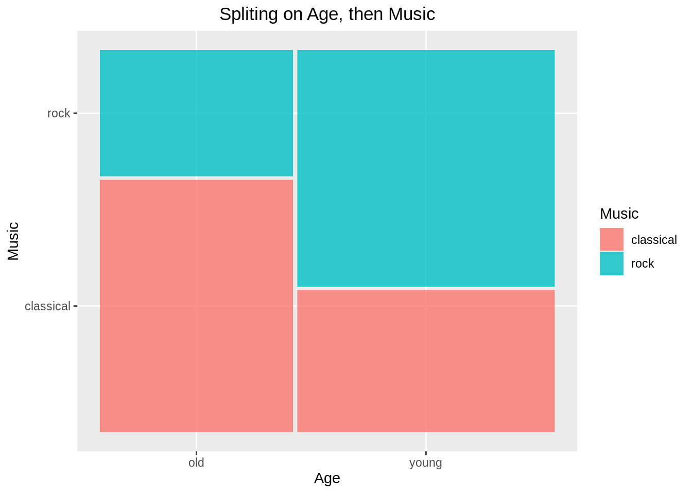
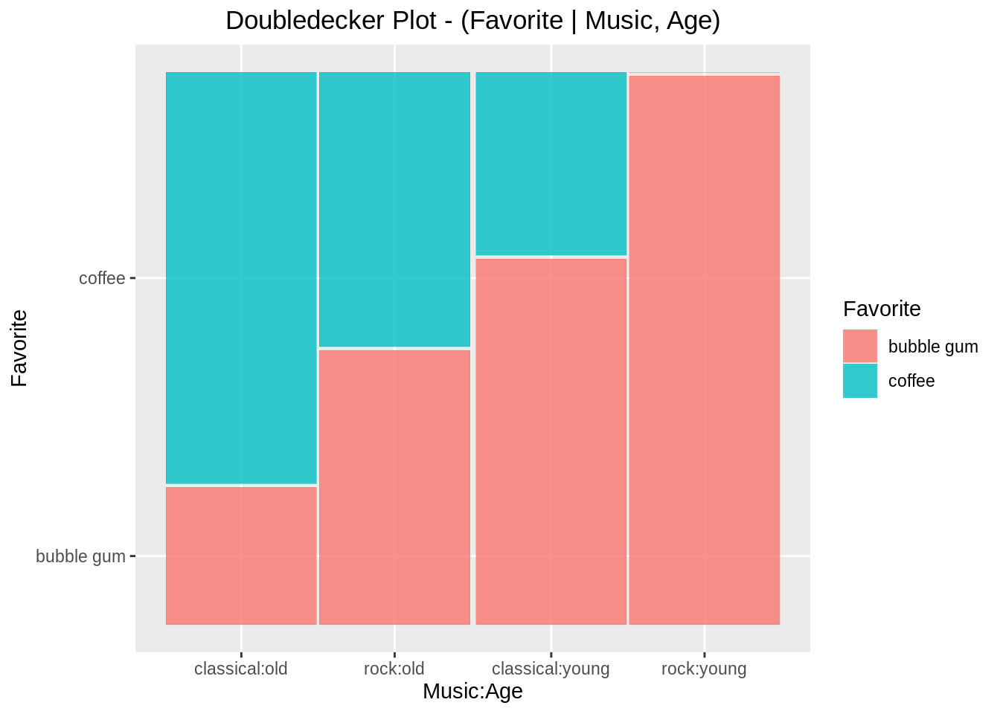
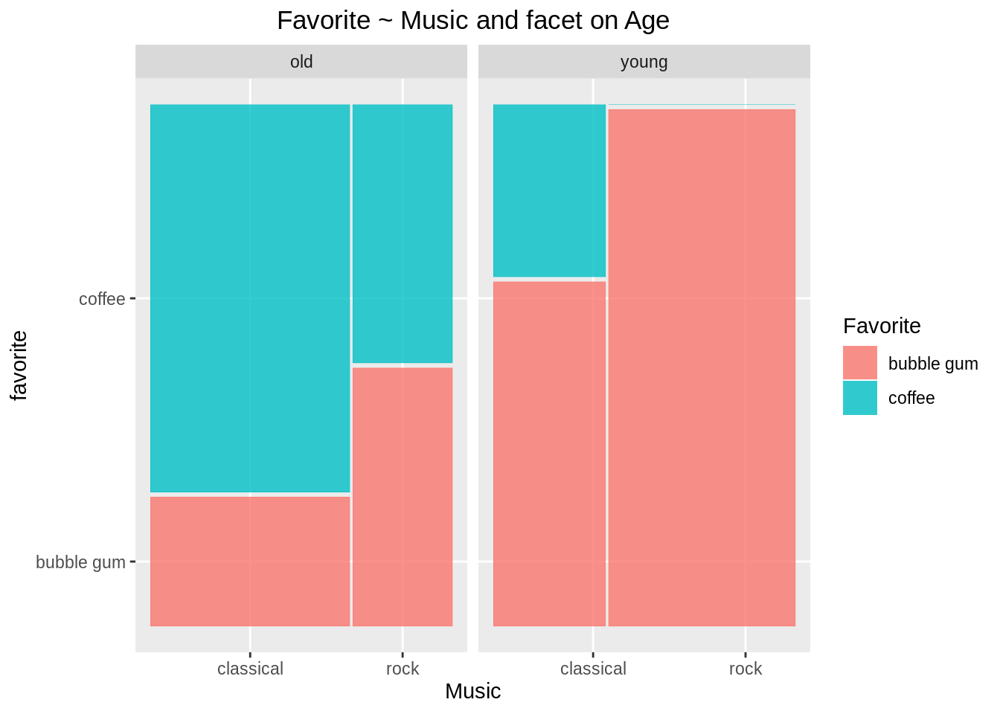

# ggmosaic

Qiang Zhao Mike Yao-Yi Wang

[Chinese version](ggmosaic-chinese.html)


## Overview

This cheat sheet is inspired by the **Chapter 15 Chart: Mosaic** of the edav.info. Instead of using the mosaic function from the package **vcd** to plot the mosaic plot, this cheat sheet shows how to achieve the same output through using **ggmosaic**. 

## Introduction

* Mosaic plot is only for categorical data
* Variables to put in `geom_mosaic`:
  + **weight**: Count/Freq column
  + **x**: product(Y, X2, X1)
  + **fill**: dependent variable Y
  + **conds**: conditional variable


## Order of splits

The mosaic plot follows the hierarchical structure, thus the order of adding variables is very important. Below we will show a step by step splitting by adding one variable at the time. Before going through the example, one must install and call the package **ggplot2** and **ggmosaic**.


```r
library(ggplot2)
library(ggmosaic)

df_bin=data.frame(Age=c('old','old','old','old','young','young','young','young'),
                    Favorite=c(rep('bubble gum',2),rep('coffee',2),rep('bubble gum',2),rep('coffee',2)),
                    Music=c(rep(c('classical','rock'),4)),
                    Freq=c(1,1,3,1,2,5,1,0))
df_unbin = data.frame(Age =c(rep("old",6), rep("young", 8)), 
                      Favorite = c(rep("bubble gum", 2),rep("coffee", 4), rep("bubble gum", 7), "coffee"),
                      Music = c("classical", "rock", rep("classical", 3), "rock", rep("classical", 2), rep("rock", 5), "classical"))
```

## Splitting on One Variable(binned data)


```r
df_bin
```

```
##     Age   Favorite     Music Freq
## 1   old bubble gum classical    1
## 2   old bubble gum      rock    1
## 3   old     coffee classical    3
## 4   old     coffee      rock    1
## 5 young bubble gum classical    2
## 6 young bubble gum      rock    5
## 7 young     coffee classical    1
## 8 young     coffee      rock    0
```


First, we will show the ggmosaic only split on `Age`:

Important: The `ggmosaic` can take binned data by assigning the weight = `Freq` column of the dataset at its aesthetics, it is not like `vcd::mosaic()`, which can only take binned data with count column name as Freq.

```r
ggplot(data = df_bin)+
  geom_mosaic(aes(x = product(Age), fill = Age, weight = Freq))+
  labs(x= "Age", title = "Spliting on Age(binned data)")+
  theme(plot.title = element_text(hjust = 0.5))
```




## Splitting on One Variable(unbinned data)

However, for unbinned data, we could just ignore the `weight` and let it set to default.

The unbinned data:

```r
df_unbin
```

```
##      Age   Favorite     Music
## 1    old bubble gum classical
## 2    old bubble gum      rock
## 3    old     coffee classical
## 4    old     coffee classical
## 5    old     coffee classical
## 6    old     coffee      rock
## 7  young bubble gum classical
## 8  young bubble gum classical
## 9  young bubble gum      rock
## 10 young bubble gum      rock
## 11 young bubble gum      rock
## 12 young bubble gum      rock
## 13 young bubble gum      rock
## 14 young     coffee classical
```


```r
ggplot(data = df_unbin)+
  geom_mosaic(aes(x = product(Age), fill = Age))+
  labs(x= "Age", title = "Spliting on Age(unbinned data)")+
  theme(plot.title = element_text(hjust = 0.5))
```


Note: We will use unbinned data for the rest of example

## Splitting on Two Variables

Split on `Age`, then `Music`:

```r
ggplot(data = df_unbin)+ 
  geom_mosaic(aes(x = product(Music, Age), fill = Music))+
  labs(x = "Age", y = "Music", title = "Spliting on Age, then Music")+
  theme(plot.title = element_text(hjust = 0.5))
```



Split on `Music`, then `Age`:

```r
ggplot(data = df_unbin)+
  geom_mosaic(aes(x = product(Age, Music), fill = Age))+
  labs(x= "Music", y = "Age",  title = "Spliting on Music, then Age")+
  theme(plot.title = element_text(hjust = 0.5))
```


For plotting mosaic plot on Y ~ X, we want to set `x = product(Y, X)` in `aes` as we always want to split the dependent variable last. We also need to set `fill = Y` as we want to color base on dependent variable.

## Splitting on Three Variables

Split on `Age`, then `Music`, then `Favorite`:


```r
ggplot(data = df_unbin)+
  geom_mosaic(aes(x = product(Favorite, Music, Age), fill = Favorite))+
  labs(x = "Favorite:Age", y = "Music", title = "Split on Age, then Music, then Favorite")+
   theme(plot.title = element_text(hjust = 0.5))
```


Note that in the above example, by default the order of split and their directions as follows:

1.  `Age` -- vertical split

2.  `Music` -- horizontal split

3.  `Favorite` -- vertical split

## Adjusting the Direction of Splits

The directions can be adjusted as we want. For example, we want to create a doubledecker plot for the above example following below criteria:

Splitting order: 

1.  `Age` -- vertical split ("hspine")

2.  `Music` -- vertical split ("hspine")

3.  `Favorite` (dependent variable)-- horizontal split ("vspine")


```r
ggplot(data = df_unbin)+
  geom_mosaic(aes(x = product(Favorite, Music, Age), fill = Favorite), 
              divider = c("vspine", "hspine", "hspine"))+
  labs(x = "Music:Age", y = "Favorite", 
       title = "Doubledecker Plot - Split on Age, then Music, then Favorite")+
  theme(plot.title = element_text(hjust = 0.5))
```


Note that the divider vector is in order of which the variables appear in the `product(Favorite, Music, Age)`, however the order of splits is `Age`, `Music`, then `Favorite`. Also note that in the divider vector, "vspine" = horizontal split and "hspine" = vertical split.

## Alternative approach: Conditional
We can also use conditional property to achieve the same result as the above. In this case, `geom_mosaic(aes(x = product(last_split), fill = last_split, conds = product(second_split, first_split))`.


```r
ggplot(data = df_unbin)+
  geom_mosaic(aes(x = product(Favorite), fill = Favorite, conds = product(Music, Age)), 
              divider = c("vspine", "hspine", "hspine"))+
  labs(x = "Music:Age", y = "Favorite", 
       title = "Doubledecker Plot - (Favorite | Music, Age)")+
  theme(plot.title = element_text(hjust = 0.5))
```




## Alternative approach: Facetting
We can also achieve similar result through facetting.


```r
ggplot(data = df_unbin)+
  geom_mosaic(aes(x = product(Favorite, Music), fill = Favorite))+
  facet_grid(. ~Age)+
  labs(x="Music", y = "favorite", title = "Favorite ~ Music and facet on Age")+
  theme(plot.title = element_text(hjust = 0.5))
```



## Comparison with vcd::mosaic

There are often confusions between **ggmosaic:geom_mosaic** and **vcd:mosaic** as the syntax for splitting order and splitting direction are quite different for the two. The **vcd:mosaic** follows the order of `mosaic(last_split ~ first_split + second_split)` and the `direction` vector in the order of splits is `(first_split, second_split, third_split)` with "v" being the vertical split and "h" being the horizontal split. However, **ggmosaic:geom_mosaic** follow the different pattern, the order of split is `product(last_split, second_split, first_split)` and the `divider (similar to direction in vcd:mosaic)` in the order of split is `divider = c(last_split, second_split, first_split)` with "vspine" being the horizontal split and "hspine" being the vertical split.

