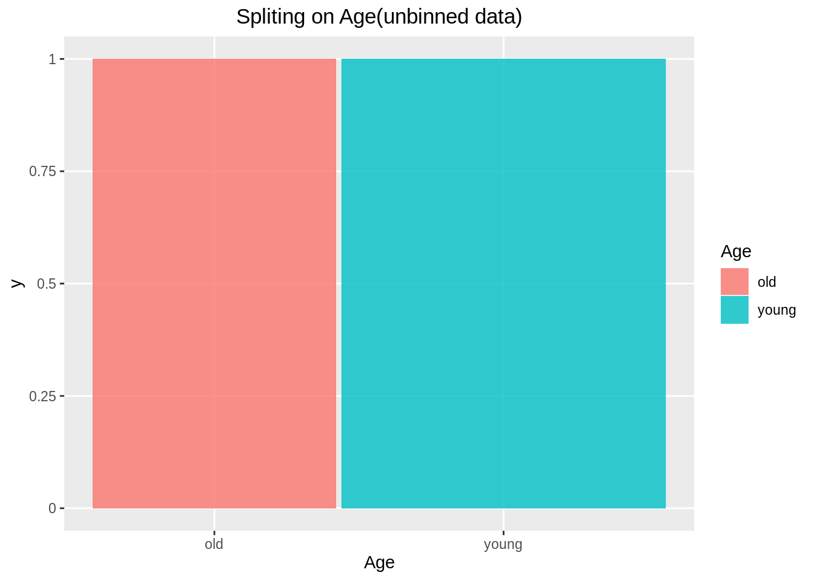
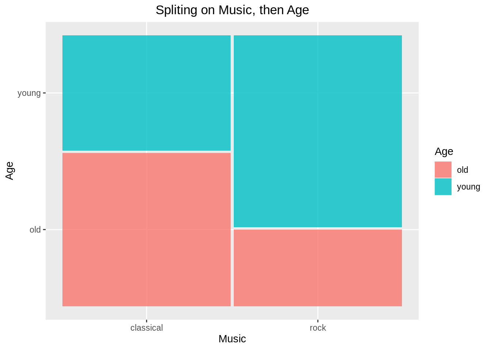
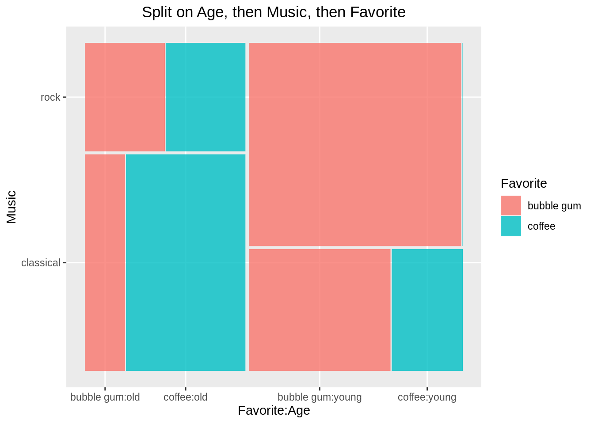

# ggmosaic {#ggmosaic_chinese}

Qiang Zhao Mike Yao-Yi Wang


[English version](ggmosaic.html)


## Chinese Translation: ‘ggmosaic’（马赛克图）

## 引言

这个文档是参考edav.info中第十五章节：马赛克图（Mosaic），引用其中的数据和例子。相较于edav.info中vcd包里的mosiac函数，我们准备使用ggmosiac来画马赛克图。


## 简介
* 马赛克图针对的是分类变量
* geom_maisc中的变量
  + **weight** : 数据中的计数栏
  + **x** : product（因变量，自变量2，自变量1）
  + **fill** : 数据中的自变量栏
  + **conds** : 条件变量

## 分割的顺序
马赛克图遵循等级分层结构，因此往product里面加变量的顺序极其重要。下面，我们会一步一步的展示如何正确的加入变量。我们首先要安装并且引用ggplot2和ggmosaic包。

```r
library(ggplot2)
library(ggmosaic)

df_bin=data.frame(Age=c('old','old','old','old','young','young','young','young'),
                    Favorite=c(rep('bubble gum',2),rep('coffee',2),rep('bubble gum',2),rep('coffee',2)),
                    Music=c(rep(c('classical','rock'),4)),
                    Freq=c(1,1,3,1,2,5,1,0))
df_unbin = data.frame(Age =c(rep("old",6), rep("young", 8)), 
                      Favorite = c(rep("bubble gum", 2),rep("coffee", 4), rep("bubble gum", 7), "coffee"),
                      Music = c("classical", "rock", rep("classical", 3), "rock", rep("classical", 2), rep("rock", 5), "classical"))
```


## 根据一个变量分割（分箱数据）：

```r
df_bin
```

```
##     Age   Favorite     Music Freq
## 1   old bubble gum classical    1
## 2   old bubble gum      rock    1
## 3   old     coffee classical    3
## 4   old     coffee      rock    1
## 5 young bubble gum classical    2
## 6 young bubble gum      rock    5
## 7 young     coffee classical    1
## 8 young     coffee      rock    0
```
首先，我们根据年龄（Age）分割：
注意：ggmosaic可以通过weight来处理分箱数据，我们令weight等于数据中的计数栏（Freq）即可。vcd::mosaic也可以做到同样效果，但是计数栏的名称一定要为Freq。

```r
ggplot(data = df_bin)+
  geom_mosaic(aes(x = product(Age), fill = Age, weight = Freq))+
  labs(x= "Age", title = "Spliting on Age(binned data)")+
  theme(plot.title = element_text(hjust = 0.5))
```


## 根据一个变量分割(非分箱数据):
对于非分箱数据，我们应该忽略weight。下面是非分箱数据的读数:

```r
df_unbin
```

```
##      Age   Favorite     Music
## 1    old bubble gum classical
## 2    old bubble gum      rock
## 3    old     coffee classical
## 4    old     coffee classical
## 5    old     coffee classical
## 6    old     coffee      rock
## 7  young bubble gum classical
## 8  young bubble gum classical
## 9  young bubble gum      rock
## 10 young bubble gum      rock
## 11 young bubble gum      rock
## 12 young bubble gum      rock
## 13 young bubble gum      rock
## 14 young     coffee classical
```


```r
ggplot(data = df_unbin)+
  geom_mosaic(aes(x = product(Age), fill = Age))+
  labs(x= "Age", title = "Spliting on Age(unbinned data)")+
  theme(plot.title = element_text(hjust = 0.5))
```


注意：我们接下来的例子都是使用非分箱的数据

## 根据两个变量分割
我们首先根据年龄(Age)分割，然后再根据音乐种类(Music)分割:

```r
ggplot(data = df_unbin)+ 
  geom_mosaic(aes(x = product(Music, Age), fill = Music))+
  labs(x = "Age", y = "Music", title = "Spliting on Age, then Music")+
  theme(plot.title = element_text(hjust = 0.5))
```


下面这个例子是先分割音乐种类(Music)，再分割年龄(Age):


```r
ggplot(data = df_unbin)+
  geom_mosaic(aes(x = product(Age, Music), fill = Age))+
  labs(x= "Music", y = "Age",  title = "Spliting on Music, then Age")+
  theme(plot.title = element_text(hjust = 0.5))
```



如果我们想画因变量Y关于自变量X的马赛克图，我们应该设aes中的x=prod(Y,X)。我们要保证因变量是最后一个被划分的。而且, 我们也要使得fill=Y，因为我们注重的是因变量Y的分布。

## 根据三个变量分割
我们首先划分年龄(Age),然后划分音乐种类(Music)，最后划分喜好(Favorite)。

```r
ggplot(data = df_unbin)+
  geom_mosaic(aes(x = product(Favorite, Music, Age), fill = Favorite))+
  labs(x = "Favorite:Age", y = "Music", title = "Split on Age, then Music, then Favorite")+
   theme(plot.title = element_text(hjust = 0.5))
```


注意：在上面的例子当中，系统默认的切割方向以及顺序如下:

1. 年龄(Age): 垂直切割
2. 音乐种类(Music): 横向切割
3. 喜好(Favorite): 垂直切割

## 调整切割的方向
我们可以随意改变任意变量的切割方向。比如，我们打算用上面的例子绘画一个双层结构图(DoubleDecker Plot)。
切割顺序为：

1. 年龄(Age): 垂直切割 ('hspine')
2. 音乐种类(Music): 垂直切割 ('hespine')
3. 喜好(Favorite): 横向切割 ('vspine')


```r
ggplot(data = df_unbin)+
  geom_mosaic(aes(x = product(Favorite, Music, Age), fill = Favorite), 
              divider = c("vspine", "hspine", "hspine"))+
  labs(x = "Music:Age", y = "Favorite", title = "Doubledecker Plot - Split on Age, then Music, then Favorite")+
  theme(plot.title = element_text(hjust = 0.5))
```


注意：divider中的切割方向分别对应product(Favorite,Music,Age)。但是实际上的切割顺序还是年龄(Age)，音乐种类(Music)，喜好(Favorite)。divider中的'vspine'表示横向切割；'hspine'表示垂直切割。

## 另外一种方法:条件变量(Conditional)
我们可以使用条件(conds)的属性来达到与上面例子相同的效果。
geom_mosaic(aes(x = product(最后一次切割), fill = 最后一次切割, conds = product(第二次切割, 第一次切割)).

```r
ggplot(data = df_unbin)+
  geom_mosaic(aes(x = product(Favorite), fill = Favorite, conds = product(Music, Age)), 
              divider = c("vspine", "hspine", "hspine"))+
  labs(x = "Music:Age", y = "Favorite", 
       title = "Doubledecker Plot - (Favorite | Music, Age)")+
  theme(plot.title = element_text(hjust = 0.5))
```


## 另外一种方法:块化(Facet)

```r
ggplot(data = df_unbin)+
  geom_mosaic(aes(x = product(Favorite, Music), fill = Favorite))+
  facet_grid(. ~Age)+
  labs(x="Music", y = "favorite", title = "Favorite ~ Music and facet on Age")+
  theme(plot.title = element_text(hjust = 0.5))
```


## 'ggmosaic' vs vcd::'mosaic'
我们很容易搞混'ggmosaic'和‘mosaic’的切割顺序和切割方向。
对于‘mosaic’来说，切割顺序服从公式'mosaic(最后一个切割~第一个切割+第二个切割)'，而且切割方向的变量也是对应着direction=(第一个切割的变量，第二个切割的变量，最后一个切割的变量)。其中'v'表示的是垂直切割,'h'表示的是横向切割。
但是这和‘ggmosaic’有着很大的不同。在‘ggmosaic’中，切割应服从'product(最后一个切割，第二个切割，第一个切割)'的一个倒叙顺序。而且切割方向的变量也对应着divider=(最后一个切割的变量，第二个切割的变量，第一个切割的变量)。其中'vspine'表示横向切割，‘hspine’表示垂直切割。


