# Introduction to package 'ggparty'

Tianyao Han (th2830) and Wancheng Chen (wc2687)


```r
# import packages
library(dplyr)
library(partykit)
library(ggparty)
library(ggplot2)
library(party)
```

We have already known how to visualize the distribution information of a single numerical feature using graphs like histogram, boxplot, and violin plot. Using QQ plot to test if this feature has a nromal distribution. Showing relationships between nummerical features using ridgeline plots or scatter plots or with the help of a heatmap. When talking about categorical features, we have mosiac plots, which is quite useful, to deal with. 

The relationship between features can be somewhat not easy to figure out, like the “diagnal line” problem in the previous homework, the true linear relationship between humid and temp can not be easily interpreted until we find the hiden relation between temp and dew point. In other words, it is often the case that the overall linear relation between two variables are not so significant until we find a proper way to set a partition on our data set. That is, the property of other features plays a role of adjusting or even controling the relation between our interested features.

Under this circumstance, we can introduce package 'ggparty' to help us do this part. The ggparty package aims to extend ggplot2 functionality to the partykit package. It provides the necessary tools to create clearly structured and highly customizable visualizations for tree-objects of the class 'party'.

## Introdunction of class 'party' 

```r
# Use WeatherPlay dataset from partykit package
data("WeatherPlay", package = "partykit")
WeatherPlay
```

```
##     outlook temperature humidity windy play
## 1     sunny          85       85 false   no
## 2     sunny          80       90  true   no
## 3  overcast          83       86 false  yes
## 4     rainy          70       96 false  yes
## 5     rainy          68       80 false  yes
## 6     rainy          65       70  true   no
## 7  overcast          64       65  true  yes
## 8     sunny          72       95 false   no
## 9     sunny          69       70 false  yes
## 10    rainy          75       80 false  yes
## 11    sunny          75       70  true  yes
## 12 overcast          72       90  true  yes
## 13 overcast          81       75 false  yes
## 14    rainy          71       91  true   no
```

To represent the data as a tree-based object in partykit, two basic building blocks are used: splits of class ‘partysplit’ and nodes of class ‘partynode’. The resulting recursive partition can then be associated with a data set in an object of class ‘party’.

1. Use 'partysplit' function to define split methods for the column: \
* partysplit(varid, breaks = NULL, index = NULL, right = TRUE, prob = NULL, info = NULL) \
The 'varid' means the number of the column that will be split in the dataset (e.g., 1L for outlook, 3L for humidity, 4L for windy etc.). There are two ways to split the column data, one is to split by specfic value for continuous data and one is to split by type for categorial data. Some arbitrary information can be associated with a ‘partysplit’ object by passing it to the 'info' argument.


```r
sp_o <- partysplit(1L, index = 1:3) 
sp_h <- partysplit(3L, breaks = 75)
sp_w <- partysplit(4L, index = 1:2)
```

2. Use 'partynode' function to define the split methods for nodes in the tree: \
* partynode(id, split = NULL, kids = NULL, surrogates = NULL, info = NULL)  \
The 'split' means the partysplit method mentioned above.'id' is an integer identifier of the node number, 'split' is a ‘partysplit’ object, and 'kids' is a list of ‘partynode’ objects. Some arbitrary information can be supplied in 'info' argument.

```r
pn <- partynode(1L, split = sp_o, kids = list(
  partynode(2L, split = sp_h, kids = list(
    partynode(3L, info = "yes"),
    partynode(4L, info = "no"))),
  partynode(5L, info = "yes"),
  partynode(6L, split = sp_w, kids = list(
    partynode(7L, info = "yes"),
    partynode(8L, info = "no")))))
py <- party(pn, WeatherPlay)
```

In the end, the 'party' function will split the data and record the splitting process in the shape of a tree.

```r
print(py)
```

```
## [1] root
## |   [2] outlook in sunny
## |   |   [3] humidity <= 75: yes
## |   |   [4] humidity > 75: no
## |   [5] outlook in overcast: yes
## |   [6] outlook in rainy
## |   |   [7] windy in false: yes
## |   |   [8] windy in true: no
```


```r
plot(py)
```

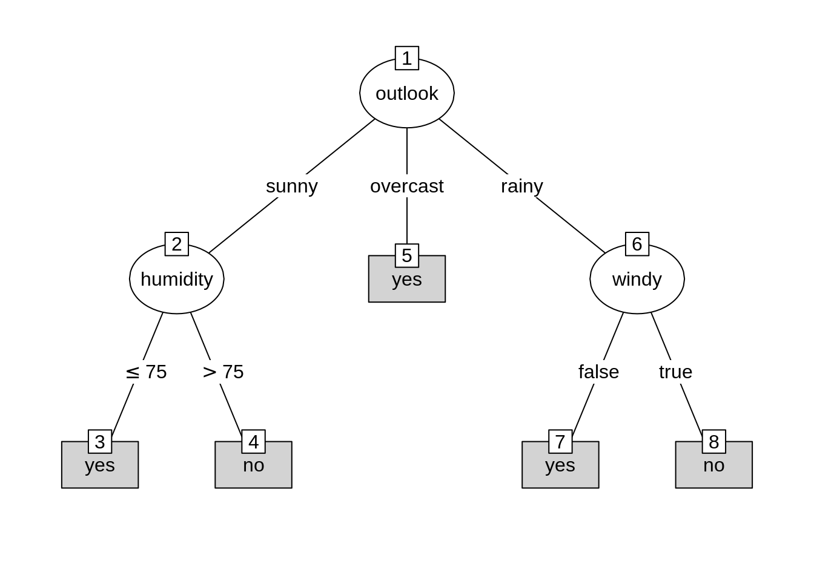

## Use 'ggparty' to visualize the tree
Use ggparty function to visualize the object of class 'party' into a tree-based type.
* geom_edge() draws the edges between the nodes \
* geom_edge_label() labels the edges with the corresponding split breaks \
* geom_node_label() labels the nodes with the split variable, node info or anything else. The shorthand versions of this geom geom_node_splitvar() and geom_node_info() have the correct defaults to write the split variables in the inner nodes or the info in the terminal nodes \
* geom_node_plot() creates a custom ggplot at the location of the node \

```r
ggparty(py) +
  geom_edge() +
  geom_edge_label() +
  geom_node_label(aes(label = splitvar),
                  ids = "inner") +
  geom_node_label(aes(label = info),
                  ids = "terminal")
```

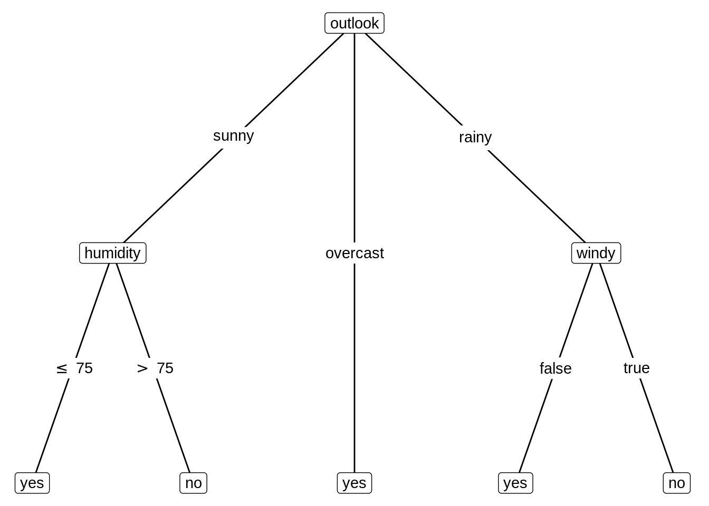

## Customize the tree
Change color and size of the nodes.

```r
ggparty(py) +
  geom_edge() +
  geom_edge_label() +
  # map color to level and size to nodesize for all nodes
  geom_node_splitvar(aes(col = factor(level),
                         size = nodesize)) +
  geom_node_info(aes(col = factor(level),
                     size = nodesize))
```

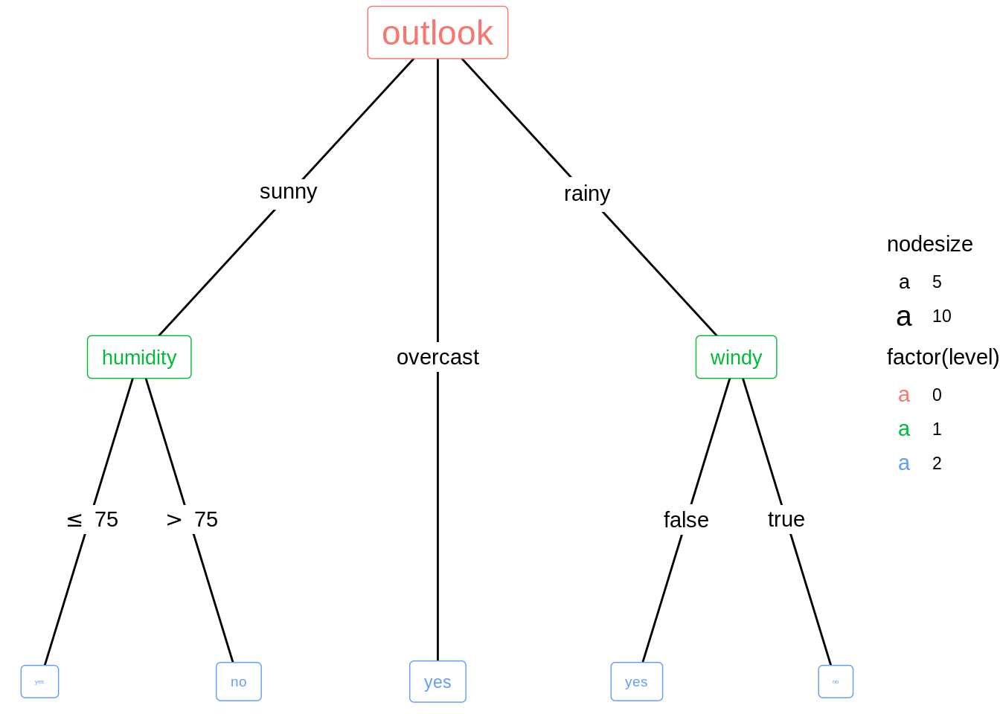

## Add plots to the tree
Generate a new 'party' object. Set 'fitted' and 'response' variables for the 'party' object. That is the two variables that we want to find the correlation.

```r
n1 <- partynode(id = 1L, split = sp_o, kids = lapply(2L:4L, partynode))
t2 <- party(n1,
            data = WeatherPlay,
            fitted = data.frame(
              "(fitted)" = fitted_node(n1, data = WeatherPlay),
              "(response)" = WeatherPlay$play,
              check.names = FALSE),
            terms = terms(play ~ ., data = WeatherPlay)
)
t2 <- as.constparty(t2)
```

New split type for the dataset. Adding fitted and response variables.

```r
print(t2)
```

```
## 
## Model formula:
## play ~ outlook + temperature + humidity + windy
## 
## Fitted party:
## [1] root
## |   [2] outlook in sunny: no (n = 5, err = 40.0%)
## |   [3] outlook in overcast: yes (n = 4, err = 0.0%)
## |   [4] outlook in rainy: yes (n = 5, err = 40.0%)
## 
## Number of inner nodes:    1
## Number of terminal nodes: 3
```

To visualize the distribution of the variable play we will use the geom_node_plot() function. It allows us to show the data of each node in its separate plot. For this to work, we have to specify the argument gglist. Basically we have to provide a 'list' of all the 'gg' components we would add to a ggplot() call on the data element of a node. Because the response variable is categorial, use barchart to do the visualization part.

```r
ggparty(t2) +
  geom_edge() +
  geom_edge_label() +
  geom_node_splitvar() +
  geom_node_plot(gglist = list(geom_bar(aes(x = "", fill = play),
                                        position = position_fill()),
                               xlab("play")))
```

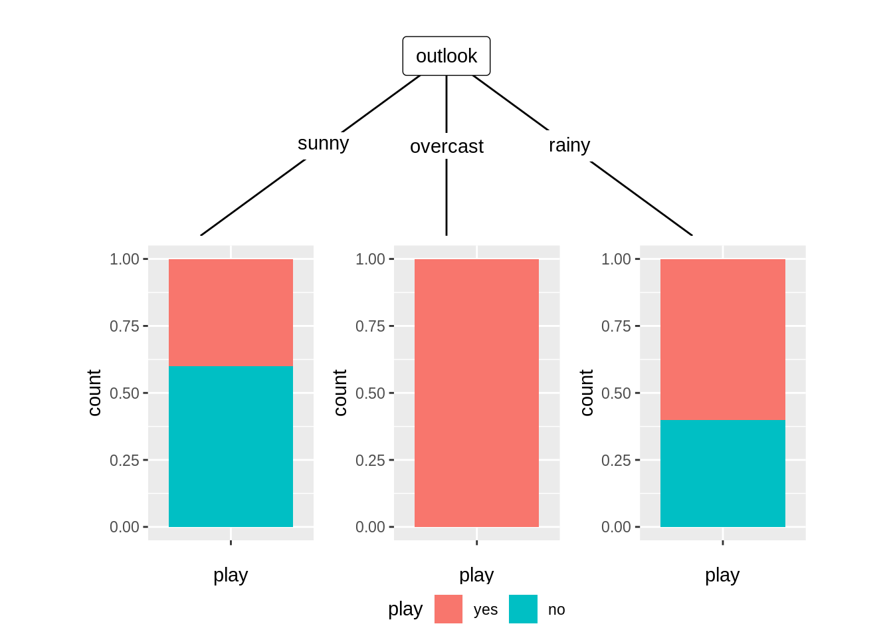

## Application

So how to dig this hiden information out, with the help of explortary data analysis? Our group will show you how to use recursive partition method and visualization techniques to find some interesting patterns that are difficult to find out without knowing this technique.

### Categorical vs Numerical

We first will show you how to automatically visualize impact of other variables on the relation between categirical and numerical variables. The dataset we will use is Pima Indians Diabetes Database.


```r
data("PimaIndiansDiabetes2", package = "mlbench")
head(PimaIndiansDiabetes2)
```

```
##   pregnant glucose pressure triceps insulin mass pedigree age diabetes
## 1        6     148       72      35      NA 33.6    0.627  50      pos
## 2        1      85       66      29      NA 26.6    0.351  31      neg
## 3        8     183       64      NA      NA 23.3    0.672  32      pos
## 4        1      89       66      23      94 28.1    0.167  21      neg
## 5        0     137       40      35     168 43.1    2.288  33      pos
## 6        5     116       74      NA      NA 25.6    0.201  30      neg
```


In this dataset, it is natrual to think that plasma glucose concentration glucose is an important predictor for diabetes. Suppose we want to explore the relation between glocose and diabetes. We first take the summary of the data. And result shows that we have 768 observations but variable tricpes and insulin have too many NAs so we decide not using these two variables. Then we delete NAs of other variables and get our dataframe PimaIndianDiabetes.


```r
str(PimaIndiansDiabetes2)
```

```
## 'data.frame':	768 obs. of  9 variables:
##  $ pregnant: num  6 1 8 1 0 5 3 10 2 8 ...
##  $ glucose : num  148 85 183 89 137 116 78 115 197 125 ...
##  $ pressure: num  72 66 64 66 40 74 50 NA 70 96 ...
##  $ triceps : num  35 29 NA 23 35 NA 32 NA 45 NA ...
##  $ insulin : num  NA NA NA 94 168 NA 88 NA 543 NA ...
##  $ mass    : num  33.6 26.6 23.3 28.1 43.1 25.6 31 35.3 30.5 NA ...
##  $ pedigree: num  0.627 0.351 0.672 0.167 2.288 ...
##  $ age     : num  50 31 32 21 33 30 26 29 53 54 ...
##  $ diabetes: Factor w/ 2 levels "neg","pos": 2 1 2 1 2 1 2 1 2 2 ...
```

```r
summary(PimaIndiansDiabetes2)
```

```
##     pregnant         glucose         pressure         triceps     
##  Min.   : 0.000   Min.   : 44.0   Min.   : 24.00   Min.   : 7.00  
##  1st Qu.: 1.000   1st Qu.: 99.0   1st Qu.: 64.00   1st Qu.:22.00  
##  Median : 3.000   Median :117.0   Median : 72.00   Median :29.00  
##  Mean   : 3.845   Mean   :121.7   Mean   : 72.41   Mean   :29.15  
##  3rd Qu.: 6.000   3rd Qu.:141.0   3rd Qu.: 80.00   3rd Qu.:36.00  
##  Max.   :17.000   Max.   :199.0   Max.   :122.00   Max.   :99.00  
##                   NA's   :5       NA's   :35       NA's   :227    
##     insulin            mass          pedigree           age        diabetes 
##  Min.   : 14.00   Min.   :18.20   Min.   :0.0780   Min.   :21.00   neg:500  
##  1st Qu.: 76.25   1st Qu.:27.50   1st Qu.:0.2437   1st Qu.:24.00   pos:268  
##  Median :125.00   Median :32.30   Median :0.3725   Median :29.00            
##  Mean   :155.55   Mean   :32.46   Mean   :0.4719   Mean   :33.24            
##  3rd Qu.:190.00   3rd Qu.:36.60   3rd Qu.:0.6262   3rd Qu.:41.00            
##  Max.   :846.00   Max.   :67.10   Max.   :2.4200   Max.   :81.00            
##  NA's   :374      NA's   :11
```

```r
PimaIndiansDiabetes <- na.omit(PimaIndiansDiabetes2[,-c(4, 5)])
```

We first want to use ggplot2 to show the relation. Diabetes is a categorical variable while glucose is a numerical variable. So we use density curve and boxplot to show. From these two plots we can get information:

1. People with positive diabetes have higher glucose than people have negative diabetes.
2. More outliers(larger than normal) occur in glucose distribution under people with negative diabetes.
3. The glucose distribution under people with positive diabetes seem to have 2 peeks and is not normally distributed.

From these information we find that although generally people with positive diabetes have higher glocose, but how other varibles can affect this property(so that there are two peeks in glucose distribution of people with positive diabetes)? It is hard to tell from the plots we get so far. Maybe we can try to facet on other variables to see what happens. But when other variables are numerical, we have to first do discretization, and how wide the bin will be can just be another problem. So here is time for using Model-Based Recursive Partitioning method to help us find what the significant node is and how to visualize it.


```r
ggplot(PimaIndiansDiabetes, aes(glucose, fill = diabetes, colour = diabetes)) +
  geom_density(alpha = 0.1) + 
  xlim(0,250) + 
  ggtitle("glucose distribution under different diabetes type")
```

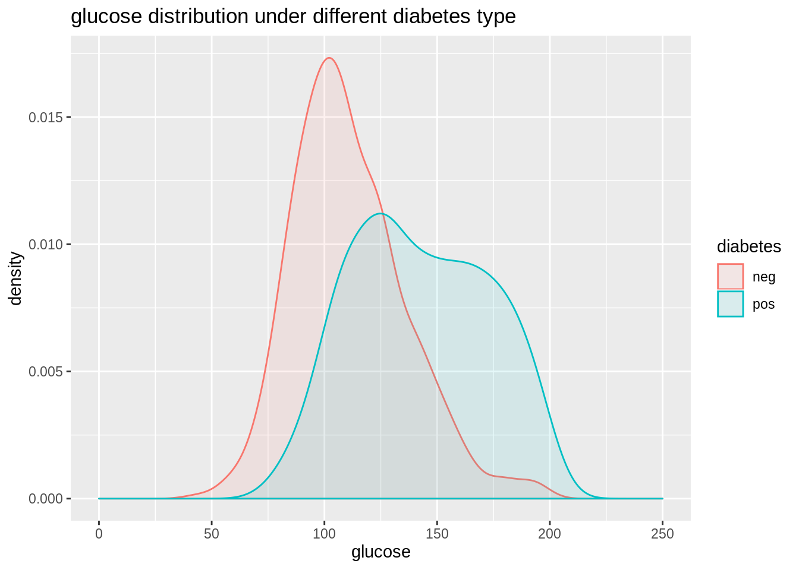


```r
ggplot(PimaIndiansDiabetes, aes(x=diabetes, y=glucose, fill=diabetes))+
  geom_boxplot()+
  ggtitle("glucose range under diffrent diabete type")
```

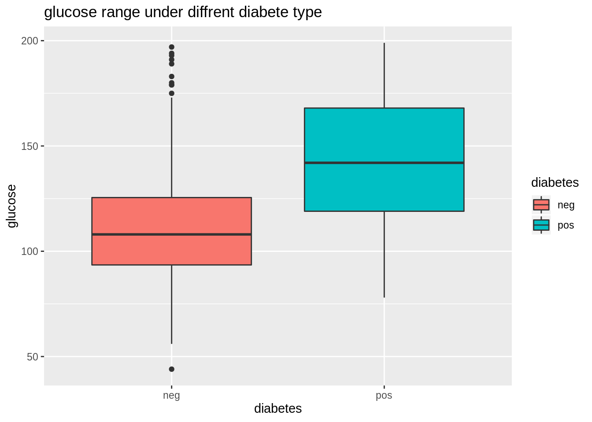

From these information we get we find that although generally people with positive diabetes have higher glocose, but how other varibles can affect this property(so that there are two peeks in glucose distribution of people with positive diabetes)? It is hard to tell from the plots we get so far. Maybe we can try to facet on other variables to see what happens. But when other variables are numerical, we have to first do discretization, and how wide the bin will be can just be another problem. So here is time for using Model-Based Recursive Partitioning method to help us find what the significant node is and visualize it. Here we will use mob function from party library. We can directly read the print result to get some interesting information. This tree model shows three patterns about relation of glucose and diabetes.

Node 2 Women with low body mass index that have on average a low risk of diabetes, however this increases clearly with glucose level. Node 4 Women with average and high body mass index, younger than 30 years, that have a higher avarage risk that also increases with glucose level. Node 5 Women with average and high body mass index, older than 30 years, that have a high avarage risk that increases only slowly with glucose level.


```r
#tree
fmPID <- mob(diabetes ~ glucose | pregnant + pressure + mass + pedigree + age,
data = PimaIndiansDiabetes, model = glinearModel, family = binomial())

#show information
print(fmPID)
```

```
## 1) mass <= 26.3; criterion = 1, statistic = 43.409
##   2)*  weights = 148 
## Terminal node model
## Binomial GLM with coefficients:
## (Intercept)      glucose  
##   -10.99945      0.06457  
## 
## 1) mass > 26.3
##   3) age <= 30; criterion = 1, statistic = 33.705
##     4)*  weights = 292 
## Terminal node model
## Binomial GLM with coefficients:
## (Intercept)      glucose  
##    -6.57307      0.04504  
## 
##   3) age > 30
##     5)*  weights = 284 
## Terminal node model
## Binomial GLM with coefficients:
## (Intercept)      glucose  
##    -3.31857      0.02748
```

Printed information are always bad for illustration, we can simply use plot function to get a better result. And the three patternd talked are quite obvious in the graph.


```r
# plot it 
plot(fmPID)
```

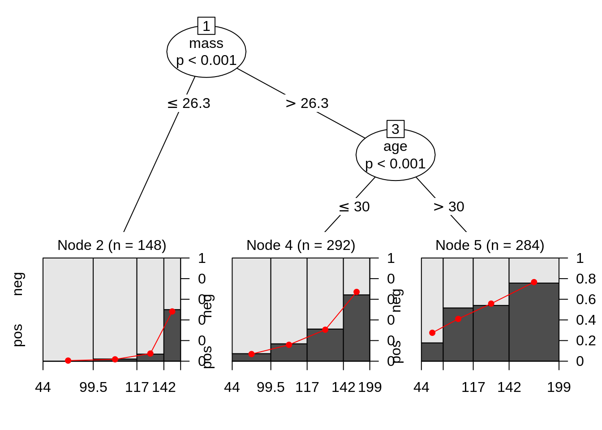

We can compute the odds ratio for each group. On average, the odds increase by 6.7%, 4.6% and 2.8% with respect to glucose in the three groups. There is way more information than just a single boxplot or distribution plot.


```r
# show odds ratios
exp(coef(fmPID)[,2])
```

```
##        2        4        5 
## 1.066698 1.046075 1.027861
```

### Numerical vs Numerical

PimaIndianDiabetes dataset shows the case to explore relation between one numerical variable and one categorical variable. When we have two numerical variables, we can also use this method to show more detailed patterns. This time we will use ggparty to make our plot more pretty. 

TeachingRatings is a dataset on course evaluations, course characteristics, and professor characteristics for 463 courses for the academic years 2000–2002 at the University of Texas at Austin. 


```r
data("TeachingRatings", package = "AER")
head(TeachingRatings)
```

```
##   minority age gender credits     beauty eval division native tenure students
## 1      yes  36 female    more  0.2899157  4.3    upper    yes    yes       24
## 2       no  59   male    more -0.7377322  4.5    upper    yes    yes       17
## 3       no  51   male    more -0.5719836  3.7    upper    yes    yes       55
## 4       no  40 female    more -0.6779634  4.3    upper    yes    yes       40
## 5       no  31 female    more  1.5097940  4.4    upper    yes    yes       42
## 6       no  62   male    more  0.5885687  4.2    upper    yes    yes      182
##   allstudents prof
## 1          43    1
## 2          20    2
## 3          55    3
## 4          46    4
## 5          48    5
## 6         282    6
```


Now we want to know if there relation between evaluation scores and teachers’ physical appearance. We first use a scatter plot to show that. We can generally see that beauty and eval has a positive corelation. As teachers’ rating of physical appearence goes higher, the evaluation score also goes higher.


```r
ggplot(TeachingRatings, aes(x=beauty, y=eval)) + 
  geom_point() + 
  ggtitle("scatter plot on beauty and eval")
```

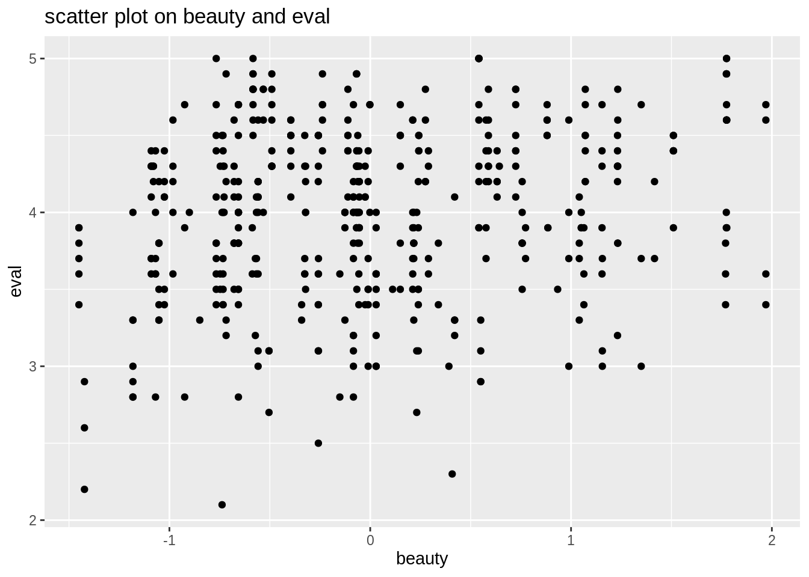

Faceted by minority and division, and lengended by gender, we see more detailed patterns betwenn beauty and eval.


```r
ggplot(data=TeachingRatings,aes(x=beauty, y=eval, color=gender))+
  geom_point(alpha=0.5, size=0.8)+
  geom_smooth(method=lm, se=FALSE)+
  facet_grid(minority ~ division, margins=TRUE)+
  labs(title="scatter plot on beauty and eval with gender as legend",
       subtitle = "faeted by minority and division")
```

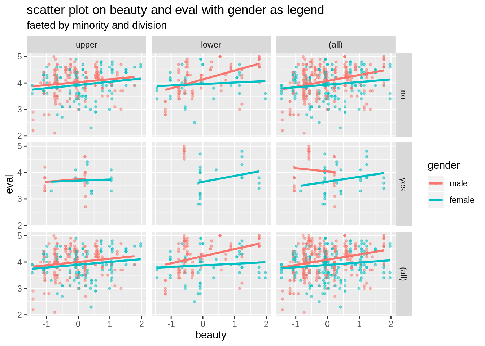

If we want to see whether some categorical variables in the dataset also can affect the coreltion we found so far, traditionally we can use facet and legend by hand with ggplot2. But what variable to use is a big problem if there are many. Things can be more complicated when we want to see if a numerical variable has an effect on out found corelation. We have choose a proper bin to change the numericla variable to a factor. However, things can be much more easier if we use Model-Based Recursive Partitioning method. Here we will use lmtree method in partykit package and plot the result.


```r
data("TeachingRatings", package = "AER")

tr_tree <- lmtree(eval ~ beauty | minority + age + gender + division + native + tenure, data = TeachingRatings, weights = students, caseweights = FALSE)

plot(tr_tree)
```

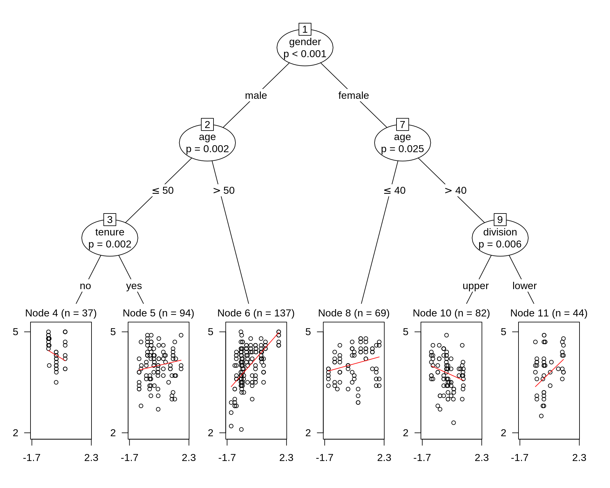

To make our plot prettier, we use package from ggparty. An interesting pattern occurs in node 8. More beautiful a female instructor more than 40 years old teaching an upper class is, lower evaluation score she has.


```r
ggparty(tr_tree,
        terminal_space = 0.5,
        add_vars = list(p.value = "$node$info$p.value")) +
  geom_edge(size = 1.5) +
  geom_edge_label(colour = "grey", size = 6) +
  geom_node_plot(gglist = list(geom_point(aes(x = beauty,
                                             y = eval),
                                         alpha = 0.5),
                              theme_bw(base_size = 15)),
                scales = "fixed",
                id = "terminal",
                shared_axis_labels = T,
                shared_legend = T,
                legend_separator = T,
                predict = "beauty",
                predict_gpar = list(col = "blue",
                                   size = 1.2)
                ) +
  geom_node_label(aes(col = splitvar),
                  line_list = list(aes(label = paste("Node", id)),
                                   aes(label = splitvar),
                                   aes(label = paste("p =", formatC(p.value, format = "e", digits = 2)))),
                  line_gpar = list(list(size = 10, col = "black", fontface = "bold"),
                                   list(size = 18),
                                   list(size = 10)),
                  ids = "inner") +
  geom_node_label(aes(label = paste0("Node ", id, ", N = ", nodesize)),
                  fontface = "bold",
                  ids = "terminal",
                  size = 5, 
                  nudge_y = 0.01) +
  theme(legend.position = "none")
```

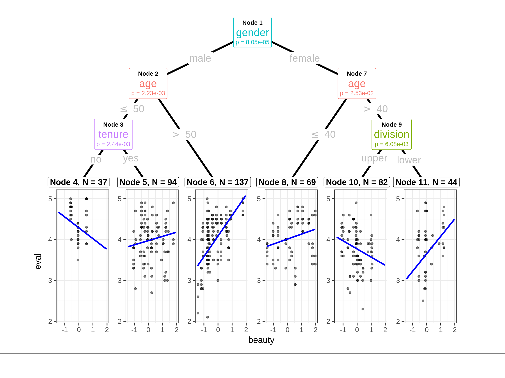

And we can take the summary of node 8 to further explore.


```r
summary(tr_tree, node = 8)
```

```
## 
## Call:
## lm(formula = eval ~ beauty)
## 
## Weighted Residuals:
##     Min      1Q  Median      3Q     Max 
## -6.4288 -1.8997  0.5785  1.8240  4.8163 
## 
## Coefficients:
##             Estimate Std. Error t value Pr(>|t|)    
## (Intercept)  4.01371    0.05626  71.343   <2e-16 ***
## beauty       0.12221    0.05139   2.378   0.0203 *  
## ---
## Signif. codes:  0 '***' 0.001 '**' 0.01 '*' 0.05 '.' 0.1 ' ' 1
## 
## Residual standard error: 2.617 on 67 degrees of freedom
## Multiple R-squared:  0.07785,	Adjusted R-squared:  0.06408 
## F-statistic: 5.656 on 1 and 67 DF,  p-value: 0.02026
```


