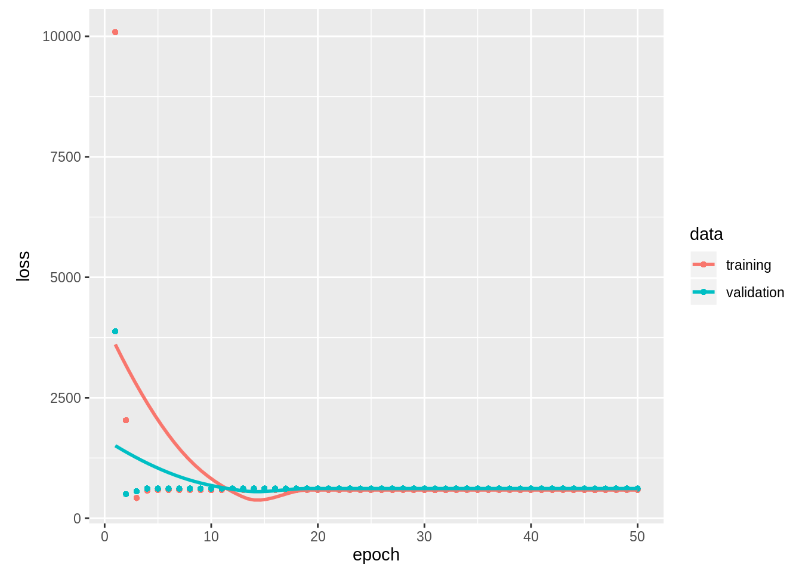

# Keras Package Tutorial

Patrick Stanton

Deep Learning has become a cornerstone of modern Machine Learning. The ability to develop and train neural networks is a necessity for any Data Scientist. One of the most prevalent packages that enables us to do so is called Keras. This tutorial will show you how to use this package in R.

## Installation

Keras is high-level API that runs atop a more powerful package called Tensor Flow. The installation is pretty straightforward. We simply install the package using CRAN, load into library, and run the installation function.


```r
install.packages("keras")
library(keras)
install_keras()
```

```
## Creating virtual environment '~/.virtualenvs/r-reticulate' ...
## Using python: /usr/bin/python2.7
## Using virtual environment '~/.virtualenvs/r-reticulate' ...
## 
## Installation complete.
```

## Obtaining a Dataset

A wonderful thing about keras is that it comes with several datasets on it including CIFAR10, MNIST, and many more. For our 
toy example, we will use the 1970s Boston housing survey dataset. This dataset contains 13 variables regarding various features of 506 neighborhoods in Boston, including crime rates, retail presence, and many others. Using these attributes, we are going to attempt to building a model that predicts the median home value of the neighborhood. The dataset conveniently comes divided into training and testing data. Thus, all we need to do is load them into variables.


```r
boston <- dataset_boston_housing()
train_x <- boston$train$x
train_y <- boston$train$y
test_x <- boston$test$x
test_y <- boston$test$y
```


## Building a model

We will now design a simple sequential model architecture of three dense layers with 100, 25, and 1 neurons, respectively. For our activation function, we will use relu. This is an extraordinarily popular activation function as it maps non-linear trends very well. Other popular activation function include hyperbolic tangent and sigmoid. This is obviously much too complex of an architecture for this dataset. However, we are merely interested in showing interesting model specifications. Notice that this model takes in a vector with a length of 13 and outputs a scalar value.


```r
model <- keras_model_sequential()

model %>% layer_dense(units = 100, activation = "relu", input_shape = c(13)) %>%
layer_dense(units = 25, activation = "relu") %>%
layer_dense(units = 1, activation = "relu")
```

Now that we have designed our architecture, we must compile the model. In this function, we define the loss function and optimizer for training. Since we are mapping to a single continuous value, mean squared error is a good choice for the loss function. If this were a classification problem, we would probabily use the categorical cross-entropy loss function, or some other more fitting loss function. For our optimizer, we will choose adam, which is the most commonly used optimizer in industry. This code establishes several hyperparameters of our model and prepares it to be trained.


```r
compile(model, loss = "mse", optimizer = optimizer_adam())
```

Now, the real fun. In this code section, we get to see our model in action. For the purposes of this tutorial, we are going to train on the entire training set. Ordinarily, we would partition off a section of the training set for validation purposes. Instead, we will use the testing set as our validation set. The fit function allows us to select how many times we would like backpropagate the errors through the network as well as the batch size of training examples being fed into the network. The fit function returns the loss of both the training and validation set after each iteration. We will store these values in the history variable for later purposes.


```r
history <- fit(model, train_x, train_y, epochs=50, batch_size = 100, validation_data = list(test_x, test_y))
```

Suppose we would now like to visualize the training and validation losses over the epochs. We simply use the plot function on the history variable. This provides valuable information regarding the fit of our model. 


```r
plot(history)
```



Congratulations, you have just trained a neural network. As you can see, we have achieved pretty good mean squared loss for both partitions of the dataset. Hence, we have a fairly

I hope this tutorial has taught you some of the interesting things you can do with the keras R package.
