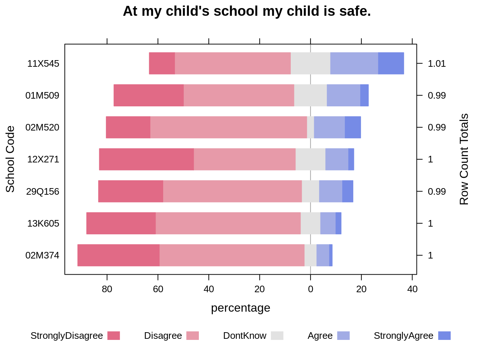
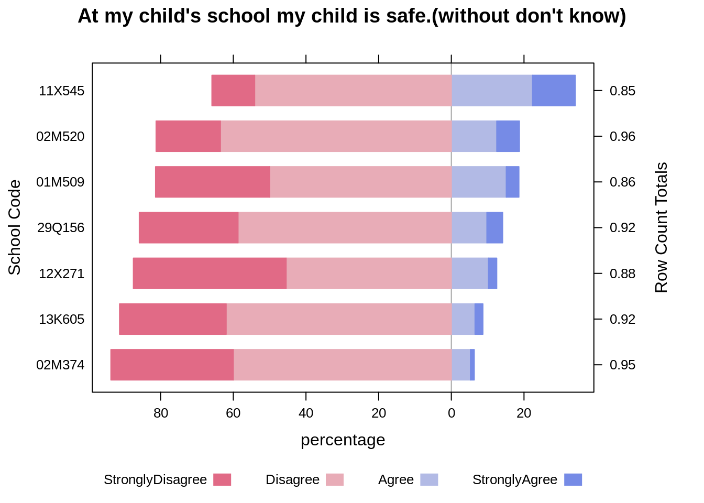
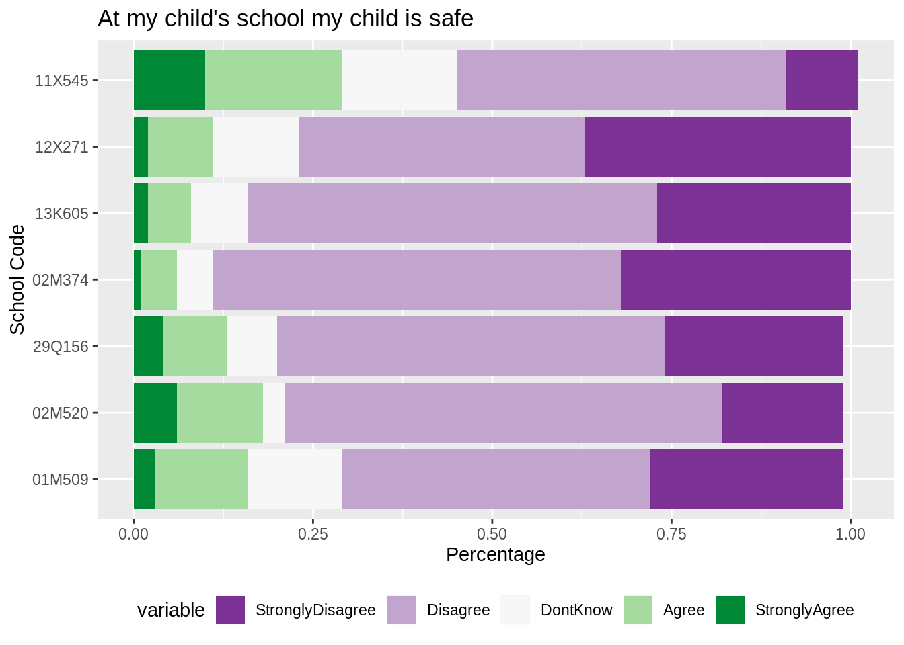

# How to plot likert data

Zining Fan and Xinyuan He

## Introduction

The Likert scale is a five (or seven) point scale which is used to allow the individual to express how much they agree or disagree with a particular statement. A common set of 5 answers can be selected are: Strong Disagree, Disagree, Don't Know/Not Sure, Agree and Strongly Agree. 

To visualize the result of a Likert scale datasets, we can use diverging stacked bar chart or stacked bar chart, which we will introduce later in this chapter.

## Diverging stacked bar chart using function likert()

Here is an example of how to plot likert data. We could use function likert(), it is in the package "likert". The plot looks like a diverging bar chart.


The code and the plot are shown below, 

```r
# use function likert() to plot likert data
HH::likert(DBN~., b, positive.order=TRUE, as.percent = TRUE,
           main="At my child's school my child is safe.",
           xlab="percentage",ylab="School Code")
```



In this picture, the statement is "At my child's school my child is safe.". We could see that the percentage of each catogary for different schools, the "don't know " is set at the middle in the likert plot. 

## Data cleaning and preparation

Actually, before we plot, the first thing we need to do is to tidy data. Transforming data to the format we want is very important and more challengeable than ploting. After transforming, the tidy data looks like, 


```r
# view data frame
b
```

```
##      DBN StronglyDisagree Disagree DontKnow Agree StronglyAgree
## 1 01M509             0.27     0.43     0.13  0.13          0.03
## 2 02M374             0.32     0.57     0.05  0.05          0.01
## 3 02M520             0.17     0.61     0.03  0.12          0.06
## 4 11X545             0.10     0.46     0.16  0.19          0.10
## 5 12X271             0.37     0.40     0.12  0.09          0.02
## 6 13K605             0.27     0.57     0.08  0.06          0.02
## 7 29Q156             0.25     0.54     0.07  0.09          0.04
```

In the table above, each line represents the data from school. The data is in percentage format. If you want to know more about this dataset, you could go to https://www.schools.nyc.gov/about-us/reports/school-quality/nyc-school-survey.

There is another choice to plot the dataset. In the likert data, the neutral data or "don't know" data is the least important, so we could exclude these data. The plot looks like :


```r
# exclude "don't know" 
bb <- b[,c(1,2,3,5,6)]
HH::likert(DBN~., bb, positive.order=TRUE,as.percent = TRUE,
           main="At my child's school my child is safe.(without don't know)",
           xlab="percentage",ylab="School Code")
```



In the plot above, we could clearly compare the percentage of "Agree" and "StronglyAgree" to "Disagree" and "StronglyDisagree". 

## Stacked bar chart using ggplot()

Another way to plot the likert data is to use stacked bar chart. We can use ggplot() and gemo_bar to implement the stacked bar chart as shown in the example below.

Before drawing the stacked bar chart with ggplot(), we need to reorganize the dataset into the following format:

```r
mb = melt(b)
mb
```

```
##       DBN         variable value
## 1  01M509 StronglyDisagree  0.27
## 2  02M374 StronglyDisagree  0.32
## 3  02M520 StronglyDisagree  0.17
## 4  11X545 StronglyDisagree  0.10
## 5  12X271 StronglyDisagree  0.37
## 6  13K605 StronglyDisagree  0.27
## 7  29Q156 StronglyDisagree  0.25
## 8  01M509         Disagree  0.43
## 9  02M374         Disagree  0.57
## 10 02M520         Disagree  0.61
## 11 11X545         Disagree  0.46
## 12 12X271         Disagree  0.40
## 13 13K605         Disagree  0.57
## 14 29Q156         Disagree  0.54
## 15 01M509         DontKnow  0.13
## 16 02M374         DontKnow  0.05
## 17 02M520         DontKnow  0.03
## 18 11X545         DontKnow  0.16
## 19 12X271         DontKnow  0.12
## 20 13K605         DontKnow  0.08
## 21 29Q156         DontKnow  0.07
## 22 01M509            Agree  0.13
## 23 02M374            Agree  0.05
## 24 02M520            Agree  0.12
## 25 11X545            Agree  0.19
## 26 12X271            Agree  0.09
## 27 13K605            Agree  0.06
## 28 29Q156            Agree  0.09
## 29 01M509    StronglyAgree  0.03
## 30 02M374    StronglyAgree  0.01
## 31 02M520    StronglyAgree  0.06
## 32 11X545    StronglyAgree  0.10
## 33 12X271    StronglyAgree  0.02
## 34 13K605    StronglyAgree  0.02
## 35 29Q156    StronglyAgree  0.04
```

Then we plot the data, the code and plot are shown below, 


```r
g2 = ggplot()+
  geom_bar(data = mb, aes(x = reorder(DBN,value), y=value, fill=variable), position="stack", stat="identity")+
  coord_flip() + 
  ggtitle("At my child's school my child is safe")+
  ylab("Percentage")+
  xlab("School Code")+
  scale_fill_brewer(palette="PRGn")+
  theme(legend.position="bottom")
  #scale_x_discrete(limits=c("StronglyAgree", "Agree", "DontKnow","Disagree","StronglyDisagree"))
g2
```



One advantage of using stacked bar chart is that: since these two features "StronglyAgree" and "StronglyDisagree" are placed at the two ends of the bars,the comparisions between them are very clear. While it will be relatively hard to compare features placed in the middle of the bars, like "Disagree" and "Agree". 

## Summary

There are many options to visualize likert data as shown in the previous sections, and each with different advantages and disadvantages. You can choose based on your needs. If you would like to find more information you can go to https://blog.datawrapper.de/divergingbars/.
