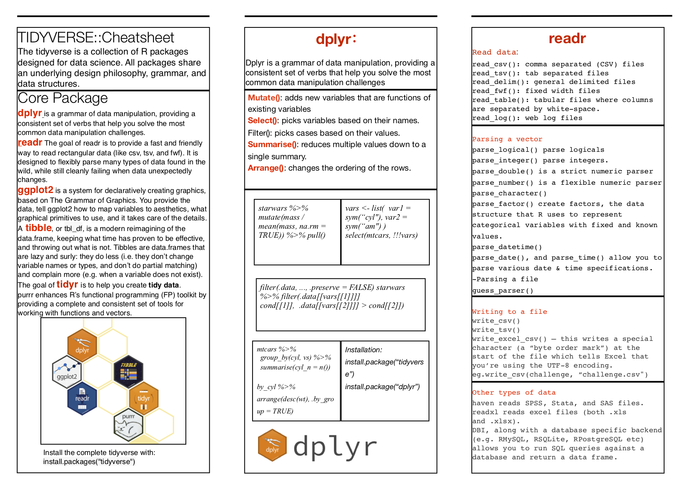

# Working with data links

## Categorical data cheatsheet

Zhi Qi

This chapter provides a cheatsheet that helps you tackle categorical data. It breaks down what form of graph to use by the type and the number of variables. More information available on edav.info/

Cheatsheet:
https://github.com/michaelqizhi/Categorical-data-cheatsheet/blob/master/Categorical%20Variables%20Cheatsheet.pdf

## Data wrangling with R cheatsheet:

Tabitha K. Sugumar

Goal: Reference sheet for commonly used functions when doing basic data wrangling and cleaning tasks. Consolidate this information in an easy to find place in order to double check syntax, which version of a function to use, etc.

Functions included: 

Subsetting: filter, select
Applying: apply, lapply, sapply, vapply
Reshaping: cbind, rbind, merge, melt, cast, gather, spread, arrage
Aggregation: groupby, summarize, aggregate
Manipulation: mutate, transmute, mutate_if, mutate_at, mutate_all, trimws, substr, make_clean_names, na.omit, is.na, remove_empty

Link: https://github.com/tks19/EDAV/blob/master/DataWranglingwithRCheatsheet.pdf

## Date and Time Cheatsheet in R

Kanika Aggarwal and Swarna Bharathi Mantena

We both prepared a cheatsheet for the Date and Time manipulations in R programming language. Mentioned below is the github link and the references used. 
NOTE: We uploaded the cheatsheet as a pdf file in the github repository. 
    
Github Link:

https://github.com/SwarnaBharathiMantena/EDAV_CommunityContribution

References:

http://ianmadd.github.io/pages/POSIXct_and_POSIXlt.html

https://www.cyclismo.org/tutorial/R/time.html

https://stackoverflow.com/questions/7561400/strptime-function-in-r-to-manipulate-date-time-class

https://astrostatistics.psu.edu/su07/R/html/base/html/strptime.html

https://www.stat.berkeley.edu/~s133/dates.html

https://readr.tidyverse.org/reference/parse_datetime.html

https://www.stat.berkeley.edu/~s133/dates.html 

https://stat.ethz.ch/R-manual/R-devel/library/base/html/Sys.time.html

https://learnr.wordpress.com/2010/02/25/ggplot2-plotting-dates-hours-and-minutes/

## rvest cheatsheet

Huayun Xu and Zelin Li

This project creates a cheatsheet on rvest package in R.

link: https://github.com/MXKLZL/rvest-cheatsheet/blob/master/contribution.pdf

## tidyverse cheatsheet

Huimin Jiang and Yiming Huang

## Python vs R (video)

Nima Chitsazan and Foad Khoshouei

We created a video describing visualization in python and R. For python we specifically focused on matplotlib library and compared it to ggplot library of R. 

The video is available on youtube:
https://youtu.be/phVKWXaAStY

The slides are available:
https://github.com/fk2377/EDAVCC

## R package writing (workshop)

Siddhant Shandilya and Mohit Chander Gulla

R packages are an ideal way to package and distribute R code and data for re-use by others.

This workshop will provide you with an overview of how to create your own pacakge in R. 

The walkthrough gives step by step instructions on how to define your functions, create a project for your package, embed your functions and its documentation within it and finally how to compile and build it into an R package that is ready to be shared or published.

All the materials used in the workshop can be found at: https://github.com/siddhantshandilya/EDAV---Community-Contribution-19

You may refer to the reference links provided at the end of the pdf which goes into further details on how to publish your package on CRAN repository, if you are interested.

## Regex (workshop)

Author: Cheng Yan, Chao Huang

This workshop may offer you a basic understanding of regular expression and how it can be used to solve various problems. The workshop is divided into four sections, from the definition of regular expression to the application of regular expression in EDAV. This page is just a roadmap of the workshop and you can find more details and examples in the slides of the workshop [here](resources/regex_workshop/RegEx_101.pdf).

**Definition of Regular Expression**

In this section, we introduce the definition of regular expression and typical scenarios where we can apply this powerful tool.

**Basic syntax of Regular Expression**

In this section, we introduce the basic syntax of regular expression, including wildcards, set, meta-characters, repeated matches, position matching and etc. These patterns can help solve most of the string manipulation problems we meet in our daily work.

**Advanced syntax of Regular Expression**

Besides basic syntax, we also introduce some more advanced techniques, including group capturing and looking around. With these tools, you can construct more complex and also more powerful regular expressions. 

**Application in EDAV**

By using regular expression to solve a string wrapping problem given at PSet2 in one line of code, we show how to compile and use regular expression in R.

For those who want to know more about regular expression, two books are highly recommended, namely __*"Sams Teach Yourself Regular Expressions in 10 Minutes"*__ and __*"Mastering Regular Expressions"*__.

## GitHub help session (workshop)

Karthik Rajaraman Iyer and Akshay Pakhle

We held a walk in doubt session for peers , helping them resolve issues with the github workflow. While some had trouble setting up environment variables in GitBash, other common clarifications were about the brached workflow, creation/handing of pull requests and the appropriate use of issues.

We also helped in designing a practice assignment to get a grasp over the github workflow.
