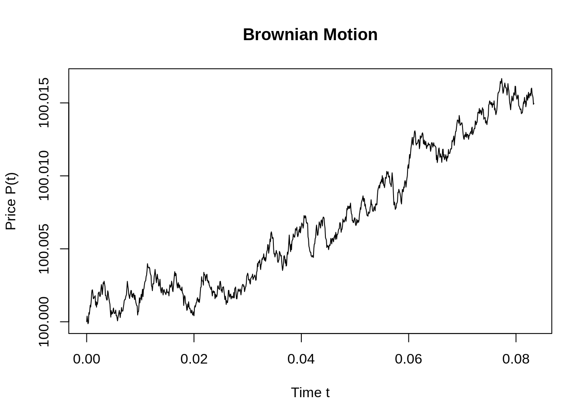
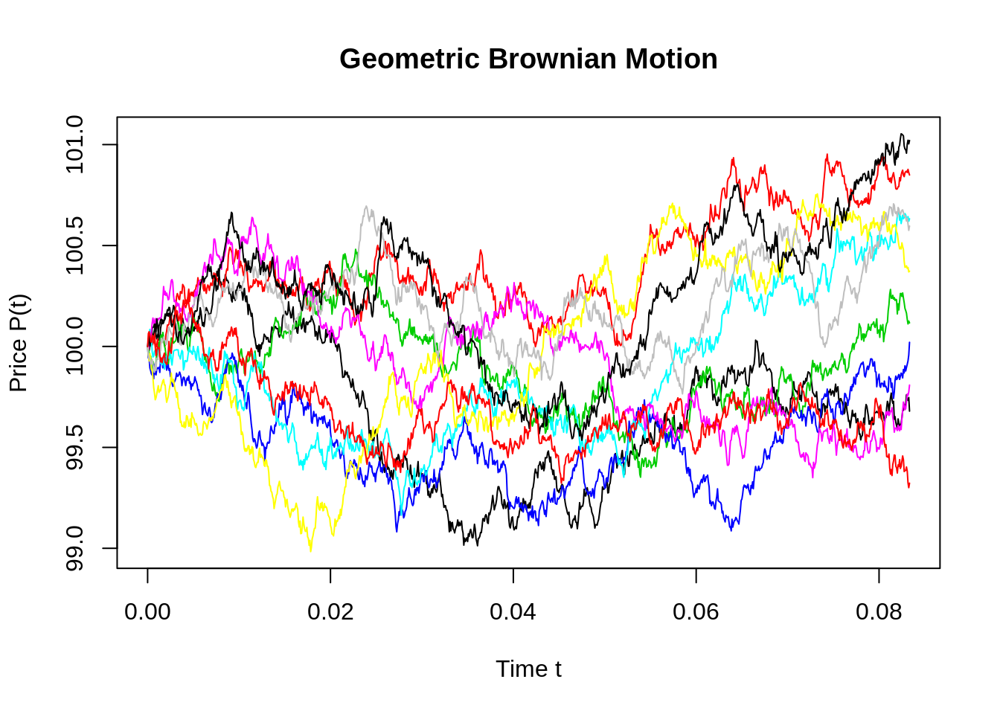
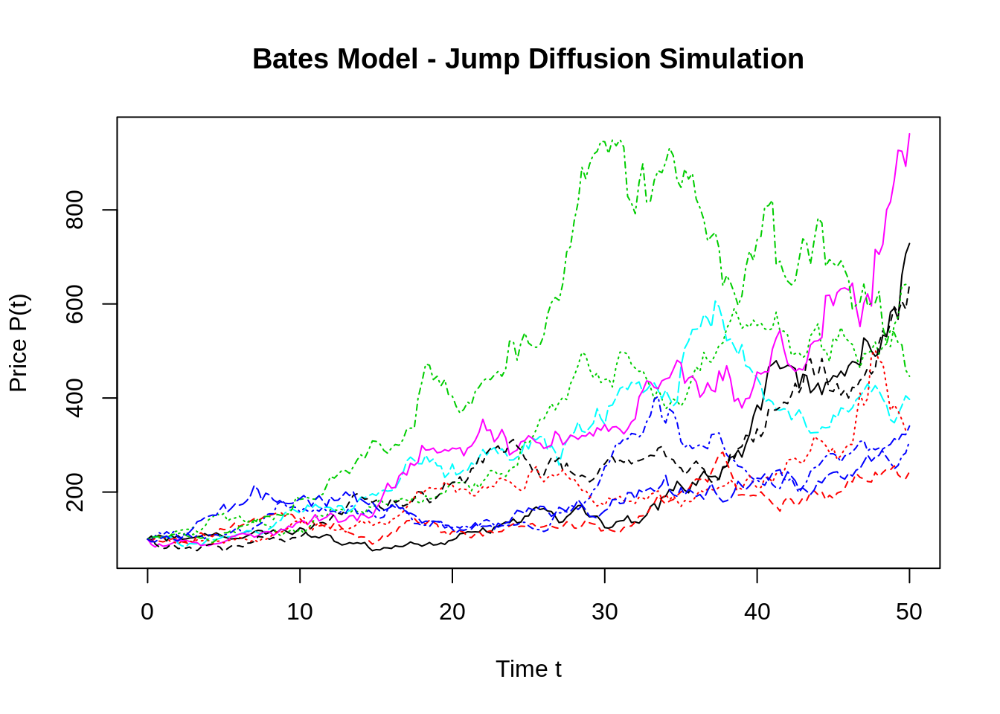

# Modeling links


## Exploring Financial Models

Shreyas Jadhav(sj3006), Andrei Sipos(ags2202), Gideon Teitel(gt2288)


We made a presentation on exploration and visualization of Financial models and presented it in class on 28th October 2019. 

The presentation involved analysis of 3 models namely:

* Modern Portfolio Theory (Markowitz Model)
* Capital Asset Pricing Model (CAPM)
* Brownian Motion and Bates Model - Jump Diffusion

We have analysed and implemented the models in python and R.  

Following are the links for the same:

LINKS: 

Code for: Modern Portfolio Theory (Markowitz Model) and Capital Asset Pricing Model (CAPM) : https://github.com/shreyasj3006/Exploring-Financial-Models

Link for the entire presentation :
https://drive.google.com/open?id=0B9K8qs96dJgzZGhkNHRvS051dmlDc2dwcWl6enNIQzdXcHhJ

Note: Please use your lionmail id to access this link.


Code for Simple Brownian Motion Simulation:


```r
miu=0.01; sigma=0.03; T=1/12; n=1000; P0=100;
dt=T/n

t=seq(0,T,by=dt)
Price=c(P0,miu*dt+sigma*sqrt(dt)*rnorm(n,mean=0,sd=1))
Price=cumsum(Price)
plot(t,Price,type='l',ylab="Price P(t)",xlab="Time t",main = "Brownian Motion")
```




```r
#install.packages("sde")

library(sde)

nt=10; 

t=seq(0,T,by=dt)
X=matrix(rep(0,length(t)*nt), nrow=nt)

for (i in 1:nt) {
  X[i,]= GBM(x=P0,r=miu,sigma=sigma,T=T,N=n)
  }


plot(t,X[1,],t='l',ylim=c(min(X), max(X)), col=1, ylab="Price P(t)",xlab="Time t",main = "Geometric Brownian Motion")

for(i in 2:nt){lines(t,X[i,], t='l',ylim=c(min(X), max(X)),col=i)}
```



```r
#
```


```r
#install.packages("ESGtoolkit")

library(ESGtoolkit)

eps0 <- simshocks(n = 10, horizon = 50, frequency = "quart")
sim.GBM <- simdiff(n = 10, horizon = 50, frequency = "quart", model = "GBM", P0, theta1 = 0.03, theta2 = 0.1, eps = eps0)
matplot(time(sim.GBM), sim.GBM, type = 'l', ylab="Price P(t)",xlab="Time t",main = "Bates Model - Jump Diffusion Simulation")
```




## Overview of the t-SNE algorithm

Arjun Dhillon

For my community contribution, I'll be delivering a 5-mintue lightning presentation on t-distributed stochastic neighbor embeddings (t-SNE).  The t-SNE algorithm is useful in representing high-dimensional data in 2 or 3 dimensions.  The process works by mapping higher dimensional data points to 2 or 3 dimesional datapoints in such a way that similar data points have higher probability of being near one another.  It is especially useful for visualizing latent reprsentations of data in neural networks.  

The main idea of t-SNE is to minimize the Kullback-Leibler divergence of the distribution $Q$ of points in the remapped space from the distribution of points in $P$ the original space:

$$KL(P||Q) = \sum_{i \ne j} p_{ij} \log \frac{p_{ij}}{q_{ij}}$$,

where $p_{ij}$ represents the similarity of two points in the original space:

$$p_{ij} = \frac{\exp( - \lVert x_i - x_j \rVert^2 / 2 \sigma_i^2)}{\sum_{k \ne i} \exp( - \lVert x_i - x_j \rVert^2 / 2 \sigma_i^2)}$$
and $q_{ij}$ represents the similarity of the mappings $y_i$:

$$q_{ij} = \frac{(1 + \lVert y_i - y_j \rVert^2)^{-1}}{\sum_{k \ne i} (1 + \lVert y_i - y_j \rVert^2)^{-1}}$$


