# Midsemester Review

Tiffany Zhu tz2196 and Olivia Wang yw3324


## Lecuture 1: Introduction

* Exploratory Data Aanlysis (EDA)
  + detecting patterns, finding outliers, making comparisons, identifying clusters
* Data science pipeline
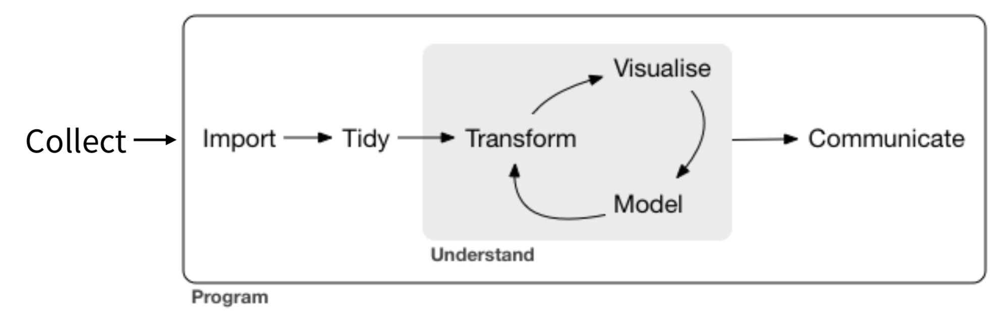
* Exploration vs visualization
  + Exploratory vs explanatory
  + Not mutually exclusive

## Lecture 2: Histograms


```r
x <- rnorm(N)
df <- data.frame(x)
ggplot(df, aes(x)) + 
  geom_histogram() +
  ggtitle("Histogram of Random Data")
```

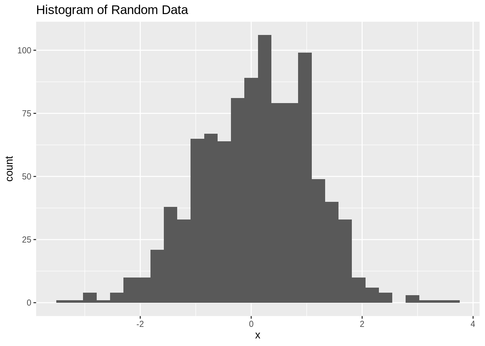


* Summary:
  + Primary tool for continuous variables
  + Different types: Count (frequency)/relative frequency/cumulative frequency/density
  + Boundaries
    + default in R: right closed (e.g. (55,60])
  + Bin width
    + Sometimes multimodality might disappear with change in binwidth
    + using non-integer binwidth can conceal useful empirical info
    + unequal bin width should be avoided

* Relative frequency histograms:
  + Area under curve is 1
  + $Relative Frequency = \frac{count}{total}$
  + $Density = \frac{Relative Frequency}{BinWidth}$
* Uneven binwidth histogram:
  + Density histogram should be used
* Uneven binwidth histogram:
  + Density histogram should be used
* Cumulative frequency:
  + e.g. how many ppl can have weight less than X
* Good for:
  + emphasizing features of the raw data
* Bad for:
  + density estimates


## Lecture 3: Grammar of Graphics
* Why use a grammar? Becuase More flexible, more room for growth
* Building blocks
  + Layers (many)
    + geom → aesthetic mapping, stat, position
  + coord (1)
  + facet (1)
  + scales (1 per mapping)
    + x → scale_x_date(), y → scale_y_continuous(), color → scale_color_manual()
  +theme (1)
* Example mnemonic to remember order:
  + *G*eometry *C*lass *F*eels *S*o *L*ame *T*oday
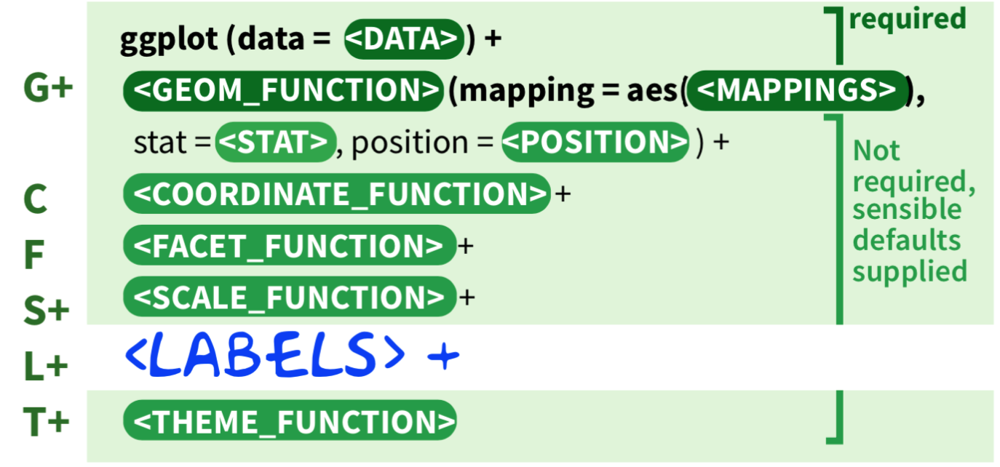


## Lecture 4: Common ggplot2 Problems
* aes() not needed for constant values
* correct example – color varies with z
* ggplot(df, aes(x, y, color = z)) + geom_point()
* if missing legend, data is not tidy (use gather())


## Lecture 5: Boxplots & Continuous Variables

#### Boxplot Overview
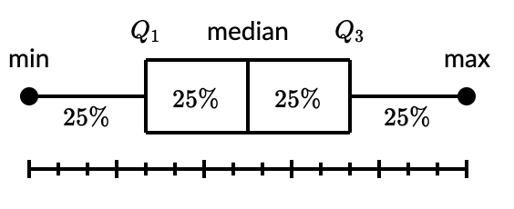
* Boxplot components
  + minimum
  + quartile 1 (lower hinge)
  + quartile 2 (median)
  + quartile 3 (upper hinge)
  + maximum
* `interquartile range` (hinge spread) 
  + $IQR = Q3 – Q1$
* Can easily see outliers
    + Point is outlier if it falls outside of fences
    + Upper Fence: 1.5*hinge + upper hinge (Q3)
        + 1.5*IQR + Q3
    + Lower Fence: 1.5*hinge - lower hinge (Q1)
        + 1.5*IQR - Q1
* Best for comparing the distribution of a variable across the groups (textbook-ch 3)
* If multiple boxplots, should reorder by something (e.g. median, max value, standard deviation)

#### Comparing Histograms to Boxplots


```r
par(mfrow=c(3,2))
hist(x, main="Histogram of Normal Data")
boxplot(x, horizontal=T, main='Boxplot of Normal Data')

x <- c(0, 0, 1, 1, 1, 2, 2, 3, 3, 4, 5, 7, 10)
hist(x, main="Histogram of Right Skewed Data")
boxplot(x, horizontal=T, main='Boxplot of Right Skewed Data')

x <- c(0, 0, 1, 1, 1, 2, 2, 3, 3, 4, 5, 7, 8, 9, 9, 9, 10, 10)
hist(x, main="Histogram of Bimodal Data")
boxplot(x, horizontal=T, main='Boxplot of Bimodal Data')
```

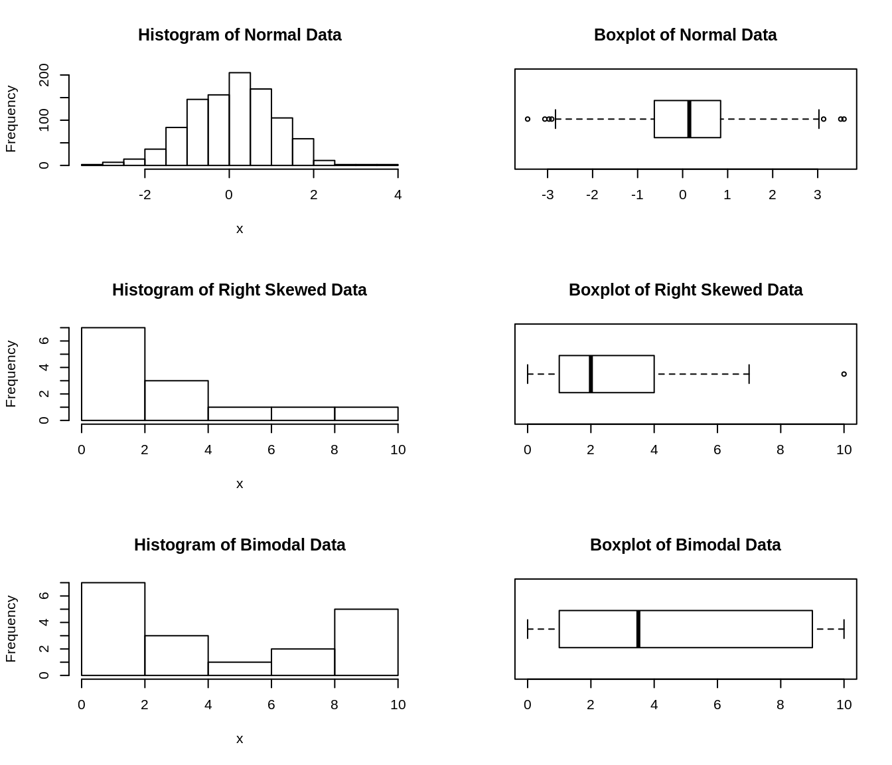


* `violin plots`
    + density curves--> rotated
    + bandwidth really matters
    + box plot vs. violin:
        + skinny quartile: lots of data
        + fat one: little data
* `Ridgeline plots`: density curve plots shifted - good for multimodality
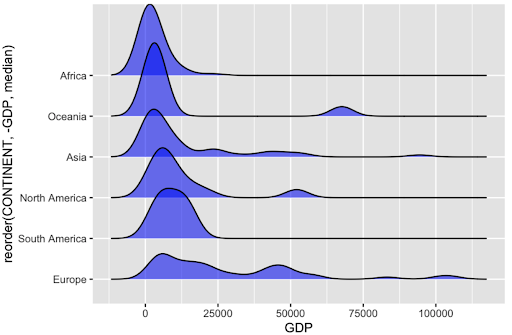

## Lecture 6: Rounding Normal (Continuous Variables Wrap-up)
* You can tell if the data is rounded or not by: 
    + changing the bin width (to see gaps)
    + Stem and leaf plot

* Q-Q plot (quantile-quantile)
    + If distribution is normal, you will get a straight line


```r
x <- rnorm(N, 50, 10)
qqnorm(x)
qqline(x, col = "red")
```

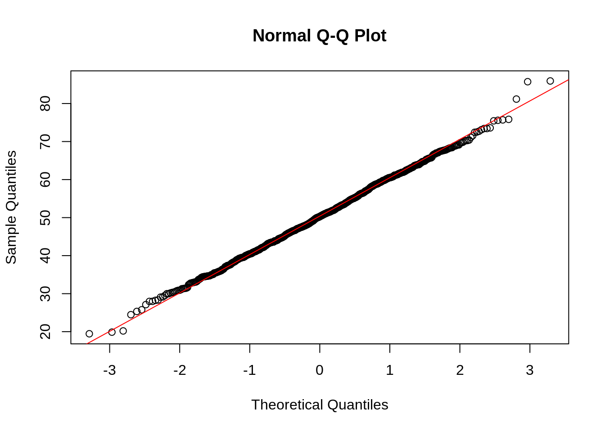

* Other ways to test normality is by:
    1. Putting density curve & normal curve on top of the histogram
    2. Shapiro-Wilk test
        + Null Hypothesis: Data is normally distributed
        + Alternative Hypothesis: Data is NOT normally distributed
        + Check the p-value
        
## Lecture 7: Graphical Perception
* Gets harder and harder to perceive:
  + Position along a common scale
  + Position along identical, nonaligned scales
  + Length
  + Angle / Slope
  + Area
  + Volume
  + Color hue / Color saturation / Density
  
## Lecture 8: Categorical Variables (Textbook: Chapter 04)
* Summary:
    + https://github.com/jtr13/codehelp/blob/master/R/reorder.md
    + Hard to work with
    + Not a lot of options
    + Choice about which categories to display
    + Choice of the order of categories
    + Data cleaning takes more time
* Types of data
    + Nominal – no fixed category order -> order by frequency
        + Bar charts
            + Order by frequency: Sort from highest to lowest count (left to right or top to bottom)
            + Natural order
    + Ordinal – fixed category order -> use natural order
        + Bar chart
            + Sort in logical order of categories
            + can't change binwidth
    + Discrete – small # of possibilities
        + Cleveland dot plot
    + Not always clearcut: nominal vs ordinal, ordinal vs discrete,
    + Sometimes numbers = nominal, not discrete
* `Bar charts`
    + how to order:
        + if ordinal: order by natural order
        + If nominal: order by frequency count
        + If data is binned, use geom_col, If data unbinned, use geom_bar
        1. unbinned, ordinal, correct level order
            + geom_bar
        2. unbinned, ordinal, levels out of order
            + geom_bar, fct_relevel
        3. binned, ordinal, correct level order
            + geom_col
        4. binned, ordinal, levels out of order
            + geom_col, fct_inorder
        5. unbinned, nominal
            + geom_bar, fct_infreq
        6. binned, nominal
            + geom_col, fct_reorder
  + example:


```r
library(dplyr)
colors <- as.data.frame(HairEyeColor)

# just female hair color, using dplyr
colors_female_hair <- colors %>%
  filter(Sex == "Female") %>%
  group_by(Hair) %>%
  summarise(Total = sum(Freq))

ggplot(colors_female_hair, aes(x = Hair, y = Total)) +
  geom_bar(stat = "identity") +
  ggtitle("Bar Graph Using ggplot2")
```


## Lecture 9: Web Scraping & rvest package
* `Web scraping`
    + Should be last resort
    + Better to use an API (httr package) or R package
    + Investigate legal issues, think about ethical questions, limit bandwidth use

## Lecture 10: Scatterplots - 2 Continuous Variables (Textbook: Chapter 05)


```r
ggplot(cars, aes(speed, dist)) + geom_point() + ggtitle('Scatter Plot of Cars Data')
```

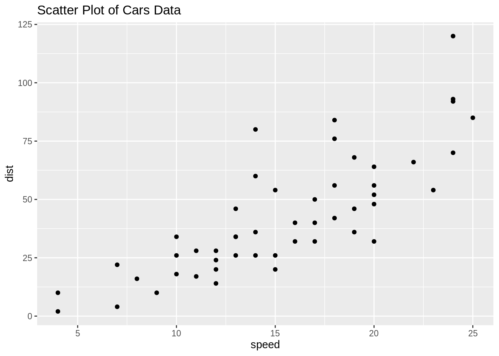

* `Features` visible in scatterplots 
    + Correlation (Correlation != Causation) => dependent variable on the y-axis
    + Associations
    + Outliers
    + Clusters
    + Gaps (where particular combinations of values do not occur)
    + Barriers (Boundaries) (where some combinations of values may not be possible. e.g. having more years of experience than their age)
    + Conditional Relationships (different relationships for different intervals of x)
* Strategies
    + Use techniques to deal with over plotting 
    + open circles
    + Alpha blending
    + Plotly (interactive)
    + Don’t plot all points 
    + temporarily remove outliers, start off with sampling, subset data on the
    + basis of some variable, such as “freshmen”
    + Heatmaps 
    + bin counts or density estimates
    + Density contour lines 
    + to see if there’s a clear cluster or not
    + Combination of above 
    + Multiple variables: scatterplot matrices

## Lecture 11: Parallel Coordinates
* Used for multiple (more than 2) continuous variables
* Where there are a lot of repeat data, splines make PC plots more useful
* Interpreting Parallel Coordinates
  + Twisting means that the variables are negatively correlated
  + Straigh parallel lines means that the variables are strongly positively correlated 
  + Otherwise, variables are not correlated
  

```r
library(datasets)
library(GGally)

ggparcoord(iris, columns=1:4, title = "Parallel coordinate plot for Iris flowers")
```


## Lecture 12: Interactive Parallel Coordinates (Htmlwidget: parcoords)
* Interactive PC good for recognizing outliers 
* Parallel coordinate plots need to be interactive to be fully effective 
* Alpha blending, color, filter out (certain data)


```r
library(parcoords)
parcoords(mtcars, brushMode = "1d-axes", rownames=F, reorderable = TRUE, withD3 = TRUE)
```

<!--html_preserve--><div class="parcoords html-widget" height="480" id="htmlwidget-5b17cca842a778f7a96c" style="width:672px;height:480px; position:relative; overflow-x:auto; overflow-y:hidden; max-width:100%;" width="672"></div>
<script type="application/json" data-for="htmlwidget-5b17cca842a778f7a96c">{"x":{"data":{"names":["Mazda RX4","Mazda RX4 Wag","Datsun 710","Hornet 4 Drive","Hornet Sportabout","Valiant","Duster 360","Merc 240D","Merc 230","Merc 280","Merc 280C","Merc 450SE","Merc 450SL","Merc 450SLC","Cadillac Fleetwood","Lincoln Continental","Chrysler Imperial","Fiat 128","Honda Civic","Toyota Corolla","Toyota Corona","Dodge Challenger","AMC Javelin","Camaro Z28","Pontiac Firebird","Fiat X1-9","Porsche 914-2","Lotus Europa","Ford Pantera L","Ferrari Dino","Maserati Bora","Volvo 142E"],"mpg":[21,21,22.8,21.4,18.7,18.1,14.3,24.4,22.8,19.2,17.8,16.4,17.3,15.2,10.4,10.4,14.7,32.4,30.4,33.9,21.5,15.5,15.2,13.3,19.2,27.3,26,30.4,15.8,19.7,15,21.4],"cyl":[6,6,4,6,8,6,8,4,4,6,6,8,8,8,8,8,8,4,4,4,4,8,8,8,8,4,4,4,8,6,8,4],"disp":[160,160,108,258,360,225,360,146.7,140.8,167.6,167.6,275.8,275.8,275.8,472,460,440,78.7,75.7,71.1,120.1,318,304,350,400,79,120.3,95.1,351,145,301,121],"hp":[110,110,93,110,175,105,245,62,95,123,123,180,180,180,205,215,230,66,52,65,97,150,150,245,175,66,91,113,264,175,335,109],"drat":[3.9,3.9,3.85,3.08,3.15,2.76,3.21,3.69,3.92,3.92,3.92,3.07,3.07,3.07,2.93,3,3.23,4.08,4.93,4.22,3.7,2.76,3.15,3.73,3.08,4.08,4.43,3.77,4.22,3.62,3.54,4.11],"wt":[2.62,2.875,2.32,3.215,3.44,3.46,3.57,3.19,3.15,3.44,3.44,4.07,3.73,3.78,5.25,5.424,5.345,2.2,1.615,1.835,2.465,3.52,3.435,3.84,3.845,1.935,2.14,1.513,3.17,2.77,3.57,2.78],"qsec":[16.46,17.02,18.61,19.44,17.02,20.22,15.84,20,22.9,18.3,18.9,17.4,17.6,18,17.98,17.82,17.42,19.47,18.52,19.9,20.01,16.87,17.3,15.41,17.05,18.9,16.7,16.9,14.5,15.5,14.6,18.6],"vs":[0,0,1,1,0,1,0,1,1,1,1,0,0,0,0,0,0,1,1,1,1,0,0,0,0,1,0,1,0,0,0,1],"am":[1,1,1,0,0,0,0,0,0,0,0,0,0,0,0,0,0,1,1,1,0,0,0,0,0,1,1,1,1,1,1,1],"gear":[4,4,4,3,3,3,3,4,4,4,4,3,3,3,3,3,3,4,4,4,3,3,3,3,3,4,5,5,5,5,5,4],"carb":[4,4,1,1,2,1,4,2,2,4,4,3,3,3,4,4,4,1,2,1,1,2,2,4,2,1,2,2,4,6,8,2]},"options":{"rownames":false,"brushMode":"1D-axes","brushPredicate":"AND","reorderable":true,"margin":{"top":50,"bottom":50,"left":100,"right":50},"mode":false,"bundlingStrength":0.5,"smoothness":0},"autoresize":false,"tasks":null},"evals":[],"jsHooks":[]}</script><!--/html_preserve-->

## Lecture 13: Git - Workflow
* Create local clone of your repository bc hard to write code on GitHub
* Simple workflow
  + From local: 1. pull, 2. write code, 3. commit/push


## Lecture 14: Multivariate Categorical Variables (e.g. Mosaic Plots)
* `Categorical data`
    + It has categories
    + Data formats:
        + Cases
        + COUNTS (tidy data with Freq Column)
        + Contingency or pivot table
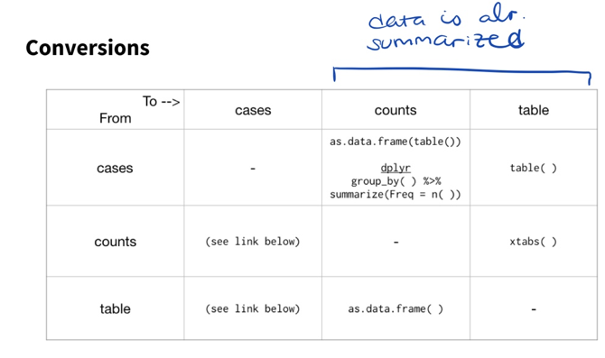

* `Multivariate Categorical` 
    + FREQUENCY
        + Bar charts
            + Grouped vs. stacked
                + Stacked: interested in overall total
                + Grouped: the rest
            + The closer things are, the easier to compare
        + Cleveland dot plot
            + Two dots on the same horizontal level: for simplicity of comparison
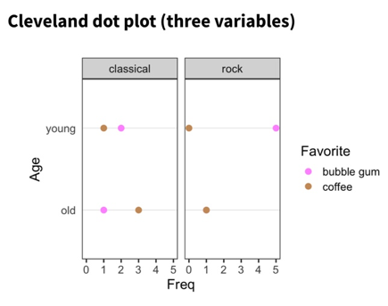

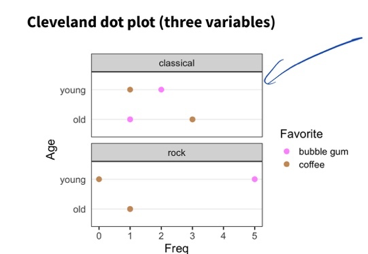

* PROPORTION/ASSOCIATION
    + Mosaic Plots
        + Any filled rectangular plot (no white space) with consistent numbers of rows and columns, in which the area of each small rectangle is PROPORTIONAL to the FREQUENCY count for a UNIQUE combination of levels of the categorical variable displayed


```r
library(vcd)
library(ucidata)
mosaic(cp ~ exang,
       labeling = labeling_border(rot_labels = c(45, 0, 0, 0),
                                  abbreviate_labs = c(6)),
       main = 'Chest Pain vs Exercise Induced Angina',
       heart_disease_cl)
```


        
* Best practices
    + Dependent variables is split LAST and split HORIZONTALLY
    + Fill: set to dependent variable
    + Other variables are split vertically
    + Level of dependent variable is closest to the x-axis and darkest
* `Mosaic pairs plot`
    + You are looking at 2 at a time
    + Looking for strong linear relationships between variables
    + Strongest: most staggered; we thus decide to zoom in on those variables
* Disadvantages:
    + Labeling is a nightmare
* `Fluctation Diagrams`
    + Shows same info as the mosaic plot
    + Starts off with same sized squares
    + Drawn in proportion to the one with the highest frequency count
        + Everything thus is proportional
    + All have the same aspect ratio
    + Variables having no relationship to each other: boxes of varying shapes
    + Useful for:
        + When there are a lot of variables
* `Mosaic vs. tree map`
    + Tree map: each box cannot be in more than one category (based on hierarchical data)
        + Filled rectangular plot representing hierarchical data
* `Chi Square Test of Independence`
    + Close to mosaic
    + Tests how different variables are from one another
    + We compare the observed to the expected (under the assumption of the null: assumes that the two variables are independent)
        + Graph shows that there are no interactions
* Implementation (from textbook)
    1. Starts off with an empty rectangle that represents the whole dataset
    2. Taking the first variable and dividing the HORIZONTAL axis into sections PROPORTIONAL to the sizes of its categories.
    3. Each of the rectangles is then divided along its VERTICAL axis according to the sizes of the second variable categories
    4. In theory, you can continue to divide up the rectangles alternately horizontally and vertically for as many variables as you have. (however, having too many categories makes the plot messy)
* Works well with:
    + Small number of categories
    + Ordinal dependent variables
        + As you can see cumulative patterns if they exist
* Alternative:
    + Using the pairs function in vcd
        + Produces a matrix display with the bar charts of the individual variables down the diagonal
        + As well as 6 mosaic plots both above and below the diagonal
        + Labeling is kept to a minimum
            + While efficient, plot is hard to read


## Lecture 15: Transforming Data
* General naming conventions (e.g. for files) – should be machine readable, human readable
* Data frames – avoid spaces, punctuation, special characters
* Factor levels – descriptive but not too long
    + when recoding factor levels: leave a papertrail, keep original columns if can
* Data visualization – human readability, brevity
* If possible, don’t use column names that have to be altered when plotting
* Transposing data frames 
    + t() 
        + will convert numerical to character if there are non numericals in the column
        + works best if data frame has row names
        + gather() then spread()
* transposing multiple columns
    + mutate_all, mutate_if, mutate_at

## Lecture 16: Likert
* Likert data is survey data with responses: 
  + strongly agree, agree, don't know, dislike, strong dislike
* Plots to graph likert data:
  + Stacked bar chart
  + Diverging stacked bar chart - centered at the neutral data
  + Can use `HH::likert` package


## Lecture 17: Git - Branching
1. pull
2. create new branch, 
3. write code, 
4. commit/push, 
5. submit pull request (so can merge branch into master), 
6. merge pull request, 
7. delete branch locally

## Lecturee 18: Simpson's Paradox
* Different ways of splitting the mosaic plot/faceting the data can show different and sometimes opposite trend-- as a result, it is important to note the proportions when comparing groups of different sizes 
* Wikipedia: “Where a trend appears in several different groups of data but disappears/reverses when these groups are combined” 
* Video - https://www.youtube.com/watch?v=ebEkn-BiW5k
    + when looking at just cats or just humans, can see that treatment helps.
    + but when looking at total (cat + human), seems like treatment doesn’t help.
    

## Lecture 19: Heatmaps (Textbook: Chapter 8)
* It can show FREQUENCY counts (2 D histogram- with just an x and an y-axis) or value of a third variable (which you will have to manually insert, it will not be generated automatically)
* When cleaning dataset to be used for Heat maps:
    + We need 1 column that lists all the variables
* Can be used for continuous or categorical data (both for axes and fill color)
    + However:
        + It is overused
        + Based off of color (hard to decipher) --> not our first choice
* `Categorical axes`
    + Frequency count/ time
        + Common use: gene expression
            + Rows: genes
            + Columns: samples
            + COLOR: change in gene expression LEVEL
    + Not a good option for
        + Data with small numbers of categories (small n)
            + Very hard to read (color makes it hard to see patterns)
* `Continuous axes`
    + Location
    + Eyetracking
    + Geographic Data
* `Implementation`
    + Geom_point()
    + Geom_tile() --> makes rectangles instead of dots
    + Geom_raster() --> similar to but faster than geom_tile()
    + if one variable is categorical, use fill
    + Heat map theme
        + theme(axis.line = element_blank(), axis.ticks = element_blank())
    + coord_fixed --> squares
    + white borders with geom_tile
    + rescale(value): transforms values to 0 to 1
        + rescaling: group_by key first and then rescale
        + small sample size and not rescaled?
            + Meaningless unless we look at proportions
        + Can be rescaled so that whole box/column adds to 1
    + To test that your values are correct: add geom_text()
    + Try changing color scheme to make things clearer
* Tips regarding heat maps (`from textbook`)
    + Each case is represented by a row and each variable is represented by a column
    + Individual cells are colored according to the case value relative to the  other values in the COLUMN
        + Either with a normal transformation to z score
        + Or adjusted to a scale from min to max
            + It is unwise to color according to all values in the dataset tas that highlights differences between different levels of variables instead of differences between individual cases.
    + Clusters are very important
    + Rather subjective tool
        + Can be effective for particular structures in some datasets, but cannot be relied upon to produce good results in general.
* Additional related graphs
    + Scatterplot Matrices
        + Shows relationship and association
    + Parallel coordinate plots
        + Great for studying groups of cases
        + Some of the features are already identified in the scatterplot matrix display, at least for those variables with adjacent axes.
        + A lot of information on the distribution of individual variables
            + Skewness
            + Gaps
        + Most effective if used interactively.
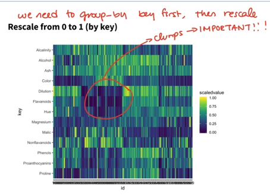 
  
## Lecture 20: Time Series (Textbook: Chapter 11)
* Definition: lines with time on the x axis
    + usually for continuous variables, but could be for nominal (e.g. person’s state of health) or discrete variables
    + main reasons for studying time series: understand patterns of the past to forecast the future
    + dates and times have tricky properties => best to use package to deal with them
* Single time series (from textbook)
    + Decisions to be made before plotting:
        + Symbol – use point and/or lines?
        + Scale – what scale should be used for x or y axis? What min to max level to use?
        + Aspect ratio – the length of the y axis to the length of the horizontal time axis.
        + Trend – should a trend estimate in form of a smoother be added to the display?
        + Gaps – how should gaps be represented?
* `Multiple series` (from textbook)
    + Related series for the same population
        + Instead of drawing each series individually, can make a new dataset with             1. time values needed
            2. values of the different time series all in one variables
            3.  a grouping variable of the time series labels
    + Same series for different subgroups
        + E.g. time series of the same variable for several countries, so a time series that can be analyzed together on the same scale
    + Series with different scales
        + To deal with different scales could
            1. Set value of first time in series to 100. Each value is divided by the first value and multiplied by 100.
            2. standardize all series by their respective means and standard deviations
            
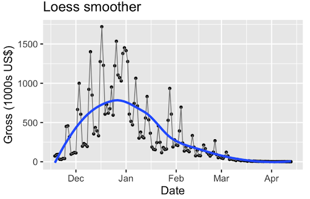

* `Loess smoother` (non-parametric - does not assume anything about the underlying distribution)
    + Uses geom_smooth()
        + Increasing smoothing parameter => smoother => under fitting
    + Underfitting = over smoothing
    + Overfitting = under smoothing
* Trends to describe time series graph
    + Cyclical trends – repeated trends
        + facet by variable to look at cyclic pattern more
    + Secular trends – overall trends
* Could use bars, they are better for individual values. But should ideally use lines.
* What if you want to observe the frequency of time series data? A simple answer: use geom_point() in addition to geom_line().
* Gaps
    + Add points to lines to show the frequency of the data
        + A straight line is suspicious in the real world, it is usually because there’s missing values.
        + It’s very difficult to deal with NAs when using time series
    + Could just leave gaps by setting missing values to NA
        + If don’t want gaps, remove NAs
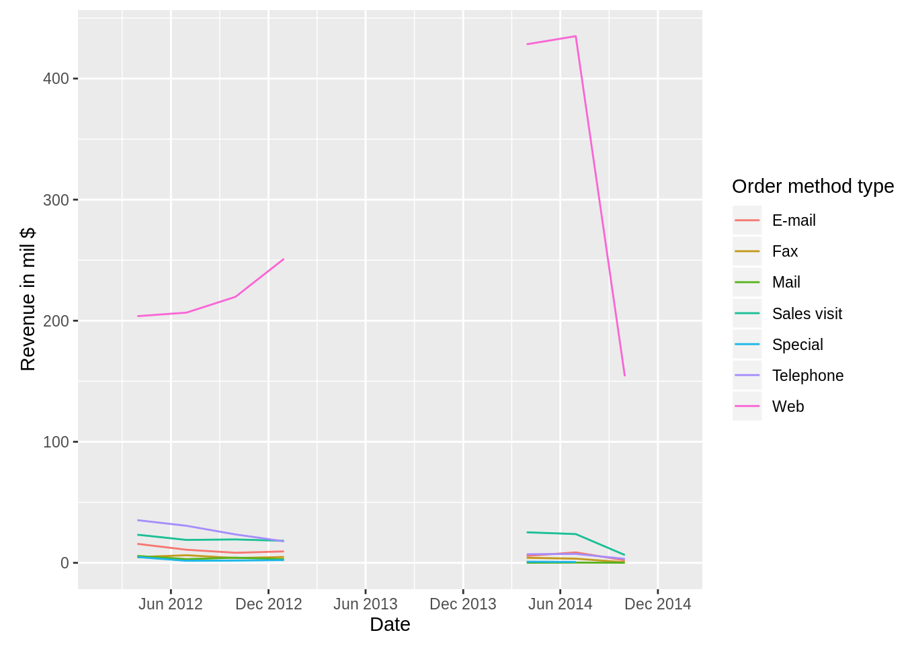    


        


