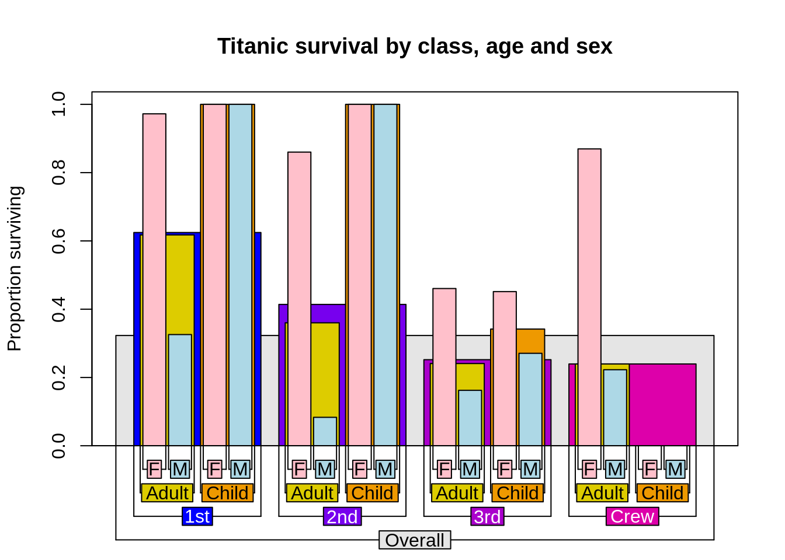
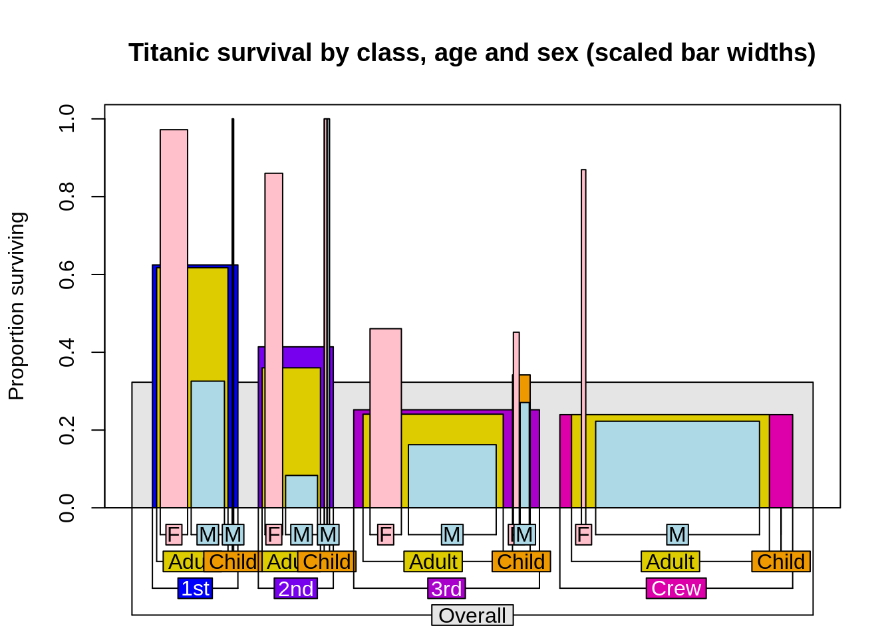
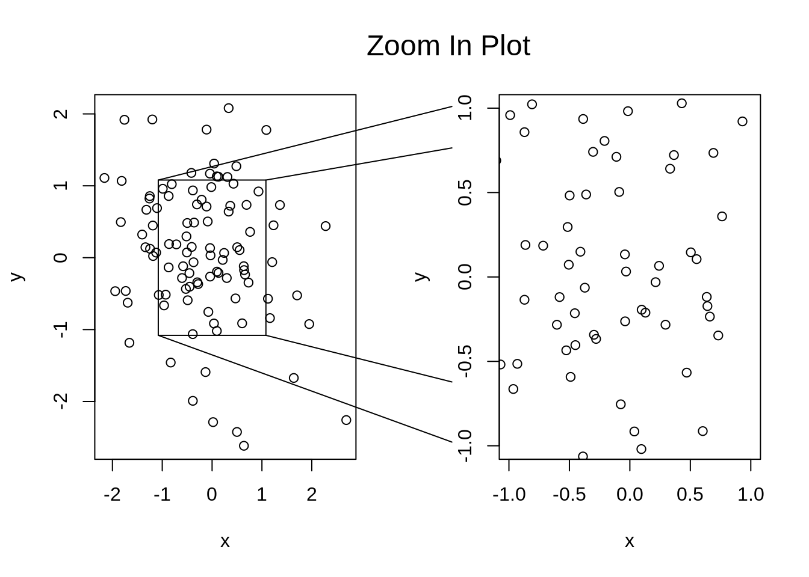
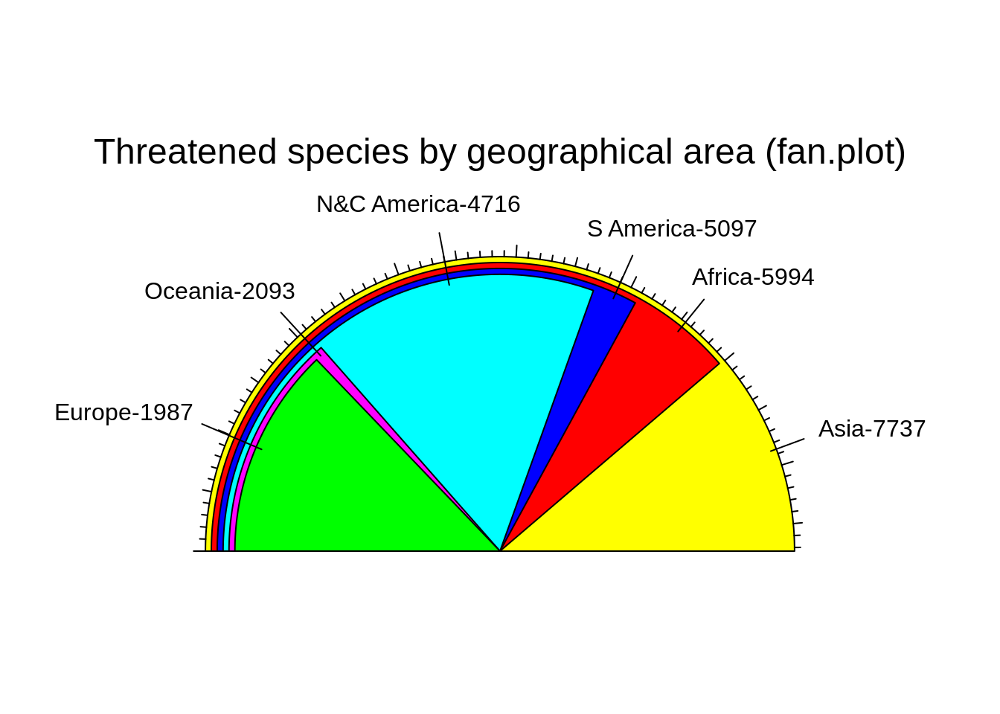
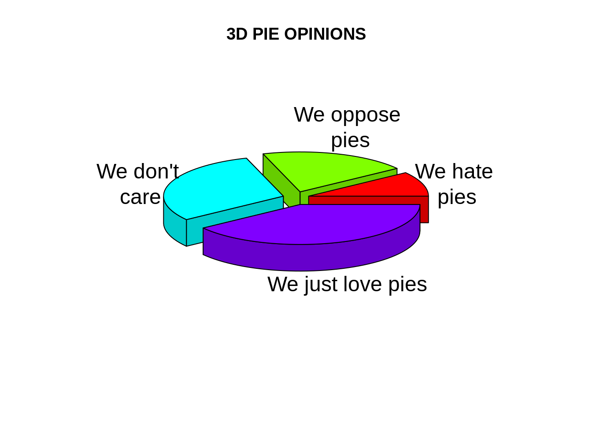
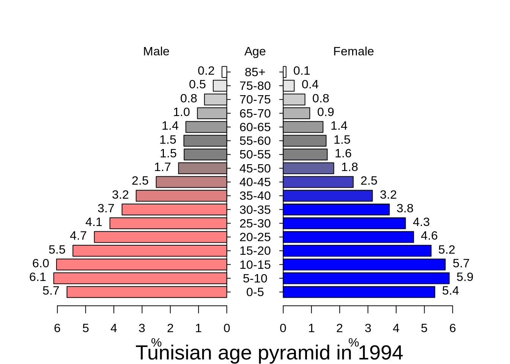

# Plotrix for complex visualizations

Alex Wan and Junyang Jiang


## Overview
 
  Our graphs have to be informative and attractive to the audience to get their attention. 
  
  This section covers how we can use specialized plots and accessories functions in plotrix to easily build complex visualizations.
  
## Plotrix
  
  In `plotrix`, we have many functionalities. A brief description of a selcted few of them is as follows:
  
  * `barNest`: Display a nested breakdown of numeric values
  * `zoomInPlot`: Display a plot with rectangular section expanded in an adjacent plot
  * `fan.plot`: Display a fan plot
  * `pie3D`: Display a 3D pie chart
  * `pyramid.plot`: Pyramid plot
  
### barNest example

In a nested bar chart, we can break down the elements of the data frame by one or more categorical elements and display the breakdown as a bar plot. It first takes as input the dependent and independent variables, as columns of a dataframe, along with the colors to be used in the plot. The showall parameter indicates whether to display bars for the entire breakdown, while the shrink parameter determines the proportion to shrink the width of bars at each level. The trueval parameter returns the proportion of of the response variable equal to 'trueval'.
  

```r
titanic<-data.frame(
class=c(rep("1st",325),rep("2nd",285),rep("3rd",706),rep("Crew",885)),
age=c(rep("Adult",319),rep("Child",6),rep("Adult",261),rep("Child",24),
rep("Adult",627),rep("Child",79),rep("Adult",885)),
sex=c(rep("M",175),rep("F",144),rep("M",5),rep("F",1),
rep("M",168),rep("F",93),rep("M",11),rep("F",13),
rep("M",462),rep("F",165),rep("M",48),rep("F",31),
rep("M",862),rep("F",23)),
survived=c(rep("Yes",57),rep("No",118),rep("Yes",140),rep("No",4),rep("Yes",6),
rep("Yes",14),rep("No",154),rep("Yes",80),rep("No",13),rep("Yes",24),
rep("Yes",75),rep("No",387),rep("Yes",76),rep("No",89),
rep("Yes",13),rep("No",35),rep("Yes",14),rep("No",17),
rep("Yes",192),rep("No",670),rep("Yes",20),rep("No",3)))
require(plotrix)

titanic.colors<-list("gray90",c("#0000ff","#7700ee","#aa00cc","#dd00aa"),
c("#ddcc00","#ee9900"),c("pink","lightblue"))

barNest(survived~class+age+sex,titanic,col=titanic.colors,showall=TRUE,
main="Titanic survival by class, age and sex",ylab="Proportion surviving",
FUN=c("propbrk","binciWu","binciWl","valid.n"),shrink=0.15,trueval="Yes")
```


  
We can also set Nwidths to TRUE, if we want to scale the the widths of bars to the number of observations.
  

```r
barNest(survived~class+age+sex,titanic,col=titanic.colors,showall=TRUE,
main="Titanic survival by class, age and sex (scaled bar widths)",
ylab="Proportion surviving",FUN=c("propbrk","binciWu","binciWl","valid.n"),
shrink=0.15,trueval="Yes",Nwidths=TRUE)
```



  
## zoomInPlot example

The zoomInPlot function allows us to display one plot on the left half, and an expanded section of the plot on the right half, with lines showing the expansion.

It takes as input two vectors, x and y. We can also use the rxlim and rylim parameters to dictate the limits of the expanded section.


```r
zoomInPlot(rnorm(100),rnorm(100),rxlim=c(-1,1),rylim=c(-1,1),
  zoomtitle="Zoom In Plot",titlepos=-1.5)
```



## fan.plot example

The fan.plot function displays numerical values as arcs of overlapping sectors. It takes as input the vector of numbers we want to plot, as well as the max.span which will be the angle of the maximum sector in radians. In the example below, the span is set to pi, so the max sector will be a half circle. The labels parameter provides the corresponding lables to the different sectors, while the ticks parameter determines the total number of ticks around the span.


```r
iucn.df<-data.frame(area=c("Africa","Asia","Europe","N&C America",
"S America","Oceania"),threatened=c(5994,7737,1987,4716,5097,2093))
fan.plot(iucn.df$threatened,max.span=pi,
labels=paste(iucn.df$area,iucn.df$threatened,sep="-"),
main="Threatened species by geographical area (fan.plot)",ticks=276)
```



## pie3D example

The pie3D function displays a 3D pie chart with optional labels. It takes as input a numeric vector where each value is a sector in the pie chart, as well as the optional labels for each sector. The radius parameter determines how large the pie is, while the explode parameter determines how much the pie sectors "explodes" outward from the center.


```r
pieval<-c(2,4,6,8)
pielabels<-
c("We hate\n pies","We oppose\n pies","We don't\n care","We just love pies")
# grab the radial positions of the labels
lp<-pie3D(pieval,radius=0.9,labels=pielabels,explode=0.1,main="3D PIE OPINIONS")
```




## pyramid.plot example

The pyramid.plot function displays a pyramid of opposing horizontal bar plots. Its primary intention is for the construction of population pyramids, although it can also display other types of opposed bar charts. It takes as input two vectors of numbers, one to be displayed on the left and the other on the right. It also needs a label vector to be displayed in the middle, which should contain a label for each left or right value, even if empty. We can also specify the colors to be used on the left and right, while setting show.values to TRUE will display the corresponding values at the end of the bars.


```r
x<-c(5.66,6.13,6.03,5.45,4.69,4.14,3.71,3.21,2.5,1.71,1.51,1.52,1.45,1.04,0.79,0.48,0.17)
y<-c(5.37,5.88,5.74,5.24,4.62,4.33,3.76,3.16,2.48,1.79,1.56,1.52,1.41,0.94,0.77,0.39,0.1)


agelabels<-c("0-5","5-10","10-15","15-20","20-25","25-30","30-35","35-40","40-45","45-50","50-55","55-60","60-65","65-70","70-75","75-80","85+")

fcol<-color.gradient(c(0,0,0.5,1),c(0,0,0.5,1),c(1,1,0.5,1),17)
mcol<-color.gradient(c(1,1,0.5,1),c(0.5,0.5,0.5,1),c(0.5,0.5,0.5,1),17)

par(mar=pyramid.plot(x,y,labels=agelabels,lxcol=mcol,rxcol=fcol,show.values=TRUE))
title(sub="Tunisian age pyramid in 1994",cex.sub=1.7)
```



## Sources
https://cran.r-project.org/web/packages/plotrix/plotrix.pdf
