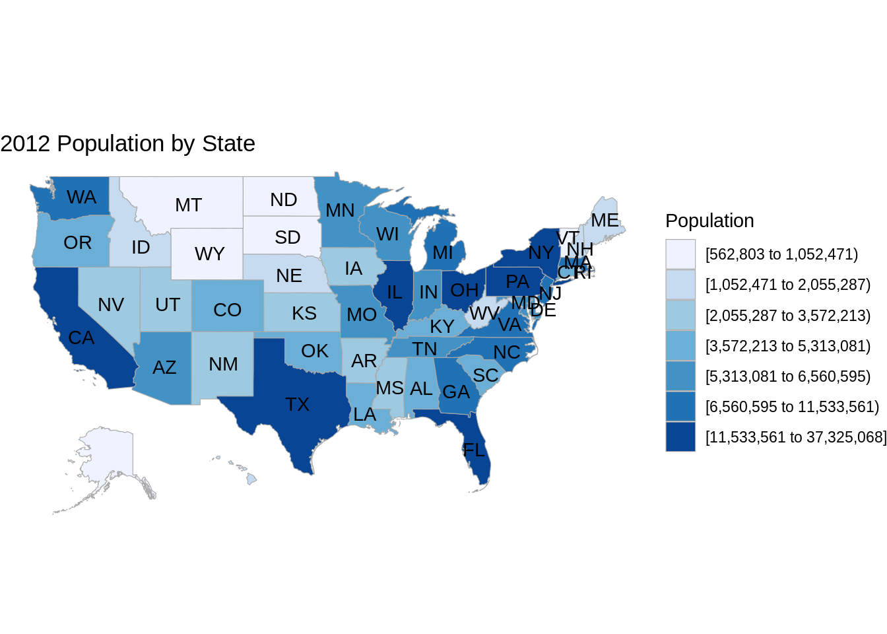
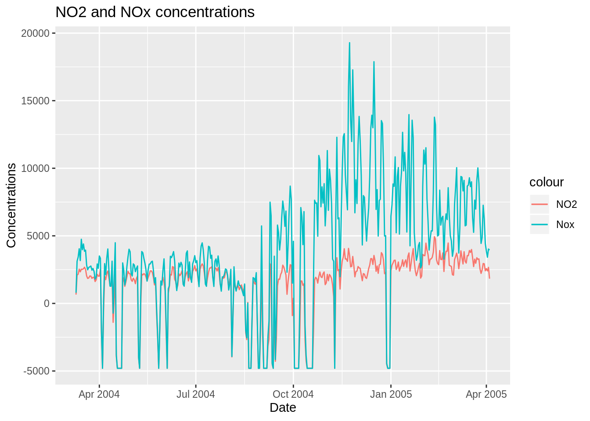

# R vs tableau plots

Pritam Biswas and Amogh Mishra


We are performing a comparison between R and tableau for different types of data visualization. We are showing a few plots of R Studio and Tableau
We will show Choropleth map in R, one for USA and one for World map. We will show the same plots in Tableau software. During the demo we will observe how easy it is use Tableau due to its drag and drop interface and dashboard facility.

## We shall now show our plots using R studio
This is the Choropleth map for populations of state in USA

```r
library(choroplethr)
data(df_pop_state)
data(df_state_demographics)
state_choropleth(df_pop_state, title="2012 Population by State", legend="Population")
```



This is the Choropleth map for GDP of countries in the world

```r
Sys.setenv("plotly_username"="biswaspritam1993")
Sys.setenv("plotly_api_key"="p3A0ZAbHFdOt9AM3XGb0")
library(plotly)

df <- read.csv('https://raw.githubusercontent.com/plotly/datasets/master/2014_world_gdp_with_codes.csv')

l <- list(color = toRGB("grey"), width = 0.5)

g <- list(
  showframe = FALSE,
  showcoastlines = FALSE,
  projection = list(type = 'Mercator')
)

p <- plot_geo(df) %>%
  add_trace(
    z = ~GDP..BILLIONS., color = ~GDP..BILLIONS., colors = c("red", "blue", "yellow", "green"),
    text = ~COUNTRY, locations = ~CODE, marker = list(line = l)
  ) %>%
  colorbar(title = 'GDP Billions US$', tickprefix = '$') %>%
  layout(
    title = '2014 Global GDP<br>Source:<a href="https://www.cia.gov/library/publications/the-world-factbook/fields/2195.html">CIA World Factbook</a>',
    geo = g
  )

chart_link = api_create(p, filename="choropleth-world")
```

The interactive choropleth map is at location https://plot.ly/~biswaspritam1993/3/

This is the NO2 and NOx concentrations in air line plot

```r
library(ucidata)

MyData <- read.csv(file="resources/r_vs_tableau/air_quality_r.csv", header=TRUE, sep=",")
MyData$Date <- as.Date(MyData$Date, format = "%d/%m/%Y")

ggplot(MyData, aes(Date)) +
  ggtitle('NO2 and NOx concentrations') +
  geom_line(aes(y=NO2, color = "NO2")) +
    geom_line(aes(y=Nox, color = "Nox"))  +
  ylab('Concentrations')
```



## We shall now see how to do the same data visualization tasks using Tableau.

Our tableau link is at : https://public.tableau.com/profile/amogh.mishra#!/vizhome/CommunityContributionEDAV/Story1

In the UCI air quality dataset (time series) we can :

- easily drag data and plot time series against harmful gases.

- do easy customization

- increase the granularity

- provide individual colours

- mark labels

- visualize relevant trends using filters

- change calculation of NO2 concentration from sum to average and median


In the Choropleth world GDP we can :

- do colour-coding changes

- get sum as a selection of the area

- get labelling min/max, all


We also have the added advantage of using the tableau dashboard.


