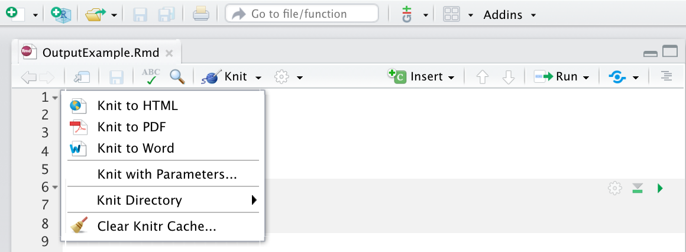

# Rmarkdown tutorial

Author: Shaofeng Wu, Mingrui Liu

## 1. Overview
R Markdown provides a tidy framework for data science. A markdown file can normally help us: \
- **save and execute code that you wrote**\
- **generate high quality reports that can be shared with an audience**\
R Markdown documents are fully reproducible and support dozens of static and dynamic output formats.\
This link provide a quick tour of what's possible with R markdown.-[links](https://vimeo.com/178485416)


### 1.1 What is R Markdown?\
- **Rmd files**\
· An R Markdown(.Rmd) file is a record of your project. It contains the code that your audience needs to reproduce your work as well as all the scripts that your audience can understand what you did.\
- **Reproducible Research**\
· You can use `Knit` to rerun the code in an R Markdown file to reproduce your work and export the results to be a well-formatted report.\
- **Dynamic Documents**\
· There are a lot of ways to export your report. The formats include html, pdf, MS Word, or RTF documents; html or pdf based slides, Notebooks, and more.\


### 1.2 Workflow
(1) **Open a new .Rmd file** at File ▶ New File ▶ R Markdown. \
(2) **Write document** by editing template\
(3) **Knit document** to create report; use knit button or
**render()** to knit\
(4) **Preview Output** in IDE window\
(5) **Publish** (optional) to web server\
(6) **Examine build log** in R Markdown console\
(7) **Use output file** that is saved along side .Rmd


## 2. Getting started

### 2.1. Install the package
You can use the following command to install the required library.
```{r, eval=FALSE}
install.packages('rmarkdown')
```


### 2.2. Open file
You can create a new file or open existed from the directory that you choose.

### 2.3. output format
The Rmarkdown can render any Rmd file into a format that Rmarkdown supports. For example, the code below renders OutputExample.Rmd to a Microsoft Word document. 
```{r results='hide'}
library(rmarkdown)
render("OutputExample.Rmd", output_format = "word_document")
```

Following is a table of all the formats that you can choose:
**Output value table**

| output value | creates |
|--------------|---------|
| html_document| html|
| pdf_document |pdf (requires Tex )|
| word_document| Microsof Word (.docx)|
| odt_document |OpenDocument Text|
| rtf_document |Rich Text Format|
| md_document  |Markdown|
| github_document| Github compatible markdown|
| ioslides_presentation| ioslides HTML slides|
| slidy_presentation| slidy HTML slides|
| beamer_presentation| Beamer pdf slides (requires Tex) |

You can choose to render to the format that you want by clicking the dropdown menu beside the knit button:


## 3. Markdown syntax

Rmarkdown has lots of fancy syntax so that you can produce an ordered and beautiful document.\
We will give the syntax here that we regularly use a lot.

* **plain text**    
plain text

* **italics and bold**  
```{}
*italics* and **bold**
```

*italics* and **bold**  


* **list**  
```{}
* unordered list  
   + sub-item 1  
   + sub-item 2  
   - sub-sub-item 1 
```
  
* unordered list
  + sub-item 1
  + sub-item 2
  - sub-sub-item 1 
  
```{}
1. ordered list
2. item 2  
 i) sub-item 1  
    A. sub-sub-item 1 
```
1. ordered list
2. item 2
  i) sub-item 1  
    A. sub-sub-item 1 
  
  
* **headers**
```{}
# Header1 {#anchor}
## Header 2 {#css_id}
### Header 3 {.css_class}
#### Header 4
##### Header 5
###### Header 6 
```
# Header1 {#anchor}
## Header 2 {#css_id}
### Header 3 {.css_class}
#### Header 4
##### Header 5
###### Header 6 

* **hyperlink**
```{}
<http://www.rstudio.com>
[link](www.rstudio.com)
Jump to [Header 1](#anchor) 
```
<http://www.rstudio.com>
[link](www.rstudio.com)
Jump to [Header 1](#anchor) 

* **table**
```{}
| Right | Left | Default | Center |
|------:|:-----|---------|:------:|
| 12    | 12   | 12      | 12     |
| 123   | 123  | 123     | 123    |
| 1     | 1    | 1       | 1      | 
```

 | Right | Left | Default | Center |
|------:|:-----|---------|:------:|
| 12 | 12 | 12 | 12 |
| 123 | 123 | 123 | 123 |
| 1 | 1 | 1 | 1 | 

* **equation**
```{}
$$E = mc^{2}$$ 
```
$$E = mc^{2}$$ 

## 4. Embeding code

### 4.1. Inline code
You can surround code with back ticks and r. R will replace inline code with its results.

For example:
```{r, eval=FALSE}
  one plus one equals `r 1+1`
```

The output is:

one plus one equals `r 1+1`

### 4.2. Code chunks
In this way, ou need to start a chunk with \`\`\` {r} and end a chunk with \`\`\`

For example:
```{r}
print("Hello, world!")
```

### 4.3. Display options
There are also a lot of options to display your codes and results.

For example, you can choose `eval` as TRUE or False in the output to decide whether to evaluate the code and include its results.

Here is the difference between the two options:

With `eval = TRUE`: 
```{r eval=TRUE}
print("Hi there!")
```

With `eval = FALSE`: 
```{r eval=FALSE}
print("Hi there!")
```

Here is a table that includes the options that we normally use:


| option | default | effect |
|--------------|---------|---------|
| eval | TRUE | Whether to evaluate the code and include its results |
|echo|TRUE|Whether to display code along with its results|
|warning|TRUE| Whether to display warnings|
|error |FALSE |Whether to display errors|
|message| TRUE |Whether to display messages|
|tidy| FALSE |Whether to reformat code in a tidy way when displaying it|
|cache| FALSE| Whether to cache results for future renders|
|comment| "##" |Comment character to preface results with|

## 5. Rendering

* **first way**

    You can run `rmarkdown::render("<file path>")` in the console.

* **second way**

    You can click the `Knit` button in the top pane and choose the output format that you want.