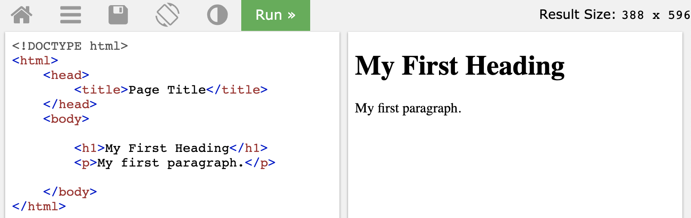

# Web scraping using rvest

Huiyu Song and Xiao Ji


## 1 Overview
This section covers how to conduct web scraping using "rvest" package
<br><br/>

## 2 An Easy Example
I want an example now!

Here is an example of scraping the price and percentage change of trending stocks from Yahoo Finance: https://finance.yahoo.com/trending-tickers. 

The first thing we need to do is to check if scraping is permitted on this page using paths_allowed( ) function.

```r
library(robotstxt)
paths_allowed(paths="https://finance.yahoo.com/trending-tickers")
```

```
## [1] TRUE
```
The output is TRUE meaning that bots are allowed to access this path.

Now we can scrape the data:

```r
library(rvest)
TrendTicker <- read_html("https://finance.yahoo.com/trending-tickers")  #read the path
#We need Name, Last Price, % Change
Name <- TrendTicker%>%
  html_nodes(".data-col1")%>%html_text()
Price <- TrendTicker%>%
  html_nodes(".data-col2")%>%html_text()
Change <- TrendTicker%>%
  html_nodes(".data-col5")%>%html_text()
dt<-tibble(Name,Price,Change)  #combine the scrapped columns into a tibble
head(dt,5)
```

```
## # A tibble: 5 x 3
##   Name                   Price  Change  
##   <chr>                  <chr>  <chr>   
## 1 AT&T Inc.              38.11  -3.83%  
## 2 The Home Depot, Inc.   226.01 -5.37%  
## 3 Kohl's Corporation     47.24  -19.11% 
## 4 Myovant Sciences Ltd.  12.54  +106.93%
## 5 CRISPR Therapeutics AG 67.88  +15.97%
```
Path %>% html_nodes( ) %>% html_text( ) is a common syntax to scrape html text and more details will be discussed in section 4. Before that, we need some basic knowledge of HTML structures.
<br><br/>

## 3 HTML Basics
### 3.1 Access the source code

Move your cursor to the element whose source code you want to check and right click. Select "Inspect"


The source code will be displayed on the top right corner of the screen.


<br><br/>

### 3.2 HTML structures
HTML is a markup language and it describes the structure of a Web page. 
A simple element in HTML looks like this:

<style>
div.blue { background-color:#e6f0ff; border-radius: 5px; padding: 20px;}
</style>
<div class = "blue">
\<p\>This is a paragraph.\</p\>
</div>

An HTML element usually consistes of a start tag, a end tag and the content in between.
Here \<p\> is the start tag, \</p\> is the end tag (the slash indicates that it is a closing tag), "This is a paragraph" is the content.

The charater "p" represents it is a paragraph element, other kinds of elements include:

<style>
div.blue { background-color:#e6f0ff; border-radius: 5px; padding: 20px;}
</style>
<div class = "blue">
\<html\>: the root element of an HTML page  
\<head\>: an element contains meta information about the document  
\<title\>: an element specifies a title for the document  
\<body\>: an element contains the visible page content  
\<h1\>: an element defines a large heading  
\<p\>: an element defines a paragraph  
</div>

<br><br/>
The basic structure of a webpage looks like this:



More details can be refered to https://www.w3schools.com/html/html_intro.asp

<br><br/>

## 4 Rvest
When we want to scrape certain information from a website, we need to concentrate on the part that we are interested in instead of the whole page. That is why we need **html_node** or **html_nodes** to locate the interested part.  

### 4.1 html_nodes and html_node  
**Usage**  
html_nodes(x,css,xpath)  
html_node(x,css,xpath)  
**Arguments**  
x: a node set or a single node  
css, xpath: Node to select
css:CSS selector; xpath:XPath 1.0 selector  
**html_node VS html_nodes**  
Html_nodes always return a nodeset of the same length, which contains information of a set of nodes.  
While html_node return exactly one html_node.    
Here is an example:

```r
paths_allowed("https://www.eyeconic.com/")
```

```
## [1] TRUE
```

```r
page=read_html("https://www.eyeconic.com/contact-lenses?cid=ps:google:Eyeconic+-+US+-+SKWS+-+Contacts+-+General+-+Exact+-+Geo:NB+-+Contacts+-+Onlineutm_campaign=skws&ds_rl=1239071&gclid=EAIaIQobChMImpP2gqW95QIVipOzCh1XfwKbEAAYAiAAEgLWrfD_BwE&gclsrc=aw.ds")
page2=read_html("https://www.eyeconic.com/contact-lenses/aot/AOT.html")
node<- page%>%html_node(xpath='//*[@id="search-result-items"]/li[1]')
nodes<-page%>%html_nodes(xpath='//*[@id="search-result-items"]/li[1]')
node
```

```
## {html_node}
## <li class="grid-tile col-md-6 col-xl-4 pb-3 px-1 px-md-2" data-colors-to-show="">
## [1] <script type="text/javascript">//<!--\n/* <![CDATA[ */\n(function(){\ntry ...
## [2] <script type="text/javascript">//<!--\n/* <![CDATA[ (viewProduct-active_d ...
## [3] <div class="product-tile w-100 m-auto text-center pt-5 bg-white position- ...
```

```r
nodes
```

```
## {xml_nodeset (1)}
## [1] <li class="grid-tile col-md-6 col-xl-4 pb-3 px-1 px-md-2" data-colors-to- ...
```

### 4.2 css and xpath  
Although the usage of html_nodes and html_node seems easy and convinient, for those who cannot extract right css or xpath, the function will not work. Here is a summary of how to write css or xpath, and some examples are shown.  
**css**  
CSS Selector are how you pick which element to apply styles to.

**Selector Syntax**   

Pattern               Meaning                                                                                               
--------------------  ------------------------------------------------------------------------------------------------------
p                     Select all \<p\\> elements                                                                            
p m                   Select all \<m\\> inside of \<p\>                                                                     
p > m                 Select an direct child \<m\> of \<p\>                                                                 
p + m                 Select an \<m\> that directly follows \<p\>                                                           
p ~ m                 Select \<m\> that preceds by \<p\>                                                                    
p#id_name             Select all \<p\> which id="id_name"                                                                   
p.class_name          Select all \<p\> which class="class_name"                                                             
p[attr]               Select \<p\> that has "attr" attribute                                                                
p[attr="tp"]          Select \<p\> that attribute attr="tp"                                                                 
p[attr~="tp"]         Select \<p\> that attribute "attr" is a list of whitespace-seperated values, and one of which is "tp" 
p[attr^="tp"]         Select p whose sttribute "attr" begins exactly with string "tp"                                       
p[attr*="tp"]         Select p whose sttribute "attr" contains string "tp"                                                  
p[attr$="tp"]         Select p whose sttribute "attr" ends exactly with string "tp"                                         
p:root                Select root of \<p\>                                                                                  
p:nth-child(n)        Select nth child of p                                                                                 
p:nth-last-child(n)   Select nth child from the bottom of p                                                                 
p:first-child         Select first child of p                                                                               
p:last-child          Select last child of p                                                                                
p:nth-of-type         Select nth \<p\> in any element                                                                       
p:nth-last-type       Select nth \<p\> from the bottom in any element                                                       
p:first-of-type       Select first \<p\> in any element                                                                     
p:last-of-type        Select first \<p\> from the bottom in any element                                                     
p:empty               Select \<p\> that has no children                                                                     
p:link                Select p which has not yet been visited                                                               
p:visited             Select p already been visited                                                                         


**Examples**

1. p#id_character  item  
Select any item inside p which has id="id_character"  
Select name of all products.  

```r
info<-page%>% 
  html_nodes('ul#search-result-items li span[itemprop="name"]')%>%
  html_text()
info[1:6]
```

```
## [1] "ACUVUE"    "ACUVUE"    "AIR OPTIX" "ACUVUE"    "BIOFINITY" "ACUVUE"
```

2. p.class_name  
Select \<p\> element which has class="class_character".   
Except id, we can also use class to concentrate on certain information.  
Select image path of all products.  

```r
acuvue<-page%>%
  html_nodes('li.grid-tile.col-md-6.col-xl-4.pb-3.px-1.px-md-2 img[itemprop="image"]')
acuvue[1:2]
```

```
## {xml_nodeset (2)}
## [1] , \<B\>, \<C\> elements.  
Example: Scrape all product names and detail names in the page.  

```r
name<-page%>%
  html_nodes('ul#search-result-items li span[itemprop="name"], ul#search-result-items li div[itemprop="name"]')%>%
  html_text()
name[1:6]
```

```
## [1] "ACUVUE"                           "ACUVUE Oasys For Astigmatism 6pk"
## [3] "ACUVUE"                           "ACUVUE 1-Day Moist 90pk"         
## [5] "AIR OPTIX"                        "Air Optix Aqua 6pk"
```

4. p *   
Select all elements in p.  
Select all nodes for price.  

```r
img<-page2%>%
  html_nodes("div.price-info *")
img
```

```
## {xml_nodeset (0)}
```

5. p:nth-child(n)  
Select nth child of \<p\>  

```r
air<-page%>%
  html_nodes("ul#search-result-items:nth-child(1)")
air
```

```
## {xml_nodeset (1)}
## [1] <ul id="search-result-items" class="search-result-items tiles-container r ...
```
<br><br/>

**Xpath**   
XPath (XML Path Language) uses path expressions to select nodes or node-sets in an XML document. These path expressions look very much like the expressions you see when you work with a traditional computer file system.  

**Xpath Syntax**  
In XPath, there are seven kinds of nodes: element, attribute, text, namespace, processing-instruction, comment, and document nodes.  
For example:  
\<bookstore\> (root element node)  
\<author\>J K. Rowling\</author\> (element node)  
lang="en" (attribute node)  

Pattern            Meaning                                                                                          
-----------------  -------------------------------------------------------------------------------------------------
nodename           Select all node with the name "nodename"                                                         
A/B                Select B from root node                                                                          
A//B               Select B in the document from the current node that match the selection no matter where they are 
.A                 Select the current node A                                                                        
..A                Select the root of current node A                                                                
@                  Select attributes                                                                                
\*                 Matches any element node                                                                         
@*                 Matches any attribute node                                                                       
node()             Matches any node of any kind                                                                     
ancestor           Select all ancestors(parent, grandparent, stc.) of the current node                              
ancestor-of-self   Select all ancestors(parent, grandparent, stc.) of the current node and current node itself      
attribute          Select all attributes of the current node                                                        
child              Select all children of the current node                                                          
descendant         Select all descendant(children, grandchildren, etc.) of the current node                         
following          Select everything in the document after the closing tag of the current node                      
namespace          Select all namespace nodes of the current node                                                   
|                  Select two nodes                                                                                 

**A Simple Way the get XPath**  
right click-->Copy-->Copy XPath  

<br><br/>

**Examples**  
Extract all product details in the contact links.  

```r
data <- data.frame()
info <- page%>%
  html_nodes('ul#search-result-items li div span[itemprop="url"]') %>%
  html_text()
info[1:6]
```

```
## [1] "https://www.eyeconic.com/contact-lenses/aot/AOT.html"   
## [2] "https://www.eyeconic.com/contact-lenses/a1m9/A1M9.html" 
## [3] "https://www.eyeconic.com/contact-lenses/aos/AOS.html"   
## [4] "https://www.eyeconic.com/contact-lenses/acuvue/OTR.html"
## [5] "https://www.eyeconic.com/contact-lenses/bf/BF.html"     
## [6] "https://www.eyeconic.com/contact-lenses/ao12/AO12.html"
```


<br>

## 5 More Examples
### 5.1 Scrape links using attributes
HTML links are defined with the tag \<a\>. The link address is specified in the "href" attribute. Suppose we want to get the link of each trend ticker, we can right click the stock symbol and check the source code:


So we use ".data-col0 a"" as the node and "href" as the attribute:

```r
local_links <- TrendTicker%>%
  html_nodes(".data-col0 a")%>%html_attr("href")
link_names <- TrendTicker%>%
  html_nodes(".data-col0 a")%>%html_text("href")

#complete the full link
full_links=NULL
for (i in 1 : length(local_links)){
  full_links[i]=paste0("https://finance.yahoo.com",local_links[i])
}

dt=tibble(link_names,full_links)
head(dt,5)
```

```
## # A tibble: 5 x 2
##   link_names full_links                                 
##   <chr>      <chr>                                      
## 1 T          https://finance.yahoo.com/quote/T?p=T      
## 2 HD         https://finance.yahoo.com/quote/HD?p=HD    
## 3 KSS        https://finance.yahoo.com/quote/KSS?p=KSS  
## 4 MYOV       https://finance.yahoo.com/quote/MYOV?p=MYOV
## 5 CRSP       https://finance.yahoo.com/quote/CRSP?p=CRSP
```

### 5.2 Scrape Table

The first step is to locate the table.  


Then copy the Xpath. When we paste the path, it should be like: //*[@id="quote-summary"]/div[1]/table  
Also, we need the html_table( ) function to convert the html table into a data frame:


```r
testlink=read_html("https://finance.yahoo.com/quote/TIF?p=TIF")
table<-testlink%>%
  html_nodes(xpath='//*[@id="quote-summary"]/div[1]/table')%>%
  html_table()
table
```

```
## [[1]]
##               X1              X2
## 1 Previous Close          124.58
## 2           Open          124.50
## 3            Bid    123.44 x 800
## 4            Ask    123.49 x 800
## 5    Day's Range 122.90 - 124.51
## 6  52 Week Range  73.04 - 130.40
## 7         Volume         972,652
## 8    Avg. Volume       2,834,483
```
<br><br/>

## 6 External Resources
**HTML Structure References**  
https://www.w3schools.com/html/html_intro.asp  
**XPath References**  
https://en.wikipedia.org/wiki/XPath  
https://www.w3schools.com/xml/xml_xpath.asp  
**CSS Selector References**  
https://www.rdocumentation.org/packages/rvest/versions/0.3.4/topics/html_nodes  
http://flukeout.github.io/  
https://www.w3schools.com/cssref/sel_firstchild.asp  


