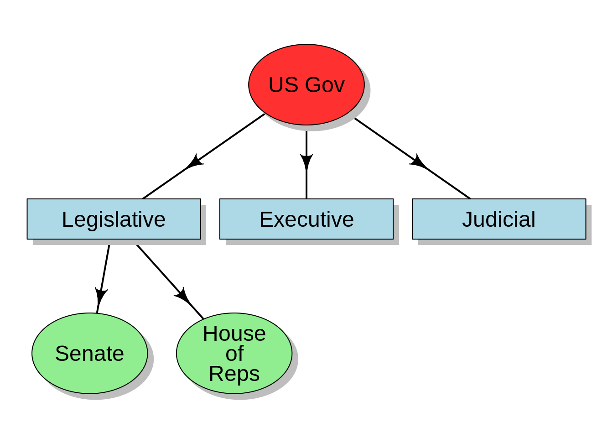
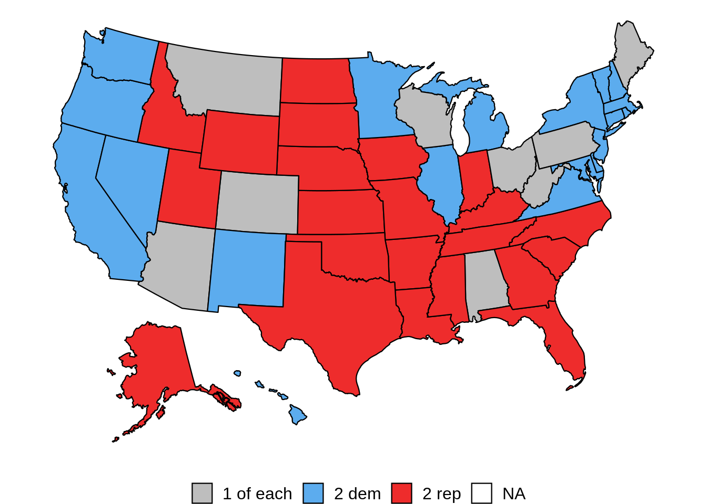
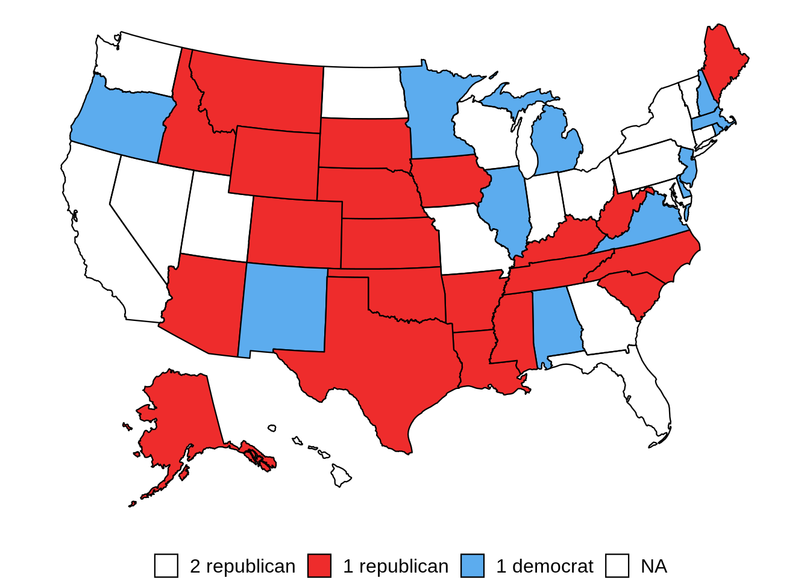
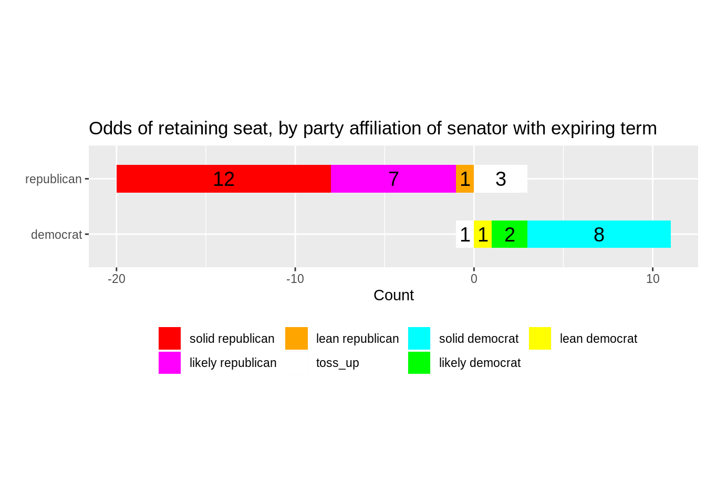
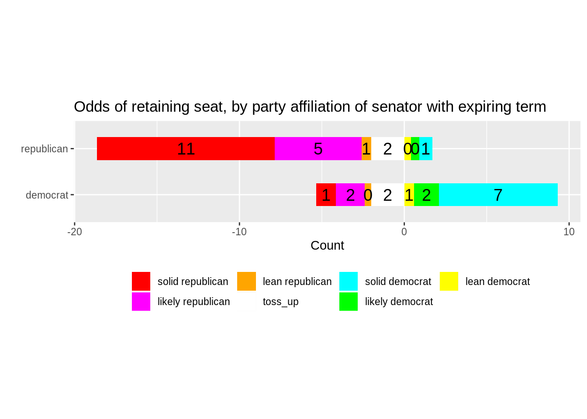

# Forecast of the 2020 senate election

James DeAntonis

In 2020, the US will hold its biannual senate election, featuring 35 seats up for grabs.  The goal of this project is to project an expectation of the results.

Overview of US government:

As seen above, the US government is split up into three brances: the legislative, executive and judicial.  The legislative brach is broken into two chambers: the senate and the house of representatives.  The house of representatives is currently under solid democratic control and likely will not be flipped in 2020.  We focus on the senate.

Current breakdown of US senate:

The current US senate sees a 53-47 Republican majority.  As seen above, this republican majority is driven by high representation in the southeast and upper mountain states.

Breakdown of seats up for re-election in 2020:

In 2020, there is a disproportionately high number of republican seats up for grabs (23) compared to their democratic counterparts (12).  We see this in the above map, which shows many seats up in the middle of the country.

Above is a visualization of a Cook Report analysis, which broke out each incumbent and categorized its probability of retaining its seat (toss-up, lean, likely, solid).  For example, we see that there are 12 incumbent republicans with solid chance of retaining seat and 8 such democrats.  Similarly, three republicans are considered toss-ups to retain, compared to one democrat.

The model used will treat each of these categories as independent binomial random variables and compute an expectation of the share of seats will be retained in the party.

The model expectation points that most of the solid seats will be retained, the toss-ups will go 50/50, and the likely and lean seats will be in between.  We see that, of all seats in the election, 20 will yield republican victories while 15 will yield democratic victories.  Since the breakdown of incumbents in these seats is 23-12, this implies a three-seat gain for the democrats.  In conclusion, the model projects a 50-50 party split after the 2020 senate election.
