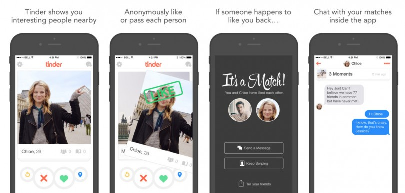
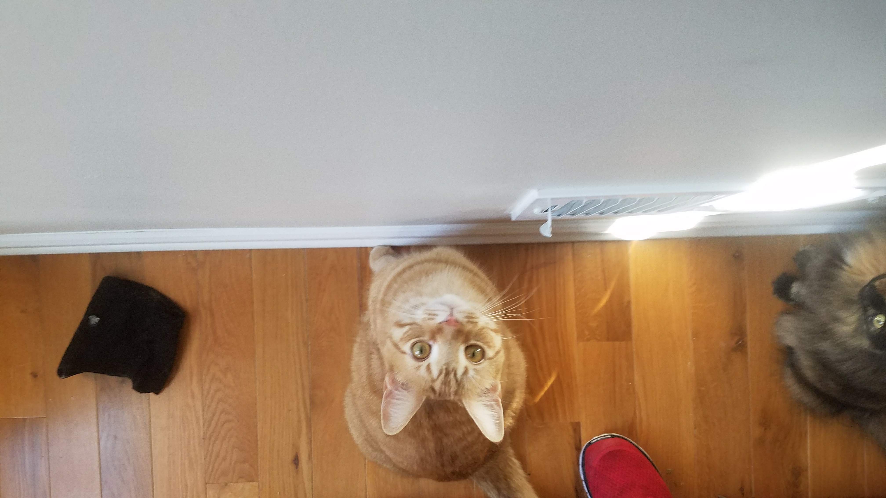

# (PART) Other {-}

# Self-Reflection & Demographical Discoveries Using Tinder Data

Benjamin Livingston

```{r, include=FALSE}
knitr::opts_chunk$set(echo = FALSE, warning = FALSE)
library(gridExtra)
library(GGally)
library(ggthemes)
library(tidyverse)
library(parcoords)
library(lubridate)
library(readr)

tinder_pink = '#FE3C72'
tinder_shade = '#FFE2E0'

tinder_theme = function() {
  theme(
    panel.background = element_rect(fill=tinder_shade),
    panel.grid.major = element_line(color='white'),
    panel.grid.minor = element_line(color='white'),
    panel.border = element_rect(linetype = 'twodash',color=tinder_pink,fill=NA),
    strip.text = element_text(color='white',face='bold'),
    strip.background = element_rect(fill=tinder_pink),
    plot.title = element_text(hjust = 0.5)
  )
}

bentinder = read.csv('resources/tinder_study/bentinder.csv')
bentinder = bentinder[,2:8]
bentinder[,1] = ymd(bentinder[,1])
```


## Introduction

When I told my friends I was doing this, they laughed.

After I showed this to my friends, they laughed again.

I laughed, too.

Our Tinder data is a disturbingly accurate window into our romantic selves. It traces so many of our dating tendencies, from pickiness, to obsession, to desperation, to pushiness. I gained tremendous insight into my romantic habits from this exercise, and I hope you will enjoy it as much as I did.

*Most importantly*, I've constructed this in a way that will allow you to easily do this analysis for yourself, too.

### For The Taken / Non-Millennial Folk

You're probably going to look at every statistic and graph here and wonder, "what the heck is all this?"

[Tinder](https://tinder.com) is a dating app that launched in 2012, available from any web browser or smartphone. You create a profile, select your preferred gender, age, and locational proximity for a potential partner, and Tinder provides you a sequence of other users that fit your criteria.

Every time a user's profile pops up, you can either "swipe left" and pass on them, or "swipe right" and like them. If (and only if) you and the other user both swipe right on each other, you are deemed a "match", and you gain ability to talk to one another. 



User habits vary: some users swipe right on everyone they see, while some users are very picky. There is very little explicit feedback from the app, so the user is forced to form their own conclusions from their personal data, which Tinder allows you to download.

### Replicating This Analysis For Yourself

**I've made it possible for you to create all these statistics and graphs for yourself at the click of a button.**

Your Tinder data can be downloaded [**at this link**](https://www.help.tinder.com/hc/en-us/articles/115005626726-How-do-I-request-a-copy-of-my-personal-data-).

[**In this GitHub repository**](https://github.com/bwliv/Tinder), you will find a file called [**grabyourtinder.R**](https://github.com/bwliv/Tinder/blob/master/grabyourtinder.R). 

If you download your Tinder data as instructed, you will receive a zipped file. In that file, there is a JSON labeled "data.JSON". This is your Tinder data - namely, all your messages and daily statistics.

The code I wrote for this project allows any user to extract all of their daily usage statistics from this JSON without the need for additional software.

If you extract and copy data.JSON to your R working directory and run the code in grabyourtinder.R, you will be able to create all these graphs and statistics for yourself, and generate a .csv of your Tinder data.

**Try this!!!!** I did all the legwork for you. I'd love to hear what you come up with. If you don't like what you see, you can throw your laptop out the window and the evidence will disappear forever.

*A note for non-R users*: If you haven't learned R, this is the perfect time to. It's free, extremely easy to use, fun to play with, and very powerful. 

Two recommended free resources if you'd like to try it out:

* Hadley Wickham's [*R For Data Science*](https://r4ds.had.co.nz/)
* Roger D. Peng's [*R Programming For Data Science*](https://leanpub.com/rprogramming)

### Protecting The Innocent (and Not-So-Innocent)

Since my Tinder data JSON file also contains my message data, it will unfortunately not be made available with this project. As you will see soon, there are a *lot* of messages in there, and thus a plethora of personally identifiable information (for myself and others) that can't be posted on the internet. Hope you understand.

In lieu of this, I have included a .csv file with my daily usage statistics in the [GitHub repository](https://github.com/bwliv/Tinder), which was extracted from the JSON using my script.

### A Fun Twist

I will be plotting my Tinder usage over time, and I'm going to add an extra feature to spice it up.

This data covers 2014-2015 until the present (we will explain why the start of this range is indefinite later). In Fall 2016, I moved from Pittsburgh to Philadelphia, and then in Summer 2019, I moved from Philadelphia to New York. 

We will mark those moves in our graphs, and see if we discover any geographic trends as we conduct our analysis.

## Analysis

### Our Fun New Tinder Statistics: "*Amourmetrics*"

* **Opens** - the number of times I opened the Tinder app
* **Messages** - messages exchanged on the app (split by sent vs. received where stated, combined otherwise)
* **Likes** - the number of times I swiped right (a.k.a. "liked" a user)
* **Passes** - the number of times I swiped left (a.k.a. "passed" on a user)
* **Swipes** - the total number of times I swiped, equal to likes + passes

### All-Time Statistics & A Demographical Discovery 

Let's start by examining my messaging habits.

```{r}
print(paste0('Total messages sent: ',sum(bentinder$messages_sent)))
print(paste0('Total messages received: ',sum(bentinder$messages_received)))
print(paste0('Total messages: ',sum(bentinder$messages_sent)+sum(bentinder$messages_received)))

```

I'm a talkative person, so this isn't particularly surprising. What's most interesting about this talk-versus-listen trend is how it has varied over time, which we'll get to in a bit.

Of course, your reaction may be a more primal "FORTY TWO THOUSAND MESSAGES?!?!". If that's the case, wait until you see my all-time totals across all Tinder statistics.

```{r}
messages = bentinder %>% select(date,messages_sent,messages_received) %>% mutate(message_differential = messages_received - messages_sent)

bentinder = bentinder %>% mutate(messages = messages_sent + messages_received) %>% select(-c(messages_sent,messages_received))

bentinder = bentinder %>% mutate(swipes=likes+passes)
sapply(bentinder[-1],sum)
```

**289,909 swipes!** 289,909! This is all mind-blowing... but *289,909*??

This could make you laugh, cry, drop your jaw, or just rub your temples and shake your head. But there's a deeper meaning to this number that I'd like to explore - because considering that I only date men, it's completely incomprehensible.

Think about this for a moment. According to a [2006 study](https://escholarship.org/uc/item/8h08t0zf) by UCLA's Gary J. Gates (the most recent readily-available, exhaustive empirical estimate of metropolitan area LGBT populations), the 2005 LGBT populations of the metropolitan areas I've lived in were approximately as follows:

* Pittsburgh: 50,994
* Philadelphia: 179,459
* New York: 568,903

Furthermore, **the LGBT population of Pennsylvania as a whole was 323,454**.

While these numbers have likely grown in the last decade-and-a-half, they [don't seem](https://en.wikipedia.org/wiki/LGBT_demographics_of_the_United_States#By_city) to have skyrocketed significantly based on more recent city LGBT population estimates, nor does it make intuitive sense that the number of gay men would have grown astronomically in the last 15 years. 

Surely, more people are *openly* LGBT in 2019 than in 2005, but we are making an important distinction between LGBT and *openly* LGBT (or *identifying as* LGBT) here. In other words, telling a survey-taker that you are LGBT and being LGBT (and seeking same-sex partners on Tinder) can be two *very* different things.

A quick calculation finds that **273,682 of these swipes happened before I moved to New York. The combined LGBT adult populations of the Pittsburgh and Philadelphia areas is estimated at 230,453, and the entire state only has an estimated 323,454 LGBT adults.**

If we make a loose assumption that about half of the LGBT residents are male, that would leave about **115,000 gay men in the Philadelphia and Pittsburgh areas and about 162,000 gay men in Pennsylvania** at large.

**I swiped 273,000 times while I lived in Pennsylvania.** That means I swiped more than *twice* the number of available people in my cities and *over 1.5 times* the number of gay men in my state. 

Considering I typically set Tinder to only show me people close to my age (almost exclusively within five years), this doesn't make any sense. 

**This makes me wonder if these LGBT population estimates are even close to accurate.** I swiped a *lot* while out of town (or while using Tinder's [Passport](https://www.help.tinder.com/hc/en-us/articles/115004490423-Passport) feature) and with visitors from other places, and while I can't definitively state *exactly* how much of my swiping was done with people from other metropolitan areas, it probably isn't enough to explain this trend. Even if only 50,000 of my swipes were done with people residing in my metropolitan area (which would be less than 20% of my overall swipes), these numbers still don't add up.

Tinder [typically doesn't suggest the same person twice](https://www.help.tinder.com/hc/en-us/articles/115003496683-I-m-seeing-profiles-I-ve-already-swiped-on-), so we can probably rule that out as a major factor. 

It seems very likely I saw at least 200,000 unique people, and we will make a low-end estimate that 50,000 of them lived in the Philadelphia and Pittsburgh areas. **It seems extremely unlikely that that 50,000 of the estimated 115,000 LGBT adult males in those areas are Tinder users close to my age.**

These numbers suggest there are (and have probably long been) **many** more gay men in these cities than the aforementioned research stated in 2006, and [other self identification-based research has stated](https://news.gallup.com/poll/234863/estimate-lgbt-population-rises.aspx) since. The linked Gallup article states that "Estimate of LGBT Population Rises to 4.5%". My data casts serious doubt on the validity of these estimates.

In no way am I claiming definitive proof that these figures are wrong, but even a cursory glance at my numbers makes them seem like poor estimates.

There are *many* potential mitigating factors here that prevent any sort of sound empirical proof of this assertion. However, the most parsimonious, plausible explanation is that the true number of gay men in America (or at the very least, in Pennsylvania) hasn't been anywhere close to properly enumerated in studies that rely on self-identification. 

Of course... perhaps all this analysis is simply a ploy on my part to deflect from the fact that I have swiped *two hundred and eighty-nine thousand* times on Tinder. I can't wrap my head around that number any more than you can.

Let's continue this dive into insanity by examining my all-time daily maximums.

```{r}
sapply(bentinder[-1],max)
```

I don't need any advanced statistical data analysis to tell you that opening Tinder 172 times in one day and swiping 5144 times in a day is... well I'll let you pick a word for it.

I'm curious though... what was happening on those days? Let's check the records and find out.

```{r}
bentinder %>% filter(opens==172|likes==1632|passes==3548|matches==91|messages==509|swipes==5144) %>% mutate(day = wday(date,label = T))
```

It's strange: there was *nothing* remarkable about these days. A quick study of my Google Maps timeline shows that I didn't go anywhere remotely interesting on any of these days, other than work. 

I had expected that my record usage would come with travel, but it seems that it just came with boredom. 

A quick look back at the photos I took on those days confirms the sheer mundanity of my record-setting Tinder marathons.




I swiped 12,250 times on the days I took those photos.

I will never stop laughing at this.

### "It's Like Batting Average, But For Tinder"

Next, we will debut my favorite new statistic from this analysis: the **swipe right percentage**

```{r}
print('Swipe right percentage:')
100 * (sum(bentinder$likes) / (sum(bentinder$likes) + sum(bentinder$passes)))
```

I swipe right on (a.k.a. "like") only 26% of users. At first, I thought this felt low, and that I was being too picky. Then, I wondered if this might actually be high, since I have no baseline to judge it against.

So, let's answer another simple question: what percentage of users I swiped right on (or "liked") swiped right on me ("liked" me back)?

```{r}
print('Match percentage:')
100 * sum(bentinder$matches) / sum(bentinder$likes)

```

This number is *much* lower - only 11.6%! I like 26% of users, but only 11.6% of those users like me back. However, it's important to note that 11.6% of users like me *among users that I liked*. For the general population, it's likely a higher percentage, perhaps equal to or greater than 26%.

Unfortunately, Tinder does not provide data on how other users swiped you, and we cannot derive this value using probability theory without further information.

Still, it's fascinating to know that of the people I like, only about 1 in 11 like me back. Perhaps I am too picky!

For good measure, let's calculate the percentage of swipes that have yielded a match.

```{r}
print('Swipes per match:')
100 * sum(bentinder$matches) / sum(bentinder$swipes)
```

To be fair, this isn't quite as bad as I thought. I can deal with swiping 33 times (which takes a minute or two) to get a match. Had this number been 100, I would have felt very differently.

We will incorporate these variables into the rest of our analysis as follows. 

First, we add a **swipe right rate**, which is equal to the number of times I swipe right divided by my total number of swipes. 

Second, we add a **match rate**, a log-adjusted variable that gets higher as more users return my swipes right in kind, and lower as more of the users I liked pass on me. 

Additional details for math people: *To be more specific, we will take the ratio of matches to swipes right, parse any zeros in the numerator or the denominator to 1 (necessary for generating real-valued logarithms), and then take the natural logarithm of this value. This statistic itself won't be particularly interpretable, but the comparative overall trends will be.*
 
### Where & When Did My Swiping Habits Change?

We will start our graphing by examining my match rate and swipe right rate over time.

```{r fig.height=6, warning=FALSE}

bentinder = bentinder %>% mutate(swipe_right_rate = (likes / (likes+passes))) %>% mutate(match_rate = log( ifelse(matches==0,1,matches) / ifelse(likes==0,1,likes)))
           
rates = bentinder %>% select(date,swipe_right_rate,match_rate) 

match_rate_plot = ggplot(rates) +
  geom_point(size=0.2,alpha=0.5,aes(date,match_rate)) +
  geom_smooth(aes(date,match_rate),color=tinder_pink,size=2,se=FALSE) +
  geom_vline(xintercept=date('2016-09-24'),color='blue',size=1) + 
  geom_vline(xintercept=date('2019-08-01'),color='blue',size=1) +
  annotate('text',x=ymd('2016-01-01'),y=-0.5,label='Pittsburgh',color='blue',hjust=1) +
  annotate('text',x=ymd('2018-02-26'),y=-0.5,label='Philadelphia',color='blue',hjust=0.5) +
  annotate('text',x=ymd('2019-08-01'),y=-0.5,label='NYC',color='blue',hjust=-.4) +
  tinder_theme() +
  coord_cartesian(ylim = c(-2,-.4)) +
  ggtitle('Match Rate Over Time') +
  ylab('')

swipe_rate_plot = ggplot(rates) +
  geom_point(aes(date,swipe_right_rate),size=0.2,alpha=0.5) +
  geom_smooth(aes(date,swipe_right_rate),color=tinder_pink,size=2,se=FALSE) +
  geom_vline(xintercept=date('2016-09-24'),color='blue',size=1) + 
  geom_vline(xintercept=date('2019-08-01'),color='blue',size=1) +
  annotate('text',x=ymd('2016-01-01'),y=.345,label='Pittsburgh',color='blue',hjust=1) +
  annotate('text',x=ymd('2018-02-26'),y=.345,label='Philadelphia',color='blue',hjust=0.5) +
  annotate('text',x=ymd('2019-08-01'),y=.345,label='NYC',color='blue',hjust=-.4) +
  tinder_theme() +
  coord_cartesian(ylim = c(.2,0.35)) +
  ggtitle('Swipe Right Rate Over Time') +
  ylab('') 

grid.arrange(match_rate_plot,swipe_rate_plot,nrow=2)
```

**Match rate** fluctuates very wildly over time, and there clearly isn't any sort of annual or monthly trend. It's cyclical, but not in any obviously traceable manner. 

My best guess here is that the quality of my profile photos (and perhaps general dating prowess) varied significantly over the last five years, and these peaks and valleys trace the periods when I became more or less attractive to other users. The jumps on the curve *are* significant, corresponding to users liking me back anywhere from about 20% to 50% of the time. 

Perhaps this is evidence that the perceived "hot streaks" or "cold streaks" in one's dating life are a very real thing. 

**Swipe right rate** stays much more consistent. There are fewer peaks and valleys, and there's less overall variation. 

However, there is a very noticeable dip in Philadelphia. As a native Philadelphian, the implications of this frighten me. We have [routinely](https://www.reuters.com/article/us-philadelphia-unattractive/looking-for-attractive-people-dont-go-to-philly-idUSN1933313720071019) been derided as having some of the least attractive residents in the nation. I passionately reject that implication. I *refuse* to accept this as a proud native of the Delaware Valley.

That being the case, I'm going to write this off as being a product of disproportionate sample sizes and leave it at that.

The uptick in New York is abundantly clear across the board, though. I used Tinder very little in Summer 2019 while preparing for graduate school, which causes many of the usage rate dips we'll see in 2019 - but there is a *huge* jump to all-time highs across the board when I move to New York. If you're an LGBT millennial using Tinder, it's difficult to beat New York.

### A Problem With Dates

If you study these tables, you'll notice the same issue I did - missing data for messages and app opens.

```{r}
bentinder[1:20,-c(8,9)]
print('----------skipping rows 21 to 169----------')
bentinder[170:190,-c(8,9)]
 
bentinder = bentinder %>% select(-c(likes,passes,swipe_right_rate,match_rate))
bentinder = bentinder[-c(1:186),]
messages = messages[-c(1:186),]
```

We clearly cannot compile any useful averages or trends using those categories if we're factoring in data collected before Sep 29, 2015. Therefore, we will restrict our data set to all dates since Sep 29, 2015 moving forward, and all inferences will be made using data from that date on.

### Overall Trends

Now that we've redefined our data set and removed our missing values, let's examine the relationships between our remaining variables.

```{r fig.height=6, warning=FALSE}
ggduo(bentinder[2:5], types=list(continuous = wrap("smooth_loess", alpha = 0.4,size=0.2))) + tinder_theme()

```

It's abundantly obvious how much outliers affect this data. Nearly all the points are clustered in the lower left-hand corner of every graph. We can see general long-term trends, but it's hard to make any sort of deeper inference.

There are *a lot* of *very* extreme outlier days here, as we can see by studying the boxplots of my usage statistics.

```{r fig.height = 6}
tidyben = bentinder %>% gather(key = 'var',value = 'value',-date)

ggplot(tidyben,aes(y=value)) +
  coord_flip() +
  geom_boxplot() +
  facet_wrap(~var,scales = 'free',nrow=5) +
  tinder_theme() +
  xlab("") +
  ylab("") +
  ggtitle('Daily Tinder Stats') +
  theme(axis.text.y = element_blank(),axis.ticks.y = element_blank())
```

A handful of extreme high-usage dates skew our data, and will make it difficult to view trends in graphs. Thus, henceforth, we will "zoom in" on graphs, displaying a smaller range on the y-axis and hiding outliers in order to better visualize overall trends.

### Playing Hard To Get

Let's start zeroing in on trends by "zooming in" on my **message differential** over time - the daily difference between the number of messages I get and the number of messages I receive.

```{r warning=FALSE}

ggplot(messages) +
  geom_point(aes(date,message_differential),size=0.2,alpha=0.5) +
  geom_smooth(aes(date,message_differential),color=tinder_pink,size=2,se=FALSE) +
  geom_vline(xintercept=date('2016-09-24'),color='blue',size=1) + 
  geom_vline(xintercept=date('2019-08-01'),color='blue',size=1) +
  annotate('text',x=ymd('2016-01-01'),y=6,label='Pittsburgh',color='blue',hjust=0.2) +
  annotate('text',x=ymd('2018-02-26'),y=6,label='Philadelphia',color='blue',hjust=0.5) +
  annotate('text',x=ymd('2019-08-01'),y=6,label='NYC',color='blue',hjust=-.44) +
  tinder_theme() +
  ylab('Messages Sent/Received In Day') +
  xlab('Date') +
  ggtitle('Message Differential Over Time') +
  coord_cartesian(ylim=c(-7,7))
```

The left side of this graph probably doesn't mean much, since my message differential was closer to zero when I barely used Tinder early on. What's interesting here is I was talking more than the people I matched with in 2017, but over time that trend eroded.

Either I'm talking less, people are talking to me more, or both. 

Let's view messages sent and messages received separately and study the trend a little closer.

```{r warning=FALSE}

tidy_messages = messages %>% select(-message_differential) %>% gather(key = 'key',value = 'value',-date)

ggplot(tidy_messages) +
  geom_smooth(aes(date,value,color=key),size=2,se=FALSE) +
  geom_vline(xintercept=date('2016-09-24'),color='blue',size=1) + 
  geom_vline(xintercept=date('2019-08-01'),color='blue',size=1) +
  annotate('text',x=ymd('2016-01-01'),y=29,label='Pittsburgh',color='blue',hjust=.3) +
  annotate('text',x=ymd('2018-02-26'),y=29,label='Philadelphia',color='blue',hjust=0.5) +
  annotate('text',x=ymd('2019-08-01'),y=30,label='NYC',color='blue',hjust=-.2) +
  tinder_theme() +
  ylab('Msg Received & Msg Sent In Day') +
  xlab('Date') +
  ggtitle('Message Rates Over Time')
```

There are a number of possible conclusions you might draw from this graph, and it's hard to make a definitive statement about it - but my takeaway from this graph was this:

I talked *way* too much in 2017, and over time I learned to send fewer messages and let people come to me. As I did this, the lengths of my conversations eventually reached all-time highs (after the usage dip in Phiadelphia that we'll discuss in a second). Sure enough, as we'll see soon, my messages peak in mid-2019 more precipitously than any other usage stat (although we will discuss other potential explanations for this).

Learning to push less - colloquially known as playing "hard to get" - appeared to work much better, and now I get more messages than ever and more messages than I send.

Again, this graph is open to interpretation. For instance, it's also possible that my profile simply got better over the last couple years, and other users became more interested in me and started messaging me more. Whatever the case, clearly what I am doing now is working better for me than it was in 2017.

### Playing The Game

```{r warning=FALSE}

ggplot(tidyben,aes(x=date,y=value)) +
  geom_point(size=0.5,alpha=0.3) +
  geom_smooth(color=tinder_pink,se=FALSE) +
  facet_wrap(~var,scales = 'free') +
  tinder_theme() + 
  ggtitle('Daily Tinder Stats Over Time')

mat = ggplot(bentinder) +
  geom_point(aes(x=date,y=matches),size=0.5,alpha=0.4) +
  geom_smooth(aes(x=date,y=matches),color=tinder_pink,se=FALSE,size=2) +
  geom_vline(xintercept=date('2016-09-24'),color='blue',size=1) + 
  geom_vline(xintercept=date('2019-08-01'),color='blue',size=1) +
  annotate('text',x=ymd('2016-01-01'),y=13,label='PIT',color='blue',hjust=0.5) +
  annotate('text',x=ymd('2018-02-26'),y=13,label='PHL',color='blue',hjust=0.5) +
  annotate('text',x=ymd('2019-08-01'),y=13,label='NY',color='blue',hjust=-.15) +
  tinder_theme() +
  coord_cartesian(ylim=c(0,15)) +
  ylab('Matches') +
  xlab('Date') + 
  ggtitle('Matches Over Time')

mes = ggplot(bentinder) +
  geom_point(aes(x=date,y=messages),size=0.5,alpha=0.4) +
  geom_smooth(aes(x=date,y=messages),color=tinder_pink,se=FALSE,size=2) +
  geom_vline(xintercept=date('2016-09-24'),color='blue',size=1) + 
  geom_vline(xintercept=date('2019-08-01'),color='blue',size=1) +
  annotate('text',x=ymd('2016-01-01'),y=55,label='PIT',color='blue',hjust=0.5) +
  annotate('text',x=ymd('2018-02-26'),y=55,label='PHL',color='blue',hjust=0.5) +
  annotate('text',x=ymd('2019-08-01'),y=30,label='NY',color='blue',hjust=-.15) +
  tinder_theme() +
  coord_cartesian(ylim=c(0,60)) +
  ylab('Messages') +
  xlab('Date') + 
  ggtitle('Messages Over Time')

opns = ggplot(bentinder) +
  geom_point(aes(x=date,y=opens),size=0.5,alpha=0.4) +
  geom_smooth(aes(x=date,y=opens),color=tinder_pink,se=FALSE,size=2) +
  geom_vline(xintercept=date('2016-09-24'),color='blue',size=1) + 
  geom_vline(xintercept=date('2019-08-01'),color='blue',size=1) +
  annotate('text',x=ymd('2016-01-01'),y=32,label='PIT',color='blue',hjust=0.5) +
  annotate('text',x=ymd('2018-02-26'),y=32,label='PHL',color='blue',hjust=0.5) +
  annotate('text',x=ymd('2019-08-01'),y=32,label='NY',color='blue',hjust=-.15) +
  tinder_theme() +
  coord_cartesian(ylim=c(0,35)) +
  ylab('App Opens') +
  xlab('Date') + 
  ggtitle('Tinder Opens Over Time')

swps = ggplot(bentinder) +
  geom_point(aes(x=date,y=swipes),size=0.5,alpha=0.4) +
  geom_smooth(aes(x=date,y=swipes),color=tinder_pink,se=FALSE,size=2) +
  geom_vline(xintercept=date('2016-09-24'),color='blue',size=1) + 
  geom_vline(xintercept=date('2019-08-01'),color='blue',size=1) +
  annotate('text',x=ymd('2016-01-01'),y=380,label='PIT',color='blue',hjust=0.5) +
  annotate('text',x=ymd('2018-02-26'),y=380,label='PHL',color='blue',hjust=0.5) +
  annotate('text',x=ymd('2019-08-01'),y=380,label='NY',color='blue',hjust=-.15) +
  tinder_theme() +
  coord_cartesian(ylim=c(0,400)) +
  ylab('Swipes') +
  xlab('Date') + 
  ggtitle('Swipes Over Time')

grid.arrange(mat,mes,opns,swps)
```

Even though my swipe right rate went down in Philadelphia, my usage went up (at least at first). This is probably due to Philadelphia having a much larger population than Pittsburgh, but it could also be a product of having a new dating pool after moving. That always causes a flurry of new Tinder activity.

The massive dips during the second half of my time in Philadelphia undoubtedly correlates with my preparations for graduate school, which started in early 2018. Then there's a surge upon arriving in New York and having a month off to swipe, and a significantly larger dating pool.

Notice that when I move to New York, all the usage stats peak, but there is an *especially* precipitous rise in the length of my conversations. 

Sure, I had more time on my hands (which feeds growth in all these measures), but the relatively large surge in messages suggests I was making more meaningful, conversation-worthy connections than I had in the other cities. This could have something to do with New York, or maybe (as mentioned earlier) an improvement in my messaging style.

### "Swipe Night, Part 2"

Overall, there is some variation over time with my usage stats, but how much of this is cyclical? We don't see any evidence of seasonality, but perhaps there's variation based on the day of the week? 

Let's investigate. There isn't much to see when we compare months (cursory graphing confirmed this), but there's a clear pattern based on the day of the week.


```{r warning=FALSE}
by_day = bentinder %>% group_by(wday(date,label=TRUE)) %>% summarize(messages=mean(messages),matches=mean(matches),opens=mean(opens),swipes=mean(swipes)) 
colnames(by_day)[1] = 'day'
mutate(by_day,day = substr(day,1,2))
by_days = by_day %>% gather(key='var',value='value',-day)

ggplot(by_days) +
  geom_col(aes(x=fct_relevel(day,'Sat'),y=value),fill=tinder_pink,color='black') +
  tinder_theme() +
  facet_wrap(~var,scales='free') +
  ggtitle('Tinder Stats By Day of Week') +
  xlab("") +
  ylab("")


rates_by_day = rates %>% group_by(wday(date,label=TRUE)) %>% summarize(swipe_right_rate=mean(swipe_right_rate,na.rm=T),match_rate=mean(match_rate,na.rm=T))
colnames(rates_by_day)[1] = 'day'
mutate(rates_by_day,day = substr(day,1,2))
rates_by_days = rates_by_day %>% gather(key='var',value='value',-day)

ggplot(rates_by_days) +
  geom_col(aes(x=fct_relevel(day,'Sat'),y=value),fill=tinder_pink,color='black') +
  tinder_theme() +
  facet_wrap(~var,scales='free') +
  ggtitle('Tinder Stats By Day of Week') +
  xlab("") +
  ylab("")

```

Tinder recently labeled Sunday its ["Swipe Night"](https://www.help.tinder.com/hc/en-us/articles/360034563391-What-is-Swipe-Night-), but for me, that title goes to Saturday. I use the app most then, and the fruits of my labor (matches, messages, and opens that are presumably related to the messages I'm receiving) slowly cascade over the course of the week. 

I wouldn't make too much of my match rate dipping on Saturdays. It can take a day or five for a user you liked to open the app, see your profile, and like you back. These graphs suggest that with my increased swiping on Saturdays, my immediate conversion rate goes down, probably for this exact reason.

We've captured an important feature of Tinder here: it is seldom immediate. Instantaneous responses are rare on Tinder. It's an app that involves a lot of waiting. You need to wait for a user you liked to like you back, wait for one of you to see the match and send a message, wait for that message to be returned, and so on. This can take a while. It can take days for a match to happen, and then days for a conversation to ramp up.

As my Saturday numbers suggest, this often doesn't happen the same night. So perhaps Tinder is better at looking for a date sometime this week than looking for a date later tonight.

### For My Fellow Data Nerds, Or People Who Just Like Graphs

Here's a parallel coordinate plot that allows you to play with the outliers in my usage categories, and see how my luck varied on my high-usage days. Perhaps you'll notice a trend that I missed.

```{r}
nodates = select(bentinder,-date)


parcoords(nodates,
          rownames = F,
          brushMode = "1D-axes",
          alpha = .4,
          reorderable = T,
          queue = T,
          color = tinder_pink)
  

```


## Conclusion

### Dubious Demographics

The most profound takeaway here is that these numbers cast serious doubt upon many empirical estimates of LGBT populations. We can say with reasonable confidence that my swiping numbers are implausible if estimates of Pennsylvania's LGBT population are to be believed.

### Love Is Bored

My Tinder usage peaked when I was doing very little, and it hits its weekly high-water mark on Saturdays. The busier I got in 2019, the more my usage plummeted. Having more time for Tinder clearly leads to more Tinder usage, and having less time for Tinder clearly leads to less Tinder usage.

This seems intuitive, but it suggests that romantic obsessions may have as much to do with having nothing to do as they do with actual romance. 

### Does Location Matter? Well, Maybe.

I expected larger differences between localities, but it was difficult to make precise geographic inferences. There were too many other life changes in this period to make any sweeping statements. 

The drop in swipe right rate upon moving to Philadelphia does stand out (much to my dismay), but certainly not as much as the peaks across the board in New York. Granted, I had a lot of time to swipe when I arrived in New York since I had a month off before school, but it seems that both the quantity *and* quality of my connections surged. 

When you're gay, living in a big city is great for cultural reasons - but we don't talk enough about how much overall population matters. Clearly, New York was an incredible place to swipe. Location can mean everything when you're gay.

I'll be curious to see how these New York numbers evolve over time, and if the sheer population of the city allows me to sustain them better than I did in Philadelphia. 

### The Cinderella Effect

My match rate fluctuated very wildly over time, which implies that users' interest in me varied over time. We can think of this a couple ways - either my *representation* of myself changed in my profile, or *I myself* changed and become more or less attractive to other users. 

Either way, we can interpret this as a sign that we aren't static, and a person can always get better (or worse) at dating - especially online.

### "Playing Hard To Get" May A Be Real Thing

The less I dominated my conversations, the longer they got. We can't prove causality here, but my message differential charts make it appear that a more relaxed, succinct approach to conversation benefitted me.

This brings me to my next question...

### Can We Solve Dating Using Machine Learning?

It would be fascinating to see how my success rates - namely message differential and match rate - are affected by how I use the app. 

Not using the app isn't a recipe for dating success, but overdoing it and obsessively swiping and messaging isn't a good strategy, either. So where's the middle ground?

If we build a model using this data, we may be able to answer these questions, and find an ideal way to use Tinder to maximize success. That's beyond the scope of this study, but it's something I'd like to explore down the line.

## Final Thoughts

I probably use Tinder too much. I think we've established that.

Still though, the fruits of my time invested are abundantly evident. I've made 8,777 connections, 8,500 of which I probably never would have made otherwise, and some of which became very meaningful to me.

We are seldom fortunate enough to have a true quantification of the number of people we've interacted with over the years - so as hilariously excessive as all this seems, it's pretty cool to have such a definitive empirical trace of my 20's.

I've learned a lot about myself through this analysis, and I strongly encourage you to run [my script](https://github.com/bwliv/Tinder/blob/master/grabyourtinder.R) and do the same for yourself with your own data. I'd love to hear what you find.

Until then, [swipe on, my friends](https://youtu.be/pwNPTT7nDS0).
