# Translation of Lattice Package

Rui Bai and Congcheng Yan


## Lattice 画图包的使用介绍
作者：Deepayan Sarkar

```lattice```是用来在```R```中实现格状图形（trellis graph）（最初为S和S-PLUS开发的）的附加程序包。它是功能强大且优雅的高级数据可视化系统，着重于多元数据，可以满足一些典型图形的需求，并且足够灵活以处理大多数非标准要求。 本教程涵盖了```lattice```的基础知识，并提供了指向更多资源的指南。
  
  
  
## 例子引入

为了更好地理解该软件思路，我们先从一些简单的例子开始。在此，我们使用的是```mlmRev```包中的```chem97```作为数据集。


```r
data(Chem97, package = "mlmRev")
head(Chem97)
```

```
##   lea school student score gender age gcsescore   gcsecnt
## 1   1      1       1     4      F   3     6.625 0.3393157
## 2   1      1       2    10      F  -3     7.625 1.3393157
## 3   1      1       3    10      F  -4     7.250 0.9643157
## 4   1      1       4    10      F  -2     7.500 1.2143157
## 5   1      1       5     8      F  -1     6.444 0.1583157
## 6   1      1       6    10      F   4     7.750 1.4643157
```


该数据集记录了有关在1997年英国A级化学考试中出现的学生信息。 我们只对以下变量感兴趣：

* ```score```：A级考试中的分数，有六个可能值（0、2、4、6、8）。
* ```gcsescore```：GCSE考试的平均分数。 这是一个连续的分数，可以用作A级分数的一种预测。
* ```gender```：学生的性别。

我们可以用```lattice```包画全部 ```gcsescore``` 的直方图：

```r
 histogram(~ gcsescore, data = Chem97)
```

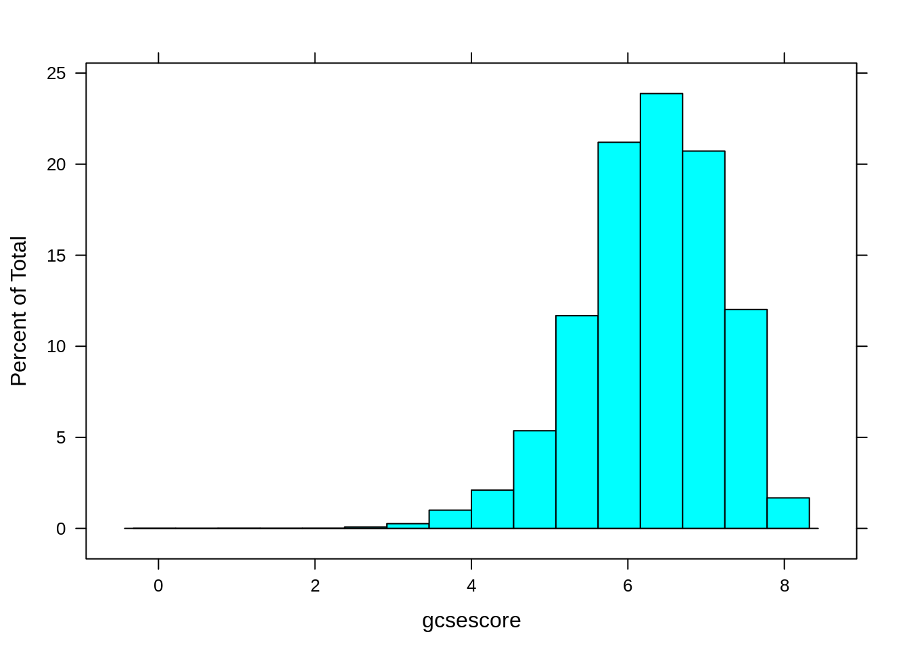


这个图只显示了一个合理对称的单峰分布，但除此之外没有别的有趣的信息。 一种更有趣的展示是比较```gcsescore```在不同子组中的分布情况，例如以A级考试成绩划分的那些子组。代码如下：


```r
histogram(~ gcsescore | factor(score), data = Chem97)
```

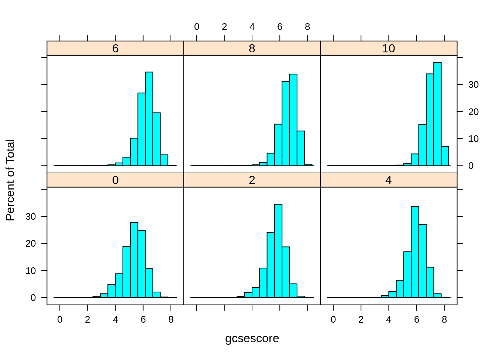

一种更有效的比较手法是直接叠加直方图。传统的直方图很难做到这一点，但是使用密度分布直方图就可实现叠加了。 在以下示例中，我们使用与以前相同的子组，但另外在每个子组中按性别进行了细分。

```r
densityplot(~ gcsescore | factor(score), Chem97, groups = gender, plot.points = FALSE, auto.key = TRUE)
```

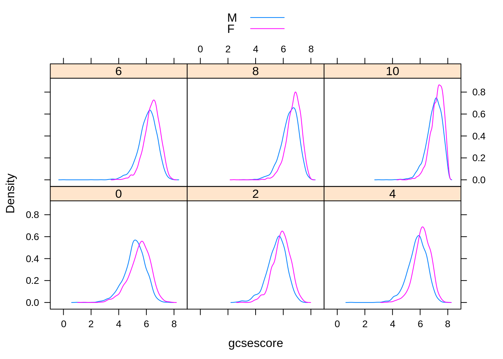
 
  **练习1** 如果省略了多余的参数```plot.points```和```auto.key```会发生什么？如果省略对```factor()```的调用会发生什么？

```?panel.densityplot```的帮助文档中说明了```plot.points```参数，而```?xyplot```的帮助文档中则说明了```auto.key```参数。在不调用```factor()```的情况下，```score```会被视为数字变量，并转换为```shingle```，详情见```?shingle```的帮助文档。

**练习2** ```lattice```使用可自定义设置的系统来导出默认图形参数。 请注意，两种性别的密度曲线可以通过不同的线型来区分。 如果在交互式图形中运行相同的命令，这是否也是正确的？ 你认为哪个更有效？

详情见```?trellis.device```说明文档。

## 主要思想

```lattice```为统计图形提供了一个高级的系统，它是独立于原本的```R```图形的。

* 它以S-PLUS中的Trellis套件为模型，并实现了大多数功能。 实际上，```lattice```可以认为是Trellis 图形基础原理的一种运用。

* 它使用```grid```作为基础实现引擎，因此默认参数延续了它的特征。

网格状显示由图形的类型以及不同变量在其中扮演的角色定义。 每种显示类型都与相应的高级功能（直方图，密度图等）相关联。 可能的角色取决于图像的类型，但也有一些特点如下：

* 主变量：定义主要显示的变量（例如，前面示例中的```gcsescore```）。

* 条件变量：将数据分为子组，每个子组显示在不同的panel中（例如，最后两个示例中的得分）。

* 分组变量：通过叠加展示在panel内对子组进行对比（例如，最后一个示例中的性别）。

 以下图像类型可在```lattice```中显示。

|函数 |显示图像|
|:------|:---------------|
|```histogram()```|直方图|
|```densityplot()```|密度曲线图|
|```qqmath()```|理论分位数图|
|```qq()```|两样本分位数图|
|```stripplot()```|带状图（比较性一维散点图）|
|```bwplot()```|比较型箱形图|
|```dotplot()```|克利夫兰点图|
|```barchart()```|条形图|
|```xyplot()```|散点图|
|```splom()```|散点图矩阵|
|```contourplot()```|等高线图|
|```levelplot()```|色阶图线框|
|```wireframe()```|曲面的三维透视图|
|```cloud()```|三维散点图|
|```parallel()```|平行坐标图|

我们可以编写新的高级功能来表示进一步的可视化类型。以```ecdfplot()```和```gridptra```包中的```mapplot()```为例。


## 设计目标
可视化是一门艺术，但是它可以从系统的科学方法中受益匪浅。我们已经可以证明：可以提出一些通用规则，这些规则可以用于设计更有效的图形。

格状图形（Trellis graph）的主要目标之一是提供使这些规则易于应用的工具，因此使用的难度已从用户转移到了软件。此类规则的示例包括：

* 尽可能利用可用空间

* 尽可能通过叠加（分组）强制直接比较

* 鼓励在并置（调节）时进行比较：使用公共轴，添加公共参考网格等对象。

这些设计目标存在一些技术缺陷。例如，不浪费空间就需要完整绘图开始时便会显示出来，因此，传统R绘图中常见的增量方法（例如，在完成主图完成后添加主标题）不适合。```lattice```使用基于对象的范例：图以常规R对象表示，其余的更新由修改此类对象并重新绘制而实现。

尽管这些规则很有用，但任何严肃的图形系统也必须具有灵活性。```lattice```设计的理念之一即为灵活性，但显然对于较常见的任务，需要在灵活性和易用性之间进行权衡。```lattice```使用以下模型实现平衡：

* 显示屏由各种元素组成

* 默认值可提供有意义的结果

* 每个部分都可以由用户独立控制

* 主要元素是：

  – 主（panel）显示
  
  – 坐标轴注释
  
  – 带状注释（描述变化过程）
  
  – 图例（通常描述分组过程）
  
在每种情况下，都可以使用附加参数来改变常见变量。不仅如此，通过任意用户定义的函数可以实现全部变量的变动，灵活性极高。```lattice```的大多数使用涉及改变这些元素中的一个或多个。不是全部图形设计被整齐地划分为这些元素；```lattice```可能并不是用于此类显示的好工具。


## 常见的高级功能
### 可视化单变量分布

几种标准统计图形旨在可视化连续随机分布变量。我们已经学习了直方图和密度图，它们都是概率密度函数的一种估计。另一个有用的显示图形是正态QQ图，它与分布函数$F（x）=P（X≤x）$有关。正态QQ图可以由```lattice```函数```qqmath()```生成。


```r
qqmath(~ gcsescore | factor(score), Chem97, groups = gender, f.value = ppoints(100), 
       auto.key = TRUE,type = c("p", "g"), aspect = "xy")
```

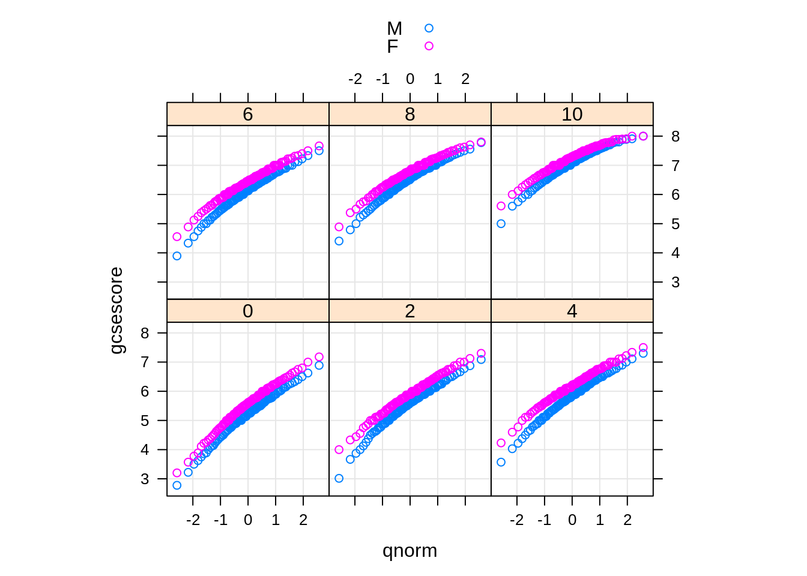

正态QQ图对数据的实际分位数与正态分布的分位数（或某些其他理论分布）。它们可以看作是分布函数$F$的估计，其中概率轴是由正常分位数函数转换的。它们旨在检测与正态分布的偏离程度。 若是近乎正态，这些点将近似沿直线分布。在上图中，凸度表明分布是左偏的，而斜率的变化表明变化的方差。```type```参数为每个格子添加一个公共的参考网格，从而更容易看```gcsescore```向上跨格的变化。```aspect```参数会自动计算长宽比。

两样本QQ图比较了两个样本的分位数（而不是一个样本和一个理论分配）。它们可以由```lattice```函数```qq()```生成，它具有两个主变量。在y〜x中，y必须是一个具有两个水平的因子，并且比较的样本是y的两个级别的x的子集。例如，我们可以比较男性和女性的```gcsescore```分布，以A级成绩为条件。


```r
qq(gender ~ gcsescore | factor(score), Chem97,
   f.value = ppoints(100), type = c("p", "g"), aspect = 1)
```

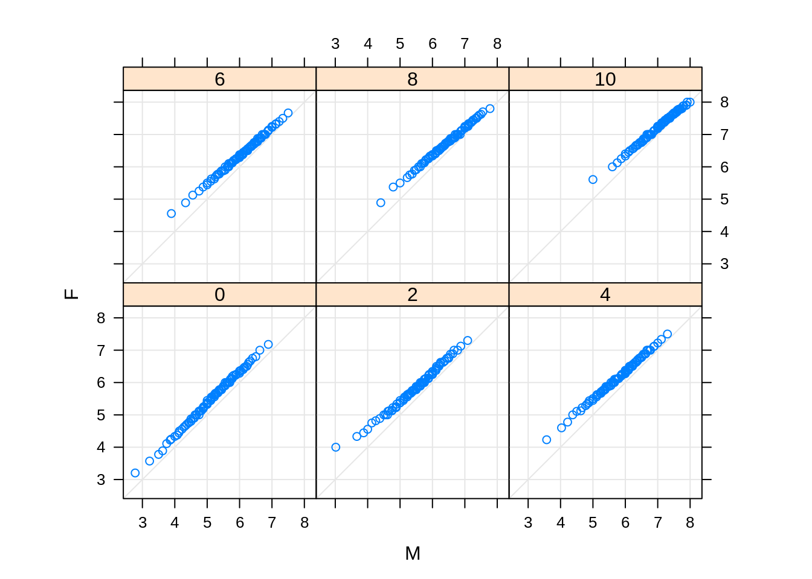

该图表明，在给定的A级考试分数下，女性在GCSE考试中的表现要好于男性。换句话说，从GCSE考试到A级考试，男性倾向于进步更多，而方差则较小（第一格中的除外）。

两样本QQ图仅允许每次比较两个样本。一个著名的允许任意数量样本之间进行比较的图形设计是比较形箱形图。它们与QQ图有关：比较的值是五个“特殊”分位数，中位数，第一和第三四分位数，以及极值。详情参见```?boxplot.stats```。

箱须图可以通过```lattice```函数```bwplot()```生成。


```r
bwplot(factor(score) ~ gcsescore | gender, Chem97)
```


盒和直线的长度减小表明方差减小，并且大量的一侧的离群值表示较重的左尾（左偏分布的特征）。

相同的箱须图可以稍有不同的布局显示，以强调更细微的变化数据中的效果：例如，```gcsescore```的中位数不会如人们所期望的那样单调地从左到右增长。


```r
bwplot(factor(score) ~ gcsescore | gender, Chem97)
```

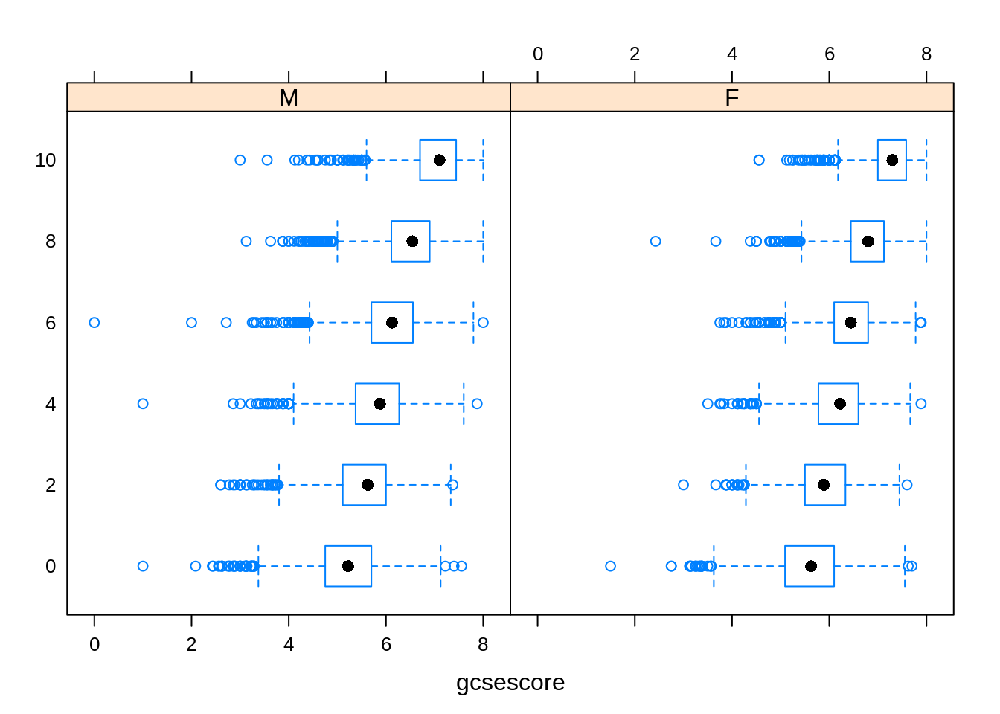

```layout```参数控制列，行和页面中面板的布局（默认参数不会在此示例中有意义）。请注意，箱须图现在是垂直的，因为已经在参数中按变量顺序切换。

**练习3** 我们看到的所有图都表明```gcsescore```的分布略有倾斜，并且在每个子组中具有不同的方差。使用Box-Cox转换通常可以成功。```MASS```软件包中的```boxcox()```函数可用于查找“最佳” Box-Cox变换，在这种情况下约为2.34。重现以前的情节通过```gcsescore~ 2.34```来替换```gcsescore```重现之前的图片。你觉得这样的转换成功吗？

**练习4** 并非所有工具对所有问题都有用。箱形图，以及较小程度的QQ分布图在对称和单峰分布时最有用，但其他时候会有误导性。例如，考虑由下列代码生成的图

```r
data(gvhd10, package = "latticeExtra")
bwplot(Days ~ log(FSC.H), data = gvhd10)
```

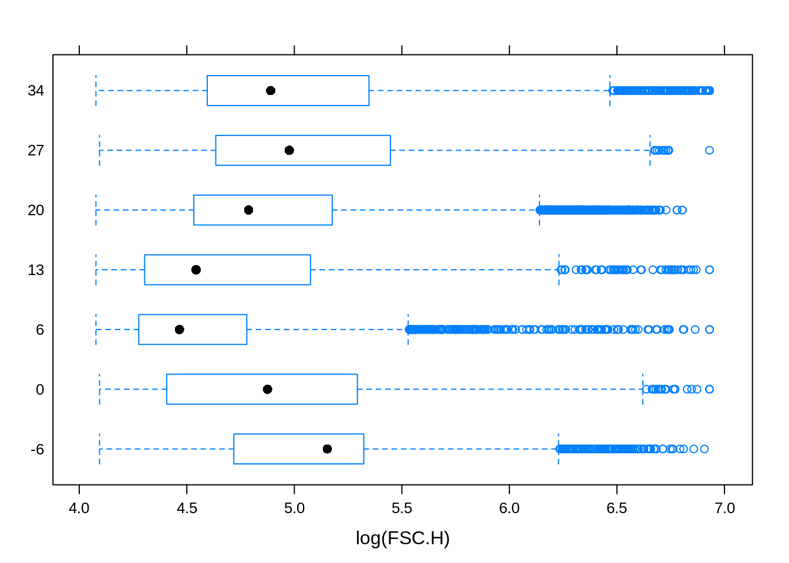

你能从该图中得出$log(FSC.H)$的分布是什么？现在按天画$log(FSC.H)$的密度图。你还能得出与以前相同的结论吗？

对于小样本，获取它的统计星系通常是不必要的，只需绘制所有数据即可发现有趣的分布特征。以下示例使用```quakes```数据集，绘制了地震震中的数量级。


```r
stripplot(depth ~ factor(mag), data = quakes, jitter.data = TRUE, alpha = 0.6,
          main = "Depth of earthquake epicenters by magnitude",
          xlab = "Magnitude (Richter)",
          ylab = "Depth (km)")
```

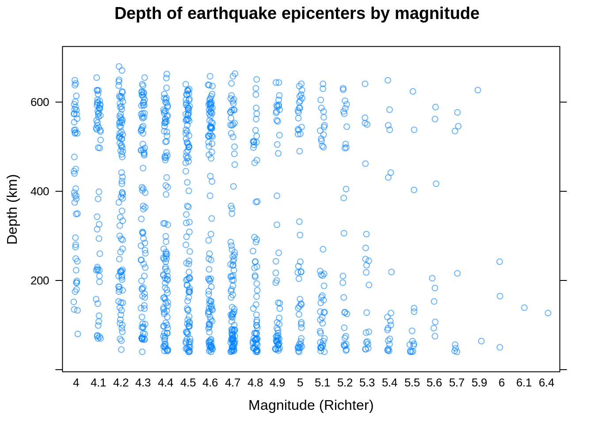

这被称为一维散点图的带状图。请注意使用抖动和部分透明性来减轻过度绘图。参数xlab，ylab和main用于添加信息标签; 这在所有```lattice```中都是存在的。

### 可视化表格

数据表格是一类重要的统计数据展示方式。条形图和克利夫兰点图是为表格设计的一种可视化方法。我们使用```VADeaths```数据集，该数据集给出了1941年在美国弗吉尼亚州的不同人群中的死亡人数。```VADeaths```是一个矩阵。


```r
VADeaths
```

```
##       Rural Male Rural Female Urban Male Urban Female
## 50-54       11.7          8.7       15.4          8.4
## 55-59       18.1         11.7       24.3         13.6
## 60-64       26.9         20.3       37.0         19.3
## 65-69       41.0         30.9       54.6         35.1
## 70-74       66.0         54.3       71.1         50.0
```

要使用```lattice```包，我们首先需要将其转换为data frame。


```r
VADeathsDF <-as.data.frame.table(VADeaths,responseName ="Rate")
VADeathsDF
```

```
##     Var1         Var2 Rate
## 1  50-54   Rural Male 11.7
## 2  55-59   Rural Male 18.1
## 3  60-64   Rural Male 26.9
## 4  65-69   Rural Male 41.0
## 5  70-74   Rural Male 66.0
## 6  50-54 Rural Female  8.7
## 7  55-59 Rural Female 11.7
## 8  60-64 Rural Female 20.3
## 9  65-69 Rural Female 30.9
## 10 70-74 Rural Female 54.3
## 11 50-54   Urban Male 15.4
## 12 55-59   Urban Male 24.3
## 13 60-64   Urban Male 37.0
## 14 65-69   Urban Male 54.6
## 15 70-74   Urban Male 71.1
## 16 50-54 Urban Female  8.4
## 17 55-59 Urban Female 13.6
## 18 60-64 Urban Female 19.3
## 19 65-69 Urban Female 35.1
## 20 70-74 Urban Female 50.0
```

条形图由```barchart()```函数生成，克利夫兰点图由```dotplot()```函数生成。两者的输入形式为y〜x（加上其他条件和分组变量），其中x和y之一应该是一个影响因素。

```VADeaths```条形图由以下代码生成


```r
barchart(Var1 ~ Rate | Var2, VADeathsDF, layout = c(4, 1))
```

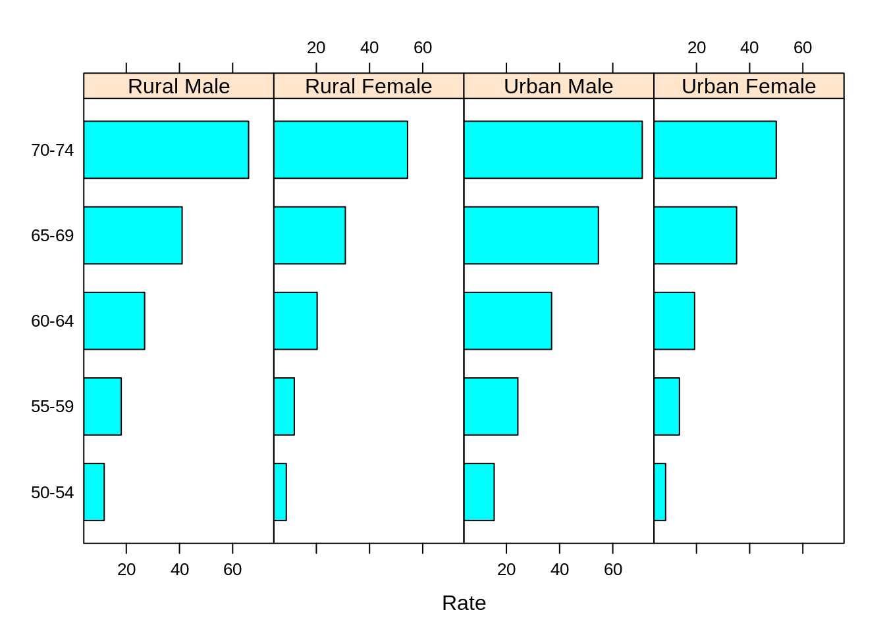

该图可能会引起误解，因为图中最明显的视觉效果是面积的比较，但它没有任何意义。这个问题可以通过使区域与它们代表的数值成比例来解决。


```r
barchart(Var1 ~ Rate | Var2, VADeathsDF, layout = c(4, 1), origin = 0)
```

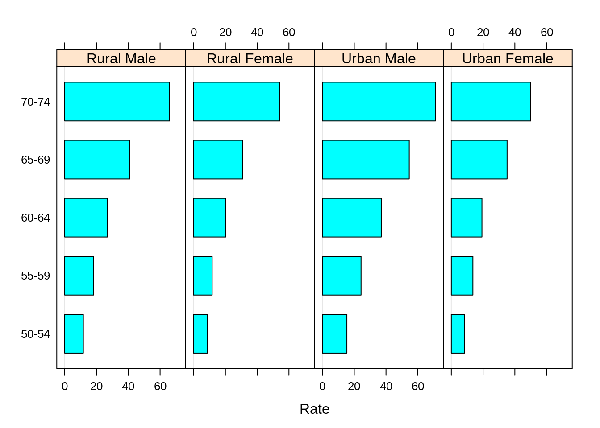

更好的方法是完全放弃这些干扰端点位置区分的条形，而是使用点图。


```r
dotplot(Var1 ~ Rate | Var2, VADeathsDF, layout = c(4, 1))
```

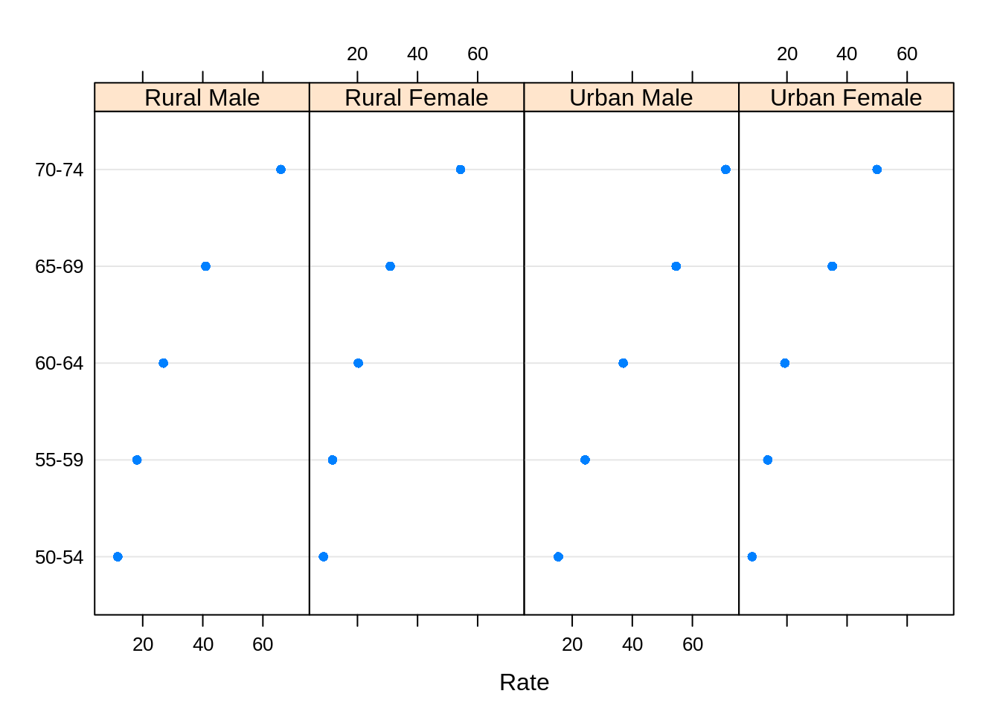

在这个例子中，如果我们根据```Var2```将点分组合并，将会更有效。


```r
dotplot(Var1 ~ Rate, data = VADeathsDF, groups = Var2, type = "o",
        auto.key = list(space = "right", points = TRUE, lines = TRUE))
```


该图清楚地表明，城市女性和农村女性按年龄划分的死亡率特征几乎相同，农村男性的死亡率有所上升，而城市男性的死亡率则进一步上升。 这种情况很难在较早的图中看到。

### 通用功能和方法

高级```lattice```函数实际上是通用函数，使用特定方法进行工作。到目前为止，我们看到的所有示例都使用“*formula*”方法；也就是说，在第一个参数是公式时使用。因为barchart()和dotplot()经常用于把多维表存储为数组，```lattice```还包括不需要转换到数据集的合适的方法。例如，最后一个示例的替代方法是


```r
dotplot(VADeaths, type = "o",
        auto.key = list(points = TRUE, lines = TRUE, space = "right"))
```

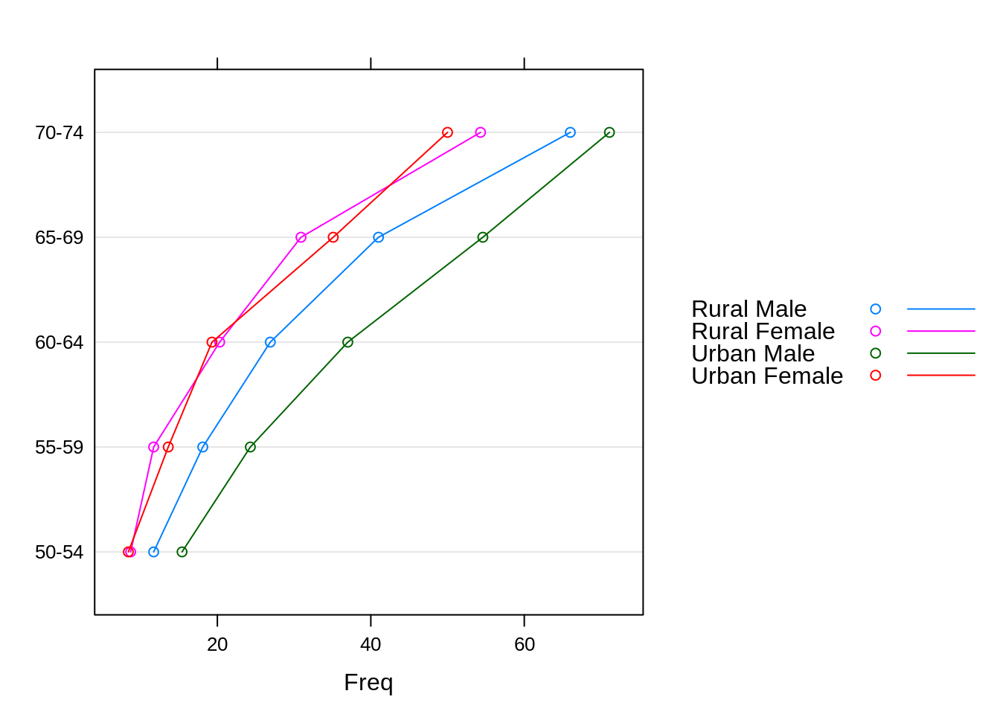

可以使用以下方法列出特定的通用函数的方法


```r
methods(generic.function = "dotplot")
```

```
## [1] dotplot.array*    dotplot.coef.mer* dotplot.default*  dotplot.formula* 
## [5] dotplot.matrix*   dotplot.numeric*  dotplot.ranef.mer dotplot.table*   
## see '?methods' for accessing help and source code
```

这些方法的特殊功能（如果有）在各自的帮助页面中进行了介绍；例如, 上面的示例为```?dotplot.matrix```。

**练习5** 使用“matrix”方法重现未分组的点图。


### 散点图和扩展

散点图通常用于连续的双变量数据以及时间序列数据。我们使用```Earthquake```数据，该数据包含在1940年至1980年间北美西部23次大地震的各个地震仪位置记录的测量结果。我们的第一个示例绘制了关于测量站到震中的距离测得的最大水平加速度。


```r
data(Earthquake, package = "nlme")
xyplot(accel ~ distance, data = Earthquake)
```

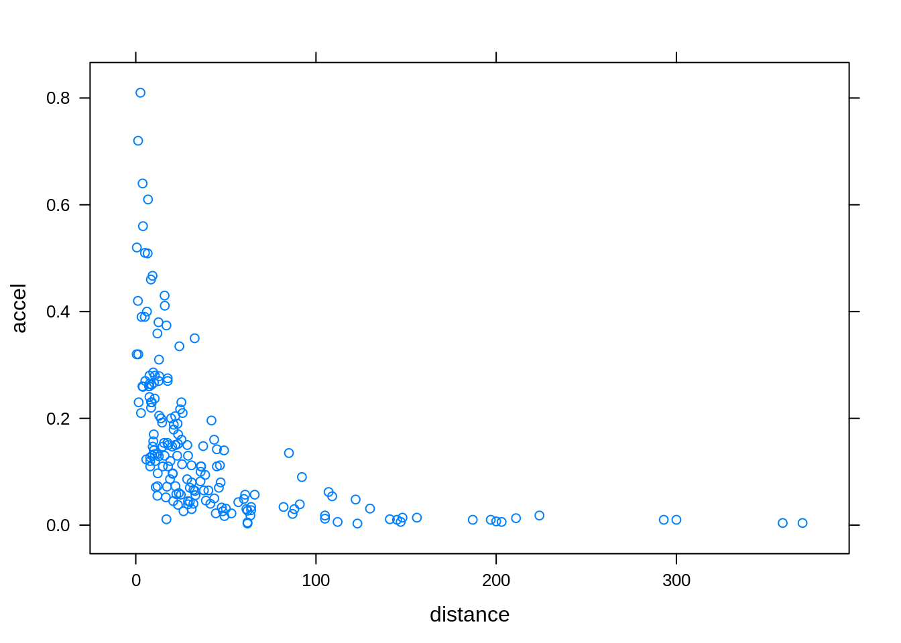

该图显示了典型的右偏分布特征，可以通过以对数刻度绘制来进行改进。通常添加一个参考网格和某种平滑度。例如，


```r
xyplot(accel ~ distance, data = Earthquake, scales = list(log = TRUE),
       type = c("p", "g", "smooth"), xlab = "Distance From Epicenter (km)",
       ylab = "Maximum Horizontal Acceleration (g)")
```

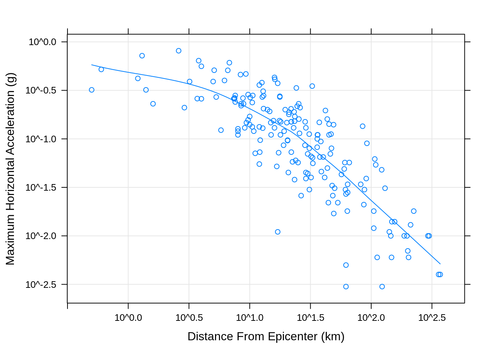

### 瓦块数据

像往常一样，可以通过调节因子绘制散点图。也可以在瓦块,即因子的连续分类上进行调节，由可能重叠的区间确定。 再次使用```quakes```数据集，我们可以通过查看一系列二维散点图来尝试了解地震震中的三维分布。


```r
Depth <- equal.count(quakes$depth, number=8, overlap=.1)
summary(Depth)
```

```
## 
## Intervals:
##     min   max count
## 1  39.5  63.5   138
## 2  60.5 102.5   138
## 3  97.5 175.5   138
## 4 161.5 249.5   142
## 5 242.5 460.5   138
## 6 421.5 543.5   137
## 7 537.5 590.5   140
## 8 586.5 680.5   137
## 
## Overlap between adjacent intervals:
## [1] 16 14 19 15 14 15 15
```


```r
xyplot(lat ~ long | Depth, data = quakes)
```

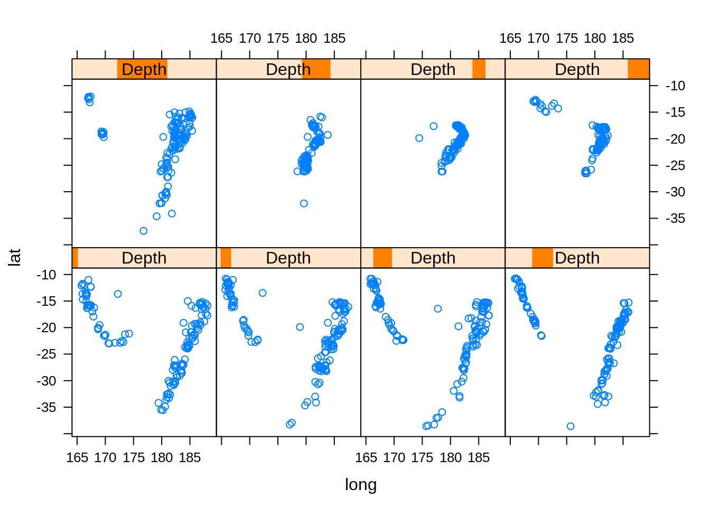

### 三维显示

当然，对于连续三变量数据，使用三维散点图可能更有效。


```r
cloud(depth ~ lat * long, data = quakes,
      zlim = rev(range(quakes$depth)),
      screen = list(z = 105, x = -70), panel.aspect = 0.75,
      xlab = "Longitude", ylab = "Latitude", zlab = "Depth")
```

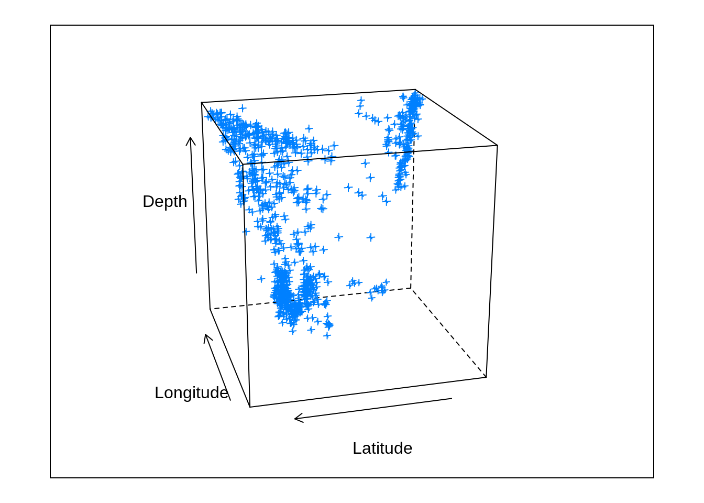

由于“camera”方向的作用很强，因此静态三维散点图不是很有效。不幸的是，```lattice```不允许交互操作查看方向。不过，一些此类图可以表明震中位置集中在三维空间中围绕两个平面。

其他三变量函数是```wireframe()```和```levelplot()```，它们以三维表面的形式显示数据。我们不会在```lattice```中详细讨论这些功能以及其他高级功能，但是可以在其帮助页面中找到示例。

**练习5** 尝试通过修改```screen```参数来更改上一个图中的查看方向。

### 网格（*trellis*）对象

```lattice```与传统```R```图形不同的一个重要特征是，高级函数实际上不绘制任何内容。相反，它们返回“trellis”对象，该对象需要```print()```或```plot()```。```R```的自动打印规则意味着在大多数情况下，用户看不到任何行为上的差异。在下面的例子中，我们对“trellis”对象使用```plot()```方法的可选参数来并排显示两个图。


```r
dp.uspe <-
  dotplot(t(USPersonalExpenditure), groups = FALSE, layout = c(1, 5),
          xlab = "Expenditure (billion dollars)")
dp.uspe.log <-
  dotplot(t(USPersonalExpenditure), groups = FALSE, layout = c(1, 5),
          scales = list(x = list(log = 2)),
          xlab = "Expenditure (billion dollars)")
plot(dp.uspe, split = c(1, 1, 2, 1))
plot(dp.uspe.log, split = c(2, 1, 2, 1), newpage = FALSE)
```

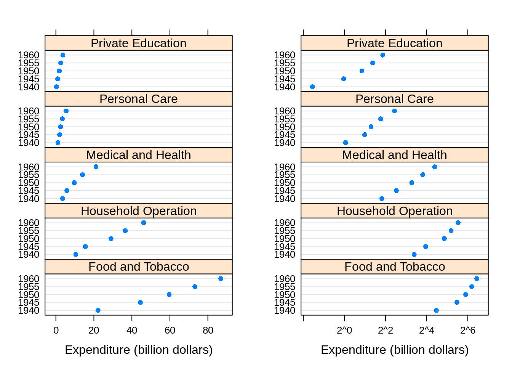

## 更多资源

我们所涵盖的材料应足够理解含有```lattice```的在线文档。其他有用的材料是

* Lattice 手册， Springerde的```UseR!```系列的一部分。网站链接：
<center><http://lmdvr.r-forge.r-project.org></center>它包含了所有手册中出现的图片和代码。
* Bell Labs的Trellis网站
<center><http://netlib.bell-labs.com/cm/ms/departments/sia/project/trellis/></center>提供了大量关于Trellis的材料，这些材料也同样适用于```lattice```（当然，不涵盖```lattice```特有的特征）

### 版本信息

* R版本2.14.0，开发中（不稳定）（2011-05-07 r55801），```x86_64-unknown-linux-gnu```
* 区域设置：```LC_CTYPE=en_IN, LC_NUMERIC=C, LC_TIME=en_IN, LC_COLLATE=en_IN, LC_MONETARY=en_IN,``` ```LC_MESSAGES=en_IN, LC_PAPER=C, LC_NAME=C, LC_ADDRESS=C, LC_TELEPHONE=C,LC_MEASUREMENT=en_IN, LC_IDENTIFICATION=C```
* 基本包：base, datasets, graphics, grDevices, methods, stats, utils
* 其他包：lattice 0.19-26
* 加载工具：grid 2.14.0, tools 2.14.0


