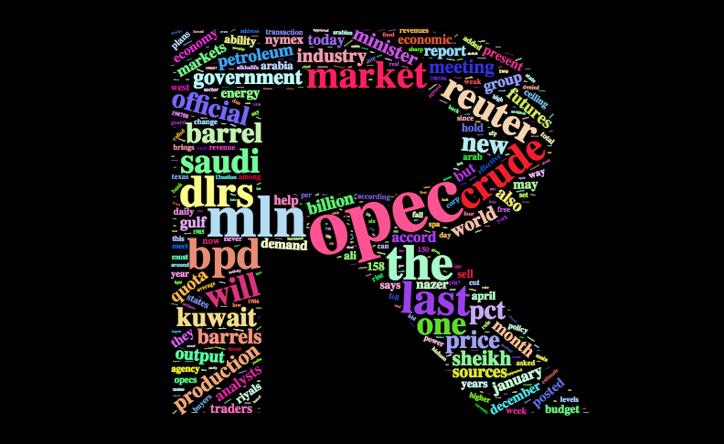

# Wordcloud

Chengyou Ju and Yujie Wang

```{r, include=FALSE}
knitr::opts_chunk$set(echo = TRUE)
```

This Rmd file is created by Chengyou Ju (UNI: cj2624) and Yujie Wang (UNI: yw3442) for STAT GR5702 Community Contribution Group 15.

In this file, we will provide a tutorial on how to draw Wordcloud graphs using the `wordcloud2` package in R. 

The dataset in this project are from the **demoFreq** package.


## 1. Introduction

A Wordcloud is a visual representation of text data. Wordclouds are useful for quickly perceiving the most prominent terms, which makes them widely used in media and well understood by the public. 

A Wordcloud is a collection of words depicted in different sizes. The bigger and bolder the word appears, the greater frequency within a given text and the more important it is.

There are two packages in R that can help us draw a wordcloud. `wordcloud` is the basic package to build the graph, while `wordcloud2` package allows more customization. In our demo, we will focus on the `wordcloud2` package, which is more widely used.

## 2. Demo of `wordcloud2` Package

For our demo, we will use a built-in dataset `demoFreq`, which has 1011 observations of 2 variables, words and frequancy.
```{r}
library(devtools)
devtools::install_github("lchiffon/wordcloud2")
library(wordcloud2)
head(demoFreq)
```
**Parameters for wordcloud2** from Rdocumentation<br>
`data` - data frame with word and freqency of the word<br>
`size` - Font size, default is 1. The larger size means the bigger word<br>
`fontFamily` - font used in the word cloud<br>
`fontWeight` - Font weight to use, e.g. normal, bold or 600<br>
`color` - color of the text, keyword ’random-dark’ and ’random-light’ can be used.<br>
`backgroundColor` - Color of the background<br>
`minRotation` - If the word should rotate, the minimum rotation (in rad) the text should rotate.<br>
`maxRotation` - If the word should rotate, the maximum rotation (in rad) the text should rotate.<br>
`shuffle` - Shuffle the points to draw so the result will be different each time for the same list and settings.<br>
`rotateRatio` - Probability for the word to rotate. Set the number to 1 to always rotate.<br>
`shape` - The shape of the "cloud" to draw. Can be a keyword present. <br>
`widgetsize` - size of the widgets<br>
`figPath` - The path to a figure used as a mask.<br>
`hoverFunction` - Callback to call when the cursor enters or leaves a region occupied by a word.<br>

### 2.0 Basic Wordcloud Graph
Building a wordcloud graph is simple. We can use the `wordcloud2` package directly after successfully installing it.

```{r}
wordcloud2(data = demoFreq)
```
As we can see, the word cloud is easy to build and to read. Words with large frequency like 'said' and 'oil' are displayed in big font size.<br> It is actually an interactive plot. If we hover on a certain word, it will pop up the word with its frequency.


### 2.1 Font Size
We can also modify the font size of the graph.
```{r}
wordcloud2(data = demoFreq, size = 0.5)
```
```{r}
wordcloud2(data = demoFreq, size = 1.5)
```

### 2.2 Color and Background Color
The word color can be changed using the "color" argument, while the background color can be changed with "backgroundColor".
```{r}
wordcloud2(demoFreq, color = 'random-dark')
```
```{r}
wordcloud2(demoFreq, color = 'random-light')
```
```{r}
wordcloud2(demoFreq, color = 'random-light', backgroundColor = "black")
```
```{r}
wordcloud2(demoFreq, color = rep_len(c("skyblue", "blue"), nrow(demoFreq)))
```

### 2.3 Shape
We can also customize the shape of a wordcloud using the "shape" argument. Here are some examples.
```{r}
wordcloud2(demoFreq, size = 0.5, shape = 'star')
```
```{r}
wordcloud2(demoFreq, size = 0.5, shape = 'pentagon')
```

### 2.4 Rotation
We can also do rotation on the wordcloud graph.
```{r}
wordcloud2(demoFreq, minRotation = -pi/6, maxRotation = -pi/6, rotateRatio = 1)
```

### 2.5 Language
We can draw a wordcloud graph of words in Chinese.
```{r}
wordcloud2(demoFreqC, fontFamily = "????????????", color = "random-light", backgroundColor = "black")
```


### 2.6 Customized shape
We can build wordcloud with the shape of a word using function `letterCloud`.
```{r,eval = FALSE}
letterCloud(demoFreq, word = "R", color = "random-light", backgroundColor = "black")
```

<br>
<br>
Also, we can create user-defined shape for the wordcloud by simply adding the image we choose to figPath.
```{r,eval = FALSE}
wordcloud2(demoFreq, figPath ="~/Desktop/batman.png", size = 1,
           color = "random-light",backgroundColor = "black") 
```

